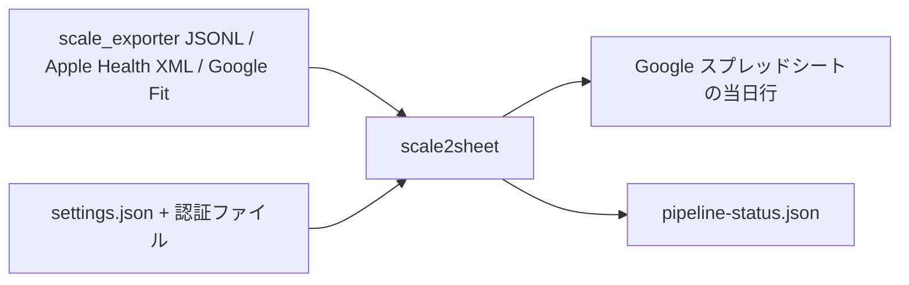

# scale2sheet

`scale2sheet` は、scale_exporter の JSONL、Apple Health XML、または Google Fit から身体測定値を読み込み、当日の Google スプレッドシート行へ転記する macOS 向け Go CLI です。

## インストール

Go 1.22 以上を用意し、リポジトリのルートで単一バイナリを作成します。

```sh
CGO_ENABLED=0 go build -o dist/scale2sheet ./cmd/scale2sheet
./dist/scale2sheet --version
```

`CGO_ENABLED=0` は、配布バイナリを外部の C ランタイムに依存させないための指定です。製品の build・test・実行に Node/npm/Bun は必要ありません。

## 設定

設定ファイルは `~/.config/scale2sheet/settings.json` です。初回起動時に存在しなければ、既定値を含むファイルを作成します。設定値の決定順序は、環境変数、`settings.json`、組み込み既定値の順です。

最低限、Google Sheets の `sheet-id` と `sheets-credentials`、入力ソースに応じた入力先を設定します。

```json
{
  "time-zone": "Asia/Tokyo",
  "source": "scale-exporter",
  "sheet-id": "<Google スプレッドシート ID>",
  "sheet-name": "体温・血圧",
  "sheets-credentials": "~/.config/scale2sheet/google-sheets-service-account.json",
  "scale-exporter-output-dir": "/path/to/scale-exporter-output",
  "morning-cron": "0 7 * * *",
  "evening-cron": "0 21 * * *"
}
```

| キー | 内容 | 既定値・条件 |
| --- | --- | --- |
| `time-zone` | 日付と時間帯の解釈 | `Asia/Tokyo` |
| `source` | `scale-exporter`、`google-fit`、`apple-health` | `scale-exporter` |
| `sheet-id` | 転記先スプレッドシート ID | 必須 |
| `sheet-name` | 対象シート名 | `体温・血圧` |
| `sheets-credentials` | Sheets サービスアカウント鍵のパス | 必須 |
| `scale-exporter-output-dir` | scale_exporter の JSONL フォルダ | `source` が `scale-exporter` のとき必須 |
| `apple-health-export-xml` | Apple Health の XML パス | `source` が `apple-health` のとき必須 |
| `google-fit-client-id` | Google Fit OAuth client ID | `source` が `google-fit` のとき必須 |
| `google-fit-client-secret` | Google Fit OAuth client secret | `source` が `google-fit` のとき必須 |
| `google-fit-redirect-uri` | OAuth callback URI | `http://localhost:3000/oauth2callback` |
| `google-fit-token-path` | Google Fit token JSON の保存先 | `~/.config/scale2sheet/google-fit-token.json` |
| `google-fit-lookback-days` | Google Fit を遡る日数 | `14` |
| `morning-cron` / `evening-cron` | `serve` の cron 式 | `0 7 * * *` / `0 21 * * *` |

環境変数を使う場合は `settings.json` より優先されます。

| 環境変数 | 対応する設定 |
| --- | --- |
| `TIME_ZONE` | `time-zone` |
| `SCALE_EXPORTER_OUTPUT_DIR` | `scale-exporter-output-dir` |
| `APPLE_HEALTH_EXPORT_XML` | `apple-health-export-xml` |
| `GOOGLE_SHEET_ID` | `sheet-id` |
| `GOOGLE_SHEET_NAME` | `sheet-name` |
| `GOOGLE_APPLICATION_CREDENTIALS` | `sheets-credentials` |
| `GOOGLE_FIT_CLIENT_ID` / `GOOGLE_FIT_CLIENT_SECRET` | Google Fit client credentials |
| `GOOGLE_FIT_REDIRECT_URI` | `google-fit-redirect-uri` |
| `GOOGLE_FIT_TOKEN_PATH` | `google-fit-token-path` |
| `GOOGLE_FIT_LOOKBACK_DAYS` | `google-fit-lookback-days` |
| `MORNING_CRON` / `EVENING_CRON` | `morning-cron` / `evening-cron` |

認証ファイルは Git に追加しないでください。Sheets のサービスアカウントメールアドレスを対象スプレッドシートへ共有する必要があります。Google Fit は `google-fit-credentials.json` に `client_id`、`client_secret`、必要なら `redirect_uri` を置く方法も使えます。

## 測定値と転記先

対象シートの1行目には次の見出しを用意します。対象日の `月日` 行が存在しない場合、その行は自動作成せず転記を失敗として扱います。

```text
月日 | 朝体重 | 朝体温 | 朝血圧上 | 朝血圧下 | 朝脈拍 | 夜体重 | 夜体温 | 夜血圧上 | 夜血圧下 | 夜脈拍
```

朝は `05:00` 以上 `12:00` 以下、夜は `20:00` 以上 `23:30` 以下の測定値を対象にします。体重が対象時間帯にない場合はシートを更新せず `completed:no-data` として正常終了します。Google Fit の体温データ型が利用できない場合、体温だけ空欄になります。



## Google Fit 初回認証

Google Cloud で Fitness API と OAuth クライアントを有効にし、redirect URI に `http://localhost:3000/oauth2callback` を登録します。client credentials を設定した後、次を実行します。

```sh
./dist/scale2sheet auth
```

CLI が認可 URL を表示し、macOS ではブラウザを開きます。認可後に localhost callback を受け、`google-fit-token-path` へ mode `0600` の token JSON を保存します。

## 手動実行

```sh
# scale_exporter の公開済み JSONL を読む
./dist/scale2sheet run --period morning

# 対象日を指定する
./dist/scale2sheet run --period evening --date 2026-08-13

# Apple Health XML を読む
./dist/scale2sheet run --period morning --source apple-health

# Google Fit を読む
./dist/scale2sheet run --period morning --source google-fit
```

`run` は書き込んだ行を JSON で標準出力へ出し、対象値がなければ `No spreadsheet row updated.` と出力します。Google Sheets への各転記試行には 30 秒の期限があります。

## 常駐実行

```sh
./dist/scale2sheet serve
```

`serve` は `morning-cron` と `evening-cron` に従って同じ処理を実行します。実行中は `active-run.json` と macOS の排他 lease で二重実行を防ぎます。`SIGTERM` / `SIGINT` で終了できます。

## launchd への登録

まず設定と認証ファイルを揃え、バイナリをインストールします。

```sh
./dist/scale2sheet install
```

既定では次の場所へ配置します。

- バイナリ: `~/.local/bin/scale2sheet`
- 設定・認証・状態: `~/.config/scale2sheet/`
- launchd plist: `~/Library/LaunchAgents/jp.seijin.kappa.scale-pipeline.morning.plist`、`...evening.plist`
- ログ: `~/Library/Logs/scale-pipeline/`

設定と認証ファイルを確認してから launchd へ登録します。

```sh
~/.local/bin/scale2sheet install --launchd
~/.local/bin/scale2sheet doctor
```

登録前の計画だけを確認するには `install --launchd --dry-run` を使います。`--prefix <path>` でバイナリ配置先を変更できます。設定不足、認証ファイル不足、または実行中の lease がある場合は、plist・バイナリ・設定を変更せず失敗します。

## アンインストール

```sh
~/.local/bin/scale2sheet uninstall
```

アンインストールは launchd 登録、plist、配置したバイナリ、インストール manifest を削除します。設定、認証ファイル、状態ファイル、ログは残ります。`uninstall --dry-run` で削除計画を確認できます。

## 状態ファイルと終了コード

`pipeline` は `~/.config/scale2sheet/pipeline-status.json` に、期間ごとの実行中状態、最終結果、入力件数、転記結果、連続失敗回数、health を保存します。書込みは一時ファイルからの atomic rename です。`active-run.json` は実行中 lease の診断用です。

```sh
./dist/scale2sheet pipeline --period morning --date 2026-08-13
```

| 終了コード | 意味 |
| --- | --- |
| `0` | 正常終了、no-data、`--help`、`--version` |
| `1` | 設定、入力、認証、Google API、転記、lease の実行時エラー |
| `2` | 未知のコマンド・オプション、必須引数不足、不正な period/source/date |

## 開発・検証

```sh
gofmt -w cmd internal
CGO_ENABLED=0 go build -o dist/scale2sheet ./cmd/scale2sheet
CGO_ENABLED=0 go test ./...
go vet ./...
bash scripts/check-go-toolchain-contract.sh
bash scripts/run-pipeline-shadow-acceptance.sh
bash scripts/run-google-sheets-deadline-acceptance.sh
bash scripts/run-installer-acceptance.sh
bash scripts/run-runtime-safety-acceptance.sh
bash scripts/run-binary-source-drift-acceptance.sh
bash scripts/run-bun-binary-smoke.sh
```

最後の smoke スクリプト名は既存呼び出しとの互換性のため残っていますが、実際にビルド・実行するのは Go バイナリです。

## 既知の制約

- `pipeline` は現在 `scale-exporter` の安定 snapshot を対象にします。Apple Health と Google Fit は `run` と `serve` の source adapter として利用します。
- launchd 登録と Darwin 固有の `O_EXLOCK` lease は macOS 専用です。
- Google API の認証・読み書きはネットワークと外部サービスの状態に依存します。期限超過時は Sheets 側の反映結果を自動再試行せず、対象行を確認してください。
- 状態ファイルが更新されない場合、プロセス自体が起動していない可能性までは状態ファイルだけで検知できません。
