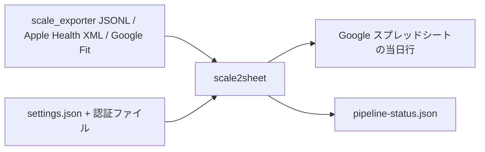

# scale2sheet

`scale2sheet` は、scale_exporter の JSONL、Apple Health XML、または Google Fit から身体測定値を読み込み、当日の Google スプレッドシート行へ転記する macOS 向け Go CLI です。

## インストール

Go 1.22 以上と macOS の Xcode Command Line Tools（`lipo`、`file`、`plutil`）を用意し、リポジトリのルートで製品バイナリを作成します。

```sh
bash scripts/build-macos-release.sh
./dist/scale2sheet --version
```

このスクリプトは `GOOS=darwin`、`GOARCH=arm64` / `amd64`、`CGO_ENABLED=0`、`GOTOOLCHAIN=local`、`-trimpath` を明示して build し、`lipo` で Apple Silicon と Intel の universal Mach-O（`arm64` + `x86_64`）を `dist/scale2sheet` に作成します。これはローカル検証用の unsigned artifact です。公開配布には、次節の Developer ID 署名・Hardened Runtime・notarytool 公証済み DMG を使用します。製品運用では `go run` や `go build` の既定 host target を使わず、このスクリプトで作成したバイナリを使用します。製品の build・test・実行に Node/npm/Bun は必要ありません。

## 公開配布用 macOS artifact

公開配布では、Apple Developer Program の `Developer ID Application` 証明書で universal binary を署名し、Hardened Runtime を有効にした DMG を作成してから Apple の notary service へ公証を依頼します。公証済み DMG には ticket を staple し、`stapler`、`hdiutil`、`spctl`、`codesign` で検査します。Apple Development、ad hoc、未署名の artifact は公開配布物に使用しません。

必要なものは macOS、Xcode Command Line Tools、Go 1.22 以上、Developer ID Application identity、そして次のいずれかの notarytool 認証です。

- 推奨: App Store Connect API key（`.p8`、Key ID、Issuer ID）
- ローカル代替: `xcrun notarytool store-credentials` で保存した Keychain profile

証明書が利用可能であることは、次で確認できます。出力に `Developer ID Application:` が含まれる必要があります。

```sh
security find-identity -v -p codesigning
```

### ローカルでの公証

Keychain profile を作成する場合は、Apple の app-specific password を対話入力して次を実行します。パスワードや秘密鍵の内容をファイルやリポジトリへ書き込みません。

```sh
xcrun notarytool store-credentials scale2sheet-notary \
  --apple-id '<Apple ID>' \
  --team-id '<Team ID>'
```

保存した profile を使って DMG を作成します。`MACOS_NOTARY_KEYCHAIN_PATH` は profile を保存した Keychain の実パスです。

```sh
export MACOS_SIGNING_IDENTITY='Developer ID Application: <Common Name> (<Team ID>)'
export MACOS_NOTARY_KEYCHAIN_PROFILE='scale2sheet-notary'
export MACOS_NOTARY_KEYCHAIN_PATH="$HOME/Library/Keychains/login.keychain-db"
bash scripts/build-macos-distribution.sh dist/scale2sheet-macos.dmg
```

App Store Connect API key を使う場合は、`.p8` の実パスを指定します。

```sh
export MACOS_SIGNING_IDENTITY='Developer ID Application: <Common Name> (<Team ID>)'
export MACOS_NOTARY_KEY_PATH='/secure/path/AuthKey_<Key ID>.p8'
export MACOS_NOTARY_KEY_ID='<Key ID>'
export MACOS_NOTARY_ISSUER_ID='<Issuer ID>'
bash scripts/build-macos-distribution.sh dist/scale2sheet-macos.dmg
```

`MACOS_SIGNING_IDENTIFIER`（既定 `jp.seijin.kappa.scale2sheet.cli`）と `MACOS_DMG_VOLUME_NAME`（既定 `scale2sheet`）は必要な場合だけ変更します。API key 方式では3つの `MACOS_NOTARY_KEY_*` 値をすべて指定し、Keychain 方式では profile と path を両方指定します。どちらも不完全な場合、スクリプトは build や出力作成より前に失敗します。

成功すると `dist/scale2sheet-macos.dmg` と `dist/scale2sheet-macos.dmg.notary.json` が作成されます。DMG を開き、同梱 binary を既定の install 先へコピーしてから通常の設定・install 手順を続けます。

```sh
mount_point="$(mktemp -d)"
hdiutil attach dist/scale2sheet-macos.dmg -nobrowse -readonly -mountpoint "$mount_point"
mkdir -p "$HOME/.local/bin"
ditto "$mount_point/scale2sheet" "$HOME/.local/bin/scale2sheet"
hdiutil detach "$mount_point"
rmdir "$mount_point"
"$HOME/.local/bin/scale2sheet" --version
```

### GitHub Actions の公開配布

リポジトリの `macos-release` environment に次の secrets を登録します。secret の値は README、Issue、ログ、リポジトリへ記録しません。

| Secret | 内容 |
| --- | --- |
| `MACOS_DEVELOPER_ID_CERTIFICATE_BASE64` | Developer ID Application identity を含む p12 の base64 |
| `MACOS_DEVELOPER_ID_CERTIFICATE_PASSWORD` | p12 の import password |
| `MACOS_KEYCHAIN_PASSWORD` | CI 一時 keychain の password |
| `MACOS_SIGNING_IDENTITY` | `Developer ID Application: ...` の完全な identity 名 |
| `MACOS_NOTARY_KEY_BASE64` | App Store Connect API key `.p8` の base64 |
| `MACOS_NOTARY_KEY_ID` | API key ID |
| `MACOS_NOTARY_ISSUER_ID` | API key issuer ID |

`.github/workflows/macos-release.yml` は `workflow_dispatch` または `v*` tag でだけ実行され、PR の通常 CI では secrets を読みません。workflow は証明書を `$RUNNER_TEMP` の一時 keychain へ import し、`.p8` を一時ファイルへ復号します。終了時には keychain、p12、`.p8` を削除します。GitHub Actions の artifact として DMG と notary log JSON が保存されます。

公開配布 workflow の正常系は、Developer ID identity、notarytool の `Accepted`、staple、Gatekeeper 検査の全てが揃った場合だけ成功します。identity または認証情報が無い場合は fail-closed し、Apple Development 署名や ad hoc 署名へフォールバックしません。秘密情報を利用しない構文・失敗系契約は次で確認できます。

```sh
bash scripts/run-macos-distribution-contract-acceptance.sh
```

## 設定

設定ファイルは `~/.config/scale2sheet/settings.json` です。初回起動時に存在しなければ、既定値を含むファイルを作成します。設定値の決定順序は、環境変数、`settings.json`、組み込み既定値の順です。

最低限、Google Sheets の `sheet-id` と `sheets-credentials`、入力ソースに応じた入力先を設定します。

```json
{
  "time-zone": "Asia/Tokyo",
  "source": "scale-exporter",
  "sheet-id": "<Google スプレッドシート ID>",
  "sheet-name": "体温・血圧",
  "sheets-credentials": "~/.config/scale2sheet/google-sheets-service-account.json",
  "scale-exporter-output-dir": "/path/to/scale-exporter-output",
  "morning-cron": "0 7 * * *",
  "evening-cron": "0 21 * * *"
}
```

| キー | 内容 | 既定値・条件 |
| --- | --- | --- |
| `time-zone` | 日付と時間帯の解釈 | `Asia/Tokyo` |
| `source` | `scale-exporter`、`google-fit`、`apple-health` | `scale-exporter` |
| `sheet-id` | 転記先スプレッドシート ID | 必須 |
| `sheet-name` | 対象シート名 | `体温・血圧` |
| `sheets-credentials` | Sheets サービスアカウント鍵のパス | 必須 |
| `scale-exporter-output-dir` | scale_exporter の JSONL フォルダ | `source` が `scale-exporter` のとき必須 |
| `apple-health-export-xml` | Apple Health の XML パス | `source` が `apple-health` のとき必須 |
| `google-fit-client-id` | Google Fit OAuth client ID | `source` が `google-fit` のとき必須 |
| `google-fit-client-secret` | Google Fit OAuth client secret | `source` が `google-fit` のとき必須 |
| `google-fit-redirect-uri` | OAuth callback URI | `http://localhost:3000/oauth2callback` |
| `google-fit-token-path` | Google Fit token JSON の保存先 | `~/.config/scale2sheet/google-fit-token.json` |
| `google-fit-lookback-days` | Google Fit を遡る日数 | `14` |
| `morning-cron` / `evening-cron` | `serve` の cron 式 | `0 7 * * *` / `0 21 * * *` |

環境変数を使う場合は `settings.json` より優先されます。

| 環境変数 | 対応する設定 |
| --- | --- |
| `TIME_ZONE` | `time-zone` |
| `SCALE_EXPORTER_OUTPUT_DIR` | `scale-exporter-output-dir` |
| `APPLE_HEALTH_EXPORT_XML` | `apple-health-export-xml` |
| `GOOGLE_SHEET_ID` | `sheet-id` |
| `GOOGLE_SHEET_NAME` | `sheet-name` |
| `GOOGLE_APPLICATION_CREDENTIALS` | `sheets-credentials` |
| `GOOGLE_FIT_CLIENT_ID` / `GOOGLE_FIT_CLIENT_SECRET` | Google Fit client credentials |
| `GOOGLE_FIT_REDIRECT_URI` | `google-fit-redirect-uri` |
| `GOOGLE_FIT_TOKEN_PATH` | `google-fit-token-path` |
| `GOOGLE_FIT_LOOKBACK_DAYS` | `google-fit-lookback-days` |
| `MORNING_CRON` / `EVENING_CRON` | `morning-cron` / `evening-cron` |

認証ファイルは Git に追加しないでください。Sheets のサービスアカウントメールアドレスを対象スプレッドシートへ共有する必要があります。Google Fit は `google-fit-credentials.json` に `client_id`、`client_secret`、必要なら `redirect_uri` を置く方法も使えます。

## 測定値と転記先

対象シートの1行目には次の見出しを用意します。対象日の `月日` 行が存在しない場合、その行は自動作成せず転記を失敗として扱います。

```text
月日 | 朝体重 | 朝体温 | 朝血圧上 | 朝血圧下 | 朝脈拍 | 夜体重 | 夜体温 | 夜血圧上 | 夜血圧下 | 夜脈拍
```

朝は `05:00` 以上 `12:00` 以下、夜は `20:00` 以上 `23:30` 以下の測定値を対象にします。体重が対象時間帯にない場合はシートを更新せず `completed:no-data` として正常終了します。Google Fit の体温データ型が利用できない場合、体温だけ空欄になります。



## Google Fit 初回認証

Google Cloud で Fitness API と OAuth クライアントを有効にし、redirect URI に `http://localhost:3000/oauth2callback` を登録します。client credentials を設定した後、次を実行します。

```sh
./dist/scale2sheet auth
```

CLI が認可 URL を表示し、macOS ではブラウザを開きます。認可後に localhost callback を受け、`google-fit-token-path` へ mode `0600` の token JSON を保存します。

## 手動実行

```sh
# scale_exporter の公開済み JSONL を読む
./dist/scale2sheet run --period morning

# 対象日を指定する
./dist/scale2sheet run --period evening --date 2026-08-13

# Apple Health XML を読む
./dist/scale2sheet run --period morning --source apple-health

# Google Fit を読む
./dist/scale2sheet run --period morning --source google-fit
```

`run` は書き込んだ行を JSON で標準出力へ出し、対象値がなければ `No spreadsheet row updated.` と出力します。Google Sheets への各転記試行には 30 秒の期限があります。

## 常駐実行

```sh
./dist/scale2sheet serve
```

`serve` は `morning-cron` と `evening-cron` に従って同じ処理を実行します。実行中は `active-run.json` と macOS の排他 lease で二重実行を防ぎます。`SIGTERM` / `SIGINT` で終了できます。

## launchd への登録

まず設定と認証ファイルを揃え、バイナリをインストールします。

```sh
./dist/scale2sheet install
```

既定では次の場所へ配置します。

- バイナリ: `~/.local/bin/scale2sheet`
- 設定・認証・状態: `~/.config/scale2sheet/`
- launchd plist: `~/Library/LaunchAgents/jp.seijin.kappa.scale-pipeline.morning.plist`、`...evening.plist`
- ログ: `~/Library/Logs/scale-pipeline/`

設定と認証ファイルを確認してから launchd へ登録します。登録前は必ず dry-run を実行できます。

```sh
./dist/scale2sheet install --prefix ~/.local
./dist/scale2sheet install --prefix ~/.local --launchd --dry-run
~/.local/bin/scale2sheet install --prefix ~/.local --launchd
~/.local/bin/scale2sheet doctor --prefix ~/.local
```

`--prefix <path>` でバイナリ配置先を変更できます。custom prefix を使った場合は、実際に配置されたバイナリにも同じ prefix を渡して診断します。設定不足、認証ファイル不足、または実行中の lease がある場合は、plist・バイナリ・設定を変更せず失敗します。

登録状態は read-only の `launchctl print` で確認し、必要なときだけ `kickstart -k` で対象 period を直ちに一度実行できます。`kickstart` はスケジュールを変更しません。

```sh
launchctl print "gui/$(id -u)/jp.seijin.kappa.scale-pipeline.morning"
launchctl print "gui/$(id -u)/jp.seijin.kappa.scale-pipeline.evening"
launchctl kickstart -k "gui/$(id -u)/jp.seijin.kappa.scale-pipeline.morning"
```

生成された plist の XML を手動確認する場合は、次を実行します。

```sh
plutil -lint ~/Library/LaunchAgents/jp.seijin.kappa.scale-pipeline.morning.plist
plutil -lint ~/Library/LaunchAgents/jp.seijin.kappa.scale-pipeline.evening.plist
```

## アンインストール

```sh
~/.local/bin/scale2sheet uninstall --prefix ~/.local --dry-run
~/.local/bin/scale2sheet uninstall --prefix ~/.local
```

アンインストールは launchd 登録、plist、配置したバイナリ、インストール manifest を削除します。設定、認証ファイル、状態ファイル、ログは残ります。`uninstall --dry-run` で削除計画を確認できます。

## 状態ファイルと終了コード

`pipeline` は `~/.config/scale2sheet/pipeline-status.json` に、期間ごとの実行中状態、最終結果、入力件数、転記結果、連続失敗回数、health を保存します。書込みは一時ファイルからの atomic rename です。`active-run.json` は実行中 lease の診断用です。

```sh
./dist/scale2sheet pipeline --period morning --date 2026-08-13
```

| 終了コード | 意味 |
| --- | --- |
| `0` | 正常終了、no-data、`--help`、`--version` |
| `1` | 設定、入力、認証、Google API、転記、lease の実行時エラー |
| `2` | 未知のコマンド・オプション、必須引数不足、不正な period/source/date |

### 入力異常時の扱い（AT-10a）

`pipeline` が対象日のscale_exporter入力を読むとき、1ファイルの1行でもJSONまたはスキーマが不正なら、その日の入力全体を信用できないものとして扱います。正常なファイルが他にあってもGoogleスプレッドシートへ転記せず、`failed:input-invalid-or-partial`、終了コード `1`、ファイル名・行番号付きのdiagnosticを保存します。

常駐実行でmacOS通知が有効な場合は、「入力全体を信用できないため、転記していません」と警告します。通知が表示されない場合も、正本は `pipeline-status.json` と終了コードです。

## 開発・検証

Go 1.22 以上と Bash を用意します。標準の品質ゲートはローカルと GitHub Actions で同じスクリプトを実行します。CI は `macos-14` runner と `actions/setup-go@v7` で `go.mod` の Go バージョンを使い、`GOTOOLCHAIN=local` と `CGO_ENABLED=0` を指定します。

```sh
gofmt -w cmd internal
bash scripts/check-go-quality-gates.sh
```

品質ゲートは次の順に実行します。

```sh
gofmt -l cmd internal
GOTOOLCHAIN=local go mod verify
GOTOOLCHAIN=local CGO_ENABLED=0 go test -count=1 ./...
GOTOOLCHAIN=local CGO_ENABLED=0 go vet ./...
GOTOOLCHAIN=local CGO_ENABLED=0 go build -o dist/scale2sheet ./cmd/scale2sheet
bash scripts/check-go-toolchain-contract.sh
```

Staticcheck は任意の追加検査であり、現時点の CI 合否には含めません。ローカルで導入済みなら `staticcheck ./...` で確認できます。

品質ゲート後に製品受け入れ検査を実行します。

```sh
bash scripts/run-go-acceptance-matrix.sh
```

この runner は macOS の隔離 fixture を使い、pipeline shadow、Sheets deadline、installer、runtime safety、binary/source drift、Go binary smoke、macOS release、macOS distribution contract の 8 本を順に実行します。各 child script は自分で Go バイナリを build し、実ユーザーの HOME、credential、Spreadsheet は使いません。個別 script は失敗箇所を調査するときに直接実行できます。

`run-bun-binary-smoke.sh` という名前は既存呼び出しとの互換性のため残っていますが、実際に build・実行するのは Go バイナリです。

## 実 Google 連携の外部受入

通常の開発検証は `bash scripts/run-go-acceptance-matrix.sh` で完結します。実 Google Sheets／Google Fit／`serve` の受入は、本番とは別の Google Cloud project、Spreadsheet、service-account key、Google Fit OAuth client、入力データを用意した場合だけ、専用 HOME へ隔離して実行します。本番の `~/.config/scale2sheet`、本番 token、既存 Spreadsheet はこの runner から自動選択されません。

専用 service-account は対象 Spreadsheet だけへ必要な権限で共有し、鍵ファイルは owner-only（mode `0400` または `0600`）で保存します。Google Fit の OAuth client ID／secret は環境変数から渡し、runner は専用 HOME 内の `google-fit-token.json` だけを使います。値を README、Issue、ログへ記録しないでください。

まず、現在の HOME とは異なる一時 HOME を作り、marker を置きます。credentials と input directory も本番領域ではない専用パスを指定してください。

```sh
external_home="$(mktemp -d "${TMPDIR:-/tmp}/scale2sheet-external-home.XXXXXX")"
chmod 700 "$external_home"
printf '%s\n' 'scale2sheet-external-acceptance-v1' >"$external_home/.scale2sheet-external-acceptance"
chmod 600 "$external_home/.scale2sheet-external-acceptance"

export SCALE2SHEET_EXTERNAL_ACCEPTANCE=1
export SCALE2SHEET_EXTERNAL_HOME="$external_home"
export SCALE2SHEET_EXTERNAL_SHEET_ID='<専用Spreadsheet ID>'
export SCALE2SHEET_EXTERNAL_SHEETS_CREDENTIALS='/secure/acceptance/google-sheets-service-account.json'
export SCALE2SHEET_EXTERNAL_INPUT_DIR='/secure/acceptance/scale-exporter-output'
export SCALE2SHEET_EXTERNAL_BINARY="$PWD/dist/scale2sheet"
```

`SCALE2SHEET_EXTERNAL_SHEETS_CREDENTIALS` は現在のユーザー HOME 配下に置けません。runner は指定値を検査し、設定ファイルを `SCALE2SHEET_EXTERNAL_HOME/.config/scale2sheet/settings.json` に生成します。既存の settings がある場合は、指定した専用 Spreadsheet／credential／input と一致しなければ実行しません。

各ケースは個別に実行できます。

```sh
bash scripts/run-google-external-acceptance.sh at-01  # morning
bash scripts/run-google-external-acceptance.sh at-02  # evening
export SCALE2SHEET_EXTERNAL_PAST_DATE='2026-08-12'
bash scripts/run-google-external-acceptance.sh at-03  # 指定日
```

Google Fit は OAuth client を環境変数へ設定し、先に認証を実行します。macOS では認証ブラウザが開き、callback 完了後に token が専用 HOME 内へ mode `0600` で保存されます。

```sh
export GOOGLE_FIT_CLIENT_ID='<専用OAuth client ID>'
export GOOGLE_FIT_CLIENT_SECRET='<専用OAuth client secret>'
bash scripts/run-google-external-acceptance.sh at-06
bash scripts/run-google-external-acceptance.sh at-04
```

`serve` は一分単位の cron tick を観測するため、cron と観測時間を明示します。次の例では専用 Spreadsheet と入力データへ約75秒間、実時刻のスケジュール実行を行います。

```sh
export SCALE2SHEET_EXTERNAL_SERVE_CRON='* * * * *'
export SCALE2SHEET_EXTERNAL_SERVE_SECONDS=75
bash scripts/run-google-external-acceptance.sh at-05
```

全ケースを順に実行する場合は、`SCALE2SHEET_EXTERNAL_PAST_DATE`、Google Fit の client credentials、`SCALE2SHEET_EXTERNAL_SERVE_CRON`、`SCALE2SHEET_EXTERNAL_SERVE_SECONDS` を設定してから `bash scripts/run-google-external-acceptance.sh all` を実行します。runner の `PASS` はコマンド終了、token mode、lease 回収などのローカル境界だけを示します。Spreadsheet の対象セル、Google Fit の実データ、cron callback を確認するまで、AT の最終判定を `PASS` に更新しないでください。runner は専用 HOME・認証ファイルを削除しないため、確認後にパスを再確認して利用者が後片付けします。

## 既知の制約

- 公開配布用の正常系は Apple Developer ID identity と notarytool credentials が必要です。credentials が無い環境では build-macos-distribution.sh は fail-closed し、署名なし・Apple Development・ad hoc へのフォールバックは行いません。
- `pipeline` は現在 `scale-exporter` の安定 snapshot を対象にします。Apple Health と Google Fit は `run` と `serve` の source adapter として利用します。
- launchd 登録と Darwin 固有の `O_EXLOCK` lease は macOS 専用です。
- Google API の認証・読み書きはネットワークと外部サービスの状態に依存します。期限超過時は Sheets 側の反映結果を自動再試行せず、対象行を確認してください。
- 実 Google 外部受入は専用環境と手動観測が必要です。偽 credential、blackhole、隔離 fake の成功は実サービス成功の証跡になりません。
- 状態ファイルが更新されない場合、プロセス自体が起動していない可能性までは状態ファイルだけで検知できません。
