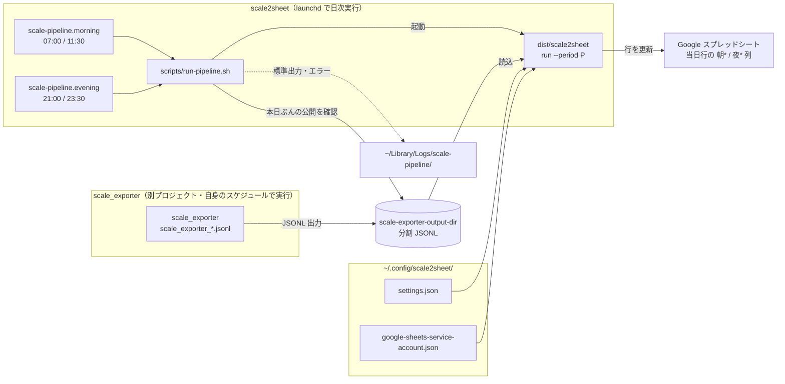
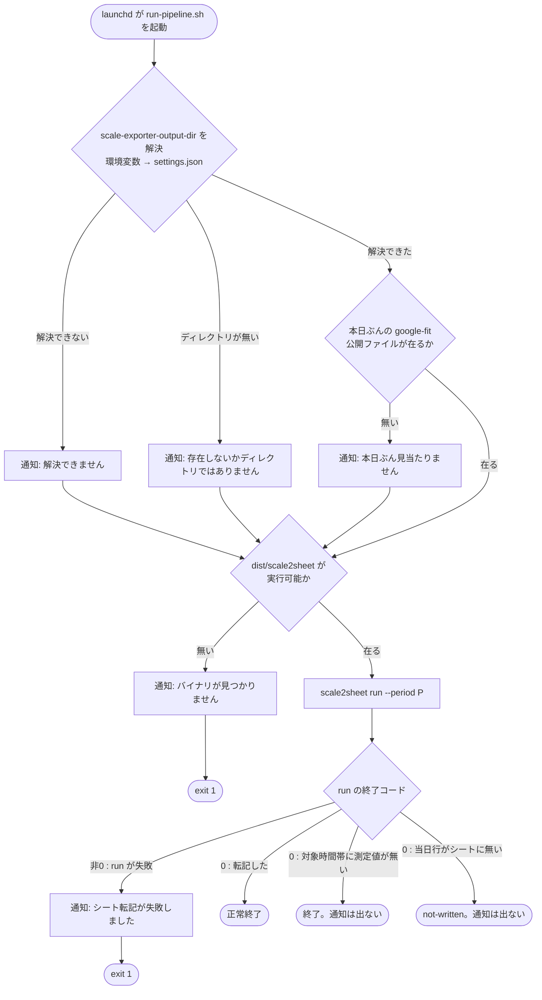

# scale2sheet

朝・夜の身体測定値を Google Spreadsheet の当日行へ転記する TypeScript サービスです。正式な配布・運用形態は `bun build --compile` で生成する単体バイナリ `scale2sheet` です。開発・型検査は Node.js（>= 22）ツールチェインを使います。**`npm test` はバイナリを実際にビルドして検証する acceptance 試験（コマンドセット乖離・pipeline shadow 経路・run lease・install/uninstall・CLI smoke、#128・#168）を含むため、[Bun](https://bun.sh/)（>= 1.0.0）のインストールも必要です。**

パッケージ名は `cale2sheet`、CLI コマンド名は `scale2sheet` です。

## データフロー

<!-- diagram: composition -->


デフォルトのデータソースは `scale-exporter`（[scale_exporter](https://github.com/kappaseijin/scale_exporter) が出力した分割 JSONL ファイルの読み込み）です。Google Fit REST API 直接取得（`--source google-fit`）も残っていますが、同 API は 2026 年末で終了するため非推奨です。launchd による朝夕の自動実行（本実行＋拾い直し）に対応します（後述）。

## 対応データ

Spreadsheet は既存行を更新します。1行目の `月日` 列で当日行を検索し、`朝*` または `夜*` 列へ値を書き込みます。

```text
月日 | 朝体重 | 朝体温 | 朝血圧上 | 朝血圧下 | 朝脈拍 | 夜体重 | 夜体温 | 夜血圧上 | 夜血圧下 | 夜脈拍
```

取得対象は体重、体温、収縮期血圧、拡張期血圧、脈拍です。Google Fit で体温データ型が利用できない場合、体温は空欄になります。

朝は `05:00` から `12:00`、夜は `20:00` から `23:30` の測定値だけを対象にします。対象時間帯の測定値がない場合、Spreadsheet は更新せず正常終了します。

## セットアップ

設定ファイルは `~/.config/scale2sheet/settings.json` です。環境変数（`.env` 含む） > `settings.json` の順で解決します。**組み込み既定値はありません。** `sheet-id` と `scale-exporter-output-dir` は必須で、未指定なら起動時に失敗します（Issue #47 / #51）。

### 既存利用者向けの移行手順

2026-08-07 以前の `settings.json` には `sheet-id` が含まれていない場合があります。次のいずれかの手順で追加してください。

1. `~/.config/scale2sheet/settings.json` をエディタで開く
2. `"sheet-id": "<転記先SpreadsheetのID>"` を追加する（SpreadsheetのURL `https://docs.google.com/spreadsheets/d/<ここがID>/edit` から取得）
3. `source` が `scale-exporter`（既定）の場合は、`"scale-exporter-output-dir": "<scale_exporterのJSONL出力フォルダ>"` も確認する。無ければ追加する

設定せずに起動すると、次のようなメッセージで失敗します。メッセージにはどのキーをどのファイルへ追加すればよいかが含まれます。

```
Google Sheets requires both sheet-id and sheets-credentials in ~/.config/scale2sheet/settings.json (or GOOGLE_SHEET_ID / GOOGLE_APPLICATION_CREDENTIALS).
```

設定ファイルの主なキーは次のとおりです。

| キー | 用途 | 必須 |
| --- | --- | --- |
| `time-zone` | 日付・時間帯の解釈（既定 `Asia/Tokyo`） | - |
| `source` | `scale-exporter` / `google-fit` / `apple-health`（既定 `scale-exporter`） | - |
| `sheet-id` / `sheet-name` | 転記先Spreadsheetとシート名 | `sheet-id` は必須 |
| `sheets-credentials` | Google Sheetsサービスアカウント鍵のパス | 必須 |
| `scale-exporter-output-dir` | scale_exporter JSONL入力フォルダ | `source` が `scale-exporter` のとき必須 |
| `apple-health-export-xml` | Apple Health XML入力パス | `source` が `apple-health` のとき必須 |
| `google-fit-token-path` / `google-fit-lookback-days` | Google Fit OAuthトークンと検索期間 | - |
| `google-fit-client-id` / `google-fit-client-secret` / `google-fit-redirect-uri` | Google Fit OAuthクライアント（環境変数 `GOOGLE_FIT_CLIENT_ID` / `GOOGLE_FIT_CLIENT_SECRET` / `GOOGLE_FIT_REDIRECT_URI` でも設定可） | `source` が `google-fit` のとき必須 |
| `morning-cron` / `evening-cron` | `serve` の実行時刻 | - |

`sheet-id` の実値はREADMEに掲載しません。共有されたREADMEから本番スプレッドシートを特定できる状態を避け、値の正本を各自の `settings.json` に置きます。

認証情報は設定ファイルへ値を直接書かず、`~/.config/scale2sheet/google-sheets-service-account.json`（Sheets）または `google-fit-credentials.json`（Google Fit）へ配置します。詳細は [EXTERNAL_DESIGN.md](./docs/EXTERNAL_DESIGN.md#設定ファイル) を参照してください。

### Bun バイナリの作成と実行

```sh
npm install
npm run build:bun
./dist/scale2sheet run --period morning   # 初回実行で settings.json が自動生成される
```

### Node.js での開発・デバッグ

```sh
npm install
npm run build:node
node dist/index.js run --period morning
```

`~/.config/scale2sheet/settings.json`（非シークレット・自動生成後に編集）:

```json
{
  "time-zone": "Asia/Tokyo",
  "source": "scale-exporter",
  "sheet-id": "<スプレッドシートID>",
  "sheet-name": "体温・血圧",
  "sheets-credentials": "~/.config/scale2sheet/google-sheets-service-account.json",
  "scale-exporter-output-dir": "/path/to/scale-exporter-output",
  "morning-cron": "0 7 * * *",
  "evening-cron": "0 21 * * *"
}
```

`scale-exporter-output-dir` は利用環境の入力フォルダへ変更してください。`sheet-id` と（`source` が `scale-exporter` のとき）`scale-exporter-output-dir` は必須です。設定は環境変数、`settings.json` の順で解決されます（組み込み既定値はありません）。

認証ファイル（シークレット・手動配置）:

- `~/.config/scale2sheet/google-sheets-service-account.json` — Google Sheets 用サービスアカウント鍵
- `~/.config/scale2sheet/google-fit-credentials.json` — Google Fit 利用時のみ。`{"client_id": "...", "client_secret": "..."}`（scale_exporter と同形式）

環境変数（`.env` 含む）は settings.json への**上書き**として引き続き使えます（変数名は `.env.example` 参照）。優先順位: 環境変数 > settings.json。

Google Sheets は service account を使います。対象Spreadsheetをservice accountのメールアドレスに共有してください。

Google Fit は個人health dataのためinstalled app OAuthを使います。Google Cloud ConsoleでOAuth clientを作成し、redirect URIに `http://localhost:3000/oauth2callback` を登録してください。

## Google Fit 初回認証

```sh
npm run build:bun
./dist/scale2sheet auth
```

Node.js で確認する場合は次でも実行できます。

```sh
npm run build:node
node dist/index.js auth
```

表示されたURLをブラウザで開いて認可します。認可後、CLIがlocalhost callbackを受け取り、`GOOGLE_FIT_TOKEN_PATH` にtoken JSONを保存します。

## Spreadsheet の前提

対象シートには当日行が事前に存在している必要があります。`月日` 列の日付は `YYYY-MM-DD`、`YYYY/MM/DD`、`M/D`、`M月D日` 形式に対応します。行が見つからない場合、自動作成はせずログを出して終了します。

## 手動実行

既定のsourceは `scale-exporter`（scale_exporter の出力JSONLファイルを読み込み）です。朝の列を更新します。

```sh
./dist/scale2sheet run --period morning
```

Google Fit REST APIから直接取得する場合（非推奨: 2026年末でAPI終了。[ARCHITECTURE_DESIGN.md](./docs/ARCHITECTURE_DESIGN.md#重要な外部制約) 参照）:

```sh
./dist/scale2sheet run --period morning --source google-fit
```

Apple Health XMLから夜の列を更新します。

```sh
./dist/scale2sheet run --period evening --source apple-health
```

### 終了コード

`run` コマンドの終了コードです（`pipeline` / `serve` / `auth` / `doctor` やシグナル終了は対象外）。

| exit code | 意味 |
| --- | --- |
| `2` | CLIの構文・引数エラー（未知のオプション、引数不足、不正な値など） |
| `1` | 設定・環境・実行時のエラー（必須設定の欠落、入力の読み取り失敗、転記の失敗など） |
| `0` | 正常終了（`--help` / `--version` を含む） |

## 常駐実行

既定では `scale-exporter` をsourceにして、`MORNING_CRON` と `EVENING_CRON` で実行します。

```sh
./dist/scale2sheet serve
```

別のsourceにする場合:

```sh
./dist/scale2sheet serve --source apple-health
```

## 開発コマンド

```sh
npm run typecheck
npm test
npm run build:node
```

`npm test` は `bun build --compile` で実際にバイナリをビルドして検証する acceptance 試験を6本含みます（コマンドセット乖離 #128、pipeline shadow 経路・run lease・install/uninstall・CLI smoke #168、Google Sheets 無応答時の期限とlease回復 #280）。そのぶん通常のユニットテストだけより時間がかかり、6本が並列で `bun build` を回すため**実行環境のCPU負荷によって所要時間が変動します**。#280のfocused acceptanceだけは180秒の明示的タイムアウトを持ちます。これは60秒startup、45秒のblackhole接続後deadline watchdog、30秒のpost-reacquire watchdogが、test runnerより先に原因別の診断を出すための上限です。製品のGoogle Sheets操作上限30秒とは別の検査上限です。ほかのacceptance試験の上限は変更していません。[Bun](https://bun.sh/) が PATH に無い場合、これらの検査はスキップではなく**失敗**します（インストール手順をエラーメッセージに表示します）。

```sh
curl -fsSL https://bun.sh/install | bash
```

## launchd による日次自動実行

<!-- diagram: run-path -->


`scripts/run-pipeline.sh` が `scale2sheet run --period` による転記を1回分実行します。launchd が本実行と拾い直し実行の計 2 回/期を起動します（本体は冪等なので重複実行しても当日行を上書きするだけ）。異常は `osascript` の macOS 通知で知らせるため、LLM やログ監視に依存しません。

`scale_exporter` の起動はこのスクリプトの責任ではありません。`scale_exporter` 自身のスケジュールで `scale-exporter-output-dir` へ公開された JSONL を読み込むだけです。当日ぶんの公開ファイルがまだ無い場合や、`scale-exporter-output-dir` 自体が解決できない・存在しない場合は通知が出ます（`run` は失敗させず、通知のみです）。

| ファイル | 役割 |
| --- | --- |
| `scripts/run-pipeline.sh <morning\|evening>` | パイプライン本体（公開済みJSONLの読込 → `run --period`） |
| `scripts/launchd/jp.seijin.kappa.scale-pipeline.morning.plist` | 朝 07:00 本実行 + 11:30 拾い直し |
| `scripts/launchd/jp.seijin.kappa.scale-pipeline.evening.plist` | 夜 21:00 本実行 + 23:30 拾い直し |

拾い直し実行は「測定が実行時刻より後になり本実行で取りこぼす」ケースを OS 側で自動的に補う（従来は手動再実行していた作業を launchd に移管）。

### インストール

```sh
npm install
npm run build:bun
mkdir -p ~/Library/LaunchAgents ~/Library/Logs/scale-pipeline
cp scripts/launchd/*.plist ~/Library/LaunchAgents/
launchctl bootstrap gui/$(id -u) ~/Library/LaunchAgents/jp.seijin.kappa.scale-pipeline.morning.plist
launchctl bootstrap gui/$(id -u) ~/Library/LaunchAgents/jp.seijin.kappa.scale-pipeline.evening.plist
```

ログは `~/Library/Logs/scale-pipeline/` に出力されます。Apple Health ソースは HealthKit 署名後に `run-pipeline.sh` のコメントアウトを外して有効化してください。

### アンインストール

launchd 自動実行を止めて登録解除します。

```sh
launchctl bootout gui/$(id -u)/jp.seijin.kappa.scale-pipeline.morning
launchctl bootout gui/$(id -u)/jp.seijin.kappa.scale-pipeline.evening
rm ~/Library/LaunchAgents/jp.seijin.kappa.scale-pipeline.morning.plist
rm ~/Library/LaunchAgents/jp.seijin.kappa.scale-pipeline.evening.plist
```

上記で自動実行のみ解除されます。設定・認証情報・ログは残るため、完全に削除する場合は加えて以下も実行してください。

```sh
rm -rf ~/Library/Logs/scale-pipeline/   # 実行ログ
rm -rf ~/.config/scale2sheet/           # settings.json・認証情報（scale_exporterの設定とは別ディレクトリ）
```

リポジトリのクローン（`node_modules/` / `dist/` を含む）を削除すればアプリ本体も完全にアンインストールされます。

注意: 常駐モード（`serve`）と併用すると二重書き込みになるため、launchd 運用時は `serve` を起動しないでください。

### 実行状態と検知の限界

`pipeline` サブコマンドで実行したパイプラインの状態は `~/.config/scale2sheet/pipeline-status.json` に記録されます。現行のv1文書は `schemaVersion`、`definitionsVersion`、`definitionsLabel`、`updatedAt`、`periods`（`morning` / `evening`）を持ち、各期間の `lastTerminal` 以下に outcome・開始/完了時刻・対象日・入力件数・診断情報など、期間単位に連続失敗回数・連続no-data回数・healthを保持します。Spreadsheetの値そのものではなく、パイプラインがどこまで到達したかを確認するために使います。

なお、READMEのlaunchd手順が呼び出す `run` サブコマンドは現在このファイルを書きません。したがって、launchdの起動状態をこのファイルだけで監視することはできません。

次の制約があります。

- パイプライン自体が起動しない期間は、`pipeline-status.json` を更新できないため検知できません（READMEのlaunchd手順では `run` がこのファイルを書かないため、なおさら対象外です）。
- macOS通知が表示・到達したことは記録できますが、利用者が通知を既読にしたことは証明できません。
- シートの空欄だけでは転記失敗を検知できません。Issue #46 の実測では、2026-07-18〜27のパイプライン未到達期間でも、夜の値は07-20を除く9日分が人手で埋まっていました。
- Google Sheets の認証、ヘッダ読取、日付列読取、書込みは、転記試行全体で共有する30秒の上限を超えると中断します。`pipeline` では `failed:transfer` と診断情報を状態ファイルへ残して終了し、`run` は終了コード `1` を返します。`serve` は同じ失敗をログに出して、次の予定実行を待ちます。
- 書込み（batch update）の途中で上限に達した場合、Google 側で反映されたかは**結果未確認**です。直ちに自動再試行せず、先に対象行を確認してください。必要なら、確認後に通常の転記を改めて実行します。
