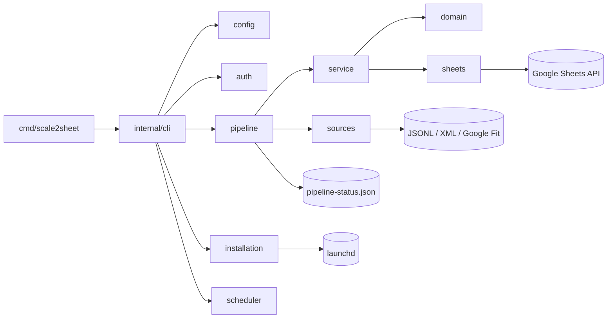
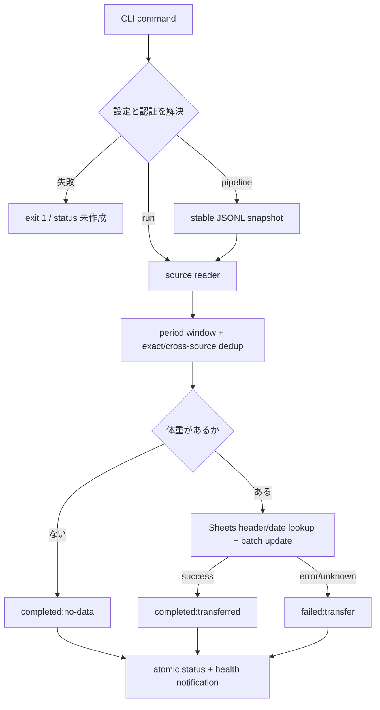

# scale2sheet — アーキテクチャ設計

## 目的と実装基盤

scale2sheet は、scale_exporter JSONL、Apple Health XML、Google Fit から身体測定値を読み込み、Google Spreadsheet の既存行を更新する Go 1.22 製品です。製品バイナリは `cmd/scale2sheet` から `CGO_ENABLED=0 go build` で作成します。launchd と Darwin 固有の排他 lease があるため、常駐運用の対象は macOS です。

## 構成

## パッケージ責務

| パッケージ | 責務 |
| --- | --- |
| `cmd/scale2sheet` | 引数を parse し `internal/cli` を起動する薄い entry point |
| `internal/cli` | command dispatch、config 解決、依存の組み立て、終了コード |
| `internal/config` | settings JSON、環境変数、既定値、source-specific validation |
| `internal/auth` | Sheets 認証記述と Google Fit OAuth callback/token 保存 |
| `internal/domain` | measurement model、period、row、transfer outcome |
| `internal/sources` | scale-exporter、Apple Health、Google Fit の読み取り adapter |
| `internal/service` | 時間帯 filter、重複除去、weight anchor、Sheets transfer |
| `internal/sheets` | Google Sheets client、header/date 解決、A1 mapping、batch update |
| `internal/pipeline` | stable snapshot、status、health、notification、orchestration |
| `internal/scheduler` | Darwin O_EXLOCK lease、active receipt、serve cron |
| `internal/installation` | binary copy、settings template、manifest、plist、launchctl、doctor |

`domain` は外部 API へ依存せず、`sources` は取得だけを行い Sheets へ書き込みません。Google API と filesystem/process 境界は adapter として切り分け、unit test では fake HTTP/client を利用します。

## 実行フロー

`pipeline` は status を running として先に保存し、terminal では対象 period だけを更新します。status は一時ファイルから rename し、mode `0600` で保存します。Google Sheets の転記期限は 30 秒で、期限超過時は反映結果未確認として自動再試行しません。

## 技術選定

| 技術 | 用途 | 理由 |
| --- | --- | --- |
| Go standard library | CLI、JSON/XML、filesystem、HTTP、cron の基本 | 単一バイナリと明示的なエラー伝播 |
| `google.golang.org/api/sheets/v4` | Google Sheets | 公式 Go client の Values Get/BatchUpdate |
| `google.golang.org/api/fitness/v1` | Google Fit | 公式 Go client の data source/dataset API |
| `golang.org/x/oauth2` | Google Fit OAuth | state、PKCE、token exchange |
| `syscall` / Unix socket | macOS lease | Darwin の `O_EXLOCK` と cooperative stop |

## 外部制約とリスク

- Google Fit REST API は終了予定があるため、標準の入力経路は scale_exporter JSONL とします。Google Fit は互換経路として残します。
- scale_exporter の公開は別プロジェクトの責務です。scale2sheet は producer を起動・設定変更せず、公開済みファイルを bounded stable snapshot として読みます。
- Spreadsheet は既存行更新のみです。見出しや当日行が無い場合は転記を成功とみなしません。
- Google API と launchd は外部状態に依存します。blackhole、lease競合、isolated HOME の acceptance で失敗時の安全性を検証します。
