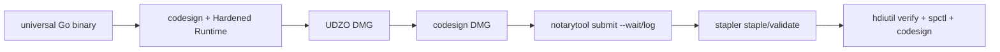

# scale2sheet — 外部設計

## 実装状態

製品の実装・配布物・既定の検証経路は Go です。macOS の製品 artifact は `bash scripts/build-macos-release.sh` で `darwin/arm64` と `darwin/amd64` を build し、`lipo` で universal 単一バイナリを作成します。旧 TypeScript/Bun 経路は比較用の履歴であり、製品の利用手順ではありません。

## CLI

```text
scale2sheet auth
scale2sheet doctor [--prefix <dir>]
scale2sheet install [--prefix <dir>] [--launchd] [--dry-run]
scale2sheet pipeline --period <morning|evening> [--date <YYYY-MM-DD>]
scale2sheet run --period <morning|evening> [--source <source>] [--date <YYYY-MM-DD>]
scale2sheet serve [--source <source>]
scale2sheet uninstall [--prefix <dir>] [--dry-run]
```

共通の `--help` / `--version` も利用できます。

| オプション | コマンド | 説明 |
| --- | --- | --- |
| `--period <morning\|evening>` | `run`, `pipeline` | 対象期間。必須 |
| `--source <scale-exporter\|google-fit\|apple-health>` | `run`, `serve` | 入力ソース。省略時は設定値 |
| `--date <YYYY-MM-DD>` | `run`, `pipeline` | 対象日。省略時は設定 timezone の当日 |
| `--prefix <dir>` | `install`, `uninstall`, `doctor` | バイナリ配置ルート。既定 `~/.local`。doctor は manifest の prefix/binary path 整合性も検査 |
| `--launchd` | `install` | launchd plist を生成・登録 |
| `--dry-run` | `install`, `uninstall` | 変更せず操作計画を表示 |

構文・値のエラーは終了コード `2`、設定・入力・認証・外部 API・転記・lease の実行時エラーは `1`、正常終了は `0` です。`pipeline` の no-data は `0` です。

`auth` は Google Fit の installed-app OAuth（state と PKCE S256 を使用する localhost callback）を実行し、token を mode `0600` で保存します。

## 設定ファイル

設定ファイルは `~/.config/scale2sheet/settings.json` です。存在しない場合は初回読込時に作成されます。解決順序は環境変数 > `settings.json` > 組み込み既定値です。

```json
{
  "time-zone": "Asia/Tokyo",
  "source": "scale-exporter",
  "sheet-id": "<Spreadsheet ID>",
  "sheet-name": "体温・血圧",
  "sheets-credentials": "~/.config/scale2sheet/google-sheets-service-account.json",
  "scale-exporter-output-dir": "/path/to/scale-exporter-output",
  "morning-cron": "0 7 * * *",
  "evening-cron": "0 21 * * *"
}
```

| キー | 型 | 内容 |
| --- | --- | --- |
| `time-zone` | string | IANA timezone。既定 `Asia/Tokyo` |
| `source` | enum | `scale-exporter` / `google-fit` / `apple-health`。既定 `scale-exporter` |
| `sheet-id` | string | 転記先 Spreadsheet ID。必須 |
| `sheet-name` | string | 対象シート名。既定 `体温・血圧` |
| `sheets-credentials` | path | Sheets service-account JSON。必須 |
| `scale-exporter-output-dir` | path | 分割 JSONL の入力フォルダ。scale-exporter 時に必須 |
| `apple-health-export-xml` | path | Apple Health `export.xml`。apple-health 時に必須 |
| `google-fit-client-id` / `google-fit-client-secret` | string | Google Fit OAuth client。google-fit 時に必須 |
| `google-fit-redirect-uri` | URI | OAuth callback。既定 `http://localhost:3000/oauth2callback` |
| `google-fit-token-path` | path | OAuth token。既定 `~/.config/scale2sheet/google-fit-token.json` |
| `google-fit-lookback-days` | positive integer | Google Fit の検索期間。既定 `14` |
| `morning-cron` / `evening-cron` | cron | `serve` の実行時刻。既定 `0 7 * * *` / `0 21 * * *` |

対応する環境変数は `TIME_ZONE`、`SCALE_EXPORTER_OUTPUT_DIR`、`APPLE_HEALTH_EXPORT_XML`、`GOOGLE_SHEET_ID`、`GOOGLE_SHEET_NAME`、`GOOGLE_APPLICATION_CREDENTIALS`、`GOOGLE_FIT_CLIENT_ID`、`GOOGLE_FIT_CLIENT_SECRET`、`GOOGLE_FIT_REDIRECT_URI`、`GOOGLE_FIT_TOKEN_PATH`、`GOOGLE_FIT_LOOKBACK_DAYS`、`MORNING_CRON`、`EVENING_CRON` です。

## 認証ファイル

| ファイル | 内容 |
| --- | --- |
| `google-sheets-service-account.json` | Google Sheets API の service-account key |
| `google-fit-credentials.json` | `client_id`、`client_secret`、任意の `redirect_uri` |
| `google-fit-token.json` | `scale2sheet auth` が保存する OAuth token |

秘密情報は設定ファイルやリポジトリへ埋め込まず、ファイル権限を owner-only にしてください。Sheets のサービスアカウントを対象 Spreadsheet へ共有する必要があります。

## 入力と転記

scale-exporter の対象ファイル名は `scale_exporter_{YYYY-MM-DD}_{apple-health|google-fit}_{seq}.jsonl` です。対象日を timezone で選び、安定性を確認してから読み込みます。朝の対象時間帯は `05:00–12:00`、夜は `20:00–23:30` です。体重を必須アンカーとし、体重が無い期間は Spreadsheet を更新しません。

Apple Health は `export.xml` から対象 Record を読み込みます。Google Fit は公式 Go client の Fitness API で data source と dataset を読み込みます。体温 data type が未提供のときは optional 欠測として継続します。

Spreadsheet は1行目の `月日` 列から対象日の既存行を探し、朝/夜の体重、体温、血圧上/下、脈拍の対応セルだけを batch update します。当日行は自動作成しません。

## 実行状態と配置

| パス | 用途 |
| --- | --- |
| `~/.config/scale2sheet/pipeline-status.json` | 期間別の running/terminal outcome、件数、health |
| `~/.config/scale2sheet/active-run.json` | 実行中 lease の診断情報 |
| `/tmp/scale2sheet-<uid>-<namespace>/active-run.lock` | Darwin `O_EXLOCK` 排他 lock |
| `~/.local/bin/scale2sheet` | 既定の install 先 |
| `~/Library/LaunchAgents/jp.seijin.kappa.scale-pipeline.*.plist` | launchd 登録 |
| `~/Library/Logs/scale-pipeline/` | launchd 標準出力・エラー |

status と認証情報は atomic 更新・owner-only permissions を使用します。Google Sheets の操作全体には 30 秒の期限があります。期限超過時は `failed:transfer` として記録し、自動再試行は行いません。

## macOS 本番運用

製品 build は次の契約に固定します。

```sh
bash scripts/build-macos-release.sh
```

このスクリプトは `GOOS=darwin`、`GOARCH=arm64|amd64`、`CGO_ENABLED=0`、`GOTOOLCHAIN=local`、`-trimpath` を明示し、`file` と `lipo -info` で `arm64` + `x86_64` を検証します。実行体は per-user `~/Library/LaunchAgents` と `launchctl gui/<uid>` で管理します。状態確認は `launchctl print`、一回の手動再実行は `launchctl kickstart -k`、plist XML 検査は `plutil -lint` を使います。

ローカル検証用の artifact は unsigned です。公開配布用 artifact は [Issue #10](https://github.com/kappaseijin/scale2sheet4go/issues/10) の `scripts/build-macos-distribution.sh` で Developer ID Application、Hardened Runtime、notarytool、stapler、公開配布用 Gatekeeper 検証を通します。

### 公開配布 artifact

現行製品は裸の Go CLI であり、既存の per-user install 契約を変更しないため、配布容器は UDZO DMG とする。DMG 内には universal `scale2sheet` binary と README を置く。Apple の直接配布手順に従い、binary を署名してから DMG を作成し、DMG も Developer ID Application で署名する。公証するのは最外側の DMG だけである。



API key 方式（`.p8`、Key ID、Issuer ID）を CI の標準とし、Keychain profile 方式もローカル用に受理する。証明書、秘密鍵、temporary keychain はリポジトリへ保存せず、GitHub Actions では `macos-release` environment の secrets を実行時だけ `$RUNNER_TEMP` へ復号し、終了時に削除する。通常の PR quality workflow は secrets を読み込まない。

Developer ID identity または notary credentials が不足する場合は、build や artifact 出力を行わず fail-closed とする。Apple Development、ad hoc、`codesign --deep`、`sudo` へのフォールバックはしない。README に、local build、CI secret、DMG からの install、契約 acceptance を自己完結で記載する。

## 関連設計

- [README.md](../README.md): 利用者向けの自己完結した手順
- [ARCHITECTURE_DESIGN.md](./ARCHITECTURE_DESIGN.md): Go パッケージ構成
- [INTERNAL_DESIGN.md](./INTERNAL_DESIGN.md): 内部型と主要関数
- [INSTALLATION_DESIGN.md](./INSTALLATION_DESIGN.md): install/uninstall/launchd
