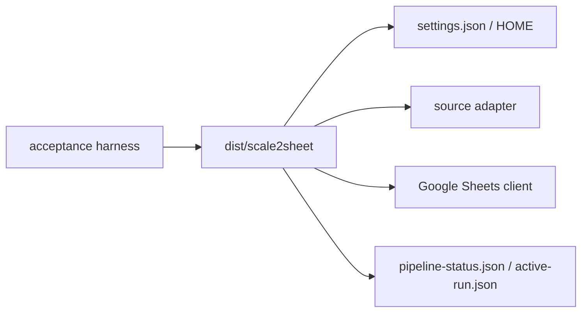

# scale2sheet — 外部テスト設計

Issue #2 の対象は Go 実装とし、受け入れ試験は TypeScript のソース経路へフォールバックせず、`dist/scale2sheet` の単一バイナリを実行する。
旧 AT-01〜AT-18 の番号は [ACCEPTANCE_TEST_REPORT.md](./ACCEPTANCE_TEST_REPORT.md) に履歴として残す。
現行 Go と旧 AT の対応分類は [Go版受入マトリクス現行化設計](./superpowers/specs/2026-08-13-go-acceptance-matrix.md) を参照する。

## 共通前提

- macOS 上で Go 1.22 以上を使う。
- ビルドとテストは `CGO_ENABLED=0` を指定し、`GOTOOLCHAIN=local` で再現する。
- 実行環境はテスト用の `HOME` と一時ディレクトリを使い、本番の設定・認証・状態を変更しない。
- 実 Google Sheets / Google Fit の確認は、偽の認証情報を使う自動試験とは分離する。
- Google API を使う経路では、秘密値・token・Spreadsheet ID をログやレポートへ記録しない。

## 製品境界



## 自動受け入れ試験

全自動試験の正本入口は次である。

```sh
bash scripts/run-go-acceptance-matrix.sh
```

macOS の隔離 fixture を使い、各 child script が個別に Go binary を build する。実行には実 credential や実 Spreadsheet を渡さない。

| 試験 | 実行コマンド | 主な契約 |
| --- | --- | --- |
| Pipeline shadow | `bash scripts/run-pipeline-shadow-acceptance.sh` | 安定 snapshot、入力欠落、失敗 terminal、SIGKILL 後の lease 回収 |
| Sheets deadline | `bash scripts/run-google-sheets-deadline-acceptance.sh` | 無応答 Sheets 操作が共有期限で終端し、状態と lease を残さない |
| Installer | `bash scripts/run-installer-acceptance.sh` | isolated HOME、dry-run、install/uninstall、起動中 lease の無変更 |
| Runtime safety | `bash scripts/run-runtime-safety-acceptance.sh` | 2 プロセス競合、EAGAIN/EWOULDBLOCK、異常終了後の再取得 |
| Binary/source drift | `bash scripts/run-binary-source-drift-acceptance.sh` | バイナリのコマンド集合と Go source の集合一致、古い経路の負の制御 |
| Binary smoke | `bash scripts/run-bun-binary-smoke.sh` | 互換名の smoke。実体は Go バイナリの help/version/config 異常系 |
| macOS release | `bash scripts/run-macos-release-acceptance.sh` | universal binary、plist、doctor、install/uninstall |
| macOS distribution contract | `bash scripts/run-macos-distribution-contract-acceptance.sh` | 署名・公証の資格情報境界と部分出力防止 |

すべての acceptance script は、ビルドに失敗した場合や期待された負の制御が成立しない場合に non-zero で終了する。
`run-bun-binary-smoke.sh` というファイル名は既存呼び出しとの互換性のために残しているだけで、Bun は実行しない。

## 専用環境の実 Google 受入

AT-01〜AT-06 を実サービスで確認する入口は `scripts/run-google-external-acceptance.sh` である。詳細な契約は [専用検証環境向け Google 外部受入 runner 設計](./superpowers/specs/2026-08-13-google-external-acceptance.md) に保存する。

runner は次の条件をすべて満たさない限り child binary を起動しない。

- `SCALE2SHEET_EXTERNAL_ACCEPTANCE=1` の明示的 opt-in。
- 現在のユーザー HOME と異なる、事前作成済み marker 付き、owner-only の `SCALE2SHEET_EXTERNAL_HOME`。
- fixture placeholder ではない専用 `SCALE2SHEET_EXTERNAL_SHEET_ID`。
- 現在のユーザー HOME 配下ではない、symlink でない、owner-only の service-account JSON。
- 実行可能な Go binary、必要な専用 scale_exporter input directory。

runner は専用 HOME 内へ settings を生成または指定値との一致を検査し、child の stdout/stderr は一時領域へ隔離する。結果ファイルには case、状態、終了時刻だけを保存し、secret、token、Spreadsheet ID、測定値を残さない。認証 token は専用 HOME の `google-fit-token.json` に固定し、mode `0600` を検査する。

```sh
external_home="$(mktemp -d "${TMPDIR:-/tmp}/scale2sheet-external-home.XXXXXX")"
chmod 700 "$external_home"
printf '%s\n' 'scale2sheet-external-acceptance-v1' >"$external_home/.scale2sheet-external-acceptance"
chmod 600 "$external_home/.scale2sheet-external-acceptance"
export SCALE2SHEET_EXTERNAL_ACCEPTANCE=1
export SCALE2SHEET_EXTERNAL_HOME="$external_home"
export SCALE2SHEET_EXTERNAL_SHEET_ID='<dedicated Spreadsheet ID>'
export SCALE2SHEET_EXTERNAL_SHEETS_CREDENTIALS='/secure/acceptance/google-sheets-service-account.json'
export SCALE2SHEET_EXTERNAL_INPUT_DIR='/secure/acceptance/scale-exporter-output'
export SCALE2SHEET_EXTERNAL_BINARY="$PWD/dist/scale2sheet"
```

ケース別の入口は次である。

| AT | runner | 自動で確認すること | 外部で確認すること |
| --- | --- | --- | --- |
| AT-01 | `... at-01` | morning command exit `0` | 対象日の朝列と値 |
| AT-02 | `... at-02` | evening command exit `0` | 対象日の夜列と値 |
| AT-03 | `... at-03` | `SCALE2SHEET_EXTERNAL_PAST_DATE` の command exit `0` | 指定日の対象行と値 |
| AT-04 | `... at-04` | Google Fit token、mode `0600`、command exit `0` | Fit 実データと転記値 |
| AT-05 | `... at-05` | serve 起動、SIGTERM、active-run lease 回収 | cron callback と Spreadsheet 更新 |
| AT-06 | `... at-06` | OAuth command exit `0`、token、mode `0600` | consent、localhost callback 完了 |

AT-05 は `SCALE2SHEET_EXTERNAL_SERVE_CRON` と `SCALE2SHEET_EXTERNAL_SERVE_SECONDS` を必須とする。`all` は AT-06、AT-04、AT-01、AT-02、AT-03、AT-05 の順に実行する。runner の `PASS` は最終的な外部受入 `PASS` ではなく、手動観測が残る場合は `OBSERVATION_REQUIRED` として扱う。

## 手動受け入れ試験

実 API の手動試験は、検証用 Google Cloud project、検証用 Spreadsheet、テスト用 `HOME` を用意した場合だけ実施する。

1. README の「実 Google 連携の外部受入」に従い、専用 HOME、marker、service-account key、Spreadsheet ID、入力 directory を設定する。
2. Spreadsheet の対象シートに README 記載の見出しと対象日の行を用意する。
3. `bash scripts/run-google-external-acceptance.sh at-01`、`at-02`、`at-03` を実行する。
4. 更新されたセル、終了コードを確認する。pipeline を併用した場合は `pipeline-status.json` と lease 回収も確認する。
5. Google Fit を試す場合は先に `at-06` を実行し、callback 後の token が専用 HOME 内 mode `0600` で保存されることを確認して `at-04` を実行する。
6. `at-05` は専用 cron と観測秒数を指定し、実時刻 callback、lease 回収、Spreadsheet 更新を確認する。
7. 実値・token・認証ファイル・Spreadsheet ID をレポートへ転載しない。

## 判定

- `0`: 期待された正常終了、no-data、help/version。
- `1`: 設定、入力、認証、API、転記、lease の実行時失敗。
- `2`: 未知のコマンド・オプション、必須値不足、不正な period/source/date。
- 期限、lease、status、無変更条件のいずれかが確認できない場合は PASS にしない。

結果は [ACCEPTANCE_TEST_REPORT.md](./ACCEPTANCE_TEST_REPORT.md) に RFC3339 JST の実行時刻付きで追記する。
