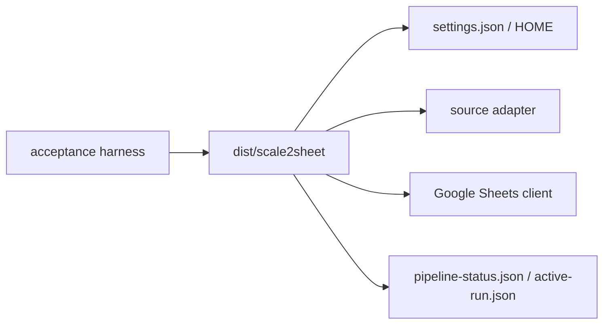

# scale2sheet — 外部テスト設計

Issue #2 の対象は Go 実装とし、受け入れ試験は TypeScript のソース経路へフォールバックせず、`dist/scale2sheet` の単一バイナリを実行する。
旧 AT-01〜AT-18 の番号は [ACCEPTANCE_TEST_REPORT.md](./ACCEPTANCE_TEST_REPORT.md) に履歴として残す。

## 共通前提

- macOS 上で Go 1.22 以上を使う。
- ビルドとテストは `CGO_ENABLED=0` を指定し、`GOTOOLCHAIN=local` で再現する。
- 実行環境はテスト用の `HOME` と一時ディレクトリを使い、本番の設定・認証・状態を変更しない。
- 実 Google Sheets / Google Fit の確認は、偽の認証情報を使う自動試験とは分離する。
- Google API を使う経路では、秘密値・token・Spreadsheet ID をログやレポートへ記録しない。

## 製品境界

## 自動受け入れ試験

| 試験 | 実行コマンド | 主な契約 |
| --- | --- | --- |
| Pipeline shadow | `bash scripts/run-pipeline-shadow-acceptance.sh` | 安定 snapshot、入力欠落、失敗 terminal、SIGKILL 後の lease 回収 |
| Sheets deadline | `bash scripts/run-google-sheets-deadline-acceptance.sh` | 無応答 Sheets 操作が共有期限で終端し、状態と lease を残さない |
| Installer | `bash scripts/run-installer-acceptance.sh` | isolated HOME、dry-run、install/uninstall、起動中 lease の無変更 |
| Runtime safety | `bash scripts/run-runtime-safety-acceptance.sh` | 2 プロセス競合、EAGAIN/EWOULDBLOCK、異常終了後の再取得 |
| Binary/source drift | `bash scripts/run-binary-source-drift-acceptance.sh` | バイナリのコマンド集合と Go source の集合一致、古い経路の負の制御 |
| Binary smoke | `bash scripts/run-bun-binary-smoke.sh` | 互換名の smoke。実体は Go バイナリの help/version/config 異常系 |

すべての acceptance script は、ビルドに失敗した場合や期待された負の制御が成立しない場合に non-zero で終了する。
`run-bun-binary-smoke.sh` というファイル名は既存呼び出しとの互換性のために残しているだけで、Bun は実行しない。

## 手動受け入れ試験

実 API の手動試験は、検証用 Google Cloud project、検証用 Spreadsheet、テスト用 `HOME` を用意した場合だけ実施する。

1. `settings.json` と service-account key を設定する。
2. Spreadsheet の対象シートに README 記載の見出しと対象日の行を用意する。
3. `scale2sheet run --period morning` または `evening` を実行する。
4. 更新されたセル、`pipeline-status.json`、終了コードを確認する。
5. Google Fit を試す場合は先に `scale2sheet auth` を実行し、callback 後の token が mode `0600` で保存されることを確認する。
6. 実値・token・認証ファイルをレポートへ転載しない。

## 判定

- `0`: 期待された正常終了、no-data、help/version。
- `1`: 設定、入力、認証、API、転記、lease の実行時失敗。
- `2`: 未知のコマンド・オプション、必須値不足、不正な period/source/date。
- 期限、lease、status、無変更条件のいずれかが確認できない場合は PASS にしない。

結果は [ACCEPTANCE_TEST_REPORT.md](./ACCEPTANCE_TEST_REPORT.md) に RFC3339 JST の実行時刻付きで追記する。
