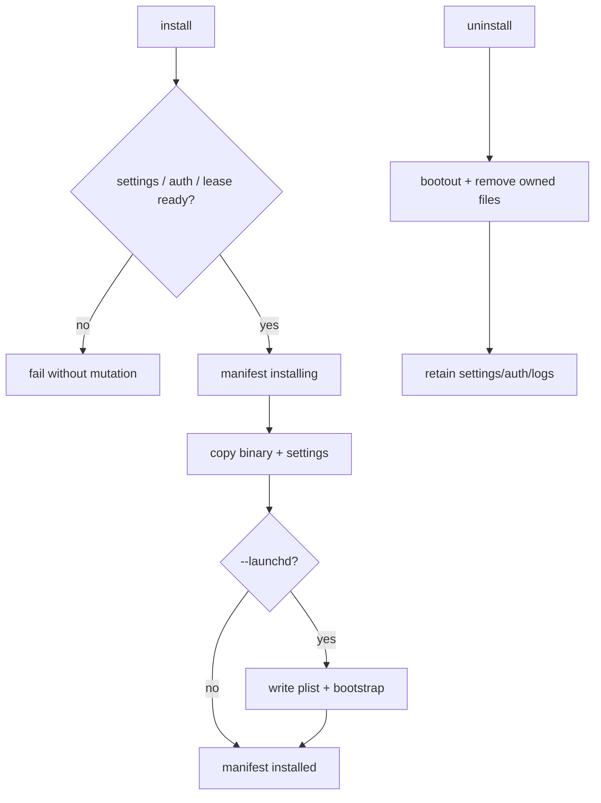

# scale2sheet インストール設計

## 適用状態

製品の install/uninstall/doctor は `internal/installation` の Go 実装を使用します。旧 TypeScript/Bun 前提の設計記述は Go ポート Issue #2 で置き換えました。`--purge`、`--wipe`、`--archive`、`--yes` は parser が受理する予約オプションですが、現在の製品操作には使用しません。

## 目的と責任境界

インストール済み `scale2sheet` をソース checkout から独立させ、launchd が配置済み Go バイナリだけを起動できるようにします。scale_exporter の設定、認証、バイナリ、LaunchAgent、入力ファイルは scale_exporter 側の所有物であり、scale2sheet installer は変更・削除しません。

## CLI

```text
scale2sheet install [--prefix <dir>] [--launchd] [--dry-run]
scale2sheet uninstall [--prefix <dir>] [--dry-run]
scale2sheet doctor [--prefix <dir>]
```

既定の prefix は `~/.local` で、バイナリは `<prefix>/bin/scale2sheet` です。`install` は settings が無ければ雛形を作成します。settings が既にある場合は、Sheets credentials を確認してから更新します。

ローカル検証用の macOS artifact は `bash scripts/build-macos-release.sh` で作成します。`GOOS=darwin`、`GOARCH=arm64|amd64`、`CGO_ENABLED=0`、`GOTOOLCHAIN=local`、`-trimpath` を固定し、`lipo` 後に `file` と `lipo -info` で universal `arm64` + `x86_64` を検査します。これは unsigned artifact です。公開配布には、README の手順に従って `bash scripts/build-macos-distribution.sh dist/scale2sheet-macos.dmg` を使用します。

### 公開配布と install の責任境界

`build-macos-distribution.sh` は既存の install/uninstall/LaunchAgent 実装を変更しません。universal binary を Developer ID Application + Hardened Runtime で署名し、README と共に UDZO DMG へ格納し、DMG を署名、公証、staple してから `spctl` と `codesign` で検査します。公開配布物から binary を `~/.local/bin/scale2sheet` へコピーした後は、通常の `install --launchd`、`doctor`、`uninstall` 契約を使用します。

CI は `macos-release` environment の一時 keychain と App Store Connect API key を使用し、通常の quality workflow へ secret を渡しません。証明書または公証 credential が無い場合は fail-closed とし、ad hoc や Apple Development の代用はしません。

`install --launchd` は次を変更前に確認します。

1. settings に `sheet-id` と `sheets-credentials` があること
2. source が要求する入力設定があること
3. 必要な credentials/token ファイルが存在すること
4. 他の scale2sheet process が run lease を保持していないこと

不足時は `failed:launchd-not-ready` または `failed:missing-auth-files` で終了し、plist、binary、manifest を変更しません。

## 配置

```text
~/.local/bin/scale2sheet
~/.config/scale2sheet/settings.json
~/.config/scale2sheet/install-manifest.json
~/.config/scale2sheet/active-run.json
~/.config/scale2sheet/pipeline-status.json
/tmp/scale2sheet-<uid>-<namespace>/active-run.lock
/tmp/scale2sheet-<uid>-<namespace>/run-<owner-token>.sock
~/Library/LaunchAgents/jp.seijin.kappa.scale-pipeline.morning.plist
~/Library/LaunchAgents/jp.seijin.kappa.scale-pipeline.evening.plist
~/Library/Logs/scale-pipeline/{morning,evening}{,.err}.log
```

`--prefix` は binary の prefix だけを変更し、設定・状態・launchd・ログは home 配下の既定パスに残ります。`doctor --prefix <dir>` は同じ `Paths` を解決し、manifest の記録 prefix と binary path が要求値に一致することを検査します。危険な prefix（home、`/`、`/usr`、`/bin`、`/sbin`、`/etc`、`/System`、`/Library`）は拒否します。

| 対象 | mode |
| --- | --- |
| config directory | `0700` |
| binary / bin directory | `0755` |
| settings、manifest、active receipt、status、stop request、socket | `0600` |
| runtime directory、lock file | `0700` / `0600` |

## launchd plist

`install --launchd` は朝夕2つの plist を生成します。

- label: `jp.seijin.kappa.scale-pipeline.morning` / `.evening`
- program: installed binary の `pipeline --period morning|evening`
- 時刻: morning `07:00` と `11:30`、evening `21:00` と `23:30`
- HOME、PATH、`SCALE2SHEET_LAUNCHD_LABEL` を EnvironmentVariables に設定
- stdout/stderr: `~/Library/Logs/scale-pipeline/`

plist の XML 値は escape し、`launchctl bootout` → plist write → `launchctl bootstrap` の順で適用します。事前に `install --launchd --dry-run` で計画を表示できます。

登録後の状態確認は read-only の `launchctl print gui/<uid>/<label>`、手動の一回実行は `launchctl kickstart -k gui/<uid>/<label>` を使います。`kickstart` は登録スケジュールを変更しません。plist の XML は `plutil -lint` で検査できます。

## manifest と更新

manifest は `schema-version: 1`、state、version、binary/config/log path、launchd metadata、created paths、updated-at を持ちます。初回は `installing` として作成し、全操作成功時に `installed` へ遷移します。更新時も binary は temporary file へ copy して rename するため、実行中 process は旧 inode を継続して使用できます。

## アンインストール

`uninstall` は manifest に記録された launchd 登録、plist、binary、manifest、空の install bin directory を削除します。settings、認証ファイル、pipeline status、active receipt、ログは残します。`uninstall --dry-run` は計画だけを表示します。



## 検証

```sh
bash scripts/run-macos-release-acceptance.sh
bash scripts/run-installer-acceptance.sh
bash scripts/run-runtime-safety-acceptance.sh
```

release acceptance と installer acceptance は一時 HOME、fake launchctl、network deny を使い、実ユーザー領域や実 Spreadsheet を変更しません。installer acceptance は複数 process の lease 競合も検査します。
