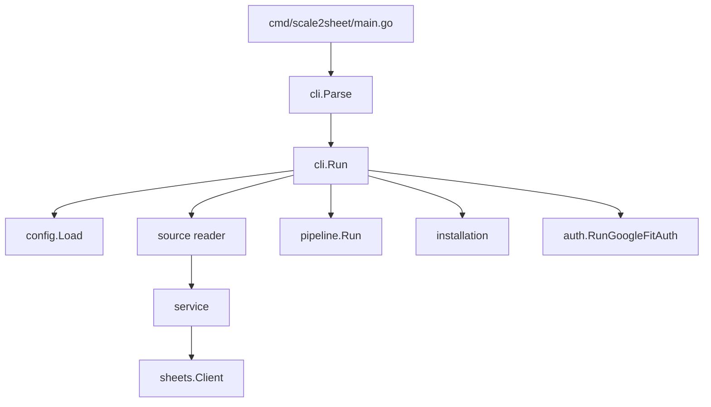

# scale2sheet — 内部設計

## domain

`internal/domain/measurement.go` は外部 API に依存しない正規化モデルを持ちます。

- `MeasurementKind`: `weight`、`body_temperature`、`blood_pressure_systolic`、`blood_pressure_diastolic`、`pulse`
- `MeasurementUnit`: `kg`、`celsius`、`mmHg`、`bpm`
- `MeasurementReading`: kind、value、unit、ISO timestamp、source、source record ID
- `LatestMeasurementSet`: 期間、capture 時刻、source、各採用値、件数
- `SpreadsheetRow`: Spreadsheet 更新用の1行
- `TransferOutcome`: `written`、`not-written`、`unknown` と更新セル数

選択ロジックは `LatestByKind`、`SelectWeightByPeriod`、`SelectReadingsByWeightAnchor` が担当します。体重を必須アンカーとし、朝は時間帯内で最も早い体重、夜は最も遅い体重を選びます。

## config / auth

`internal/config` は `SettingsFile` を JSON から読み、環境変数を上書きし、`AppConfig` を作ります。`RequireGoogleSheetsConfig`、`RequireGoogleFitConfig`、`RequireAppleHealthConfig`、`RequireScaleExporterConfig` が source ごとの不足を明示します。先頭 `~` は home へ展開します。

`internal/auth` は Sheets の credentials descriptor と Google Fit OAuth を担当します。`RunGoogleFitAuth` は localhost callback の path/state/code を検証し、PKCE verifier で token exchange を行い、`SaveGoogleFitToken` で mode `0600` の JSON を保存します。

## sources

| パッケージ | 主要 API | 契約 |
| --- | --- | --- |
| `sources/scaleexporter` | `ReadMeasurements`、`ReadStableInput` に渡す snapshot | 対象日 JSONL、ファイル分類、行番号つきエラー、source record ID |
| `sources/applehealth` | `ReadMeasurements` | `export.xml` を streaming 解析し対象 Record を正規化 |
| `sources/googlefit` | `ReadMeasurements`、`ReadMeasurementsWithHTTPClient` | OAuth token、data source/dataset pagination、optional temperature |

Google Fit の data type は `com.google.weight`、`com.google.body.temperature`、`com.google.blood_pressure`、`com.google.heart_rate.bpm` です。data point は end timestamp（無ければ start timestamp）で正規化します。

## service / sheets

`internal/service` は period window (`05:00–12:00` / `20:00–23:30`)、完全一致 dedup、cross-source dedup、weight anchor、`TransferLatestMeasurementSet` を提供します。

`internal/sheets/adapter.go` は header mapping、日付行探索、A1 column mapping、値の batch update を担当します。`internal/sheets/google_client.go` は公式 Sheets client の `Values.Get` と `Values.BatchUpdate` を `sheets.Client` へ適合させ、`USER_ENTERED` と `TotalUpdatedCells` を使います。読み取りから書き込み完了確認までの deadline は 30 秒です。

## pipeline

`internal/pipeline` の主要型は次の通りです。

- `StableInputSnapshot`: 対象日の読み込み結果、matched file/read line counts、anomaly candidates
- `PipelineStatusDocument`: schema/definitions、period 別 active run・terminal・health
- `AtomicPipelineStatusWriter`: 一時ファイル + rename、mode `0600`
- `RunOptions` / `Run`: running status → stable input → window/dedup → transfer → terminal status
- `MacOSNotifier`: health transition のみ `osascript` へ通知し、通知失敗で transfer 結果を覆さない

体重が無いときは transfer callback を呼ばず `completed:no-data` を記録します。入力欠落・不正・不安定は原因別 `failed:*` outcome と件数を記録します。

## scheduler

`internal/scheduler.AcquireRunLease` は macOS の physical config path から `/tmp/scale2sheet-<uid>-<hash>` を決め、`active-run.lock` を `O_CREAT|O_RDWR|O_EXLOCK|O_NONBLOCK|O_NOFOLLOW` で開きます。所有 receipt、Unix socket、cooperative stop request を mode `0600` で管理し、SIGKILL 後は次の process が stale receipt を回収します。

`RunServe` は5フィールド cron を毎分評価し、morning/evening の runner を呼びます。SIGTERM/SIGINT は context cancellation へ変換します。

## installation

`internal/installation` は `ResolvePaths`、`PlanInstall`、`PlanUninstall`、`ApplyOperations`、`LaunchdReady`、manifest read/write、plist rendering を提供します。

- prefix は home、`/`、`/usr`、`/bin`、`/sbin`、`/etc`、`/System`、`/Library` を拒否
- binary は temporary file へ copy して rename
- install --launchd は settings/source/auth と run lease を事前確認
- uninstall は settings、auth、logs を残し、manifest が管理する binary/plist を削除
- manifest は installing → installed → uninstalling の legal transition を検証

## CLI 配線

`cmd/scale2sheet/main.go` は `cli.Parse` と `cli.Run` だけを行います。`internal/cli` が config、source、service、sheets、pipeline、scheduler、installation を組み立てます。`ArgumentError` は exit `2`、その他の error は exit `1`、help/version と正常 no-data は exit `0` です。

