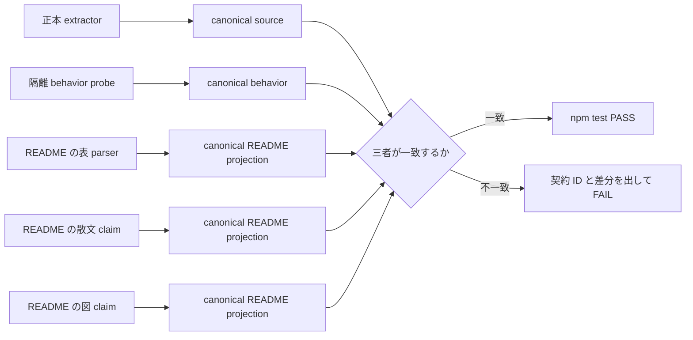

# README 追随漏れを検出する契約 gate の検討書

起草: `scale2sheet_architect_codex`

検証: `scale2sheet_reviewer_claude` へ依頼する。

決定: ユーザーが行う。

| 項目 | 値 |
| --- | --- |
| 起点 | Issue #162 |
| 基準 HEAD | `d18c84f746d3012828c92e2957b1935f1589a1b6` |
| 対象 | 設定キー、`run` 終了コード、Bun 必須条件、`run-pipeline.sh` の責任境界 |
| 推奨 | 案 3「既知契約ごとの三者照合」 |
| 本書の効力 | 選択肢と推奨を示すが、採用と実装を確定しない |
| README への影響 | 本書は開発上の設計比較だけを追加するため、README は変更しない |

## 1. 問題

`README.md` は利用者が設定と利用のために読む唯一の資料である。

実装だけが変わって README が追随しなければ、利用者から見た仕様は変わっていない。

2026-08-09 に、追随漏れが二つ確認された。

Issue #162 の初稿は三つと数えたが、PR #128 は同じ PR で README を更新していたため、Issue のコメントで二つへ訂正されている。

| PR | 正本と挙動の変更 | README の状態 | 帰結 |
| --- | --- | --- | --- |
| #147 | `run` の引数エラーを exit `2`、実行時失敗を exit `1` へ分離した | 変更しなかった | #152 で後追いした |
| #152 | 終了コードの実装は変えなかった | exit `1` を ConfigError だけとする狭い初稿だった | reviewer が実際の失敗経路を根拠に差し戻した |
| #160 | exporter 呼出しと再試行を削除し、公開ファイル確認へ変えた | 初稿は旧説明を残した | reviewer が blocking で止めた |
| #128 | `npm test` に Bun が必要な acceptance を接続した | 同じ PR で Bun 必須条件を更新した | 良い前例になった |

PR #160 では、launchd 節を直す途中で、PR #152 が追加した終了コード表も一度削除された。

この削除は差し戻し後の最終 commit 列には残っていない。

一次資料は、commit `9bb3d3222fec7e228e8c4434d3f80f764ed66da0` に対して 2026-08-09T13:41:38+09:00 に提出された `CHANGES_REQUESTED` review である。

同 review は、launchd 説明と同じ差分で終了コード表が削除されたことを blocking として記録している。

したがって、最終 commit だけを調べて「削除されていない」と結論してはならない。

これは、一つの契約を直す変更が、別の契約の記述を消す型である。

差分から選ばれた一つの検査だけを走らせる方式では、この型を見落とす。

したがって、既知契約の検査は変更ファイルに関係なく毎回すべて走らせる必要がある。

## 2. 現行 gate の実測

### 2.1 既存の設定キー検査

`scripts/verify-readme-config-keys.mjs` は、設定 schema と環境変数 mapping から実装側の集合を取り、README と照合する。

PR #140 で、差分件数が一つでもあれば exit `1` にするよう直され、`test/config/verify-readme-config-keys.test.ts` から `npm test` へ接続された。

現行検査が見る向きは非対称である。

| 差分の向き | 現行検査 |
| --- | --- |
| 実装に在って README に無い | 検出する |
| README に在って実装に無い | 検出しない |

README の表からキーを削除する変異は、実装側の集合に残るため検出される。

一方、実装に無い `obsolete-setting` を README の表へ足す変異は、現行の差集合に含まれない。

また、現行 parser は対象の設定表ではなく README 全体の Markdown 表を走査する。

同じキーが別の表に残れば、設定表から消えても存在すると数える余地がある。

基準 HEAD の隔離 worktree で、設定表の `sheet-id` だけを削り、終了コード表へ同じ `sheet-id` を追加した。

この変異でも検査は `A=0 + B=0 + C=0` と exit `0` を返し、判定は `SURVIVED` だった。

これは G-4 が推測ではなく、現行 parser で再現する偽陰性である。

設定キー以外の三契約は、この script の対象外である。

したがって、終了コード、Bun、実行責任を検出しないこと自体は、現行 script の欠陥ではない。

Issue #162 は、その三契約を含む仕組みを追加するための課題である。

### 2.2 既存の README 図検査

基準 HEAD には、PR #180 が追加した二つの Mermaid 図と `test/docs/diagrams.test.ts` が含まれる。

この test は、`run-pipeline.sh` が exporter を起動しないこと、公開ファイルを確認すること、`run --period` を呼ぶこと、wrapper が `run` の非 0 を exit `1` へ写すことを source と図の間で検査する。

README の図を直接壊す変異と source を壊す変異を含み、10 tests が `npm test` に接続されている。

一方、終了コード表、Bun 必須説明、設定表の余剰、launchd 節の prose は検査対象ではない。

図 test 自身も、launchd の時刻、データ矢印の向き、通知文言を対象外と明記する。

したがって、「図全体が test で守られている」のではなく、列挙した実行経路 claim だけが守られている。

この検査は `RUN_PIPELINE_BOUNDARY` の一部を source と README の二者で守る先行実装として扱う。

図を五つ目の独立契約にはせず、同じ責任境界契約の README 表現として三者照合へ統合する。

既存の 10 tests は捨てず、behavior probe を加えた同じ canonical value へ接続する。

### 2.3 基準変異

2026-08-09T20:43:37+09:00 に、基準 HEAD から作った隔離 worktree の README へ次の四変異を同時に入れた。

| 変異 ID | README へ入れた変異 | 守りたい契約 |
| --- | --- | --- |
| M-B0-1 | exit `2` の行を削除した | `RUN_EXIT_CODES` |
| M-B0-2 | `npm test` に Bun が必須で、無ければ失敗する説明を削除した | `BUN_REQUIRED` |
| M-B0-3 | `run-pipeline.sh` が exporter を起動し、最大三回再試行する旧説明へ戻した | `RUN_PIPELINE_BOUNDARY` |
| M-B0-4 | 実装に無い `obsolete-setting` を設定表へ追加した | `CONFIG_KEYS` |

`node scripts/verify-readme-config-keys.mjs` は `A=0 + B=0 + C=0` を出力し、exit `0` だった。

`npx vitest run test/docs/diagrams.test.ts` は 10 tests passed だった。

M-B0-3 により launchd の prose は旧説明へ戻ったが、Mermaid 図は現行経路のままなので、README 内部で二つの説明が矛盾した。

既存の図 test は図と source の claim だけを見るため、この prose と図の矛盾を検出しなかった。

Node.js `26.5.0` と Bun を明示した隔離環境で `npm test` を実行した結果は、31 files、274 tests passed だった。

所要時間は 24.89 秒だった。

判定は `SURVIVED` である。

この基準変異は、「現在の README が正しい」ことを示す試験ではない。

現在の gate が、実際に起きた追随漏れの型を検出できないことを示す負の対照である。

## 3. gate に必要な性質

新しい仕組みは次の性質を持つ必要がある。

| ID | 性質 | 理由 |
| --- | --- | --- |
| G-1 | 既知の四契約について、正本、挙動、README を別経路から取る | 二者だけでは、#152 の狭すぎる説明を見落とす |
| G-2 | 四契約の adapter を `npm test` のたびにすべて走らせる | #160 のような別契約の消去を検出する |
| G-3 | README と実装の集合差を双方向に取る | 古い余剰記述も検出する |
| G-4 | parser の対象を見出しと表へ限定する | 別表へ移した `sheet-id` で実測した偽陰性を避ける |
| G-5 | 0 件を成功にしない | parser が対象を見ていない状態と、差分が無い状態を分ける |
| G-6 | 挙動は隔離 fixture で取り、本番設定、本番 binary、外部 API を使わない | 検査の副作用を防ぐ |
| G-7 | 更新不要な変更では警告も失敗も出さない | 偽陽性による gate の形骸化を防ぐ |
| G-8 | failure は契約 ID、三者の値、差分方向を表示する | 修正対象を一意にする |
| G-9 | 変異判定を `KILLED`、`KILLED-BY-TSC`、`SURVIVED` に分ける | 型検査による失敗を契約 test の検出と誤認しない |

## 4. 選択肢

### 4.1 案 1: PR テンプレートと reviewer 手順だけ

PR テンプレートへ「README への影響: 有、または無と理由」を置き、reviewer が実装 PR の README を確認する。

導入は軽い。

一方、#147 はこの確認が無いまま merge されている。

人が項目を埋めることと、内容が正しいことも同じではない。

Issue #162 の「実行 gate へ接続する」を満たさないため、単独では採らない。

残余リスクを reviewer へ伝える補助策としては使う。

### 4.2 案 2: 変更ファイル種別から blocking 判定する

`src/cli/**` や `scripts/**` が変わり、README が変わらなければ失敗させる。

対象を広く拾える。

しかし、ファイル名から変更の意味は判定できない。

内部の refactor、test seam の追加、コメント修正まで README 更新を要求すれば偽陽性になる。

偽陽性を再実行または例外扱いで通す運用が定着すると、gate は欠陥を通せることを教える。

その効果は flaky gate と同じである。

したがって、変更ファイル種別を blocking 条件には使わない。

ファイルから契約 ID への対応表は、reviewer が確認対象を選ぶ補助信号にだけ使う。

### 4.3 案 3: 既知契約ごとの三者照合

既知の四契約ごとに adapter を置く。

各 adapter は、実装上の正本、隔離して観測した挙動、README の対象節を同じ canonical contract へ変換する。

共有 harness が三者の一致を `npm test` で要求する。

任意の実装変更を一般判定せず、実際にずれた契約へ精度を集中できる。

基準変異を直接 KILL でき、更新不要変更を無視できる見込みがある。

この案を推奨する。

| 観点 | 案 1 | 案 2 | 案 3 |
| --- | --- | --- | --- |
| 人が忘れても検出する | できない | 一部できる | 既知契約でできる |
| 変更の意味を確認する | reviewer に依存する | できない | contract と挙動で確認する |
| 偽陽性 | 手順漏れとして現れる | 多い | 契約を限定するため抑えられる |
| `npm test` への接続 | しない | できる | する |
| #160 の別契約消去 | reviewer 次第 | README が変われば通る | 全 adapter 実行で検出する |
| 採否 | 補助策 | 不採用 | 推奨 |

## 5. 推奨設計

### 5.1 三者照合の構造



contract registry が持つのは、契約 ID、adapter、README の見出し、退役条件という metadata だけにする。

値の一覧を registry と実装へ重複して手書きしない。

正本 extractor は、実装が実際に消費する定数、schema、`package.json`、script の責任境界から値を導く。

behavior probe は、同じ値に対応する利用者から見える結果を実行して観測する。

README parser は、対象見出しの範囲だけを読み、Markdown 表を canonical value へ変換する。

一つの契約を README の表、散文、図が表す場合、各表現を別々の README projection として登録する。

共有 harness は各 projection が behaviorCanonical と一致することに加え、README projection 同士も一致することを要求する。

これにより、M-B0-3 で実測した散文と図の矛盾を検出する。

機械照合する事実の中心は一つの Markdown 表へ集約する。

この表は README 内で parser が読む中心形式であり、product 側の値の正本ではない。

値の正本は production source だけに置き、表、散文、図はいずれも利用者向け projection とする。

散文が同じ事実を重ねる必要が無ければ、散文は表への参照へ縮める。

散文が利用者向け claim を残す場合は、自然言語全体を推定せず、対象見出し内の明示した可視の claim 行から canonical value を取る。

HTML コメントに隠した marker だけで散文を検査済みとは数えない。

Mermaid 図も二つ目の正本にはせず、表と同じ canonical value の README projection として検査する。

PR #180 の diagram marker、verify marker、claim validator は、この投影を検査する既存部品として再利用する。

現行 diagram test が個別に持つ期待 token と期待 regex の値は、採用時に sourceCanonical から adapter が供給する。

diagram validator 自身は矢印、node、token を読む機構だけを持ち、契約値を別に手書きしない。

登録していない本文、要約、注記へ同じ機械事実を重複して書かない。

表の値は画像化せず、README で直接読める状態を保つ。

HTML コメントだけを正本にする方式は採らない。

コメントだけ更新して表示文を古いまま残す経路があるためである。

生成した README を commit する方式も必須にはしない。

利用者向けの文章を編集可能なまま保ち、登録した canonical な契約事実だけを照合する。

### 5.2 harness の判定

各 adapter は次を返す。

```text
contractId
sourceCanonical
behaviorCanonical
readmeProjections[]
evidence
```

共有 harness は、`sourceCanonical == behaviorCanonical` と、各 `readmeProjection == behaviorCanonical` を別々に判定する。

この分離により、正本と挙動の差、挙動と README の差、README 内部の表現間の差を failure から識別できる。

集合を扱う契約では、追加と欠落を双方向に表示する。

見出しが無い、重複する、表が空、既知の一行を検出できない場合は、差分が 0 件でも失敗する。

これは Issue #173 の「0 は、無いのか見えていないのか分からない」への対策である。

### 5.3 四契約の adapter

任意の実装変更を一般判定の対象外にしても、選択した四契約の production source を現状のままにするわけではない。

各 adapter が test の期待値を正本にしないため、採用時には次の source 変更が必要になる。

| 契約 ID | 採用時に product 側へ作るもの | README 側の変更 |
| --- | --- | --- |
| `CONFIG_KEYS` | 現在 function 内にある設定キー mapping を、`loadConfig` と verifier が共に消費する descriptor registry へ出す | 設定キー専用表を機械照合の対象として一意にする |
| `RUN_EXIT_CODES` | `runCli` の分岐が消費する typed exit contract を作り、引数、設定、実行時、成功の分類をすべてその contract から返す | 現行の終了コード表を canonical 表にする |
| `BUN_REQUIRED` | `package.json` の `engines.bun` を版の正本として維持し、五つの acceptance 名と共通 preflight を一つの機械可読 manifest から各 script と `npm test` が消費する | README 冒頭と開発コマンド節の重複説明を一つの表と参照へ統合する |
| `RUN_PIPELINE_BOUNDARY` | production の既定値を保った dependency seam と、通常分岐が消費する責任境界 field を `run-pipeline.sh` へ作る | 責任境界表を追加し、散文と二つの図を同じ projection 群へ接続する |

`BUN_REQUIRED` は配布 binary の runtime code を変えないが、product repository の `package.json`、acceptance script、test 接続を変える。

ほかの三契約は production の TypeScript または shell script を変更する。

したがって、案 3 は gate test だけを追加する案ではない。

対象外との境界は「production を変えるか」ではなく、有限の contract registry に登録した契約かどうかである。

| 契約 ID | 正本 | 隔離 behavior | README |
| --- | --- | --- | --- |
| `CONFIG_KEYS` | `settingsFileSchema`、環境変数 schema、mapping | temp の settings と env を `loadConfig` 系へ与え、解決された項目を観測する | 専用の設定キー表 |
| `RUN_EXIT_CODES` | CLI が実際に消費する終了コード contract | 隔離 HOME と service double で、引数エラー、設定エラー、実行時エラー、help、成功を実行する | `run` 限定の終了コード表 |
| `BUN_REQUIRED` | `package.json` の `engines.bun` と `npm test` 配下の acceptance 集合 | PATH から Bun を外し、各 acceptance の preflight が非 0 と導入案内を返すことを観測する | Bun の最低版、必須対象、欠落時の失敗を示す表 |
| `RUN_PIPELINE_BOUNDARY` | script が実際に消費する責任境界 contract | temp 出力先、偽 `scale2sheet`、通知 recorder を使って script を実行する | launchd 節の責任境界表と二つの Mermaid 図 |

#### `CONFIG_KEYS`

現行の A、B、C 分類と exit code の固定は維持する。

README 側から実装側への余剰差分を D として追加し、`A+B+C+D > 0` を failure にする。

README parser は全表を走査せず、設定キーの専用見出しと直後の表へ限定する。

設定表から既知キーを一つ消す正の対照と、実装に無いキーを一つ足す逆方向の対照を持つ。

設定表から既知キーを消して別表へ同じキーを足す移設変異も持つ。

既存 script を捨てて同じ処理をもう一つ書くのではなく、extractor を再利用可能な単位へ分けるか、構造化出力を adapter から読む。

#### `RUN_EXIT_CODES`

正本は、exit code と分類の対応を実装が消費する形で持つ。

test の期待値だけに `0 / 1 / 2` を複製して正本と呼ばない。

現行 `runCli` の `exitOverride`、`ConfigError` catch、暗黙の uncaught runtime error を typed outcome へ寄せ、top-level が contract の値を `process.exitCode` へ写す。

観測上の `2 / 1 / 0` は変えず、実行時失敗の exit `1` を Node.js の暗黙値だけに依存させない。

behavior は少なくとも次の代表ケースを持つ。

| 代表ケース | 観測する結果 |
| --- | --- |
| `run` の `--period` 欠落または不正 | exit `2` |
| 隔離 HOME で必須設定が欠落 | exit `1` |
| service double が入力または転記失敗を返す | exit `1` |
| `run --help` と version | exit `0` |
| 成功または no-data | exit `0` |

設定エラーだけでなく実行時エラーも exit `1` になることを behaviorCanonical に含める。

README 表が exit `1` を ConfigError だけと説明すれば、#152 と同じ狭さとして不一致になる。

behavior probe は隔離 HOME、temp file、service double を使い、実在の Spreadsheet と外部 API へ接続しない。

#### `BUN_REQUIRED`

最低版は `package.json` の `engines.bun` から取る。

どの acceptance が `npm test` に含まれるかは、五つの名前を持つ機械可読 manifest を Vitest の登録と各 script が共に消費する形で取る。

対象は `binary-drift`、`pipeline-shadow`、`runtime-safety`、`installer`、`bun-binary-smoke` である。

各 script に複製されている Bun preflight は、同じ manifest と共通関数を消費する薄い呼出しへ寄せる。

PATH から Bun だけを外した状態で各 script の preflight を実行する。

build へ到達せず、非 0 と導入案内を返すことを観測する。

この probe 自体は `npm run build:bun` を実行しない。

README は最低版、`npm test` で必須であること、無い場合は skip ではなく failure であることを一つの表へ置く。

#### `RUN_PIPELINE_BOUNDARY`

canonical value は少なくとも次を持つ。

| field | 値 |
| --- | --- |
| `invokesExporter` | `false` |
| `checksPublishedFile` | `true` |
| `missingPublicationEffect` | `notify-only` |
| `transferCommand` | `run` |
| `runFailureWrapperExit` | `1` |
| `notWrittenEffect` | `exit-0-no-notify` |

PR #180 の図 test は、このうち exporter 所有、公開ファイル、`run`、wrapper exit、not-written の source と図の対応を既に検査する。

提案 adapter はその検査を重複実装せず、同じ canonical value の README 側 projection として取り込む。

責任境界表、launchd 節の散文、二つの Mermaid 図を別々の projection として登録する。

散文に旧 exporter 呼出しを戻し、図だけ現行のままにした場合も `RUN_PIPELINE_BOUNDARY` が失敗する。

既存 test は静的な source と図の二者照合なので、隔離 behavior probe を追加して三者を閉じる。

現行 script は production の directory と binary path を固定しているため、そのまま behavior probe を実行してはならない。

実装時に、production の既定値を変えず、test から temp directory、偽 binary、通知 recorder を注入できる seam を先に作る。

probe は poison exporter を用意し、呼ばれたら失敗させる。

公開ファイル有無の両方を作り、欠落時は通知するが transfer 自体の exit を変更しないことを確認する。

偽 `scale2sheet` が exit `2` を返す case も実行し、wrapper が通知して exit `1` へ写すことを確認する。

当日行が無い case は、exit `0` のまま通知しないことを確認する。

正本の field は script の分岐が実際に消費する形にし、表示だけの `--contract-probe` が実装と別に真実を名乗る構造にはしない。

安全な test seam を作れない場合、二者照合を三者照合と報告してはならない。

その場合は `RUN_PIPELINE_BOUNDARY` を blocking 済みと数えず、ユーザーへ未達を上げる。

cutover により `run-pipeline.sh` がユーザー向け経路から外れた後は、この契約、probe、README の記述を同じ PR で退役させる。

退役条件を issue の現在状態ではなく、README の運用経路から script が外れたことと、実装の launchd 定義が installed binary の `pipeline` を直接起動することの二条件で判定する。

## 6. 変更ファイル対応表の扱い

変更ファイル対応表は、blocking test を選択するために使わない。

四 adapter は常にすべて実行する。

対応表は reviewer が追加の変異と一次資料を選ぶために使う。

| 変更の例 | reviewer が重点確認する契約 |
| --- | --- |
| `src/config/**`、`.env.example` | `CONFIG_KEYS` |
| `src/cli/**`、CLI entrypoint | `RUN_EXIT_CODES` |
| `package.json`、`test/acceptance/**`、acceptance script | `BUN_REQUIRED` |
| `scripts/run-pipeline.sh`、launchd 定義 | `RUN_PIPELINE_BOUNDARY` |
| README の契約表 | 対応 adapter に加え、四 adapter 全体 |

PR テンプレートには「README への影響: 有、または無と理由」と「影響する契約 ID」を置いてよい。

この記入は review の入口であり、gate の合否根拠ではない。

## 7. 変異検証

### 7.1 基準変異

実装後は、2.3 の四変異を実際の README へ同時に当て、`npm test` が非 0 になることを測る。

設計上は、次の failure を期待する。

| 基準変異 | 期待する adapter |
| --- | --- |
| exit `2` 行削除 | `RUN_EXIT_CODES` |
| Bun 必須説明削除 | `BUN_REQUIRED` |
| exporter 旧説明 | `RUN_PIPELINE_BOUNDARY` |
| `obsolete-setting` 追加 | `CONFIG_KEYS` |

本書の段階では harness が未実装なので、`KILLED` になることは未実測である。

「案 3 なら KILL するはず」と「実際に KILL した」を分ける。

実装完了の報告には、実際の test output と三値判定が必要である。

### 7.2 adapter ごとの最低変異

| 変異 | 目的 |
| --- | --- |
| README の canonical 行を削除する | README 欠落を直接検出する |
| README の canonical 行を余分に追加する | 古い余剰を検出する |
| README の表と Mermaid 図を別々に壊す | 同じ契約の複数表現が同じ canonical value を見ることを確認する |
| 正本だけを変える | source と behavior の不一致を検出する |
| behavior だけを変える | 実装が正本を消費していない状態を検出する |
| 正本と behavior を変え、README を据え置く | 実装変更への README 追随漏れを検出する |
| 対象外の unit test または内部 refactor だけを変える | 偽陽性が出ないことを確認する |

変異は test fixture の内部値だけで済ませず、守りたい側の README にも実際に当てる。

検査器へ注入した差分だけで「README を守れる」と結論しない。

### 7.3 判定

| 判定 | 意味 |
| --- | --- |
| `KILLED` | 対象 adapter の assertion が変異を検出した |
| `KILLED-BY-TSC` | TypeScript の型検査が先に失敗し、adapter の検出力は未確認だった |
| `SURVIVED` | gate が完走して緑のまま、または対象 adapter が差分を検出しなかった |

test runner の起動失敗、Bun 欠落、環境 timeout は、契約 test による `KILLED` と数えない。

## 8. 新しい契約を追加する手順

新しい adapter は、次の項目を一単位として追加する。

1. 利用者から見える、有限で、機械観測できる契約であることを示す。
2. 一意な契約 ID と README の対象見出しを決める。
3. 値を複製せず、実装が消費する正本から canonical value を取る。
4. 本番へ接続しない隔離 behavior probe を作る。
5. README の一つの Markdown 表から canonical value を取り、同じ事実を表す散文または図があれば別 projection として列挙する。
6. source、behavior、すべての README projection の一致を shared harness へ登録する。
7. README の欠落、余剰、source だけ、behavior だけ、source と behavior の同時変更を変異で測る。
8. 更新不要変更で警告も failure も出ないことを測る。
9. `npm test` へ接続し、手動 command だけの検査にしない。
10. 契約が不要になる条件と、正本、probe、README を同時に消す退役手順を書く。

behavior を安全に観測できない契約は、三者照合の blocking 対象へ登録しない。

二者照合を補助検査として置く場合は、`behavior: unverified` と failure output に明示する。

## 9. 対象外

任意の `src/` または `scripts/` 変更から README 影響を一般判定することは対象外とする。

変更の意味を読まずに blocking すると、偽陽性が gate を無効化するためである。

自然言語全体の意味を推定する parser は作らない。

機械照合する事実は構造化した表と登録済み projection へ寄せ、それ以外の説明文は別ベンダーの reviewer が読む。

README の Mermaid 図は対象外にしない。

PR #180 が持つ実行経路 claim を `RUN_PIPELINE_BOUNDARY` の README 表現として再利用する。

一方、同 test が適用範囲外と明記した launchd の時刻、データ矢印の向き、通知文言は、本件の既知四契約へ追加しない。

これらは正本、behavior、README を偽陽性なく canonical 化する設計がまだ無いためであり、図 test と reviewer の既存範囲を本書が広げたとは主張しない。

README 以外の `docs/` を利用者向け正本に昇格させない。

この設計だけを理由に GitHub Actions を新設しない。

既存の必須実行経路である `npm test` へ接続する。

設定 schema、終了コードの意味、Bun の採用、cutover の方針自体は設計し直さない。

## 10. 未確定点

`RUN_PIPELINE_BOUNDARY` の安全な test seam の具体形は、実装前の小さい prototype と mutation で決める必要がある。

本書は、production の既定 path を変えないこと、実在の exporter と scale2sheet binary を起動しないこと、poison exporter で再導入を検出することを条件として固定する。

shell function へ分けるか、内部専用の dependency override を置くかは、本書では決めない。

`BUN_REQUIRED` の五つの Bun 欠落 probe を `npm test` へ足す前に、共通 preflight 単体と full suite の追加時間を測る。

変更前後をそれぞれ少なくとも 10 回連続実行し、中央値、p95、failure 回数を記録する。

五つを個別 process で起動する場合と、一つの共有検査から manifest 全体を確認する場合を比較する。

一回の緑だけでは flaky でない根拠にしない。

時間または failure が増える場合は、五つの build を起動せず一つの共有 preflight で全接続を検査する方式へ縮める。

許容する時間増分の上限は未確定であり、prototype の実測値とともにユーザーへ上げる。

README の表の最終文言は、canonical field を欠落なく表現する範囲で programmer が起草し、Claude reviewer が挙動と照合する。

## 11. 帰結

案 1 は忘れないための入口として残すが、blocking 根拠にしない。

案 2 は偽陽性を避けられないため採らない。

案 3 は、実際にずれた四契約へ範囲を限定し、正本、隔離挙動、README の三者を `npm test` で毎回照合する。

この方式なら、PR #160 の launchd 節を直す変更が終了コード表を消しても、`RUN_EXIT_CODES` adapter が独立して失敗する。

基準変異が現行 gate を通ったことは実測済みである。

案 3 が同じ変異を KILL することは未実測であり、採用後の実装完了条件として残る。

本書の推奨を採用するかはユーザーが決定する。
