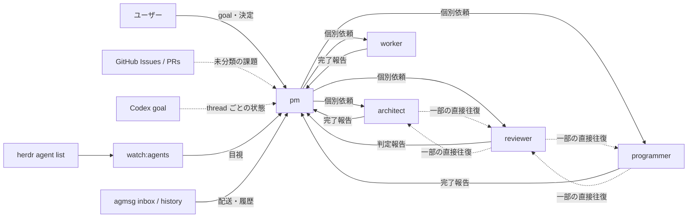
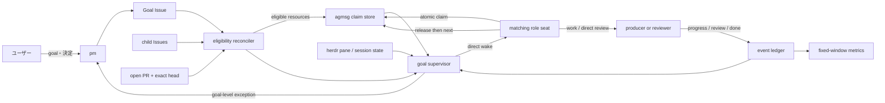
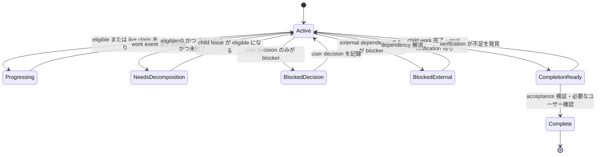
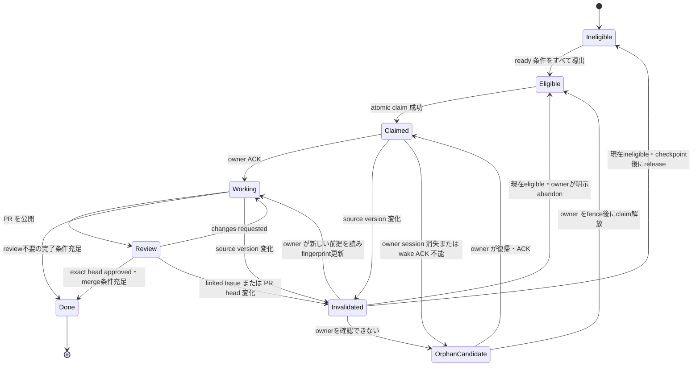

# goal に対して課題を解決し続ける自律ループの検討書

## 0. 結論

[Issue #209](https://github.com/kappaseijin/scale2sheet/issues/209) の原因は、席の数や作業量ではない。

**active goal、作業項目、現在の所有者、席の稼働状態が別々の場所にあり、それらを結ぶ状態機械が無いこと**が原因である。

本書は次の三層を組み合わせる hybrid 案を推奨する。

| 層 | 正本とする事実 | 候補となる既存機構 |
| --- | --- | --- |
| 恒久的な意図 | Goal の合格条件、子 Issue、依存、担当ロール、ユーザー決定待ち | GitHub Issue |
| 短命な所有権 | どの agent session が、どの Issue / PR を現在 claim しているか | agmsg の原子的 lock 機構を拡張する案 |
| 稼働観測 | pane / session の在否、`working` / `idle` / `unknown` | herdr / herdr-agent-monitor |

この案では、`ready` を pm が手で付けるラベルにしない。

Goal、Issue / PR、依存、判断待ち、claim を読み、**claim の時点で導出する**。

したがって pm は個々の仕事を配らない。

pm が残すのは、ユーザーから受け取った goal と決定を正本へ記録し、goal 単位の例外をユーザーへ提示する責務である。

ただし、本書は方式の検討書であり、agmsg または herdr-agent-monitor の変更を実装済みとは扱わない。

両プロジェクトへの持ち込みは、それぞれの manager を経由する必要がある。

## 1. 調査の範囲

### 1.1 対象

ユーザーの依頼は次の二点である。

- goal が設定されている間、席が次の指示を待たずに、解決可能な課題を取り続けること。
- 仕組みを追加した事実ではなく、待機が減ったことを測れること。

### 1.2 自律範囲

全席に共通して認める自律範囲は、**機械的に eligible と判定できる既存の Issue / PR を claim するところまで**とする。

任意の席が goal から自由に課題を発明し、Issue を増やすことは含めない。

active goal であるにもかかわらず eligible と claimed がともに 0 の場合は、沈黙せず `needs-decomposition` とする。

課題分解は innovator / architect へ隔離する。

innovator / architect が子 Issue を自律作成してよいか、分解案をユーザーへ提示するところまでかは、別のユーザー決定とする。

### 1.3 対象外

次は本書の解にしない。

- 席を増やすこと。
- manager が全 Issue を手で並べ、各席へ逐次配送すること。
- ユーザー決定待ちの論点を agent が代理決定すること。
- `idle` の総時間を短くすること。
- scale2sheet の production、cutover、pipeline の挙動を変更すること。
- 複数マシンにまたがる分散 queue を、この検討だけで確定すること。

`idle` の総時間を対象外にする理由は、innovator / architect / worker が短命席であり、仕事が無ければ閉席または idle になるのが正しいためである。

測るべきものは、**実行可能な仕事があるのに進まない時間**である。

## 2. 実測

### 2.1 ユーザーによる待機指摘

`ctx` の event 検索で、scale2sheet の pm セッションに含まれる user message を固定期間で再集計した。

| 期間（JST） | 「全てのエージェントが待機」を含む user message |
| --- | ---: |
| 2026-08-09T00:00:00+09:00 から 2026-08-10T00:00:00+09:00 | **7 回** |
| 2026-08-10T00:00:00+09:00 から 2026-08-10T16:11:20+09:00 | **10 回** |
| 合計 | **17 回** |

Issue #209 起票時の「2026-08-09 から 7 回」は、2026-08-09 の一日分だけなら正しかった。

期間の表記が値と一致していなかったため、本書では開始と終了を固定した。

### 2.2 agmsg の流量

`history.sh` の既定表示件数は短いが、第 3 引数に limit を指定できる。

次の呼び出しで、2026-06-18T21:10:14+09:00 から 2026-08-10T16:25:08+09:00 までの **2,433 通**を取得できた。

```bash
~/.agents/skills/agmsg/scripts/history.sh scale2sheet '' 5000
```

したがって、新しい流量ログを作らなくても、既存の永続履歴を固定 RFC3339 区間で集計できる。

| 期間（JST） | 全メッセージ | pm が端点 | pm を介さない | pm 端点率 |
| --- | ---: | ---: | ---: | ---: |
| 2026-08-09T00:00:00+09:00 から 2026-08-10T00:00:00+09:00 | 512 | 470 | 42 | **91.8%** |
| 2026-08-10T00:00:00+09:00 から 2026-08-10T16:05:00+09:00 | 184 | 144 | 40 | **78.3%** |

短い 19 通または 20 通の表示窓でなくても、pm への集中は再現した。

ただし pm 端点率だけを成功指標にしてはならない。

pm を介さない無価値なメッセージを増やしても率は下がるためである。

### 2.3 待機に見えた四つの状態

| 見え方 | 実態 | 必要な対処 |
| --- | --- | --- |
| reviewer が idle | PR #193 が約 4 時間、review 0 件 | review-ready PR を自動で eligible にする |
| programmer が 50 分無報告 | 実際は作業中 | report を要求する。即再配置しない |
| 全席 idle | pm が次を配っていなかった | eligible queue から各席が self-claim する |
| 返信が無い | 席が未起動、または配送経路が無い | session / pane / ACK を分けて確認する |

これらは、見た目が同じでも意味が異なる。

単一の「idle timeout」では正しく対処できない。

### 2.4 増席では解消しなかった

[Issue #150](https://github.com/kappaseijin/scale2sheet/issues/150) では 3 席から 9 席へ増員した。

[Issue #163](https://github.com/kappaseijin/scale2sheet/issues/163) では、成果 0 件の席と配送不能の席を含む 4 席を閉じ、9 席から 5 席へ戻した。

登録済み、pane が存在する、受信箱へ届く、pane へ配送される、作業を進める、は別の状態だった。

席数を増やしても、goal と次の仕事を結ぶ queue が無ければ idle な席が増える。

### 2.5 GitHub Issues は現時点で queue ではない

2026-08-10T16:17:00+09:00 の実測では、open Issue は 26 件だった。

| 項目 | 件数 |
| --- | ---: |
| open Issue | 26 |
| label あり | 0 |
| assignee あり | 0 |
| milestone あり | 0 |

GitHub Issue は課題台帳として機能している。

一方、現在の metadata だけからは、goal、担当ロール、判断待ち、依存解消、現在の所有者を判定できない。

## 3. 現在の情報の流れ



pm は goal の受領、次の Issue の選択、配送、沈黙の解釈、席の確認を同時に担っている。

pm がユーザー応答、PLAN / NOTES 更新、他チーム連携を行う間、次の仕事の選択も止まる。

## 4. 既存機構でできることと不足

| 機構 | 実測した能力 | 本件に対する不足 |
| --- | --- | --- |
| Codex `get_goal` | 現在の thread の goal を返す | 本 architect thread では `goal: null`。team / agent を選ぶ引数が無く、team 共有の正本にならない |
| GitHub Issue | body、label、assignee、parent / subIssues、blockedBy、PR 参照を保持 | 現行運用に queue metadata が無い。`gh issue edit` に expected-state / CAS が無い |
| `herdr agent list` | `working` / `idle` / `blocked` / `done` / `unknown` の瞬間状態 | idle 開始時刻、経過時間、goal、claim を返さない |
| `herdr agent explain` | 状態判定に使った rule と evidence | 状態の意味が仕事の有無か、沈黙か、席の不在かを判定しない |
| `watch:agents` | 5 秒ごとに pane 一覧を再描画 | 状態履歴、N 分継続、通知、work queue との相関が無い |
| agmsg watcher / inbox | 未読メッセージを pane へ配送 | goal、eligible work、claim を持たない |
| agmsg `history.sh` | 永続メッセージを limit 付きで取得 | work lifecycle の event 型と claim 所有権は無い |
| 既存 agmsg watchdog | codex 宛未読が 120 秒滞留した場合に配送を診断 | 未読配送の監視であり、idle、ready、claim の監視ではない |
| agmsg runtime lock | SQLite の `BEGIN IMMEDIATE` と primary key で競合取得を防ぐ | owner が PID であり、短命 CLI が保持する作業 claim にはそのまま使えない |

既存機構は不要ではない。

**各機構が持つ事実を相関する層が無い**。

## 5. 要件

| ID | 要件 |
| --- | --- |
| R-1 | goal を全席が同じ識別子と合格条件で読める |
| R-2 | `ready` を pm の手作業でなく、正本から導出できる |
| R-3 | 複数席が同じ resource を同時に claim できない |
| R-4 | claim owner が落ちたとき、別席が安全に回収できる |
| R-5 | 作業中の沈黙を、owner 消失と誤認して再配置しない |
| R-6 | user decision / external dependency / goal complete を claim 対象から除外する |
| R-7 | GitHub、agmsg、herdr のどれかが見えない場合、0 件または orphan と誤判定しない |
| R-8 | pm が停止しても、live な producer と reviewer が ready work を取り続けられる |
| R-9 | 短命席の正常な idle / 閉席を異常として数えない |
| R-10 | 変更前後を同じ固定窓と指標で再集計できる |
| R-11 | 他チームのリポジトリを scale2sheet の席が直接変更しない |
| R-12 | active Goal が 0 件または複数件のとき、agent が恣意的に Goal を選ばない |

## 6. Goal と work resource の表現

### 6.1 Goal Issue

team の goal は GitHub の **Goal Issue** として表す。

最初の pilot では、team ごとの active Goal をちょうど一つに限定する。

active Goal が 0 件なら `goal-absent`、複数件なら `goal-ambiguous` として fail-closed にする。

Goal Issue は少なくとも次を持つ。

| 項目 | 内容 |
| --- | --- |
| goal id | repository と Issue number |
| status | `active` / `completion-ready` / `complete` |
| outcome | ユーザーが得る結果 |
| acceptance | goal を閉じる条件 |
| non-goals | agent が勝手に広げない境界 |
| decision boundary | ユーザー決定が必要な項目 |
| PLAN reference | roadmap 上の位置。PLAN 自体を live queue にしない |
| subIssues | goal の既知の作業項目 |

Codex の thread goal は、個々の席が自分の turn を継続する補助に使ってよい。

ただし Goal Issue の代わりにしない。

`progressing` / `needs-decomposition` / `blocked-decision` / `blocked-external` は、保存する lifecycle status ではない。

Goal、child Issue、dependency、claim から supervisor が導出する観測状態である。

### 6.2 Issue の eligible 導出

Issue は、次の全条件を満たすときにだけ eligible とする。

| 条件 | 判定元 |
| --- | --- |
| parent Goal が active | Goal Issue |
| Issue が open | GitHub Issue state |
| 担当 role が一つだけ明示されている | role metadata |
| outcome / acceptance / scope の必須節が在る | Issue body verifier |
| open な `blockedBy` が無い | GitHub dependency |
| `decision:pending` でない | decision metadata |
| `hold` でない | queue metadata |
| active claim が無い | claim store |

`ready` は保存した真偽値でなく、この条件の評価結果である。

必須節が欠ける場合は `needs-triage` とする。

open blocker が在る場合は `blocked-dependency` とする。

ユーザー決定待ちは `blocked-decision` とする。

manager が行うのは、ユーザーから決定を受け取ったときに decision の解消を記録することだけである。

これは配分でなく、interface の責務である。

### 6.3 PR の eligible 導出

PR #193 の放置は Issue queue だけでは検出できない。

reviewer の resource として PR を含める。

PR は、次の全条件を満たすときに reviewer 用 eligible とする。

| 条件 | 判定元 |
| --- | --- |
| open かつ non-draft | PR state |
| goal の child Issue に結び付いている | closing / linked Issue |
| current head に対する terminal review が無い | review と head SHA |
| reviewer の active claim が無い | claim store |

PR の `source_version` は exact head SHA とする。

head が変われば、旧 head の review と claim evidence を新 head の判定へ流用しない。

open かつ non-draft なのに Goal の child Issue へ結び付かない PR は、存在しないものとして除外しない。

`needs-triage` として producer へ返す。

### 6.4 Metadata を書く責任

`ready` 自体を書く担当は置かない。

導出元の事実だけを、それを知った role が記録する。

| 事実 | 記録する role |
| --- | --- |
| Goal の outcome / acceptance / non-goals | innovator が起草し、ユーザー決定を pm が記録 |
| child Issue の outcome / acceptance / scope / role | Issue を具体化した innovator / architect / programmer / worker |
| `blockedBy` | blocker を発見した席、または現在の owner |
| `decision:pending` | 判断が必要だと発見した席 |
| decision 解消 | ユーザー決定を受領した pm |
| PR と child Issue の link | PR producer |
| claim / release | claim store。人が label を手で付けない |

pm はユーザー決定の記録を行うが、どの eligible resource を次に取るかは決めない。

### 6.5 選択順

eligible が複数在る場合も、pm がその場で選ばない。

次の順を候補とする。

1. reviewer は review-ready PR を最優先する。
2. ユーザーが明示した priority が在れば従う。
3. open dependency を解消して後続を unblock する resource を優先する。
4. 同順位は `eligible_since`、次に Issue / PR number の昇順とする。

priority を manager の裁量で書き換える運用は採らない。

## 7. 案比較

| 案 | Goal / queue | claim | 監査性 | 競合回避 | 孤児回収 | 評価 |
| --- | --- | --- | --- | --- | --- | --- |
| A. GitHub-only | Issue / label / relation | assignee / comment / label | 高い | **満たさない** | 外部監視が要る | 不採用 |
| B. repository queue file | YAML / JSON | commit / branch | 高い | git conflict になる | 遅い | 不採用 |
| C. hybrid | GitHub + agmsg + herdr | 原子的 session-bound claim | 高い | 満たせる | 満たせる | **推奨** |

### 7.1 案 A: GitHub-only

GitHub は Goal、Issue、PR、dependency を一か所で監査できる。

一方、現行 `gh issue edit` には「この label / assignee がまだ空なら更新する」という expected-state 引数が無い。

二席が同時に read し、それぞれ label または assignee を付ければ、両方が成功し得る。

また、同一ベンダーの複数席は同じ GitHub account を使う。

assignee を agent identity として使えない。

**監査性は高いが、競合回避 R-3 を満たさない**ため不採用とする。

### 7.2 案 B: repository queue file

YAML または JSON なら schema と diff を検査できる。

しかし claim、heartbeat、release のたびに commit、push、merge が必要になる。

複数席が同じ queue file を更新すれば、git conflict は例外でなく通常動作になる。

PR を介さず main を書き換える場合は、既存の Git 運用規則に反する。

**設計資料には向くが、live ownership には向かない**ため不採用とする。

### 7.3 案 C: hybrid

一つの事実を三か所へ複製する案ではない。

各層が別の寿命の事実を持つ。



GitHub は監査可能な意図を持つ。

agmsg は短命な排他所有を持つ。

herdr は process / pane の観測を持つ。

この分離なら、queue の正本を pm の会話履歴へ置かずに済む。

## 8. 状態モデル

### 8.1 Goal の状態



`eligible=0` を直ちに `needs-decomposition` としない。

既知の Goal Issue を point-read できたこと、blocker と completion の条件を評価できたことが前提である。

### 8.2 Work resource の状態



### 8.3 Runtime overlay

work lifecycle と runtime は別に評価する。

| work | runtime | 判定 | 自動動作 |
| --- | --- | --- | --- |
| claimed | idle | `owned-idle` | owner へ resume wake。即 release しない |
| claimed | working、progress event が古い | `silent-working` | report を要求。即 release しない |
| claimed | pane / session 消失 | `orphan-candidate` | grace 後、owner が消失したことを再確認して release |
| claimed | wake ACK 不能、owner をfence可能 | `orphan-candidate` | owner をfence後に release |
| claimed | wake ACK 不能、owner をfence不能 | `source-unknown` | **fail-closed**。release せず人へ通知 |
| eligible | matching seat が idle | `actionable-stall` 候補 | seat へ直接 wake |
| eligible | matching seat が無い | `seat-missing` | auto-spawn または goal-level 通知 |
| none | decision blocker あり | `blocked-decision` | work wake を送らない |
| none | Goal 完了候補 | `completion-ready` | reviewer の goal verification を作る |

50 分無報告だった programmer は `silent-working` である。

ここで claim を解放すると重複実装になる。

一方、未起動だった席は pane / session の消失である。

同じ沈黙として扱わない。

`Invalidated` は、自動 release を意味しない。

旧 owner が停止した証拠が無いまま別席へ渡すと、前提の異なる二つの実装が並行するためである。

owner は外部への副作用、push、review-ready、done を止め、新しい前提を読む。

現在も eligible で、同じ owner が継続できる場合だけ、claim token を維持したまま新しい fingerprint へ CAS 更新し、`revalidated` event と変更後の作業方針を残して `Working` へ戻る。

現在 ineligible なら checkpoint を残して同じ token で release し、decision / dependency が解消するまで work wake を出さない。

owner を確認できない場合は通常の orphan fence へ進む。

## 9. Claim contract

### 9.1 必要な性質

agmsg チームへ、次の capability を提案する。

実装を本書で確定しない。

| 項目 | 要求 |
| --- | --- |
| resource key | `(team, repository, kind, number)` を active claim の unique key とする |
| owner | agent id と agent session id を持つ |
| claim generation | claim ごとの単調増加値または一意 token を持つ |
| source version | PR は exact head SHA、Issue は eligibility fingerprint を持つ |
| atomicity | active claim の不存在確認と insert を claim store の一つの transaction にする |
| late release | owner と claim generation が一致した場合だけ release する |
| event | claim / deny / ACK / progress / invalidated / revalidated / review / release / done / orphan を append-only で残す |
| failure | store が読めなければ GitHub-only claim へ fallback しない |

unique key に claim generation を含めてはならない。

generation を unique key に含めると、旧世代と新世代が同時に active になり得るためである。

generation は late release を拒否する CAS token として別 field に持つ。

Issue の eligibility fingerprint は、Issue id だけで作らない。

少なくとも state、role、必須節、`blockedBy`、decision、hold、parent Goal の lifecycle status を正規化して hash 化する。

claim transaction の直前に fingerprint を再評価し、候補列挙時から変わっていれば claim せず再選択する。

これにより、候補列挙後に `decision:pending` が付いた Issue や、新しい blocker が付いた Issue を古い eligible 判定で取得しない。

GitHub の source read と agmsg claim store の insert は、同じ transaction にはできない。

したがって claim 成立直後にも source を point-read し、記録した fingerprint と違えば、作業開始前に `Invalidated` とする。

claim 成立後も、GitHub の変更 event と定期 reconciliation で fingerprint を再評価する。

さらに外部への副作用、push、review-ready、done の直前には owner 自身が再評価し、保存した fingerprint と一致しない限り操作を進めない。

poll の間に変化しても、この pre-side-effect gate で古い前提の成果を公開しない。

### 9.2 既存実装の先例

agmsg の `scripts/lib/storage.sh:120-140` には、SQLite の `BEGIN IMMEDIATE`、primary key、`INSERT OR IGNORE` を組み合わせた runtime lock が在る。

本提案は、その原子的取得の考え方を work resource と agent session へ広げるものである。

ただし現行 runtime lock は owner が PID である。

短命な `claim` CLI の PID が終了した後も work ownership は続くため、そのまま流用できない。

### 9.3 Claim loop

1. agent が `next(role, agent, session)` を要求する。
2. eligibility reconciler が候補を決定順で列挙する。
3. claim store が候補 1 件を transaction 内で取得する。
4. 競合で deny された場合は、次の候補へ進む。
5. 成功時は claim token と source version を返す。
6. owner が source を point-read し、source version が一致した場合だけ ACK して作業を始める。
7. source version が変わった場合は `Invalidated` とし、新しい前提を読むまで副作用を止める。
8. progress、review、done を event として残す。
9. 副作用、push、review-ready、done の直前に source version を再評価する。
10. 完了または明示 abandon 時に、同じ token で release する。
11. agent は pm の次の指示を待たず、手順 1 へ戻る。

### 9.4 孤児を回収する前の fence

ACK が無いだけでは、旧 owner が停止した証拠にならない。

旧 owner が後から作業を再開できる状態で claim を解放すると、lease token が在っても worktree の編集や push を物理的に止められない。

したがって orphan claim の自動解放には、次のいずれかを要求する。

- owner session / actas lock / pane の消失を確認した。
- controlled despawn が成功し、旧 owner を停止した。
- owner が claim token を添えて明示 abandon した。

fence を確認できない場合は、claim を保持したまま `source-unknown` として通知する。

安全でない自動回収より、fail-closed を優先する。

## 10. 監視と wake

### 10.1 Supervisor の責務

Goal supervisor は次を相関する。

- Goal Issue と child Issue / PR の eligibility。
- agmsg claim と work event。
- herdr の pane / session / agent status。
- agmsg の配送と ACK。
- active claim が保存した source version と、GitHub の現在値。

`watch:agents` の画面を広げるだけでは足りない。

長時間動く独立 process として状態を保持し、既存の監視 pane にはその結果を表示できる形が要る。

この process は pm agent process の子として生死を共にしてはならない。

pm agent の turn が止まっても動き続け、supervisor 自身が停止した場合は別の liveness control が検出する必要がある。

source version の差を検出した場合は、同じ claim generation について一度だけ `invalidated` event と owner wake を出す。

owner が `revalidated`、明示 release、または abandon を返すまで、同じ差分を重複通知せず、別 owner へも渡さない。

### 10.2 通知先

| 状態 | 通知先 |
| --- | --- |
| eligible + live idle seat | その role へ直接 wake |
| claimed + owned-idle | claim owner へ resume wake |
| claimed + silent-working | claim owner へ report 要求 |
| invalidated | claim owner へ stop / revalidate 要求。別 owner へは送らない |
| needs-triage | Issue 作成者または該当 architect |
| needs-decomposition | innovator / architect |
| blocked-decision | pm。ユーザーへ提示する単位に集約 |
| blocked-external | pm。チーム跨ぎなら manager 間で処理 |
| source-unknown / fence 不能 | pm とユーザー向け alert |
| completion-ready | reviewer、その後 pm |

通常の work handoff を pm へ戻さない。

producer と reviewer の実務往復は、既存規則どおり直接行う。

### 10.3 通知の重複防止

同じ状態を poll のたびに通知してはならない。

通知は state transition と claim generation ごとに一回とし、ACK または状態変化まで重複させない。

偽陽性が多い監視は無視され、監視が無いのと同じになる。

### 10.4 seat absent と auto-spawn

seat が存在しない場合の二案は、ユーザー決定を要する。

| 案 | 動作 | 長所 | リスク |
| --- | --- | --- | --- |
| S-1 通知まで | `seat-missing` を pm / user へ通知 | 小さく安全 | pm 停止時に自動復旧しない |
| S-2 制約付き auto-spawn | allowlist role だけを `spawn.sh` で起動 | missing seat も自律回復 | 費用、重複起動、配送 ACK の検証が要る |

S-2 を採る場合は、少なくとも次を要求する。

- role allowlist。
- live actas lock と live pane が無いこと。
- team ごとの seat cap。
- spawn cooldown。
- 1 タブ 1 agent。
- 起動後の ACK。
- ACK が無い場合に本題を積まないこと。

## 11. 「0 件」の扱い

GitHub query が 0 件を返しても、eligible work が無いとは限らない。

認証、repository、filter、API、parse の失敗で 0 件に見える場合がある。

[Issue #173](https://github.com/kappaseijin/scale2sheet/issues/173) の一般形を適用する。

> 検査が 0 を返したとき、「無い」のか「見えていない」のかは、在るものを 1 件掛けてみないと分からない。

eligibility の評価前に、既知の active Goal Issue を number 指定で point-read する。

| control | 結果 | 判定 |
| --- | --- | --- |
| Goal point-read 成功、schema 一致、eligible 0 | 本当に 0 の可能性を評価する | blocker / completion / decomposition を分類 |
| Goal point-read 失敗 | repository または API が見えていない | `queue-source-unavailable` |
| Goal は読めるが必須 field が無い | schema drift | `needs-triage` |
| claim store が読めない | ownership が見えない | fail-closed |
| herdr が `unknown` | owner 生死を断定できない | claim を解放しない |

## 12. 計測設計

### 12.1 一次指標

| 指標 | 定義 | 目的 |
| --- | --- | --- |
| user wait nudge count | 固定期間中の「全てのエージェントが待機」を含む user message 数 | ユーザーが介入した回数を直接測る |
| actionable stall count | active goal + eligible > 0 + live claim = 0 が閾値を超えた回数 | 実行可能な仕事の放置を測る |
| actionable stall seconds | 上の状態の累積秒数 | 回数だけで隠れる長時間放置を測る |
| ready-to-claim | `eligible_since` から atomic claim まで | self-pull の速度を測る |
| PR-ready-to-review-claim | PR の current head が review-ready になってから reviewer claim まで | PR #193 型を測る |
| orphan-to-reclaim | owner fence から次 owner claim まで | 未起動 / 消失席の回復を測る |
| duplicate claim | 同じ resource に active owner が二つ在った件数 | 競合回避を測る。目標は 0 |
| blocked claim | decision / dependency blocker を持つ resource の claim 成功件数 | 誤取得を測る。目標は 0 |
| stale-version publish | 保存した source version と異なる状態で push / review-ready / done が成功した件数 | claim 後の前提変更漏れを測る。目標は 0 |
| decomposition signal latency | active goal で work 0 になってから `needs-decomposition` event まで | pm が配らない沈黙を測る |

### 12.2 二次指標

| 指標 | 用途 | 単独採用しない理由 |
| --- | --- | --- |
| pm endpoint ratio | pm 中心性の傾向 | 無価値な直接 message でも改善できる |
| direct role-to-role count | producer / reviewer の直接往復 | message の量は成果を保証しない |
| seat idle time | 表示上の状態 | 短命席の正しい idle を悪化扱いする |
| push interval | progress の補助 | 50 分のローカル作業を失敗と断定できない |

### 12.3 固定窓

変更前後で次を固定する。

- timezone は JST。
- 日次は `00:00:00+09:00` から翌日 `00:00:00+09:00` の半開区間。
- agmsg は `history.sh` を十分大きい limit で取得し、created_at で絞る。
- user wait nudge は `ctx` の event id を単位にし、session result 件数を数えない。
- post-pilot は 24 時間窓と 7 日累計の両方を出す。
- 分母、開始、終了、query、0 件 control の成否を結果と一緒に記録する。

### 12.4 閾値

過去の kaizen には、沈黙の確認目安として 15 分が記録されている。

一方、actionable stall、silent-working、wake ACK、orphan grace を全て 15 分にする根拠は無い。

次の値は実装前にユーザーが決めるか、pilot の計測から確定する。

- actionable stall を通知するまでの時間。
- progress report を要求するまでの時間。
- wake ACK timeout。
- owner fence 後の orphan grace。
- active claim の fingerprint を定期再評価する間隔。
- 同一状態の通知 cooldown。

## 13. 負のコントロール

| ID | 変異または状態 | 期待 |
| --- | --- | --- |
| N-1 | 二席が同じ Issue を同時 claim | 一席だけ成功。もう一席は次候補へ |
| N-2 | `decision:pending` の Issue | NO-CLAIM |
| N-3 | open `blockedBy` を持つ Issue | NO-CLAIM |
| N-4 | body の acceptance 節が無い Issue | `needs-triage`。eligible にしない |
| N-5 | claimed + working + progress 古い | report 要求だけ。再配置しない |
| N-6 | claimed + idle | resume wake。即 release しない |
| N-7 | owner session 消失 | fence 確認後に release、別席が claim |
| N-8 | owner ACK 不能だが fence 不能 | fail-closed。別席へ渡さない |
| N-9 | PR head A の claim 後に head B を push | A の claim / review は B に無効 |
| N-10 | GitHub list query が誤って 0 件 | Goal point-read control が失敗し、`queue-source-unavailable` |
| N-11 | claim store が停止 | GitHub-only claim へ fallback しない |
| N-12 | herdr が owner を `unknown` と返す | orphan と断定せず claim を保持 |
| N-13 | active goal、eligible / claimed 0、未完了 | `needs-decomposition` を一回出す |
| N-14 | active goal、decision blocker のみ | `blocked-decision`。work wake を出さない |
| N-15 | goal acceptance 充足候補 | reviewer verification を作り、勝手に complete にしない |
| N-16 | pm process を停止、programmer と reviewer は live | Issue claim、PR review claim、次の claim が継続 |
| N-17 | auto-spawn を無効化、seat absent | `seat-missing` を出し、起動したふりをしない |
| N-18 | event ledger query が 0 件 | 既知の control event が無ければ metrics を算出しない |
| N-19 | active Goal が 0 件または 2 件 | `goal-absent` / `goal-ambiguous`。恣意的に選ばない |
| N-20 | Issue claim 後に `decision:pending` を付ける | `Invalidated`。owner は副作用を止め、別席へ渡さない |
| N-21 | Issue claim 後に acceptance を変更し、Issue 自体は eligible のまま | 古い fingerprint では push / done 不可。owner の CAS 更新と `revalidated` event 後だけ再開 |

N-16 が本件の中核である。

これが通らなければ、pm の負荷を下げただけで単一障害点は残る。

## 14. 導入順

### 14.1 先に決めること

1. hybrid 案を採るか。
2. seat absent 時に S-1 通知までとするか、S-2 制約付き auto-spawn まで含めるか。
3. 監視の各閾値を、実装前に固定するか pilot で決めるか。
4. innovator / architect が `needs-decomposition` から子 Issue を作成できる範囲。
5. agmsg チームと herdr-agent-monitor チームが必要 capability を受け入れるか。

### 14.2 実装を分ける場合の順序

本書は実装計画ではないが、採用時に順序を誤ると gate が空になるため、依存順だけを示す。

1. scale2sheet で Goal Issue と eligible 導出 schema を定義する。
2. query が 0 件のときに Goal point-read control を掛ける。
3. agmsg チームで atomic claim / generation / event capability を検討する。
4. 同時 claim と late release の負のコントロールを通す。
5. herdr-agent-monitor チームで supervisor / state duration / direct wake を検討する。
6. orphan 三分岐と fail-closed を通す。
7. scale2sheet で一つの Goal Issue を pilot にする。
8. 固定窓で 24 時間と 7 日を計測する。
9. 成功後、各 manager を通じて他チームへ共通化を提示する。

agmsg / herdr の機構が無い段階で `ready` label だけを先に運用すると、GitHub-only 案の claim race が残る。

暫定手順として使う場合も、構造的な完了とは数えない。

## 15. 他チームとの境界

本件は scale2sheet 固有ではない。

同じチーム体制を他プロジェクトでも使うため、単一障害点の構造は scale2sheet だけに閉じない。

一方、scale2sheet の architect が他チームの repository を直接変更してはならない。

| 必要 capability | owner 候補 | scale2sheet からの扱い |
| --- | --- | --- |
| Goal / Issue / PR schema の pilot | scale2sheet | 自チーム内で検討可能 |
| atomic claim / event | agmsg | scale2sheet pm から agmsg manager へ提案 |
| liveness 相関 / state duration / wake | herdr-agent-monitor | scale2sheet pm から同 manager へ提案 |
| global role rule | ユーザー / global rules 管理 | user decision 後に反映 |

各チームの受け入れ前に、機能が在る前提の運用文書を書かない。

## 16. ユーザーへ上げる判断

### D-1: 基本方式

- [ ] A. GitHub-only。
- [ ] B. repository queue file。
- [ ] C. **hybrid（本書の推奨）**。

### D-2: seat absent

- [ ] S-1. 通知まで。
- [ ] S-2. 制約付き auto-spawn まで含める。

### D-3: 閾値

- [ ] T-1. 実装前に固定する。
- [ ] T-2. 安全側の暫定値で pilot し、24 時間 / 7 日の実測で確定する。

### D-4: 課題分解

- [ ] E-1. innovator / architect は分解案をユーザーへ提示するだけ。
- [ ] E-2. accepted goal の境界内なら child Issue を作成してよい。

## 17. 推奨

D-1 は C の hybrid を推奨する。

GitHub-only は監査性が高いが原子的 claim を持たず、repository queue file は live ownership に遅すぎるためである。

D-2 は、atomic claim と owner fence の負のコントロールが通るまでは S-1 とし、その後 S-2 を別 gate で有効化する順を推奨する。

起動機構だけを先に入れると、同じ仕事のために二席を起動し得る。

D-3 は T-2 を推奨する。

15 分という過去の目安は在るが、全 timeout に同じ値を使う根拠は無い。

D-4 は、まず E-1 とし、ready work を self-claim する A の範囲を先に成立させることを推奨する。

課題分解の自律化は、goal の境界を越える危険が別にある。

## 18. 完了条件

本検討の後続実装を「完了」と呼ぶには、少なくとも次が必要である。

- active Goal Issue が全席から同じ内容で読める。
- ready が pm の手作業なしに導出される。
- N-1 から N-21 の結果が記録される。
- pm を停止した N-16 で loop が継続する。
- 24 時間と 7 日の固定窓で一次指標を再集計する。
- user wait nudge、actionable stall、duplicate claim、blocked claim の結果を提示する。
- agmsg / herdr の変更は各 owner team のレビューを通る。
- scale2sheet 固有の pilot と、全チーム共通化を別の判断として扱う。

**「仕組みを作った」ではなく、「active goal に actionable work があるのに止まる状態を変異で作り、監視と claim loop がそれを捕まえた」ことを完了証拠とする。**
