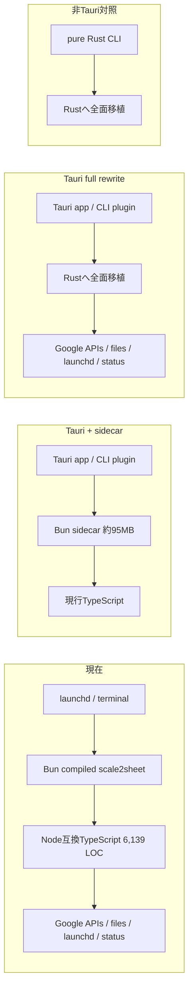

# Tauri v2への移行可否の調査検討書

## 1. 結論

**現時点ではTauri v2へ移行しない案を推奨する。**

理由は、Tauri v2が悪いからではない。

現行の成果物がmacOSのheadless CLIであり、Tauri v2の主な価値であるWebView UI、app bundle、DMG、署名、updaterを必要とする要件がIssue #82に無いからである。

現行TypeScriptを残してTauriのsidecarにすると、95MBのBunバイナリは残り、Tauri wrapperのぶん配布物は大きくなる。

Bunを外すには、6,139行のTypeScriptとNode.js依存をRust側へ移す必要がある。

それはbuild toolの交換ではなく、CLI、OAuth、Google Sheets、入力parser、launchd、installer、status、run leaseを含む再実装である。

現行の95MBは実在する費用だが、Issue #82には目標サイズ、許容起動時間、GUI、署名、配布方式の合格条件が無い。

したがって、サイズの大きさだけで2026-07-05のBun正式配布決定を覆さない。

次のいずれかが新しい要件として決まった場合は再検討する。

- GUIまたはtray UIを提供する。
- 署名済みapp bundle / DMGと自動更新を正式配布経路にする。
- 95MBを下回る具体的な配布サイズ上限を置く。
- cold startまたは日次実行の起動時間に具体的な上限を置く。
- Rustへの全面移植費用を受け入れる。

## 2. 問いと対象外

Issue #82の本文は空で、タイトルは「実行ファイルの単一バイナリ化のためにbunではなくtauri v2を検討する」である。

しかし現行の`dist/scale2sheet`は、すでに`bun build --compile`で生成した単一のMach-O実行ファイルである。

したがって本書の問いを「単一バイナリにできるか」から、次へ置き換える。

> 現行のheadless CLI契約と検査能力を保ったまま、Tauri v2へ移ることで、サイズ、起動、配布、保守の総費用が改善するか。

本書は移行を実装しない。

GUIの画面設計、Rust moduleの分割、CLI schemaの再設計も行わない。

採用判断に必要な比較軸と、採用後に初めて着手できるprototype gateまでを対象にする。

## 3. 以前の決定と、変わった事実

### 3.1 以前の決定

2026-07-05の三つの検討書は、配布・運用の正式経路をBun単体バイナリ、開発・型検査・testをNode.jsとした。

- [Bun CLI化についての検討書](./2026-07-05T102021_Bun_CLI化についての検討書.md)
- [単一バイナリ化を正式配布形態にする検討書](./2026-07-05T105321_単一バイナリ化_bun_buildを正式な配布形態にする検討書.md)
- [Bunを優先実行環境にする検討書](./2026-07-05T152943_Bunを優先実行環境にしバイナリ名をscale2sheetにする検討書.md)

その決定の根拠は現在も成立している。

- sourceはNode.js互換TypeScriptのまま保つ。
- 配布物はNode.js/npmを実行時に要求しない。
- 開発時のVitestとtscを維持する。
- launchdは`scale2sheet`実行ファイルを直接起動できる。

### 3.2 その後に変わった事実

以前より明確になった費用は二つある。

1. 現行Bunバイナリが95,149,154 bytesであり、小さくない。
2. compiled binaryを実際に起動するacceptanceが5本、継続gateへ入った。

二つ目は移行の動機ではなく、移行時に失う検査能力の大きさである。

95,149,154 bytesは10進表記で95.15MB、2進表記で90.74MiBであり、依頼時の「91MB」と一致する。

2026-08-10T18:31:31+09:00の隔離実行では、acceptance 8 files / 10 testsが38.54秒で完了した。

このうち実バイナリをbuildして起動する5本の所要時間は次だった。

| Acceptance | 実測時間 |
| --- | ---: |
| runtime safety / run lease | 9.236秒 |
| Bun binary smoke | 12.506秒 |
| install / uninstall | 14.829秒 |
| binary / source command-set drift | 21.082秒 |
| pipeline shadow | 38.272秒 |

並列実行なので、各時間の合計はsuite全体のwall timeではない。

## 4. 比較軸

用途が未定のまま「TauriかBunか」を比較すると、どちらにも有利な用途を後から選べる。

先に次の軸を固定する。

| ID | 軸 | 測るもの | 採否に使わない代用品 |
| --- | --- | --- | --- |
| A-1 | 現行契約 | 7 command、option、exit 0/1/2、stdout/stderr、設定、launchd | windowが開くこと |
| A-2 | 配布サイズ | 利用者へ渡す全artifactの合計bytes | 最小templateのbinaryだけ |
| A-3 | 起動時間 | 同一Macでcold / warmを分けたCLI完了時間 | build時間、UI表示時間 |
| A-4 | 配布容易性 | install、uninstall、署名、notarize、更新、rollback | bundleを生成できること |
| A-5 | build依存 | 利用者と開発者が導入するtoolchain | runtime依存だけ |
| A-6 | 保守 | direct / transitive依存、更新頻度、二言語境界 | release回数だけ |
| A-7 | acceptance移行費 | 既存5本を同じ変異検出力で通すまでの変更 | test file数だけ |
| A-8 | 運用適合 | launchdからwindowやDock icon無しで直接起動し、終了codeを返す | Finderから起動できること |

サイズと起動時間は、現行と同じ契約を満たしたartifact同士だけを比較する。

## 5. 現行Bun経路の実測

### 5.1 環境

| 項目 | 値 |
| --- | --- |
| 実測日時 | 2026-08-10T18:29:00+09:00から2026-08-10T18:31:00+09:00 |
| 測定checkout HEAD | `316944450fee8c9941ba76b2b93d719e9dd2cb5d`（PR #212 head） |
| 現在のmain | `e0f3bc675cfd3f89193754ff745b1af4c53b3207` |
| OS / architecture | macOS / arm64 |
| Bun | 1.3.14 |
| Rust | 1.96.0 |
| Tauri crate metadata | `tauri 2.11.5`、`tauri-plugin-cli 2.4.1` |

本番設定を使う`run`、`pipeline`、`serve`、`auth`、`install`は実行していない。

`npm run build:bun`も実行していない。

buildはarchitect cloneから一時directoryへ直接出力し、起動計測は`--help`だけで行った。

測定HEADと現在のmainの`src`、`scripts`、`package.json`には差分が無いことを`git diff --quiet`で確認した。

### 5.2 サイズとbuild

| 対象 | bytes | 備考 |
| --- | ---: | --- |
| checkoutの`dist/scale2sheet` | 95,149,154 | arm64 Mach-O、adhoc / linker-signed |
| 一時directoryへのfresh build | 95,165,666 | 1,260 modules |
| 1 moduleだけのBun compile floor | 63,446,114 | 同じBun 1.3.14 |

fresh buildのwall timeは3.11秒、最大RSSは561,692,672 bytesだった。

単純差分では、Bun runtime floorが約63.4MB、現在のapplicationと依存が約31.7MBを占める。

この差分は圧縮配布サイズではなく、raw executableの比較である。

### 5.3 起動時間

`dist/scale2sheet --help`を、一つのNode計測processから31回ずつ3 batch起動した。

各batchの最初の一回をfirst、残り30回をwarm標本とした。

| Batch | first | warm p50 | warm p95 | warm min-max |
| --- | ---: | ---: | ---: | ---: |
| 1 | 2,767ms | 340ms | 482ms | 294-716ms |
| 2 | 317ms | 311ms | 497ms | 274-504ms |
| 3 | 308ms | 308ms | 451ms | 277-487ms |

別のfresh buildではfirst 1,874ms、warm 40件のp50 362ms、p95 992msだった。

firstはmacOS cacheや署名検査の影響を含み、ばらつきが大きい。

一回の緑や一つの中央値だけで上限を決めない。

現行launchdの実行回数は一日4回なので、この起動時間が利用者の待ち時間を直接支配するわけではない。

## 6. Tauri v2が提供するもの

Tauri v2はRustとOS WebViewを組み合わせるdesktop application toolkitである。

公式architectureも、HTMLをWebViewで描画し、JavaScriptとRustをmessage passingで結ぶ構造として説明している。

最小appは600KB未満になり得るが、これはOS WebViewを再配布しない最小構成の値である。

現行scale2sheetの機能を含む値ではない。

- [Tauri: What is Tauri?](https://v2.tauri.app/start/)
- [Tauri Architecture](https://v2.tauri.app/concept/architecture/)
- [Tauri App Size](https://v2.tauri.app/concept/size/)

Tauriには`clap`を使うCLI pluginがあり、command line argumentsをJavaScriptまたはRustから読める。

CLI parserが在ることと、現行Node.js CLIをそのまま動かせることは別である。

[Tauri CLI plugin](https://v2.tauri.app/plugin/cli/)はargument mapを渡すが、現行sourceのNode.js APIと8個のnpm runtime依存をWebViewへ提供しない。

現行43 source filesのうち19 filesがNode.js builtinをimportし、34 importと42件の`process.*`参照を持つ。

そのためTypeScriptを残す場合は、Bun binaryをsidecarとして同梱する必要がある。

Tauriの公式sidecar機構も、target tripleごとの外部binaryをbundleへ含める方式である。

[Embedding External Binaries](https://v2.tauri.app/develop/sidecar/)は、外部binaryが消える仕組みではない。

Tauriはapp bundle、DMG、platform installer、署名、notarization、updaterを提供する。

これらはGUIまたは配布channelが必要なら価値を持つ。

署名済みprebuilt artifactを配ればend userからRustやNodeを外せるが、そのrelease channelは現行scale2sheetにまだ無い。

prebuilt artifact自体はBunでも配布できるため、「利用者がbuild toolを要しない」ことだけではTauri固有の利点にならない。

- [Tauri distribution](https://v2.tauri.app/distribute/)
- [macOS signing and notarization](https://v2.tauri.app/distribute/sign/macos/)
- [Tauri updater](https://v2.tauri.app/plugin/updater/)

macOS desktop buildにはXcodeまたはCommand Line ToolsとRustが要る。

JavaScript frontendを使う場合はNode.js toolchainも加わる。

- [Tauri prerequisites](https://v2.tauri.app/start/prerequisites/)

2026-08-10時点のcrates.io metadataでは`tauri 2.11.5`、`tauri-plugin-cli 2.4.1`だった。

公式GitHub releasesを2026-05-12T09:00:00+09:00以降で数えると、Tauri coreは4 release、Tauri CLIは3 releaseだった。

同じ窓のBun stable releaseは1件で、localのBun 1.3.14と一致した。

release回数は活発な保守の信号でもあるため、多いことだけを欠点とは数えない。

一方、Tauriを足すとRust toolchain、Tauri core、CLI plugin、platform bundler、WebView境界を新しく追随する必要がある。

## 7. Architectureの不一致

sidecar案はTypeScriptを保てるが、Bunを外せない。

full rewrite案はBunを外せるが、移行費用の大部分はTauriではなくRust portである。

GUIが要らずサイズだけが目的なら、pure Rust CLIがTauriに対する必要性の対照になる。

## 8. 既存acceptanceの作り直し量

### 8.1 現物

compiled binaryに直接関係するshell / Python / Vitestは合計1,356行だった。

この全行を必ず書き直すという意味ではない。

「build seamだけ変えられる検査」と「検査の正本から変える必要がある検査」を分ける。

| 検査 | 現在固定しているもの | sidecar | full Rust / Tauri |
| --- | --- | --- | --- |
| pipeline shadow | fresh Bun binary、lease、status、producer禁止 | build seamだけ変更可能 | black-box契約を維持できれば再利用可能 |
| runtime safety | Bun binary二process、O_EXLOCK、SIGKILL回復 | build seamだけ変更可能 | Rustで同じlease契約を再実装後に再利用 |
| install / uninstall | raw binary copy、manifest、launchd | sidecarのinstall先を決め直す | `.app`かraw CLIかでfixtureを再設計 |
| CLI smoke | Bun binaryの6 isolated invocation | sidecarを直接叩けば再利用 | 7 commandとexit contractを再実装後に再利用 |
| binary drift | TypeScript sourceの`--help`とbinaryのcommand set | sidecarには現状を維持 | source正本がRustへ移るため検査自体を再設計 |
| isolated builds meta-test | 4 scriptが一時directoryへ`bun build --compile` | Bun sidecarなら維持 | build commandとartifact pathを再設計 |

最も大きな穴は、testが新しいartifactではなく古いBun binaryを起動しても緑になり得ることである。

build commandの文字列を変えるだけでは、Tauri artifactがproduction契約を満たすことを証明しない。

### 8.2 移行時の必須変異

| ID | 変異 | 期待 |
| --- | --- | --- |
| M-1 | Tauri wrapperだけを測り、Bun sidecarをサイズから除く | KILLED |
| M-2 | Tauri artifactを作るがacceptanceは旧Bun binaryを起動 | KILLED |
| M-3 | `pipeline`を未実装のままGUIが起動 | KILLED |
| M-4 | `run`のargument errorがexit 1へ戻る | KILLED |
| M-5 | launchdから起動するとwindowまたはDock iconが出る | KILLED |
| M-6 | app bundleのuninstallでconfig / auth / logsまで消す | KILLED |
| M-7 | Rust sourceにcommandを足しartifactが古い | KILLED |
| M-8 | Tauri build不可を「既存Bun testが緑」で通す | KILLED |

「acceptanceが5本在る」ではなく、M-1からM-8で検査が実際に新しいartifactを見ていることを確認する。

## 9. 選択肢

### 案A: Bun単体バイナリを維持する

既存の配布、launchd、installer、acceptanceを保つ。

サイズや署名が要件になった場合は、Bun artifactの圧縮、署名、prebuilt配布をTauriと独立に検討する。

**利点:** 現行契約と349 testsを維持し、移行による偽陰性を増やさない。

**欠点:** raw executableは約95MBで、first launchは実測1.9から2.8秒の標本がある。

### 案B: Tauri appに現行Bun binaryをsidecarとして同梱する

GUI、tray、DMG、署名、updaterが必要な場合の段階案である。

headless launchdはsidecarを直接起動し、Tauri appは設定UIだけを担当する境界も取り得る。

**利点:** 現行TypeScriptとblack-box acceptanceを多く残せる。

**欠点:** Bunを置き換えず、配布サイズとtoolchainを増やす。

Issue #82の「bunではなくtauri」という目的には答えない。

### 案C: Tauri appのRust backendへ全面移植する

CLI pluginまたはRust entrypointから7 commandを提供し、現行処理をRustへ移す。

**利点:** Bun runtimeを配布物から外し、app bundle、署名、updater、GUIを一つのframeworkで扱える可能性がある。

**欠点:** 6,139行のsourceと8 runtime dependenciesの責務を再実装し、binary drift gateを含む5 acceptanceの正本を作り直す。

feature-complete artifactのサイズと起動時間は未測定である。

### 案D: pure Rust CLIへ移植する

GUIを作らず、現在と同じraw CLIをRustで再実装する。

**利点:** サイズと起動だけが目的なら、WebView application frameworkを持ち込まない。

**欠点:** Rust全面移植とacceptance移行費は案Cと同じく大きく、Tauriの配布機能は得ない。

これは採用推奨ではなく、「サイズ改善にTauriが必要か」を判定する対照である。

## 10. 比較表

| 軸 | A Bun維持 | B Tauri + Bun sidecar | C Tauri + Rust全面移植 | D pure Rust CLI |
| --- | --- | --- | --- | --- |
| 現行CLI / launchd | 実証済み | sidecar直起動なら維持 | 要再実装 | 要再実装 |
| raw配布サイズ | 95.15MB実測 | 95.15MBより増える | 不明 | 不明 |
| 起動時間 | warm p50 0.31-0.34秒 | sidecar直起動なら同等 | 不明 | 不明 |
| GUI / tray | 無し | 追加可能 | 追加可能 | 無し |
| DMG / updater | 別途設計 | Tauri機能を利用可能 | Tauri機能を利用可能 | 別途設計 |
| build依存 | Node + Bun | Node + Bun + Rust + Tauri | Rust + Tauri、場合によりNode | Rust |
| source移植 | 無し | UI bridgeだけ | 全面 | 全面 |
| acceptance変更 | 無し | build / install seam | 5本すべてに影響 | 5本すべてに影響 |
| 現在の要件への適合 | 高い | GUI要件が無いので過剰 | 費用の根拠が無い | 費用の根拠が無い |

## 11. 推奨と退役条件

### 11.1 推奨

案Aを維持し、Issue #82は「現時点では移行しない」という理由を記録してcloseする案を推奨する。

これは永久にTauriを拒否する決定ではない。

Issue本文に無い目的をagentが補って全面移植を始めないためのfail-closed判断である。

### 11.2 再検討を開始する条件

次の表で一件以上がユーザー要件になったとき、案Bから案Dを比較し直す。

| Trigger | 最初に比較する案 |
| --- | --- |
| 設定GUI / trayが必要 | BとC |
| 署名済みDMG / updaterが必要 | BとC、およびBun artifactへの独立導入 |
| raw artifactの上限が定義された | Aの圧縮 / 配布改善、C、D |
| CLI cold start上限が定義された | A、C、Dのfeature-complete prototype |
| Node / Bun sourceを廃止する決定 | CとD |

## 12. 採用する場合のprototype gate

ユーザーが案B、C、Dのいずれかを選んでも、production経路を直ちに切り替えない。

一時directoryまたは専用branchで次を順に実測する。

1. 7 commandとhelpを同じartifactから出す。
2. `run`のexit 2 / 1 / 0を固定する。
3. launchd相当の非interactive環境でwindow、Dock icon、dialogを出さず終了する。
4. 5 compiled-binary acceptanceを新artifactへ向ける。
5. M-1からM-8を当て、KILLED / KILLED-BY-TSC / SURVIVEDを記録する。
6. artifact全体のbytes、cold / warm、build時間、最大RSSを同じMacで3回以上測る。
7. install / uninstallの削除対象と残置対象をREADMEへ差し替える。
8. cutover前後のrollback artifactを保持する。

Tauriの最小templateが小さくbuildできても、手順1から5を満たさなければ候補artifactに数えない。

## 13. 調査sourceと再現条件

### 13.1 repository一次資料

- `package.json`の`build:bun`。
- `src/cli/index.ts`と`src/cli/installation.ts`の7 command。
- `scripts/run-*-acceptance.sh` 5本。
- `scripts/check-binary-source-drift.py`。
- `test/acceptance/isolated-binary-builds.test.ts`。
- READMEのBun、test、launchd節。

### 13.2 外部一次資料

- [Tauri 2.11.5 crate](https://crates.io/crates/tauri/2.11.5)
- [Tauri plugin CLI 2.4.1 crate](https://crates.io/crates/tauri-plugin-cli/2.4.1)
- [Tauri official releases](https://github.com/tauri-apps/tauri/releases)
- [Bun official releases](https://github.com/oven-sh/bun/releases)
- §6に列挙したTauri公式文書。

### 13.3 local agent history

`ctx search "Tauri v2 scale2sheet"`で、Issue #82の動機が不明であり、以前のBun決定との差分を起点にするという2026-08-04の記録を確認した。

同じ内容はIssue #82のコメントに残っており、本書の判断はrepositoryとGitHubの一次資料から再検証できる。

- provider: Claude
- ctx session: `dc11f225-b977-7882-9297-9a40db7f3fe1`
- ctx event: `65184d91-2ae5-735a-a5cb-694f904d6149`

## 14. ユーザー判断

本書は案Aを推奨するが、次の採否はユーザーが決める。

- A: Bun単体バイナリを維持し、Issue #82を理由つきでcloseする。
- B: GUI / 配布要件を追加し、Tauri + Bun sidecarのprototypeへ進む。
- C: GUI / 配布要件とRust全面移植を受け入れ、Tauri full rewriteのprototypeへ進む。
- D: サイズ / 起動だけを目的に、pure Rust CLIを別Issueで調査する。

要件が追加されない場合はAとするのが、本書の推奨である。
