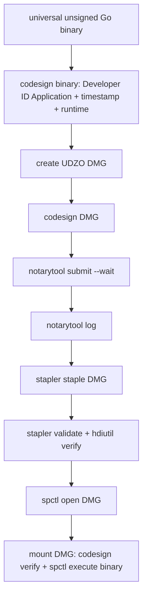

# Developer ID署名とnotarytool公証の採否についての検討書

## 背景と目的の妥当性

Issue #10 は、Issue #6 で確定した pilot 用 universal Go binary を、macOS の公開配布で Gatekeeper が検証できる信頼チェーンへ進める一課題である。
署名だけでなく Hardened Runtime、公証、staple、Gatekeeper 検査、CI secret 境界を同じ成果物に対して固定する必要があるため、Issue #6 の install/LaunchAgent 課題とは分離した一つの目的として妥当である。

## 外部調査

- Apple の [distribution signing](https://developer.apple.com/documentation/xcode/creating-distribution-signed-code-for-the-mac/) は Developer ID Application、secure timestamp、main executable の `-o runtime` を案内する。`--deep` は署名時に使わない。
- Apple の [notarization](https://developer.apple.com/documentation/security/notarizing-macos-software-before-distribution) は `notarytool` で archive を submit し、処理完了後に ticket を staple する経路を定義する。`altool` は採用しない。
- Apple の [packaging guidance](https://developer.apple.com/documentation/xcode/packaging-mac-software-for-distribution) は、直接配布では署名済みコードを distribution container に入れて公証する経路を示す。
- [TN3147](https://developer.apple.com/documentation/technotes/tn3147-migrating-to-the-latest-notarization-tool) は `notarytool store-credentials` と Keychain profile を案内する。
- ローカル `stapler` の実測では対応形式は UDIF disk image、signed flat installer package、特定の executable bundle であり、裸の非 bundle Go executable を最終配布容器にするのは適合しない。

## 採用方針

### 配布容器は DMG とする

現行製品は `.app` bundle でも installer package でもなく、`~/.local/bin` へユーザー単位で配置する CLI である。
既存の install/LaunchAgent 契約を変更せず公開配布の staple 対応形式を満たすため、DMG に `scale2sheet` と README を格納する。

署名順序は次のとおり固定する。

DMG を staple した後は署名を変更しない。最終成果物は staple 済み DMG と notary log JSON である。

### 署名条件

- identity は `Developer ID Application: ...` に限定し、Apple Development、ad hoc、Mac Distribution は拒否する
- universal binary の各 slice を別々に署名せず、`lipo` 後の universal executable を一度署名する
- `codesign --force --sign "$MACOS_SIGNING_IDENTITY" --timestamp --options runtime --identifier "$MACOS_SIGNING_IDENTIFIER"`
- `codesign --verify --strict` を binary と DMG の双方で実行する
- `sudo` と `codesign --deep` は使わない

### 公証認証と CI 境界

CI の標準経路は App Store Connect API key（`.p8`、Key ID、Issuer ID）とし、workflow 実行時だけ `$RUNNER_TEMP` に復号する。
ローカルまたは別 CI では、`notarytool store-credentials` で作成した Keychain profile も利用できる。

リポジトリへ保存しない secret は次のとおりである。

| Secret | 用途 |
| --- | --- |
| `MACOS_DEVELOPER_ID_CERTIFICATE_BASE64` | Developer ID Application 証明書を含む一時 p12 |
| `MACOS_DEVELOPER_ID_CERTIFICATE_PASSWORD` | p12 の import password |
| `MACOS_KEYCHAIN_PASSWORD` | CI 一時 keychain の password |
| `MACOS_SIGNING_IDENTITY` | Developer ID Application identity の完全名 |
| `MACOS_NOTARY_KEY_BASE64` | App Store Connect API key の `.p8` |
| `MACOS_NOTARY_KEY_ID` | API key ID |
| `MACOS_NOTARY_ISSUER_ID` | API key issuer ID |

workflow は `macos-release` environment の手動実行または `v*` tag に限定する。
証明書は一時 keychain に import し、API key は一時ファイルに置き、終了時に keychain とファイルを削除する。
PR の通常 CI では公証を実行せず、秘密情報が無い場合は公開配布 workflow が fail-closed する。

## 現在の検証境界

現環境の `security find-identity -v -p codesigning` は Apple Development identity 1 件のみで、Developer ID Application identity は存在しない。
GitHub repository secret も未設定であるため、実際の Apple notary service への正常系 submit/staple/Gatekeeper acceptance は、workflow とローカル fail-closed/contract acceptance を実装した後に、Developer Program credentials が投入された環境で実施する。
credentials 無しで成功扱いにする代替や Apple Development 署名での代用は採用しない。

## 結論

Issue #10 は、`scripts/build-macos-distribution.sh` と手動/tag workflow により、Developer ID 署名済み universal binary を DMG 化し、notarytool の submit/wait/log、stapler、hdiutil、spctl を同じ順序で再現する。
Apple credentials が無い環境では、出力を生成せず理由を明示して失敗する。

## 後続のユーザー判断

Issue #10 の後続コメントでユーザーが **Apple=3** を選択し、Developer ID署名・notarytool公証・Gatekeeper正常系受入を本プロジェクトの対象外へ変更した。
本書の外部調査、署名順序、fail-closed 契約の記録は履歴として保持するが、採否と未完了条件の現行状態は [Apple=3 の判断記録](./2026-08-13T211919_Apple3_macOS公開配布正常系を対象外とする判断.md) を正本とする。
