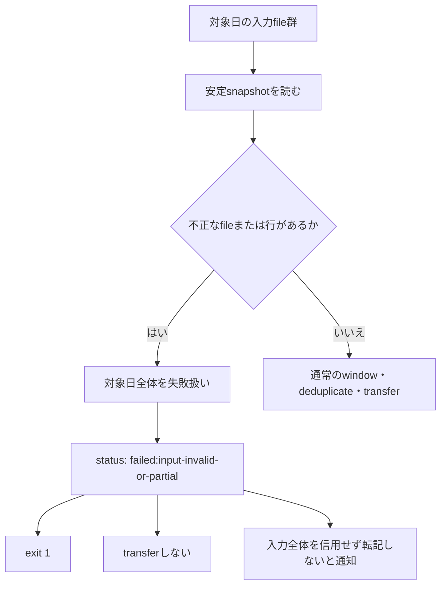

# Go版AT-10a入力異常ポリシーをA-0へ確定

## 決定

AT-10aは **A-0** を採用する。

対象日の入力について、1ファイルの1行だけでも不正がある場合は、その日の値全体を疑わしいものとして扱い、転記しない。

ユーザー理由:

> 1ファイルの1行だけでも不正があるならその日の値の全てが疑わしい。転記すべきではない。通知でその旨を警告する。

## 現行Goで固定する契約

- JSONLの対象fileを安定snapshotとして読み込む。
- いずれかのfileのいずれかの行でparse不能またはschema不正を検出した場合、snapshot全体を失敗にする。
- statusのoutcomeは `failed:input-invalid-or-partial` とする。
- pipelineの終了コードは `1` とする。
- Google Sheetsへのtransferは呼び出さない。
- diagnosticには、既存の入力エラー契約に従ってファイル名・行番号を含める。
- 利用者向け通知では、入力全体を信用できないため転記しないことを明示する。通知文の実装は [Issue #31](https://github.com/kappaseijin/scale2sheet4go/issues/31) で行う。

## 採用しない案

- **A-1**: 不正fileを除外して正常fileだけを転記する方式は採用しない。
- **I-before / I-after**: A-1を採用しないため、導入時期の選択は発生しない。
- file単位のpartial transfer、除外file一覧、A-1用のdefinition versionは現行GoのAT-10a契約に追加しない。

## 決定の妥当性

scale_exporterのproducer契約はfileの構文・終端・公開原子性を定めるが、consumerが不正入力を全体失敗またはfile単位除外のどちらで扱うかは定めていない。
したがって、consumerであるscale2sheetの転記安全性を優先してA-0を選ぶことは、外部producer契約と矛盾しない独立した受入判断である。

## 影響範囲

- 現行Go runtimeの入力読込、pipeline outcome、exit code、transfer未実行テストを採用契約として扱う。
- AT-10aをGo受入マトリクスの決定待ちから、A-0契約の自動検証対象へ移す。
- 既存のA-1比較資料は、採用しなかった案と過去検討の記録として保持する。
- 通知の具体的な文面変更はIssue #31・別PRで扱う。
