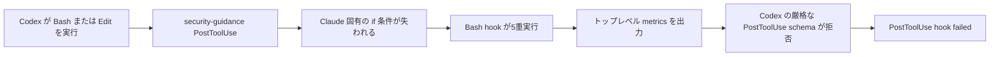

# PostToolUse hook の互換性に関する対応方針

## 目的の妥当性

Issue #35 は Go アプリの機能ではなく、Codex が開発作業の後に実行する hook の互換性を扱う。
PostToolUse の失敗表示は、実装と検証のログを埋めてパイロット運用の判断を遅らせるため、プロジェクト全体の開発基盤に対する課題として妥当である。

## 調査結果

Codex CLI 0.147.0 の app-server `hooks/list` は、security-guidance プラグインの PostToolUse を次の構成で読み込んでいる。

| hook key | Codex が認識した matcher | 実体 |
| --- | --- | --- |
| `security-guidance@claude-plugins-official:hooks/hooks.json:post_tool_use:0:0` | `Edit\|Write\|MultiEdit\|NotebookEdit` | `security_reminder_hook.py` |
| `security-guidance@claude-plugins-official:hooks/hooks.json:post_tool_use:1:0` から `1:4` | `Bash` | `security_reminder_hook.py` |

元の `hooks.json` は Bash の各 hook に Claude Code 固有の `if` 条件を持つ。
Codex の `hooks/list` ではその条件が matcher に反映されず、同じ Bash hook が 5 件に展開される。

そのため、通常の Bash 実行でも同じ Python hook が 5 回起動する。
`git commit` または `git push` に一致すると、hook は Claude Code 用の計測値をトップレベルの `metrics` オブジェクトとして出力する。
重複実行分も `{"metrics":{"bash_hook_dedup":true}}` を出力する。

Codex の PostToolUse 出力スキーマは未知のトップレベル項目を許可しない。
このスキーマには `metrics` がないため、Codex は出力を不正と判定し、`PostToolUse hook (failed)` を表示する。
Edit 系 hook のパターン検出時にも同じ `metrics` 出力が発生するため、Bash 系だけを停止しても再発余地が残る。

再現結果は次のとおりである。

```text
security-guidance PostToolUse Bash hook 1回目: rc=0, stdout={"metrics": {"...": ...}}
security-guidance PostToolUse Bash hook 2回目から5回目: rc=0, stdout={"metrics": {"bash_hook_dedup": true}}
Codex PostToolUse schema: metrics は許可されない
```

グローバルの `cc-status` PostToolUse は rc=0 かつ stdout が空であり、この事象の原因ではない。
`save-plan-log.sh` も通常の PostToolUse 入力では rc=0 かつ stdout が空である。

## 処理の対応関係



## 採用する対応

security-guidance の PostToolUse 登録 6 件だけを、Codex app-server の `config/batchWrite` による `hooks.state` で無効化する。

| 対象 | 変更後 |
| --- | --- |
| `security-guidance@claude-plugins-official:hooks/hooks.json:post_tool_use:0:0` | `enabled: false` |
| `security-guidance@claude-plugins-official:hooks/hooks.json:post_tool_use:1:0` から `1:4` | `enabled: false` |

この方法はプラグインキャッシュと `hooks.json` の宣言を直接編集しない。
同じ hook key に `enabled: true` を upsertすればロールバックできる。

次の hook は維持する。

- グローバルの PreToolUse、PermissionRequest、SessionStart、SessionEnd、UserPromptSubmit、Stop 以外の設定
- グローバルの PostToolUse `cc-status`
- グローバルの PostToolUse `save-plan-log.sh`
- security-guidance の SessionStart と UserPromptSubmit
- Issue #29 で無効化済みの Stop hook の状態

## 却下する対応

### プラグインキャッシュを直接編集する

プラグイン更新で変更が失われ、管理対象外の差分になるため採用しない。

### security-guidance の Bash hook だけを停止する

Edit 系 hook もパターン検出時に `metrics` を出力するため、PostToolUse 失敗を確実に抑制できない。

### グローバルの全 PostToolUse を停止する

`cc-status` と計画保存まで失われ、Issue #35 の目的を超えるため採用しない。

### Codex 用 wrapper を追加する

Claude 用の出力を Codex 用へ変換する新しい保守対象が増える。
今回の目的は表示される失敗を止めることであり、互換 wrapper の設計は別課題として切り出すべきである。

## 外部資料

- [Codex PostToolUse output schema](https://raw.githubusercontent.com/openai/codex/main/codex-rs/hooks/schema/generated/post-tool-use.command.output.schema.json)
- [Codex hook output parser](https://github.com/openai/codex/blob/main/codex-rs/hooks/src/engine/output_parser.rs)
- [Codex hooks](https://developers.openai.com/codex/hooks/)
- [Codex app-server protocol](https://github.com/openai/codex/blob/main/codex-rs/app-server/README.md)

## ロールバック

同じ 6 件の hook key に `enabled: true` を `config/batchWrite` で upsertする。
その後 `hooks/list` で対象が enabled に戻り、他の hook の状態と `currentHash` が変わっていないことを確認する。
