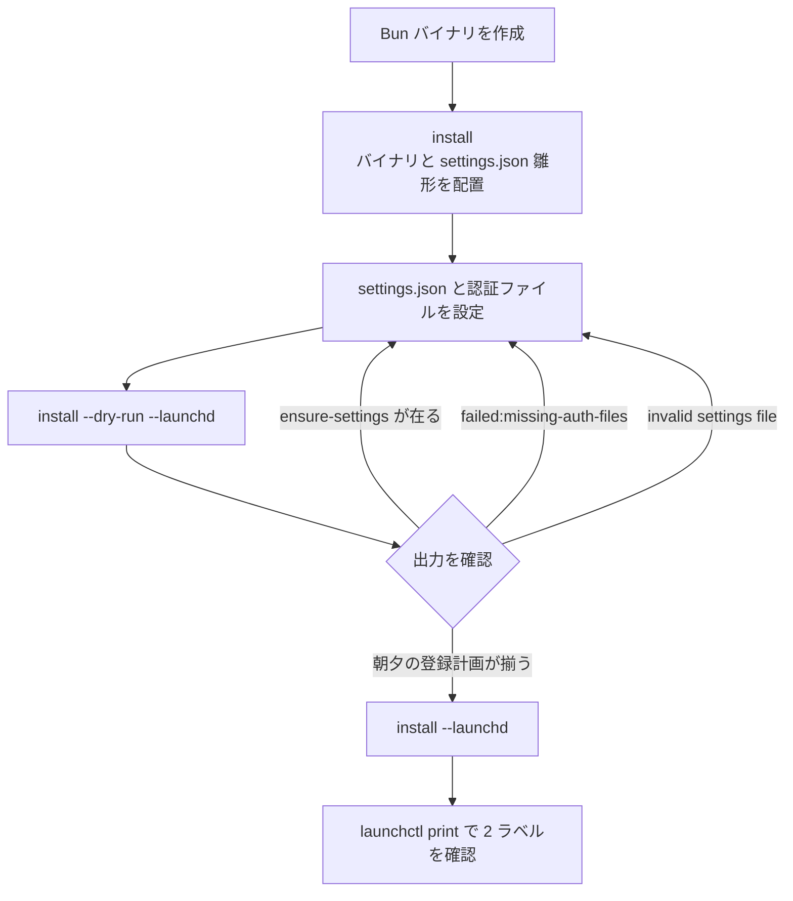
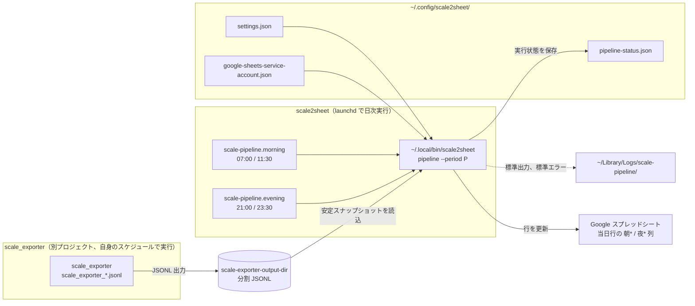
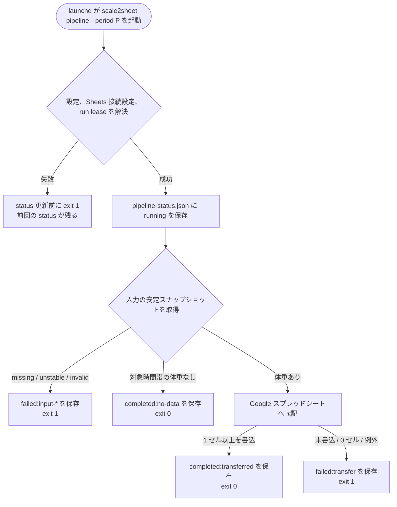

# cutover 後の README 導入手順差し替え案

## 1. 目的

cutover が成立したときに、README の手動 plist 導入手順を `install --launchd` による導入手順へ差し替える。

README は利用者が参照する唯一の資料なので、初回導入、既存の手動 plist からの移行、固定時刻、アンインストール後の残置物までを README だけで判断できる状態にする。

この文書は差し替え前の案であり、cutover 判定前に README へ反映しない。

## 2. 反映条件と対象外

### 2.1 反映条件

2026-08-11 夜の cutover gate が通り、launchd の正規経路を installer 生成 plist へ切り替えることが決まった場合にだけ反映する。

反映は README の文章、2 枚の Mermaid 図、`test/docs/diagrams.test.ts` の claim を同じ PR で行う。

### 2.2 対象外

次はこの差し替え案では変更しない。

- `install --launchd` が設定内容を検証せず登録計画を作れる実装上の欠落。
- CLI に表示される `--force` が実際の計画または lease 取得へ効いていない問題。
- launchd の時刻を利用者が変更できる機能。
- cutover 自体の判定と runtime の切り戻し手順。

運用上は必須だが settings schema では optional なキーの欠落は Issue #184 の実装対象とし、この README 案では安全な二段階導入と dry-run の限界を明記する。

`--force` は効力を確認できないため、利用者向け手順へ載せない。

## 3. 採用する導入順序

設定が完了する前に自動実行が始まらないようにするため、初回導入を二段階に分ける。



`install --launchd` を最初から実行する案は採らない。

設定が無い場合でも、現行実装は settings 雛形の作成から launchd 登録までを同じ計画へ含めるためである。

## 4. 実測

### 4.1 隔離 HOME での dry-run

`dist/scale2sheet` を使い、隔離した一時 HOME で `install --dry-run --launchd` を実行した。

非 dry-run の `install --launchd` は実行していない。

| 条件 | exit | 主な出力 | 判定 |
| --- | ---: | --- | --- |
| `settings.json` が無い | `0` | `ensure-settings` の後、朝夕とも `bootout`、`write-plist`、`bootstrap` まで `planned` | 設定前でも登録計画まで進む |
| `settings.json` と参照先の認証ファイルが在る | `0` | `ensure-settings` は無く、朝夕とも登録操作が `planned` | 登録前の期待形 |
| `settings.json` は在るが参照先の認証ファイルが無い | `1` | `failed:missing-auth-files <絶対パス>` | 認証ファイルの存在を検出する |
| `sheet-id` キーが無く、認証ファイルは在る | `0` | 朝夕とも登録操作が `planned` | 運用上の必須キー欠落は検出しない |
| `sheet-id` が空文字で、認証ファイルは在る | `1` | `invalid settings file` と `sheet-id` の `too_small` | schema 違反を検出する |
| `source` が列挙外で、認証ファイルは在る | `1` | `invalid settings file` と許容する 3 source | schema 違反を検出する |

`ensure-settings` が出ないことは、`settings.json` が存在することを示す。

dry-run は JSON 構文、既知キーの型と値域、`source` の列挙値、参照先の認証ファイルの存在も検証する。

一方、キー自体が optional な `sheet-id` の欠落、入力フォルダの実在、認証ファイルの内容、Spreadsheet への接続は検証しない。

### 4.2 手動 plist からの置換

本番ラベルとは異なる固有ラベルを使い、次の順序を macOS の `launchctl` で実測した。

1. `/usr/bin/true` を起動する plist を bootstrap した。
2. 同じラベルを bootout した。
3. 同じ plist パスを `/usr/bin/false` に書き換えた。
4. 同じラベルを bootstrap した。

`launchctl print` では単一のラベルだけが存在し、ProgramArguments が `/usr/bin/true` から `/usr/bin/false` へ置き換わった。

cleanup 後は同ラベルが not found になることも確認した。

installer の計画も各ラベルに対して `bootout`、同一 plist への書き込み、`bootstrap` の順なので、同じラベルとパスを使う現行の手動 plist は二重登録されず置き換わる。

本番の morning と evening ラベルは変更していない。

### 4.3 関連する既存試験

次の試験を実行し、すべて通過した。

| コマンド | 結果 |
| --- | --- |
| `npx vitest run test/installation/planner.test.ts test/installation/plist.test.ts test/installation/process.test.ts` | 3 files、33 tests passed |
| `npx vitest run test/cli/installation.test.ts test/installation/executor.test.ts` | 2 files、24 tests passed |

## 5. README の差し替え範囲

| 現在の箇所 | cutover 後の変更 |
| --- | --- |
| `## データフロー` の `composition` 図 | `run-pipeline.sh` と `dist/scale2sheet run` を除き、installer 配置バイナリの `pipeline` 直起動へ差し替える |
| `## launchd による日次自動実行` の `run-path` 図 | shell wrapper の判定フローを、`pipeline` の入力、転記、status の終端結果へ差し替える |
| launchd 節の責任境界 | `scale_exporter` を起動せず、公開済み JSONL を安定スナップショットとして読むことへ更新する |
| `### インストール` | 二段階 install、dry-run の確認条件、固定時刻、登録確認へ差し替える |
| `### アンインストール` | CLI uninstall、削除対象、残置対象、事前 dry-run へ差し替える |
| `### 実行状態と検知の限界` | `pipeline` が status を書かないという旧制約を削り、起動前の失敗は status だけでは検知できないという制約を残す |
| `test/docs/diagrams.test.ts` | wrapper の claim を退役させ、installer plist と pipeline の claim へ差し替える |

## 6. README へ入れる文章案

この節の内容は、cutover 成立後に README へ移す。

Issue、PR、cutover の経緯、エージェント運用は README へ持ち込まない。

### 6.1 `composition` 図の差し替え案

````markdown
<!-- diagram: composition -->

````

`pipeline --period P` は installer が生成する plist の ProgramArguments と一致させる。

既定 prefix 以外ではバイナリの表示が変わるため、本文で `<prefix>/bin/scale2sheet` が正本であることを補う。

### 6.2 launchd 節の差し替え案

````markdown
## launchd による日次自動実行

<!-- diagram: run-path -->


launchd は installer が `~/.local/bin/scale2sheet` へ配置したバイナリを直接起動します。

既定 prefix を変更した場合は、`<prefix>/bin/scale2sheet` が起動されます。

`scale_exporter` の起動は scale2sheet の責任ではありません。

scale2sheet は `scale_exporter` 自身のスケジュールで `scale-exporter-output-dir` へ公開された JSONL を読みます。

macOS 通知は初回実行が異常だったとき、正常から異常へ変わったとき、異常から復旧したとき、保存済みの通知状態の欠落を異常として復元したときに送られます。

同じ異常が続くたびには送られません。

### インストール

設定が完了する前に自動実行が始まらないようにするため、バイナリの配置と launchd 登録を分けます。

まず、バイナリと設定ファイルの雛形を配置します。

```sh
npm install
npm run build:bun
./dist/scale2sheet install
```

既定の配置先は `~/.local/bin/scale2sheet` です。

別の配置先を使う場合は `./dist/scale2sheet install --prefix <dir>` とし、以後の install と uninstall にも同じ `--prefix <dir>` を指定してください。

次に、`~/.config/scale2sheet/settings.json` を編集し、設定が参照する認証ファイルを配置します。

launchd を変更する前に dry-run します。

```sh
~/.local/bin/scale2sheet install --dry-run --launchd
```

設定と認証の準備状態を次の 4 値で判定します。

| dry-run の結果 | 判定と次の操作 |
| --- | --- |
| exit code `0` だが `[planned] ensure-settings` が表示される | settings.json が無いため、設定手順へ戻る |
| exit code `1` で `failed:missing-auth-files <パス>` が表示される | 表示されたパスへ認証ファイルを配置し、dry-run をやり直す |
| exit code `1` で `invalid settings file` が表示される | 表示されたキーを修正し、dry-run をやり直す |
| exit code `0`、`ensure-settings` が表示されず、朝夕の登録計画が揃う | 下の確認項目を満たせば登録へ進む |

登録へ進む状態では、次のすべてを確認します。

1. exit code が `0` である。
2. `[planned] ensure-settings` が表示されていない。
3. morning と evening の各ラベルについて、`bootout`、`write-plist`、`bootstrap` がこの順で表示される。
4. `bootstrap` のパスが `~/Library/LaunchAgents/jp.seijin.kappa.scale-pipeline.morning.plist` と `~/Library/LaunchAgents/jp.seijin.kappa.scale-pipeline.evening.plist` である。
5. `replace-binary` のパスが意図した prefix の `<prefix>/bin/scale2sheet` である。

そのほかのエラーで exit code `1` になった場合も登録へ進まず、表示された原因を解消してから dry-run をやり直してください。

dry-run は settings.json の JSON 構文、既知キーの型と値域、`source` の値、参照先の認証ファイルの存在、登録するパス、操作順を確認します。

運用上は必須でも schema では optional なキーの欠落、入力フォルダの実在、認証ファイルの内容、Spreadsheet への接続は確認しません。

たとえば `sheet-id` キー自体が無い場合は dry-run を通りますが、初回実行は必須設定の欠落として失敗します。

確認後に launchd を登録します。

```sh
~/.local/bin/scale2sheet install --launchd
```

登録を確認します。

```sh
launchctl print gui/$(id -u)/jp.seijin.kappa.scale-pipeline.morning
launchctl print gui/$(id -u)/jp.seijin.kappa.scale-pipeline.evening
```

各 period の実行時刻は固定です。

| period | 本実行 | 拾い直し |
| --- | --- | --- |
| `morning` | `07:00` | `11:30` |
| `evening` | `21:00` | `23:30` |

launchd の時刻を変更する設定はありません。

`morning-cron` と `evening-cron` は `serve` 用であり、launchd の時刻は変えません。

ログは `~/Library/Logs/scale-pipeline/`、実行状態は `~/.config/scale2sheet/pipeline-status.json` に保存されます。

### 手動 plist からの移行

既に `scripts/launchd/*.plist` を手動登録している場合も、上の二段階手順を使います。

既存ジョブが実行中でない時間に dry-run と install を実行してください。

`install --launchd` は既存の morning と evening を bootout し、同じラベルと plist パスへ installer 生成の定義を書き、bootstrap します。

同じラベルが二重に起動することはなく、`scripts/run-pipeline.sh` を経由する定義から `<prefix>/bin/scale2sheet pipeline --period P` を直接起動する定義へ置き換わります。

実行中のため install が失敗した場合は、その実行が終わってから同じコマンドを再実行してください。

### アンインストール

`uninstall` は launchd 登録と installer が管理するファイルを削除します。

不可逆な操作なので、最初に dry-run で対象を確認してください。

```sh
~/.local/bin/scale2sheet uninstall --dry-run
```

削除対象を確認した後に実行します。

```sh
~/.local/bin/scale2sheet uninstall
```

既定 prefix 以外へ install した場合は、同じ `--prefix <dir>` を指定してください。

削除されるものは次のとおりです。

| 対象 | 条件 |
| --- | --- |
| morning と evening の launchd 登録 | install manifest に記録されたラベル |
| `~/Library/LaunchAgents/` の plist | install manifest に記録されたファイル |
| `<prefix>/bin/scale2sheet` | install manifest に記録されたバイナリ |
| install manifest | uninstall の管理情報 |
| installer が作成したディレクトリ | config ディレクトリを除き、空の場合だけ削除 |

次のものは削除されません。

| 残るもの | 補足 |
| --- | --- |
| `~/.config/scale2sheet/` | 空でも削除しない |
| `~/.config/scale2sheet/settings.json` | 利用者設定 |
| `~/.config/scale2sheet/` の認証ファイル | Google Sheets と Google Fit の認証情報 |
| `~/.config/scale2sheet/pipeline-status.json` | 直近の実行状態 |
| `~/Library/Logs/scale-pipeline/` のログ | ログが在ればディレクトリも残る |
| installer が作成していないディレクトリ | 空でも削除対象にしない |
| installer が作成したが空でないディレクトリ | 内容を保護するため残る |

設定、認証情報、実行状態、ログも不要な場合は、内容を確認して必要なバックアップを取った後に手動で削除してください。

注意: launchd 運用中に `serve` を同時に起動すると二重実行になるため、併用しないでください。

### 実行状態と検知の限界

`pipeline` は `~/.config/scale2sheet/pipeline-status.json` に morning と evening の実行状態を記録します。

各 period には直近の終端結果、開始時刻、完了時刻、対象日、入力件数、診断情報、最後に完了した日時 `lastDoneAt`、最後に実際に転記した日時 `lastTransferredAt`、連続失敗回数、連続 no-data 回数、health が含まれます。

このファイルは Spreadsheet の値そのものではなく、pipeline がどこまで到達したかを確認するための状態です。

次の制約があります。

- launchd またはバイナリの起動前に失敗した場合は、pipeline-status.json を更新できません。
- settings の解決、Google Sheets 必須設定の確認、run lease の取得は running の保存より前なので、ここで失敗した場合も pipeline-status.json は更新されず前回値が残ります。
- macOS 通知が表示または到達したことは記録できますが、利用者が通知を既読にしたことは証明できません。
- シートの空欄だけでは転記失敗を判定できません。
````

## 7. 図の claim と検査の差し替え

### 7.1 claim の正本

図の文字列だけを検査の正本にしない。

production source を正本とし、図と検査はいずれもその projection として扱う。

| 図 | claim | production source の候補 |
| --- | --- | --- |
| `composition` | plist は installer 配置バイナリへ `pipeline --period P` を渡す | `src/installation/plist.ts` |
| `composition` | morning と evening の固定ラベルと固定時刻 | `src/installation/planner.ts` と `src/installation/plist.ts` |
| `composition` | pipeline は JSONL 入力を読む | `src/pipeline/pipeline.ts` と `src/pipeline/input-snapshot.ts` |
| `composition` | pipeline は status を書く | `src/pipeline/pipeline.ts` と `src/pipeline/status.ts` |
| `run-path` | settings、Sheets 必須設定、run lease の解決は running の保存より前 | `src/cli/index.ts` |
| `run-path` | 入力失敗は `failed:input-*` と exit `1` | `src/pipeline/pipeline.ts` |
| `run-path` | 体重なしは `completed:no-data` と exit `0` | `src/pipeline/pipeline.ts` |
| `run-path` | 1 セル以上の書込は `completed:transferred` と exit `0` | `src/pipeline/pipeline.ts` |
| `run-path` | 未書込、0 セル、例外は `failed:transfer` と exit `1` | `src/pipeline/pipeline.ts` |

固定値を test の期待値へ複製して正本と呼ばない。

利用できる production contract または adapter から値を得て README と照合する。

### 7.2 退役させる claim

次の旧 claim は cutover と同時に削除する。

- `scripts/run-pipeline.sh` を source として、scale_exporter の公開ファイルを入力として確認する。
- launchd が `run-pipeline.sh` を起動する。
- `run-pipeline.sh` が `run --period` を呼ぶ。
- wrapper が run の失敗を exit `1` へ写す。
- wrapper が exporter を起動しない。
- `run` の `not-written` を launchd 経路の終端として扱う。

公開済み JSONL を読む契約自体は退役させず、§7.1 の新 claim で source を `src/pipeline/pipeline.ts` と `src/pipeline/input-snapshot.ts` へ差し替える。

旧 sourcePath の `scripts/run-pipeline.sh` が削除されたことによるファイル読込例外を、契約違反の検出として扱わない。

### 7.3 必須の負のコントロール

図と production source のどちらを壊しても、対応する試験が赤になることを確認する。

| 変異 | 期待 |
| --- | --- |
| 図の `pipeline --period` を `run --period` へ戻す | KILLED |
| 図へ `run-pipeline.sh` の中間ノードを戻す | KILLED |
| 図から `pipeline-status.json` を消す | KILLED |
| 図から status 更新前の preflight 失敗分岐を消す | KILLED |
| 図の `completed:no-data` を別 outcome へ変える | KILLED |
| production plist の `pipeline` を別サブコマンドへ変える | KILLED または KILLED-BY-TSC を区別して記録 |
| production pipeline の terminal outcome を変える | KILLED または KILLED-BY-TSC を区別して記録 |

README の散文と図が矛盾する変異も 1 件入れる。

たとえば散文だけを `run-pipeline.sh` 経由へ戻したとき、図の検査が source と図だけを見て通る状態を残さない。

## 8. cutover 時の作業順

1. cutover gate が通った記録を確認する。
2. README の `composition` 図を差し替える。
3. README の launchd 節をこの案へ差し替える。
4. `pipeline` が status を書かないという旧説明を削除する。
5. `test/docs/diagrams.test.ts` の旧 claim を退役させ、新 claim と負のコントロールを追加する。
6. README のコマンドだけで初回導入、既存 plist からの移行、dry-run、uninstall が完結するかを通読する。
7. `npm test` を複数回実行し、単発の緑だけを根拠にしない。
8. 各基準変異を実行し、KILLED、KILLED-BY-TSC、SURVIVED の 3 値で記録する。
9. reviewer が README の文章、図、production source、実測結果をクロスレビューする。

## 9. 差し戻し条件

cutover gate が通らなければ、この案を README へ反映しない。

cutover 後の実装が、固定ラベル、固定時刻、直接 `pipeline` 起動、uninstall の削除と残置のいずれかで本書と一致しなければ、README を先に合わせず実装差分として判定へ戻す。

図の claim を production source と結べない場合は、守られていない図を README へ出さない。

## 10. reviewer の重点確認

- README へ開発経緯を混ぜていないか。
- 初回導入で設定前の自動実行が始まらない順序になっているか。
- dry-run の実行ではなく、出力の確認が進行条件になっているか。
- dry-run の保証範囲を過大に書いていないか。
- 手動 plist が同じラベルとパスで置き換わり、二重起動しない根拠があるか。
- uninstall の削除対象と残置対象が実装と一致するか。
- fixed schedule と `serve` の cron を混同していないか。
- README の散文と図、および図と production source の両方が一致するか。
