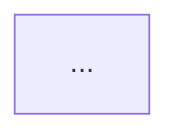
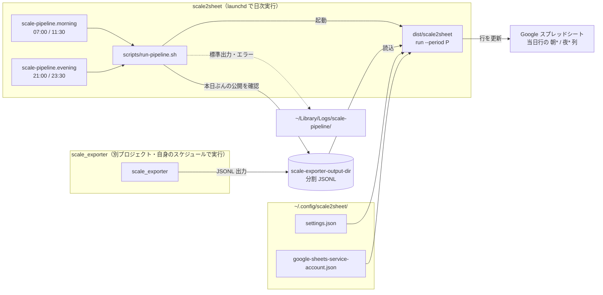
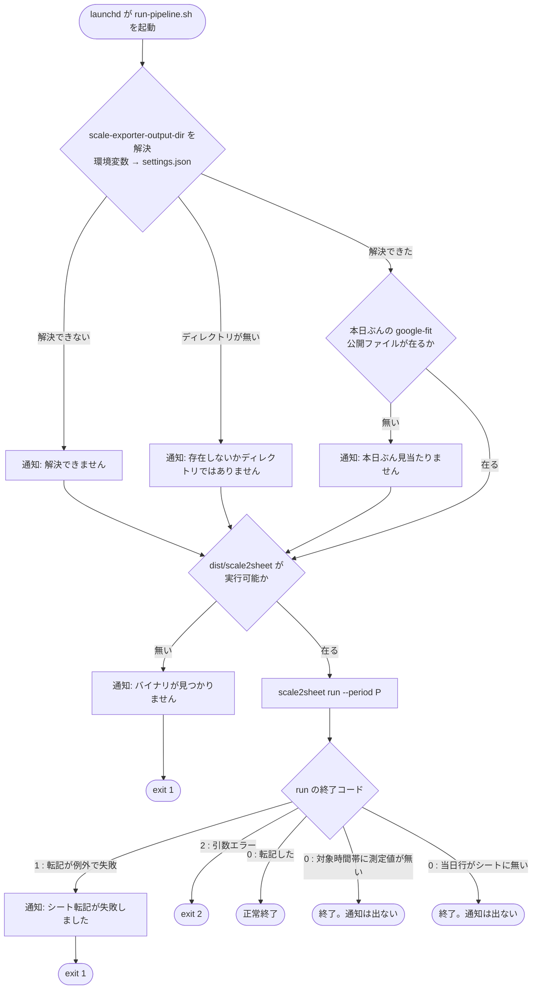

# README へ図表を埋め込む（Issue #157）

**起草: `scale2sheet_architect2_claude`（claude 系）。検証は codex reviewer。**

## 改訂履歴

| 版 | 日時 | 方式 | 乖離点の数 |
| --- | --- | --- | --- |
| 初版 | 12:20+09:00 | 図 3 枚。`docs/structures/*.yaml` → SVG → README へ `` | 3（D1・D2・D3） |
| 第 2 版 | 13:05+09:00 | 図 2 枚・現行経路。YAML → README へ mermaid ブロックを生成注入 | 2（D-S・D3） |
| **第 3 版** | **13:40+09:00** | **図 2 枚・現行経路。mermaid フェンスを Markdown へ直接書く。生成工程なし** | **1（D3 のみ）** |

**第 3 版の差分は §5・§6・§7・§10。§1〜§4・§8・§9・§11 は実質そのまま。**
**§9 の図の内容は 3 版を通じて変わっていない**（第 2 版で現行経路へ描き直したまま）。

### なぜ 3 回変わったか

**方式は 2 回ユーザー決定で変わり、乖離点はそのたびに減った。**

```
初版   生成物（SVG）と定義（YAML）と参照（README）の 3 つを同期させる  → 乖離点 3
第2版  生成物を捨て、定義（YAML）と README ブロックを同期させる        → 乖離点 2
第3版  定義を捨て、図そのものが成果物                                  → 乖離点 1
```

**残った 1 つが D3（図が実装と食い違う）であり、これは最初から本体だった。**
方式の変更は D3 を減らさない。**同期の手間だけが消えた。**

### 決定の出所（reviewer への注記）

**§3・§5・§6 の方式選択は、manager 経由で伝えられたユーザー決定である。**
**これは manager の証言であり、reviewer が一次資料で検証できる範囲の外にある。**
検証してほしいのは「決定が正しいか」ではなく「**決定を正しく反映できているか**」と
「**本書が実測と主張する箇所が実際に測られているか**」である。

## 1. 目的と合格条件

### 目的

**README を読んだ利用者が、設定・実行・異常時の確認を、`docs/` を開かずに完了できる。**
図はその手段であり、目的ではない（`development.rule.md`「README はユーザーが目にする唯一の資料」）。

### 合格条件（第 3 版）

| # | 条件 | 判定方法 |
| --- | --- | --- |
| AC-a | **図の内容が実装と一致している** | §7 の claim を vitest で実行する |
| AC-b | 図が実装と食い違った状態を**実行 gate が落とす** | **負のコントロール**: 実装側を 1 箇所変えて赤になることを確認 |
| AC-c | 図だけを書き換えた状態も**実行 gate が落とす** | **負のコントロール**: 図の 1 語を変えて赤になることを確認 |
| AC-d | **検査の無い図を README へ置けない** | README の mermaid フェンスを全数列挙し、claim 未登録なら落とす |
| AC-e | README に開発の経緯・設計判断・エージェント運用が入っていない | レビュー |

> **AC-b と AC-c は対で意味を持つ。** 片方だけでは「実装と図のどちらかを直せば緑になる」状態を許す。
> §7 の設計は、**同じ 1 つのリテラルを両側へ突き合わせる**ことでこれを閉じる。

**本日このチームは「手で動かすと正しい ≠ 壊れたら気づける」を繰り返し踏んでいる。**
**「gate を作った」ではなく「gate が実際に赤くなるところを見た」を完了条件とする。**

## 2. 実測（2026-08-09、base = `1ca0c8b`）

### 2.0 「現行本番」がいつのものかについて（2026-08-09T14:20+09:00 時点）

**本節の実測は main のソースから取っている。** 決定 1 は「現行本番を描く」なので、
**main と本番が一致していなければ、本書の図は本番ではなく main を描いていることになる。**

**13:22 まで、両者は一致していなかった。**

```
発覚   本番 dist/scale2sheet の mtime が 2026-08-06 08:51
       → 本日マージした 9 本は production に載っていなかった
原因   本番 settings.json に sheet-id が無く、#148 で削除した組み込み既定値で動いていた
対応   settings.json へ sheet-id を追加 → 再ビルド → 実測確認（13:22）
```

> **13:22 より前に書いた本書の初版〜第 3 版は、「現行本番」と書きながら実際には main を描いていた。**
> **私はその差を認識していなかった。** ソースを読んで「現行」と称するのは、
> **ビルドが配備されている前提を置いている**ということであり、その前提は検証していなかった。
> **これは §8 で挙げた「置かれた先で正しく見えるか」と同じ形の見落としである。**

#### したがって、今回は推定せず本番クローンを読んだ（14:20 実測）

```
git -C /Users/kappa/Dropbox/data/dev/scale2sheet log --oneline -1
  → 1ca0c8b（main と一致）。作業ツリーは clean、branch は main

本番の scripts/run-pipeline.sh の exporter 呼び出し  → 0 件
本番の dist/scale2sheet の mtime                     → Aug 9 13:22
```

**バイナリは 13:22 のもの、すなわち `9062698` から作られている。`1ca0c8b` からではない。**
**それでも本番は `1ca0c8b` 相当である。** 根拠:

```
git diff --name-only 9062698 1ca0c8b
  README.md
  scripts/run-pipeline.sh
src/ の変更  → 0 件
```

**`1ca0c8b` は `src/` を触っていないので、13:22 のバイナリで挙動は変わらない。**
**`run-pipeline.sh` はスクリプトなので実行時に読まれ、クローンが `1ca0c8b` にある以上そのまま有効である。**

> **「バイナリの mtime が古い」から「配備されていない」を結論しないこと。**
> **変更が `src/` に無ければ、再ビルドは要らない。**
> 逆に言えば、**mtime だけを見る配備チェックは偽陽性を出す。**
> 見るべきは「**最後のビルド以降に `src/` が変わったか**」である

**実行経路（launchd → `run-pipeline.sh` → `run`）を決めるのは plist であってバイナリでもスクリプトでもない。**
**plist は差し替えられていないので、§2.3 の経路の対応は変わらない。**
（実機の `launchctl print` は取っていない。**plist が実際に読み込まれていることの確認は manager 側の実測に依存する**）

### 2.1 現状の資産

| 対象 | 実測値 |
| --- | --- |
| README.md | 255 行 / 見出し 17 / **mermaid フェンス 0 件**（`#160` が 18 行追加した） |
| `docs/**` の mermaid・PlantUML | **0 件** |
| 既存の擬似図 | ```` ```text ```` のみ。ARCHITECTURE_DESIGN.md 1、EXTERNAL_DESIGN.md 1、INSTALLATION_DESIGN.md 8、INTERNAL_TEST_DESIGN.md 1、PLAN.md 3 |

**流用できる既存図は無い。** ARCHITECTURE_DESIGN.md のディレクトリ木は**内容も古い**
（`cli/` の説明が「run / serve / auth」で、`pipeline` / `install` / `uninstall` が欠落）。**流用してはならない。**

### 2.2 CLI が実際に持つサブコマンド

```
src/cli/index.ts        auth / pipeline / run / serve
src/cli/installation.ts install / uninstall
```

**README が説明しているのは `run` / `serve` / `auth` のみ。**

### 2.3 実行経路が 2 本ある

| | 旧経路（README の手順・**現行本番**） | 新経路（`install`・**main にマージ済**） |
| --- | --- | --- |
| launchd が起動するもの | `/bin/bash run-pipeline.sh <period>` | `<binary> pipeline --period <period>` |
| scale_exporter の起動 | **起動しない**（`#160` で撤去。以前は run-pipeline.sh が起動していた） | **起動しない**（exporter 自身のスケジュール） |
| 入力の有無の確認 | **run-pipeline.sh が本日ぶんの公開ファイルを見る**（`#160` の一時措置。通知するが**止めない**） | `pipeline` が `failed:input-*` として扱う |
| サブコマンド | `run` | `pipeline` |
| `pipeline-status.json` | **書かない** | 書く |
| health 評価・通知 | **無い**（shell の `notify()` が非 0 終了時のみ） | `MacOsNotifier`（状態遷移時） |
| run lease | 無い | 有る |

```
scripts/run-pipeline.sh               "$scale2sheet_bin" run --period "$period"
                                      exporter の呼び出しは 0 件（#160 で撤去）
scripts/launchd/*.morning.plist       /bin/bash .../run-pipeline.sh morning
src/installation/plist.ts:65          <string>pipeline</string><string>--period</string>
src/cli/index.ts:70-81                pipeline のみ AtomicPipelineStatusWriter と MacOsNotifier を渡す
src/cli/index.ts:147                  run は syncMeasurements のみ
```

**これは Issue #114 の cutover そのものである。**

### 2.4 現行経路で通知が出ない条件（実測）

| 条件 | `run` の終了コード | 通知 | 根拠 |
| --- | --- | --- | --- |
| 転記した | 0 | 出ない（正常） | — |
| **対象時間帯に測定値が無い** | **0** | **出ない** | `measurements.ts:81-85` `hasAnyMeasurementValue` が偽 → `undefined` |
| **当日行がシートに無い** | **0** | **出ない** | `sheets/adapter.ts:69-73` log して `{state:"not-written"}` を返す。**例外にしない** |
| 転記が例外で失敗 | 1 | 出る | `run-pipeline.sh:61-63` |
| 引数エラー | 2 | 出る（非 0 なので） | `src/cli/index.ts:134-137`（#79） |

**「当日行がシートに無い」は新経路では `failed:transfer` として alert になる**（`pipeline.ts:173`）。
**同じ事象を、現行経路は黙って通し、新経路は異常として扱う。**

## 3. 図の選定（決定済み・変更なし）

> **ユーザー決定: 現行本番（`run` 経路）を描く。**
> README は事実と一致させるのが原則。**状態遷移図は現行経路に存在しないので cutover 後へ延期。**

| 候補 | 採否 | 理由 |
| --- | --- | --- |
| **構成図** | **採用** | 利用者が最初に要るのは「どのファイルをどこに置くか」。**設定の失敗はほぼ全てここの誤解**で起きる |
| **処理フロー** | **採用** | §2.4 の「通知が出ない条件」を伝える唯一の手段 |
| 状態遷移 | **cutover 後へ延期** | 現行経路に health も通知も無い。いま入れると願望の図 |
| スイムレーン | 不採用 | 処理フローと重複。責任境界は `subgraph` に畳める |
| 論理図（設定解決順序） | 不採用 | 規約 `tables.rule`。2 段で分岐が無い。既存の表を維持 |

### cutover 側への申し送り

**#114 の受け入れ条件へ次を追加すること**（本計画の範囲外だが、決定の帰結として発生する）:

```
cutover 完了後
  README の run-path 図を pipeline 経路へ書き換える
  health-state 図を追加する（本計画で延期したもの）
  §7 の claim を併せて更新する  ← 忘れると旧経路を指す検査が残り、gate が誤って赤くなる
```

## 4. 図の言語

**mermaid のみ。PlantUML は導入しない。**
**`stateDiagram-v2` を使わない**（cutover 後の health 図も `flowchart` で描く。理由は §6 の実測）。

## 5. 図の配置（**第 3 版で全面改訂**）

### 決定

> **図は Markdown のインラインで書く。** mermaid のコードフェンスを、その図が要る文書へ直接書く。
> **`docs/structures/*.yaml`・`*.svg`・`docs/structure.yaml` はいずれも作らない。**
> **生成工程を持たない。**

### 配置

| 図 | 置き場所 |
| --- | --- |
| 構成図（`composition`） | `README.md` §データフロー（既存の ```` ```text ```` を置換） |
| 処理フロー（`run-path`） | `README.md` §launchd による日次自動実行 の冒頭 |

**本計画書 §9 にも同じ 2 図を載せている**（規約「計画書には積極的に図表を含める」）。

### 識別マーカー

図の直前に 1 行だけ置く。**これは生成のためではなく、検査の突き合わせ先を決めるためである。**

```markdown
<!-- diagram: run-path -->

```

**マーカーは README だけに要求する。** `docs/` 配下（計画書・検討書・設計書）の図は**任意**。

理由: **README は現在を語る資料、計画書は時点を語る記録である。**
計画書の図を永続的に「実装と一致」させるよう強制すると、**過去の計画が実装の変化のたびに赤くなる。**
記録は当時のまま残すのが正しい。

**ただし README だけは全数検査する**（§7 の AC-d）。
「マーカーを付けなければ検査を避けられる」状態を README で許すと、抜け道になる。

### 重複について

同じ図が README と本計画書の両方に載る。**この重複は許容する。**
規約が単一ソースを捨てた以上、重複は方式の帰結である。
**README 側だけが検査対象であり、そちらが正本として扱われる。**

## 6. 生成工程は持たない — なぜここへ来たかの記録

**第 3 版で `scripts/render-structures.mjs` は不要になった。**
以下は、その判断に至るまでに測った内容である。**測っていなければ、どの方式も「なんとなく」で選ぶことになった。**

### 訂正 1（初版 → 第 2 版）

> **初版は「mmdc の出す SVG は要素 id に実行ごとに変わる接尾辞を含む」と書いた。誤りだった。**
> 根拠は記憶であって実測ではなかった。測ったら図種によって答えが違った。
> **誤診のまま進めていれば、何も直さない id 正規化を実装させ、本当の原因を見落とした。**

| 項目 | 実測値 |
| --- | --- |
| `mermaid`（パーサのみ） | 111 packages / **151MB** / 5s |
| `@mermaid-js/mermaid-cli` 25.4.0 | 188 packages / **406MB** + Chromium **556MB** = **約 962MB** / 19s |
| 1 図あたりの生成時間 | **約 2.8s** |
| `flowchart` の再現性 | **バイト一致（決定的）** |
| `stateDiagram-v2` の再現性 | **非決定的**（Bézier 制御点。小数 1〜3 桁への丸めでは一致しない） |
| 状態機械を `flowchart` で描いた場合 | **バイト一致（決定的）** |

**この 962MB が第 2 版（SVG 廃止）の直接の根拠になった。**

### 訂正 2（第 2 版 → 第 3 版）

第 2 版は SVG をやめたが、**やめた理由に「GitHub が SVG をサニタイズする」は含めていなかった。私はそれを知らなかった。**
規約が実測として記録した理由のほうが、私が挙げた理由（962MB）より本質的である。

**機序は自分の成果物で独立に確認した**（2026-08-09、§9 の 2 図の mmdc 出力に対して）:

```
r1.svg  foreignObject 22 個   r2.svg  foreignObject 29 個
ノードラベル 4 種（run-pipeline.sh / scale_exporter / 当日行がシートに無い / 通知は出ない）を検査
  → SVG 全体には全て存在する
  → foreignObject を除去すると 4 種とも 1 つも残らない
```

**つまりラベルは例外なく `foreignObject` の中にある。** サニタイズで除去されれば**枠だけが残る。**
ローカルで開くと正しく見えるので、**目視では気づけない。**

> **確認できた範囲を明示する。** 測ったのは「mermaid のラベルが `foreignObject` に入ること」であって、
> **GitHub のサニタイザの挙動そのものではない。** 後者は規約が実測として記録した内容を採っている。
> **機序は整合するが、私が測ったのは片側である。**

### 帰結

**生成物を持たなければ、生成物と定義の乖離も存在しない。**
第 2 版で「新しい乖離点」と呼んだ D-S（YAML と README ブロックの同期）も、**YAML 自体が無くなるので消える。**

## 7. 乖離の検出（**第 3 版で全面改訂**）

### 残るのは D3 だけ。そしてそれが本体

| 版 | D1 生成忘れ | D2 参照切れ | D-S 同期 | **D3 実装との乖離** |
| --- | --- | --- | --- | --- |
| 初版 | あり | あり | — | **あり** |
| 第 2 版 | 消滅 | 消滅 | あり | **あり** |
| **第 3 版** | **消滅** | **消滅** | **消滅** | **あり** |

### 設計 — 1 つのリテラルを両側へ突き合わせる

**素朴に作ると穴が開く。** 「実装を grep する検査」と「図を grep する検査」を別々に書くと、
**実装を変えた人が実装側の検査だけ直して緑にできる**（図は古いまま通る）。

**閉じ方: claim ごとに `token` を 1 つだけ持ち、それを実装と図の両方へ突き合わせる。**

```ts
// test/docs/diagrams.test.ts
const claims = [
  {
    diagram: "run-path",
    claim: "launchd は run-pipeline.sh を起動する",
    token: "run-pipeline.sh",
    source: { path: "scripts/launchd/jp.seijin.kappa.scale-pipeline.morning.plist" },
  },
  {
    diagram: "run-path",
    claim: "run-pipeline.sh は run サブコマンドを呼ぶ",
    token: "run --period",
    source: { path: "scripts/run-pipeline.sh" },
  },
  {
    diagram: "run-path",
    claim: "当日行が無いとき run は例外にせず not-written を返す",
    token: "not-written",
    source: { path: "src/sheets/adapter.ts" },
  },
  {
    diagram: "composition",
    claim: "run-pipeline.sh は exporter を起動しない（#160 で撤去）",
    kind: "absent",
    token: '"$exporter"',            // 呼び出しの形。単なる名前 scale_exporter では駄目（訂正 3）
    source: { path: "scripts/run-pipeline.sh" },
    // 図の側は「SH から EXP への矢印が無い」ことを見る
  },
] as const;
```

各 claim について**両方**を assert する:

```
1  source.path の中身に token が現れる          ← 実装がそう書かれている
2  README の該当 diagram のフェンスに token が現れる  ← 図がそう描かれている
```

### 訂正 3 — 上の素朴な形には偽陰性がある（2026-08-09 発見）

> **本節の初稿は「source.path の中身に token が現れる」とだけ書いた。これでは不足である。**
> **当時は未マージだった `fix/remove-run-pipeline-exporter-call` を読んでいて気づいた。**
> **その後 `#160` としてマージされたので、以下は仮定ではなく現在の main の状態である。**

そのブランチは `run-pipeline.sh` から exporter の呼び出しを**撤去した**。
ところが撤去後のスクリプトにも `scale_exporter` という文字列は残っている:

```
コメント        「exporter の呼び出しは 2026-08-09 に撤去した」
glob パターン   scale_exporter_${today}_google-fit_[0-9][0-9][0-9].jsonl   ← 公開ファイル名の接頭辞
```

**したがって上の claim（token = `scale_exporter`）は、呼び出しが消えたあとも緑のままになる。**
一方 §9.1 の図は `SH -->|起動| EXP` を描き続ける。**図は嘘になり、検査は気づかない。**

**原因: 「ファイルに文字列 X が在る」は「ファイルが X をする」を意味しない。**
これは本日このチームが繰り返している「**測りたい対象を、測りやすい別のもので測る**」型そのものであり、
**私はそれを検出する仕組みの中で踏んだ。**

### 修正した probe の要件

| # | 要件 | 理由 |
| --- | --- | --- |
| 1 | **コメントを除去してから突き合わせる** | 上の 1 件目。言語ごとに strip する（shell の `#`、TS の `//` `/* */`） |
| 2 | **claim が挙動についてなら、token は呼び出しの形にする** | `scale_exporter` ではなく `"$exporter" --source google-fit`。上の 2 件目（glob との衝突）もこれで避けられる |
| 3 | **可能なら実行して確かめる** | PR #128 が binary-drift で採った形。`--help` を実行して同じ正規表現で抽出し、静的解析と実行結果の非対称を消した。**同じ手が使えるなら使う** |

**ただし 3 は `run-pipeline.sh` には使えない**（本番副作用の禁止事項に該当する）。
**使えない場合は 1 と 2 で代替し、「実行して確かめてはいない」ことを claim の脇に書く。**

### 追加する負のコントロール — **検査そのものを検査する**

**実装や図ではなく、`probe` の解像度を測る。**

```
token をコメント行にだけ含むファイルを作り、claim を走らせる  → 赤にならなければ probe が弱い
```

**これが無いと、要件 1 を実装し忘れても誰も気づかない。**
§7 の他の負のコントロールは「実装 / 図が壊れたら赤くなるか」を見るが、
**この 1 本だけが「検査が本当に対象を見ているか」を見る。**

**この形なら、片側だけ直しても緑にならない。**

```
実装を pipeline へ変える        → 1 が落ちる
token を pipeline へ直す        → 2 が落ちる（図はまだ run のまま）
図も直す                        → 両方緑。このとき図は実装と一致している
```

**負の主張（`kind: absent`）も同じ形で書ける。**
「`run` は status を書かない」なら、source 側は「`command("run")` のブロックに `statusWriter` が**無い**」、
図側は「`run-path` のフェンスに `pipeline-status` が**無い**」を突き合わせる。

### 分母を assert する（AC-d）

```
README.md の ```mermaid フェンスを全数列挙する
  各フェンスの直前に <!-- diagram: <id> --> があること
  その <id> が claims に 1 件以上あること
  claims の <id> が README に実在すること（孤立 claim を許さない）
```

**「図を足したが検査を書かなかった」を構造的に作れなくする。**

### テスト名に claim 文を使う

落ちたときに「`scripts/run-pipeline.sh` に `run --period` が無い」ではなく
**「run-pipeline.sh は run サブコマンドを呼ぶ — が成り立たない」**と出す。
**修正すべきが実装なのか図なのかを、落ちた人が判断できる。**

### 負のコントロール（AC-b / AC-c / AC-d）— **これを実施しないと完了ではない**

| 対象 | 壊し方 | 期待 |
| --- | --- | --- |
| AC-b | `scripts/run-pipeline.sh` の `run --period` を `pipeline --period` へ | **赤** |
| AC-c | README の `run-path` フェンス内の `run --period` を書き換える | **赤** |
| AC-c（逆） | README のフェンスから `scale_exporter` ノードを削る | **赤** |
| AC-d | README に marker 無しの mermaid フェンスを足す | **赤** |
| AC-d（孤立） | claims にあって README に無い `<id>` を残す | **赤** |
| **probe の解像度** | **token をコメント行にだけ含むファイルへ差し替える** | **赤**（緑なら probe が弱い） |

**AC-b と AC-c の両方が赤くなることを確認するまで、この設計は検証されていない。**
片方だけ確認して完了とすると、**「実装と図のどちらかを直せば緑」という穴に気づけない。**

**最終行は他の行と性質が違う。** 他は「実装 / 図が壊れたら赤くなるか」を見るが、
**これだけが「検査が本当に対象を見ているか」を見る。** 訂正 3 の再発防止であり、省略できない。

## 8. 方式が 3 回変わったことについての記録

**初版で私は案 A（規約どおりの SVG 生成）を推奨した。**
その前に案 C（mermaid ブロック）を推奨し、実測で根拠を失って案 A へ改めた経緯がある。

**結果として、ユーザーは 2 段階で方式を変え、最終的に「生成工程を持たない」へ着地した。**

私の誤りは 2 つある。

- **規約を固定と見なして選択肢を狭めた。** 「規約に反するので不可」と書いたが、
  **ユーザーは規約の側を更新することで解決した**
- **962MB を「導入コスト」としてだけ見ていた。**
  本当の問題は**公開先での表示**であり、私はそれを検査項目に挙げていなかった。
  「生成物が正しく作れるか」は測ったが、「**その生成物が置かれた先で正しく見えるか**」は測っていない。
  **これは本日このチームが繰り返している「対象そのものを触っているか」の型そのものである**

## 9. 図（現行 `run` 経路）

**以下は README へ入れる内容そのものである。**

> ### 第 3 版から描き直した（2026-08-09T14:20+09:00、`#160` マージ反映）
>
> **第 3 版の §9 は `run-pipeline.sh` が exporter を起動する図だった。**
> **`#160`（main `1ca0c8b`）が呼び出しを撤去したので、両図とも事実でなくなった。**
> 撤去は cutover gate G-2（「exporter 自身のスケジュールだけで」）のためである。
>
> 私は第 3 版でこの陳腐化を予告していた（当時は未マージ）。**予告どおりになったので描き直した。**
> **実測**: `git show origin/main:scripts/run-pipeline.sh` に exporter の呼び出しは 0 件。

### 9.1 構成図 — 何がどこに在るか（`composition`）



**2 つの系が別々のスケジュールで動くことが、この図の要点である。**
scale2sheet は exporter を起動しない。**両者を繋ぐのは出力ディレクトリだけである。**

**`pipeline-status.json` は描いていない。** 現行経路では書かれないため、描くと**在るように見える**。

### 9.2 処理フロー — どこで通知が出て、どこで出ないか（`run-path`）

**§2.4 の実測表がこの図の根拠。**



**この図が利用者へ伝える点は 2 つある。**

1. **入力側の 3 つの通知は、処理を止めない。** 通知したうえで `run` へ進む
   （実測: `#160` の追加検査はいずれも `notify` のみで `exit` しない）。
   **「通知が出たのに転記も走った」は異常ではなく設計どおりである**
2. **右下の 2 本は通知が出ない。**「測定値が無い」と「当日行が無い」は失敗として扱われない。
   **シートが空のままでも、系は正常終了したように見える**

## 10. タスク分割（**第 3 版で改訂。7 → 4 に減った**）

| # | 内容 | 完了条件 |
| --- | --- | --- |
| T1 | README へ 2 図とマーカーを入れる。§データフロー の ```` ```text ```` を置換 | GitHub 上で 2 図がレンダリングされることを目視確認 |
| T2 | `test/docs/diagrams.test.ts`（§7 の claim + 分母 assert） | claim が実装側・図側の両方を突き合わせている |
| T3 | **§7 の負のコントロール表の全行** | **全行が赤くなるところを実測。表の行数と実行数が一致すること** |
| T4 | README の記述と実装の食い違いの是正 | **Issue #166 へ繰り延べ（Q4 解決済み）** |

**削除されたタスク**（方式変更により不要）:

```
scripts/render-structures.mjs        生成工程を持たない
docs/structures/*.yaml               図は Markdown インライン
docs/structure.yaml                  ファイルマップ不要
preflight への D-S 接続               D-S が存在しない
```

**T3 を省略した状態で完了報告しないこと。** §1 の合格条件の本体である。

> **数を書かない。** 初版は「5 本」と書いていたが、その後 §7 の表へ「probe の解像度」を足して 6 行になり、
> **T3 は 5 本で満たせる状態になっていた**——**足した 1 本を実行しなくても完了扱いになる。**
> **同じ形を `#171` でも踏んだ。** 表を参照するときは、数ではなく「全行」と書く。

## 11. README 側の作業 — 図を貼るだけでは終わらない

| # | 箇所 | 状態 |
| --- | --- | --- |
| R1 | §インストール | **手動の `cp plist` + `launchctl bootstrap` を案内。`install` サブコマンドに触れていない** |
| R2 | §アンインストール | 同上。`uninstall` サブコマンドに触れていない |
| R3 | §データフロー | ```` ```text ```` 1 行。**T1 で構成図に置き換える** |
| R4 | 全体 | `pipeline` サブコマンドの説明が無い。`run` との違いも無い |
| R5 | §実行状態と検知の限界 | 「run はこのファイルを書きません」は**正しい**（実測一致）。cutover 後に変わる |

**`#160` が §launchd を追随させた**（exporter を起動しない旨と、3 つの通知の説明を追加。18 行増）。
**R1・R2・R4 は依然として未解消である**（`install` / `uninstall` の言及は README 全体で **0 件**、実測）。

**R1・R2・R4 は #157 のスコープ外だが、#157 の目的（README だけで把握できる）を直接壊している。**

## 12. 残る判断

| | 状態 |
| --- | --- |
| ~~Q1 どちらの実行経路を描くか~~ | **決定: 現行本番（`run` 経路）** |
| ~~Q2 状態遷移図を README へ入れるか~~ | **決定: cutover 後へ延期** |
| ~~Q3 方式~~ | **決定: Markdown インライン。生成工程なし** |
| ~~Q4 README の実装乖離（§11 R1・R2・R4）を別 Issue にするか~~ | **決定: Issue #166 へ分離（2026-08-09T16:38:00+09:00）** |

**Q4 は Issue #166 で決着した。** R1・R2・R4 は cutover の前後で案内すべき経路が変わるため、
図表を扱う本 Issue #157 には含めない。#157 は T1〜T3 を完了条件とする。

## 13. この計画自身の限界

- **§9 の 2 図は mmdc で描画に成功することしか確かめていない。**
  内容が実装と一致することは、§7 の claim を実装して**実際に走らせるまで完了しない**。
  **図が正しいことは、まだ私の主張にすぎない**
- **§2.4 の通知条件はコードから導いた。** `run` を実行して通知の有無を観測してはいない
  （本番副作用の禁止事項に該当）。**「通知が出ないこと」は shell スクリプトの構造からの推論である**
- **「現在稼働中」は、リポジトリの内容からの推定である。**
  実機の `launchctl print` を取っていない。**§9 の 2 図が「現行」を名乗る根拠は、ここだけ未検証。**
  **確認は manager 側の実測に依存する**
- **§6 の GitHub サニタイズは、片側しか測っていない。**
  「mermaid のラベルが `foreignObject` に入る」は自分の成果物で確認したが、
  **GitHub のサニタイザの挙動そのものは規約の記録を採った**
- **T1 の「GitHub 上でレンダリングされることを目視確認」は、この計画の中で唯一の目視判定である。**
  自動化していない。**目視は「壊れたら気づける」を保証しない**——
  §8 で自分が挙げた誤りと同じ型が、ここに 1 箇所残っている。
  **自動化する方法を思いつけなかったので、限界として明示する**
