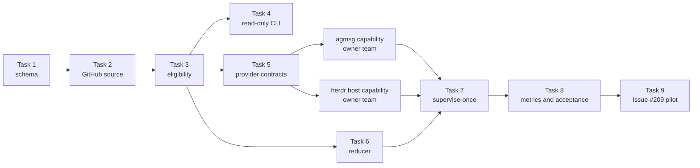

# Goal Loop Implementation Plan

> **For agentic workers:** REQUIRED SUB-SKILL: Use superpowers:subagent-driven-development (recommended) or superpowers:executing-plans to implement this plan task-by-task. Steps use checkbox (`- [ ]`) syntax for tracking.

**Goal:** active Goal に属する eligible な Issue と PR を各席が原子的に claim し、pm が停止しても producer と reviewer が次の作業を取り続ける仕組みを構築する。

**Architecture:** GitHub Issue は Goal と作業意図の正本、agmsg は短命な claim lease と event ledger、herdr は pane と agent session の観測元とする。
scale2sheet は GitHub adapter、eligibility、状態 reducer、provider adapter、計測器を `scripts/goal-loop/` に持ち、agmsg と herdr-agent-monitor の実装は各 owner team が受け入れた capability を介して利用する。

**Tech Stack:** Node.js 22 ESM、GitHub GraphQL API（`gh api graphql`）、Vitest、agmsg Bash CLI、herdr JSON CLI。

## Global Constraints

- 採用方式は hybrid とする。GitHub、agmsg、herdr の責務を一つの store へ統合しない。
- E-1 により、新しい child Issue を goal から分解できる role は innovator と architect に限る。
- S-1 により、seat が無い場合は auto-spawn しない。
- orphan claim は、同じ owner session について pane または session の消失と wake ACK 不能の両方を確認し、二条件が揃った後に grace を満了した場合だけ解放する。
- `decision:pending`、open `blockedBy`、`queue:hold`、非 active Goal の resource は claim しない。
- GitHub、claim provider、herdr のいずれかが読めない場合は fail-closed とし、別の ownership 手段へ fallback しない。
- agmsg と herdr-agent-monitor の repository は変更しない。必要 capability は本書の provider contract として記録し、scale2sheet pm が manager 間で持ち込む。
- T-2 により、五つの閾値は安全側の pilot 値から開始し、24 時間から 7 日の実測で確定する。
- 五つの閾値と `sourceControlIssue` の正本は `scripts/goal-loop/pilot-policy.json` 一件だけとする。CLI、test、host 設定へ値を複製しない。
- `npm run build:bun` を実行しない。本計画の agent 運用 script は product binary に含めない。
- README は変更しない。本件は利用者向け product 操作ではなく agent 運用であり、README の対象外である。
- 各 PR は Claude reviewer の exact-head approve と `npm test` 全通過後に main へ取り込む。
- 赤い試験の全出力を一時 log へ保存し、再実行で上書きしない。

---

## 1. 実装境界

### 1.1 作成するファイル

| Path | 責務 |
| --- | --- |
| `scripts/goal-loop/contracts.mjs` | label、body section、resource key、source version の schema |
| `scripts/goal-loop/github-source.mjs` | GitHub GraphQL の point-read と connection 取得 |
| `scripts/goal-loop/eligibility.mjs` | Issue / PR の eligible 導出、fingerprint、決定順 |
| `scripts/goal-loop/queue-cli.mjs` | `verify-schema`、`snapshot`、`candidates` の read-only CLI |
| `scripts/goal-loop/setup-labels.mjs` | 必要 label の dry-run と明示 `--apply` |
| `scripts/goal-loop/claim-provider.mjs` | agmsg owner team が提供する外部 command の fail-closed adapter |
| `scripts/goal-loop/policy.mjs` | 閾値を必須入力として検証する parser |
| `scripts/goal-loop/pilot-policy.json` | T-2 で採用した pilot 閾値の単一正本 |
| `scripts/goal-loop/reconcile.mjs` | queue、claim、agent、ACK から action を導出する純粋 reducer |
| `scripts/goal-loop/herdr-source.mjs` | `herdr agent list` の JSON を正規化する adapter |
| `scripts/goal-loop/message-sink.mjs` | provider の idempotent notification への wake / report 要求 adapter |
| `scripts/goal-loop/supervise-once.mjs` | 一回分の観測、reconcile、dry-run / apply を束ねる CLI |
| `scripts/goal-loop/metrics.mjs` | claim event と agmsg history の固定窓集計 |
| `test/goal-loop/*.test.ts` | 各 module と N-1 から N-21 の gate |
| `test/fixtures/goal-loop/*` | GitHub、claim、herdr、policy の固定 fixture |
| `docs/superpowers/specs/2026-08-10-goal-loop-provider-contracts.md` | agmsg と herdr-agent-monitor へ渡す capability contract |
| `package.json` | read-only 検査、単発 supervisor、metrics の npm script |

### 1.2 変更しないファイル

- `src/**`：product CLI と pipeline へ agent 運用を混ぜない。
- `dist/**`：production binary を置き換えない。
- `README.md`：product 利用者へ agent 運用を提示しない。
- `~/.agents/skills/agmsg/**`：agmsg owner team の受け入れ前に実装しない。
- herdr-agent-monitor repository：同チームの manager と reviewer を経由する。

### 1.3 依存順



Task 1 から Task 6 と Task 8 の純粋計測部分は、外部 capability の実装前に main へ入れられる。

Task 7 の apply mode と Task 9 は、agmsg と herdr-agent-monitor が provider contract を受け入れるまで有効化しない。

### 1.4 要件 traceability

| Requirement | 実装 Task | 主な gate |
| --- | --- | --- |
| R-1 Goal の共通識別子と合格条件 | 1、2、4 | Goal body schema と point-read |
| R-2 ready の導出 | 3、4 | eligibility truth table |
| R-3 同時 claim 排他 | 5、8 | provider conformance と N-1 |
| R-4 orphan の安全な回収 | 6、7、8 | 二信号 + grace と N-7 / N-8 |
| R-5 作業中の沈黙を再配置しない | 6、8 | `silent-working` と N-5 |
| R-6 blocker と complete の除外 | 3、8 | N-2 / N-3 / N-14 / N-15 |
| R-7 source 不可を 0 件にしない | 2、5、7、8 | point-read、sentinel、N-10 / N-11 / N-12 / N-18 |
| R-8 pm 無しで loop 継続 | 7、8、9 | N-16 live acceptance |
| R-9 正常な短命席を異常にしない | 6、7 | claim の無い `done` / absent seat は orphan count 0 |
| R-10 固定窓で再集計 | 8、9 | JST 半開区間と 24 時間 / 7 日 report |
| R-11 他 team の正本を直接変更しない | 5、9 | provider contract と manager handoff |
| R-12 Goal 0 / 複数を選ばない | 1、2、3、8 | N-19 |

## 2. GitHub metadata contract

### 2.1 Labels

| Label | 意味 |
| --- | --- |
| `goal:active` | open Goal の lifecycle が active |
| `goal:completion-ready` | open Goal の child work が終わり、goal verification 待ち |
| `role:innovator` | innovator が claim できる Issue |
| `role:architect` | architect が claim できる Issue |
| `role:programmer` | programmer が claim できる Issue |
| `role:reviewer` | reviewer が claim できる Issue。通常の review work は PR から導出する |
| `role:worker` | worker が claim できる Issue |
| `decision:pending` | ユーザー決定を待つため ineligible |
| `queue:hold` | 明示 hold のため ineligible |

Goal の complete は GitHub Issue の `CLOSED` で表す。

`goal:active` と `goal:completion-ready` が同じ open Issue に共存した場合は schema violation とする。

### 2.2 Body sections

Goal Issue は次の見出しを一回ずつ持つ。

```markdown
## Outcome
## Acceptance
## Non-goals
## Decision boundary
## Plan
```

Child Issue は次の見出しを一回ずつ持つ。

```markdown
## Outcome
## Acceptance
## Scope
```

空の section、同じ見出しの重複、担当 role label の 0 件または複数件は `needs-triage` とする。

### 2.3 Goal の選択

repository 内の open `goal:active` はちょうど一件とする。

0 件は `goal-absent`、2 件以上は `goal-ambiguous` であり、resource を返さない。

GitHub list query の前に、policy が指定する `sourceControlIssue=209` を number で point-readする。

この既知 Issue を取得できなければ、active Goal が 0 件でも `GOAL_ABSENT` とせず `QUEUE_SOURCE_UNAVAILABLE` とする。

## 3. 外部 provider contract

### 3.1 agmsg に必要な capability

scale2sheet は agmsg の実装を変更しない。

agmsg owner team へ、標準入力一行の JSON を受け、標準出力一行の JSON を返す command capability を依頼する。

```ts
type ResourceRef = {
  team: "scale2sheet";
  repository: "kappaseijin/scale2sheet";
  kind: "issue" | "pull-request";
  number: number;
  sourceVersion: string;
};

type Claim = ResourceRef & {
  agentId: string;
  sessionId: string;
  generation: number;
  token: string;
  claimedAt: string;
  lastEventAt: string;
};
```

必要 operation は次のとおりとする。

| Operation | 入力 | 成功出力 | 失敗 code |
| --- | --- | --- | --- |
| `claim-next` | agent、role、順序付き candidate 配列 | provider が live actas session を解決して取得した一件の `Claim` | `AGENT_SESSION_UNAVAILABLE`、`NO_ELIGIBLE`、`CLAIM_STORE_UNAVAILABLE` |
| `ack` | resource key、token、sourceVersion | append 済み event | `STALE_TOKEN`、`SOURCE_VERSION_MISMATCH` |
| `progress` | resource key、token、summary | append 済み event | `STALE_TOKEN` |
| `invalidate` | resource key、token、old/new sourceVersion、reason | 一世代一回の event | `STALE_TOKEN` |
| `revalidate` | resource key、token、old/new sourceVersion、workPlan | 更新後の `Claim` | `STALE_TOKEN`、`SOURCE_VERSION_MISMATCH` |
| `release` | resource key、token、reason | release event | `STALE_TOKEN` |
| `orphan-release` | resource key、token、paneMissingAt、ackFailedAt、graceSatisfiedAt | release event | `FENCE_INCOMPLETE`、`STALE_TOKEN` |
| `notify-once` | recipient、message、transitionKey、claim generation | `sent` または `already-sent` と event | `RECIPIENT_UNAVAILABLE`、`EVENT_STORE_UNAVAILABLE` |
| `record-observation` | observationKey、source versions、導出 state と counts | append 済み observation event | `EVENT_STORE_UNAVAILABLE` |
| `adjudicate-alert` | alert event id、`true-positive` / `false-positive` / `unclassified`、evidence | append 済み adjudication event | `EVENT_NOT_FOUND`、`EVENT_STORE_UNAVAILABLE` |
| `list-claims` | team、repository | active claim 配列 | `CLAIM_STORE_UNAVAILABLE` |
| `list-events` | team、repository、from、to | append-only event 配列 | `EVENT_STORE_UNAVAILABLE` |

active claim の unique key は `(team, repository, kind, number)` とする。

generation は unique key に含めず、late release を拒否する token の一部にする。

`notify-once` は `(team, repository, transitionKey, claim generation)` を idempotency key とし、同じ通知を agmsg inbox へ二重 insert しない。

delivery と event ledger の原子性は agmsg owner team の provider 内で保証し、scale2sheet が `send.sh` と event 記録を二段階で行わない。

`record-observation` は `observationKey` を一意にし、同じ cycle の再実行で metrics の分母を増やさない。

agmsg command が無い、exit 非 0、JSON が壊れている、schema が違う場合、scale2sheet adapter は `CLAIM_SOURCE_UNAVAILABLE` を返す。

GitHub label または assignee を代替 lock にしない。

### 3.2 herdr-agent-monitor に必要な capability

scale2sheet は `supervise-once` という一回実行可能な reducer entrypoint を提供する。

herdr-agent-monitor owner team へ、次を満たす host capability を依頼する。

- pm agent process とは別の長時間 process から `supervise-once` を定期実行する。
- process 自身の停止を監視 pane へ表示し、停止を正常な work 0 件に畳み込まない。
- stdout の action JSON と stderr の診断を時刻つきで保持する。
- `seat-missing` では通知だけを行い、spawn しない。
- policy path と agmsg provider command path を明示引数で渡す。
- 同じ state transition と claim generation の wake を重複実行しない。

## 4. Policy contract

T-2 で採用した pilot policy を次の一ファイルに置く。

`scripts/goal-loop/pilot-policy.json`:

```json
{
  "sourceControlIssue": 209,
  "wakeAckTimeoutMs": 600000,
  "orphanGraceMs": 1800000,
  "sourceRecheckMs": 300000,
  "actionableStallAfterMs": 1200000,
  "progressReportAfterMs": 3600000
}
```

五値の根拠は、誤って進行中の仕事を取り上げる危険を先に小さくすることである。

PR #193 は純粋な滞留が 4 時間 29 分続いた一方、programmer の無音 50 分と最大 6 時間は実際には作業中だった。

短い無音閾値だけで claim を解放すると、進行中の実装を重複取得する。

したがって 30 分の orphan grace は無音の開始時ではなく、pane または session の消失と wake ACK 不能の両方が確認された後から数える。

`policy.mjs` は正本を既定 path として読む。

`--policy` で別ファイルを渡す場合も部分上書きは行わず、全 field を持つ一ファイルを要求する。

field 欠落、0、負数、小数、未知 field が在る場合は exit `2` と `POLICY_UNSET` または `POLICY_INVALID` を返す。

通知の重複抑止に六つ目の時間値を増やさない。

同じ transition key と claim generation を provider の event ledger で一回だけ受理する構造にする。

orphan grace の起点は `max(paneMissingAt, ackFailedAt)` とする。

どちらか一方しか無い場合は、時間が経過しても release action を生成しない。

---

### Task 1: GitHub metadata schema と body parser

**Files:**
- Create: `scripts/goal-loop/contracts.mjs`
- Create: `test/goal-loop/contracts.test.ts`

**Interfaces:**
- Consumes: GitHub Issue の body、labels、state。
- Produces: `parseGoalIssue(issue)`、`parseWorkIssue(issue)`、`resourceKey(ref)`、`ROLE_LABELS`。

- [ ] **Step 1: schema violation を固定する failing test を書く**

```ts
import { describe, expect, it } from "vitest";
import { parseGoalIssue, parseWorkIssue } from "../../scripts/goal-loop/contracts.mjs";

describe("goal-loop GitHub contract (#209)", () => {
  it("rejects zero or multiple active Goal lifecycle labels", () => {
    expect(parseGoalIssue({ state: "OPEN", labels: [], body: validGoalBody })).toMatchObject({
      ok: false,
      code: "GOAL_LIFECYCLE_INVALID",
    });
    expect(
      parseGoalIssue({
        state: "OPEN",
        labels: ["goal:active", "goal:completion-ready"],
        body: validGoalBody,
      }),
    ).toMatchObject({ ok: false, code: "GOAL_LIFECYCLE_INVALID" });
  });

  it("rejects a work Issue without exactly one role or with an empty Acceptance section", () => {
    expect(parseWorkIssue({ labels: [], body: validWorkBody })).toMatchObject({
      ok: false,
      code: "ROLE_INVALID",
    });
    expect(
      parseWorkIssue({
        labels: ["role:programmer"],
        body: "## Outcome\nship it\n## Acceptance\n\n## Scope\ncode only",
      }),
    ).toMatchObject({ ok: false, code: "SECTION_EMPTY" });
  });
});
```

- [ ] **Step 2: test が module 不在で失敗することを確認する**

Run:

```bash
npx vitest run test/goal-loop/contracts.test.ts > /tmp/issue-209-task1-red.log 2>&1
```

Expected: exit 非 0。`scripts/goal-loop/contracts.mjs` を resolve できない。

- [ ] **Step 3: schema parser を実装する**

```js
export const ROLE_LABELS = Object.freeze([
  "role:innovator",
  "role:architect",
  "role:programmer",
  "role:reviewer",
  "role:worker",
]);

export const GOAL_SECTIONS = Object.freeze([
  "Outcome",
  "Acceptance",
  "Non-goals",
  "Decision boundary",
]);

export const WORK_SECTIONS = Object.freeze(["Outcome", "Acceptance", "Scope"]);

export function readRequiredSections(body, names) {
  const headings = [...body.matchAll(/^## ([^\n]+)$/gm)];
  const values = new Map();
  for (const name of names) {
    const matches = headings.filter((heading) => heading[1] === name);
    if (matches.length !== 1) return { ok: false, code: "SECTION_COUNT", section: name };
    const start = matches[0].index + matches[0][0].length;
    const next = headings.find((heading) => heading.index > matches[0].index);
    const value = body.slice(start, next?.index ?? body.length).trim();
    if (value.length === 0) return { ok: false, code: "SECTION_EMPTY", section: name };
    values.set(name, value);
  }
  return { ok: true, sections: Object.fromEntries(values) };
}
```

`parseGoalIssue` は open Goal の lifecycle label を一件に限定し、closed Goal を `complete` とする。

`parseWorkIssue` は role label を一件に限定し、`decision:pending` と `queue:hold` を boolean として返す。

- [ ] **Step 4: positive と negative の両方を通す**

Run:

```bash
npx vitest run test/goal-loop/contracts.test.ts
```

Expected: `1 file passed`。最低でも正常 Goal、closed Goal、正常 work、role 0、role 2、section 欠落、section 空、section 重複を通す。

- [ ] **Step 5: Task 1 を commit する**

```bash
git add scripts/goal-loop/contracts.mjs test/goal-loop/contracts.test.ts
git commit -m "feat: define goal loop GitHub contract"
```

### Task 2: GitHub GraphQL source と 0 件 control

**Files:**
- Create: `scripts/goal-loop/github-source.mjs`
- Create: `test/goal-loop/github-source.test.ts`
- Create: `test/fixtures/goal-loop/github-source.json`

**Interfaces:**
- Consumes: `runGraphql(query, variables)` と `sourceControlIssue`。
- Produces: `loadQueueSource({ owner, repository, sourceControlIssue, runGraphql })`。

- [ ] **Step 1: 0 件と source 不可を区別する failing test を書く**

```ts
it("does not turn a failed point-read into goal-absent", async () => {
  const result = await loadQueueSource({
    owner: "kappaseijin",
    repository: "scale2sheet",
    sourceControlIssue: 209,
    runGraphql: fakeGraphql({ pointRead: new Error("network down") }),
  });
  expect(result).toEqual({ ok: false, code: "QUEUE_SOURCE_UNAVAILABLE" });
});

it("returns goal-absent only after the known Issue point-read succeeds", async () => {
  const result = await loadQueueSource({
    owner: "kappaseijin",
    repository: "scale2sheet",
    sourceControlIssue: 209,
    runGraphql: fakeGraphql({ pointRead: issue209, activeGoals: [] }),
  });
  expect(result).toMatchObject({ ok: true, goalState: "goal-absent" });
});
```

- [ ] **Step 2: red を保存する**

```bash
npx vitest run test/goal-loop/github-source.test.ts > /tmp/issue-209-task2-red.log 2>&1
```

Expected: `loadQueueSource` が無いため失敗。

- [ ] **Step 3: query field を固定して adapter を実装する**

GraphQL は少なくとも次を取得する。

```graphql
query QueueSource($owner: String!, $repository: String!, $control: Int!) {
  repository(owner: $owner, name: $repository) {
    control: issue(number: $control) { id number state updatedAt }
    issues(first: 100, states: OPEN, labels: ["goal:active"]) {
      nodes {
        id number state title body updatedAt
        labels(first: 100) { nodes { name } pageInfo { hasNextPage } }
        subIssues(first: 100) {
          nodes {
            id number state title body updatedAt
            labels(first: 100) { nodes { name } pageInfo { hasNextPage } }
            blockedBy(first: 100) {
              nodes { id number state updatedAt }
              pageInfo { hasNextPage }
            }
          }
          pageInfo { hasNextPage }
        }
      }
      pageInfo { hasNextPage }
    }
    pullRequests(first: 100, states: OPEN) {
      nodes {
        id number isDraft headRefOid updatedAt
        closingIssuesReferences(first: 100) {
          nodes { id number }
          pageInfo { hasNextPage }
        }
        reviews(first: 100) {
          nodes { state commit { oid } submittedAt }
          pageInfo { hasNextPage }
        }
      }
      pageInfo { hasNextPage }
    }
  }
}
```

任意の `pageInfo.hasNextPage` が true なら、pilot では黙って先頭 100 件だけを使わず `QUEUE_SOURCE_TRUNCATED` で停止する。

pagination を実装する後続 PR までは、この fail-closed が契約である。

- [ ] **Step 4: real query の shape を read-only で確認する**

Run:

```bash
GH_CONFIG_DIR="$HOME/.config/gh-4codex" gh api graphql \
  -f query='query($o:String!,$r:String!,$n:Int!){repository(owner:$o,name:$r){issue(number:$n){id number state parent{number} subIssues(first:1){nodes{number} pageInfo{hasNextPage}} blockedBy(first:1){nodes{number state} pageInfo{hasNextPage}}}}}' \
  -F o=kappaseijin -F r=scale2sheet -F n=209
```

Expected: `data.repository.issue.number=209`。mutation は行わない。

- [ ] **Step 5: adapter test を通す**

```bash
npx vitest run test/goal-loop/github-source.test.ts
```

Expected: point-read failure、active Goal 0、2、truncated connection、正常一件の全 case が pass。

- [ ] **Step 6: Task 2 を commit する**

```bash
git add scripts/goal-loop/github-source.mjs test/goal-loop/github-source.test.ts test/fixtures/goal-loop/github-source.json
git commit -m "feat: load goal queue from GitHub"
```

### Task 3: eligibility、source version、決定順

**Files:**
- Create: `scripts/goal-loop/eligibility.mjs`
- Create: `test/goal-loop/eligibility.test.ts`

**Interfaces:**
- Consumes: Task 1 の parsed Goal / Issue と Task 2 の PR snapshot。
- Produces: `deriveQueue(source, claims)` と `eligibilityFingerprint(input)`。

- [ ] **Step 1: N-2、N-3、N-4、N-9、N-19 の failing test を書く**

```ts
it.each([
  ["decision pending", { decisionPending: true }, "BLOCKED_DECISION"],
  ["open blocker", { blockers: [{ number: 10, state: "OPEN" }] }, "BLOCKED_DEPENDENCY"],
  ["missing section", { contract: { ok: false, code: "SECTION_COUNT" } }, "NEEDS_TRIAGE"],
])("keeps %s out of eligible", (_name, patch, expected) => {
  expect(deriveIssueCandidate({ ...baseIssue, ...patch }, noClaims)).toMatchObject({
    eligible: false,
    reason: expected,
  });
});

it("does not reuse review evidence after a PR head change", () => {
  const result = derivePrCandidate({
    ...basePr,
    headRefOid: "head-b",
    reviews: [{ state: "APPROVED", commitOid: "head-a" }],
  }, noClaims);
  expect(result).toMatchObject({ eligible: true, sourceVersion: "head-b" });
});
```

- [ ] **Step 2: red を保存する**

```bash
npx vitest run test/goal-loop/eligibility.test.ts > /tmp/issue-209-task3-red.log 2>&1
```

Expected: module 不在で失敗。

- [ ] **Step 3: canonical fingerprint を実装する**

```js
import { createHash } from "node:crypto";

export function eligibilityFingerprint(input) {
  const canonical = JSON.stringify({
    issueId: input.issueId,
    state: input.state,
    role: input.role,
    sections: input.sections,
    blockerIds: [...input.blockerIds].sort(),
    decisionPending: input.decisionPending,
    hold: input.hold,
    parentGoalId: input.parentGoalId,
    parentGoalLifecycle: input.parentGoalLifecycle,
  });
  return createHash("sha256").update(canonical).digest("hex");
}
```

comment、assignee、本文の必須 section 外の変更は fingerprint に含めない。

eligibility を変えない編集で active claim を無効化しないためである。

- [ ] **Step 4: deterministic ordering を実装する**

候補の sort key は次の tuple とする。

```js
[
  candidate.kind === "pull-request" && role === "reviewer" ? 0 : 1,
  candidate.priority ?? Number.MAX_SAFE_INTEGER,
  candidate.unblocksCount === 0 ? 1 : 0,
  candidate.eligibleSince,
  candidate.number,
]
```

priority はユーザーが Issue に記録した整数だけを読み、pm の実行時裁量では変更しない。

- [ ] **Step 5: eligibility test を通す**

```bash
npx vitest run test/goal-loop/eligibility.test.ts
```

Expected: N-2、N-3、N-4、N-9、N-13、N-14、N-15、N-19 と ordering が pass。

- [ ] **Step 6: Task 3 を commit する**

```bash
git add scripts/goal-loop/eligibility.mjs test/goal-loop/eligibility.test.ts
git commit -m "feat: derive deterministic goal work eligibility"
```

### Task 4: read-only queue CLI と label bootstrap

**Files:**
- Create: `scripts/goal-loop/queue-cli.mjs`
- Create: `scripts/goal-loop/setup-labels.mjs`
- Create: `test/goal-loop/queue-cli.test.ts`
- Modify: `package.json:10-21`

**Interfaces:**
- Consumes: Task 2 の `loadQueueSource` と Task 3 の `deriveQueue`。
- Produces: `goal-loop:verify`、`goal-loop:snapshot`、`goal-loop:candidates`、`goal-loop:setup-labels`。

- [ ] **Step 1: mutation しない既定動作の failing test を書く**

```ts
it("prints label operations without applying them by default", () => {
  const result = spawnSync("node", ["scripts/goal-loop/setup-labels.mjs"], {
    cwd: projectRoot,
    encoding: "utf8",
    env: { ...process.env, GOAL_LOOP_GH_FIXTURE: labelsFixture },
  });
  expect(result.status).toBe(0);
  expect(JSON.parse(result.stdout)).toMatchObject({ mode: "dry-run", mutationCount: 9 });
  expect(readMutationLog()).toEqual([]);
});

it("fails closed when the queue source cannot be point-read", () => {
  const result = runQueueCli(["snapshot"], unavailableFixtureEnv);
  expect(result.status).toBe(2);
  expect(JSON.parse(result.stdout)).toMatchObject({ code: "QUEUE_SOURCE_UNAVAILABLE" });
});
```

- [ ] **Step 2: red を保存する**

```bash
npx vitest run test/goal-loop/queue-cli.test.ts > /tmp/issue-209-task4-red.log 2>&1
```

- [ ] **Step 3: JSON-only CLI を実装する**

`queue-cli.mjs` は人間向け装飾を stdout へ混ぜず、次の envelope を一行で返す。

```ts
type QueueCliResult =
  | { ok: true; command: string; goal: object; candidates: object[]; diagnostics: object[] }
  | { ok: false; command: string; code: string; diagnostics: object[] };
```

`verify-schema` は Goal と全 child Issue の schema だけを検査する。

`snapshot` は source と分類結果を返す。

`candidates --role <role>` は eligible candidate だけを決定順で返すが、claim は行わない。

- [ ] **Step 4: label bootstrap を実装する**

`setup-labels.mjs` は dry-run を既定とし、`--apply` が在る場合だけ次を実行する。

```bash
gh label create 'goal:active' --color 0e8a16 --description 'Active team Goal' --force
gh label create 'goal:completion-ready' --color fbca04 --description 'Goal verification pending' --force
gh label create 'decision:pending' --color b60205 --description 'Waiting for user decision' --force
gh label create 'queue:hold' --color c5def5 --description 'Excluded from self-claim' --force
```

role label 五件も同じ方式で作る。

stdout には label ごとの `create` / `update` / `unchanged` を出す。

- [ ] **Step 5: package script を追加する**

```json
{
  "goal-loop:verify": "node scripts/goal-loop/queue-cli.mjs verify-schema",
  "goal-loop:snapshot": "node scripts/goal-loop/queue-cli.mjs snapshot",
  "goal-loop:candidates": "node scripts/goal-loop/queue-cli.mjs candidates",
  "goal-loop:setup-labels": "node scripts/goal-loop/setup-labels.mjs"
}
```

- [ ] **Step 6: CLI test と全 test を通す**

```bash
npx vitest run test/goal-loop/queue-cli.test.ts
npm test > /tmp/issue-209-task4-green.log 2>&1
```

Expected: targeted test pass。`npm test` は全 file pass。

- [ ] **Step 7: Task 4 を commit する**

```bash
git add scripts/goal-loop/queue-cli.mjs scripts/goal-loop/setup-labels.mjs test/goal-loop/queue-cli.test.ts package.json
git commit -m "feat: expose read-only goal queue CLI"
```

### Task 5: provider contract 文書と agmsg fail-closed adapter

**Files:**
- Create: `docs/superpowers/specs/2026-08-10-goal-loop-provider-contracts.md`
- Create: `scripts/goal-loop/claim-provider.mjs`
- Create: `test/goal-loop/claim-provider.test.ts`
- Create: `test/fixtures/goal-loop/fake-claim-provider.mjs`

**Interfaces:**
- Consumes: `providerCommand` と §3.1 の JSON operation。
- Produces: `createClaimProvider({ command, spawn })`。

- [ ] **Step 1: provider 不在と壊れた応答の failing test を書く**

```ts
it.each([
  ["missing command", { status: null, error: { code: "ENOENT" } }],
  ["nonzero exit", { status: 3, stdout: "", stderr: "db locked" }],
  ["invalid JSON", { status: 0, stdout: "not json" }],
])("fails closed for %s", async (_name, spawnResult) => {
  const provider = createClaimProvider({
    command: "/missing/work-claim",
    spawn: () => spawnResult,
  });
  await expect(provider.listClaims(baseRequest)).resolves.toEqual({
    ok: false,
    code: "CLAIM_SOURCE_UNAVAILABLE",
  });
});
```

fallback 用の GitHub mutation が呼ばれていないことも assertion に含める。

- [ ] **Step 2: red を保存する**

```bash
npx vitest run test/goal-loop/claim-provider.test.ts > /tmp/issue-209-task5-red.log 2>&1
```

- [ ] **Step 3: provider contract 文書を作る**

文書は OKF frontmatter を持ち、次を §3.1 と同じ field 名で固定する。

- operation 一覧。
- resource unique key。
- agent id と live session id の結び方は agmsg owner team が保持すること。
- generation を unique key に含めないこと。
- `orphan-release` の二信号と grace evidence。
- append-only event の RFC3339 timestamp。
- command 不可時に scale2sheet が fallback しないこと。
- 同時 claim、late release、store down の conformance fixture。

agmsg 内部の path、table 名、実装言語は指定しない。

- [ ] **Step 4: adapter を実装する**

```js
export function createClaimProvider({ command, spawn }) {
  function call(operation, payload) {
    const result = spawn(command, [], {
      input: `${JSON.stringify({ operation, ...payload })}\n`,
      encoding: "utf8",
    });
    if (result.status !== 0) return { ok: false, code: "CLAIM_SOURCE_UNAVAILABLE" };
    try {
      return validateProviderResponse(JSON.parse(result.stdout));
    } catch {
      return { ok: false, code: "CLAIM_SOURCE_UNAVAILABLE" };
    }
  }
  return {
    claimNext: (payload) => call("claim-next", payload),
    ack: (payload) => call("ack", payload),
    progress: (payload) => call("progress", payload),
    listClaims: (payload) => call("list-claims", payload),
    listEvents: (payload) => call("list-events", payload),
    invalidate: (payload) => call("invalidate", payload),
    revalidate: (payload) => call("revalidate", payload),
    release: (payload) => call("release", payload),
    orphanRelease: (payload) => call("orphan-release", payload),
    notifyOnce: (payload) => call("notify-once", payload),
    recordObservation: (payload) => call("record-observation", payload),
    adjudicateAlert: (payload) => call("adjudicate-alert", payload),
  };
}
```

provider command の default path は持たせない。

CLI または host が明示引数で渡す。

- [ ] **Step 5: fake provider で正負を通す**

```bash
npx vitest run test/goal-loop/claim-provider.test.ts
```

Expected: success envelope、ENOENT、非 0、invalid JSON、schema mismatch、stale token が pass。

- [ ] **Step 6: Task 5 を commit する**

```bash
git add docs/superpowers/specs/2026-08-10-goal-loop-provider-contracts.md scripts/goal-loop/claim-provider.mjs test/goal-loop/claim-provider.test.ts test/fixtures/goal-loop/fake-claim-provider.mjs
git commit -m "feat: add goal claim provider adapter"
```

Task 5 merge 後、pm はこの spec を agmsg と herdr-agent-monitor の manager へ送る。

scale2sheet の programmer は両 team の実装 branch を直接操作しない。

### Task 6: policy parser と状態 reducer

**Files:**
- Create: `scripts/goal-loop/policy.mjs`
- Create: `scripts/goal-loop/pilot-policy.json`
- Create: `scripts/goal-loop/reconcile.mjs`
- Create: `test/goal-loop/policy.test.ts`
- Create: `test/goal-loop/reconcile.test.ts`

**Interfaces:**
- Consumes: queue snapshot、active claims、agent snapshots、ACK state、policy、`now`。
- Produces: `parsePolicy(value)` と `reconcileGoalLoop(input)` の action 配列。

- [ ] **Step 1: pilot policy の単一正本と fail-closed parser の failing test を書く**

```ts
import pilotPolicy from "../../scripts/goal-loop/pilot-policy.json" with { type: "json" };

it.each([
  [{}, "POLICY_UNSET"],
  [{ ...pilotPolicy, orphanGraceMs: 0 }, "POLICY_INVALID"],
  [{ ...pilotPolicy, unknown: 10 }, "POLICY_INVALID"],
])("rejects incomplete or ambiguous policy", (input, code) => {
  expect(parsePolicy(input)).toMatchObject({ ok: false, code });
});

it("loads the committed pilot policy without a second value fixture", () => {
  expect(parsePolicy(pilotPolicy)).toMatchObject({ ok: true, value: pilotPolicy });
});
```

test は正本 JSON を読み、異常系は memory 上の copy を変異させる。

同じ五値を持つ test fixture は作らない。

- [ ] **Step 2: S-1 と invalidation の failing test を書く**

```ts
it("does not release when only pane disappearance is known", () => {
  const actions = reconcileGoalLoop({
    ...baseInput,
    claims: [claim],
    agents: [],
    ack: { failedAt: null },
    now: "2026-08-10T18:30:00+09:00",
  });
  expect(actions).not.toContainEqual(expect.objectContaining({ type: "orphan-release" }));
});

it("starts grace after both pane loss and ACK failure are known", () => {
  const before = reconcileGoalLoop(orphanInput({ elapsedAfterBoth: policy.orphanGraceMs - 1 }));
  const after = reconcileGoalLoop(orphanInput({ elapsedAfterBoth: policy.orphanGraceMs }));
  expect(before).not.toContainEqual(expect.objectContaining({ type: "orphan-release" }));
  expect(after).toContainEqual(expect.objectContaining({
    type: "orphan-release",
    resourceKey: claim.resourceKey,
    token: claim.token,
  }));
});
```

- [ ] **Step 3: red を保存する**

```bash
npx vitest run test/goal-loop/policy.test.ts test/goal-loop/reconcile.test.ts > /tmp/issue-209-task6-red.log 2>&1
```

- [ ] **Step 4: action union を実装する**

```ts
type GoalLoopAction =
  | { type: "wake"; agentId: string; role: string; transitionKey: string }
  | { type: "request-progress"; agentId: string; claimToken: string; transitionKey: string }
  | { type: "invalidate"; claimToken: string; oldVersion: string; newVersion: string; reason: string }
  | { type: "orphan-release"; claimToken: string; paneMissingAt: string; ackFailedAt: string; graceSatisfiedAt: string }
  | { type: "seat-missing"; role: string; transitionKey: string }
  | { type: "needs-decomposition"; goalNumber: number; allowedRoles: ["innovator", "architect"] }
  | { type: "blocked-decision"; goalNumber: number }
  | { type: "completion-ready"; goalNumber: number }
  | { type: "source-unavailable"; source: "github" | "claim" | "herdr" };
```

`reconcileGoalLoop` は副作用を行わず、同じ input と `now` に同じ action を返す。

`transitionKey` は state、resource key、claim generation、source version から作る。

- [ ] **Step 5: N-5 から N-8、N-12 から N-17、N-20、N-21 を通す**

```bash
npx vitest run test/goal-loop/policy.test.ts test/goal-loop/reconcile.test.ts
```

Expected:

- `silent-working` は progress 要求だけで release しない。
- `owned-idle` は resume wake だけで release しない。
- pane 消失と ACK 不能の片方だけでは release しない。
- herdr `unknown` は orphan にしない。
- `decision:pending` 追加は `invalidate` を一回だけ返す。
- acceptance 変更後の古い source version では publish 許可を返さない。
- seat absent は `seat-missing` であり spawn action を返さない。

- [ ] **Step 6: Task 6 を commit する**

```bash
git add scripts/goal-loop/policy.mjs scripts/goal-loop/pilot-policy.json scripts/goal-loop/reconcile.mjs test/goal-loop/policy.test.ts test/goal-loop/reconcile.test.ts
git commit -m "feat: reduce goal queue and liveness states"
```

### Task 7: self-claim CLI と一回実行 supervisor

**Files:**
- Create: `scripts/goal-loop/work-cli.mjs`
- Create: `scripts/goal-loop/herdr-source.mjs`
- Create: `scripts/goal-loop/message-sink.mjs`
- Create: `scripts/goal-loop/supervise-once.mjs`
- Create: `test/goal-loop/work-cli.test.ts`
- Create: `test/goal-loop/herdr-source.test.ts`
- Create: `test/goal-loop/supervise-once.test.ts`
- Create: `test/fixtures/goal-loop/herdr-agents.json`
- Modify: `package.json:10-21`

**Interfaces:**
- Consumes: Task 4 の candidate、Task 5 の claim provider、Task 6 の reducer、`herdr agent list`。
- Produces: agent の `next / guard / progress / release` CLI と host の `supervise-once` CLI。

**Entry Gate:** agmsg owner team が §3.1 と互換の provider command を提供し、pm が command path と version を Issue #209 へ記録するまで、この Task の live provider test と apply mode を開始しない。

- [ ] **Step 1: claim 直後の窓と pre-side-effect gate の failing test を書く**

```ts
it("invalidates a claim when the source changes between claim and ACK", async () => {
  const result = await runWorkCli(["next", "--agent", "scale2sheet_programmer_codex", "--role", "programmer"], {
    queueReads: [snapshot("version-a"), snapshot("version-b")],
    provider: fakeProvider.claiming("version-a"),
  });
  expect(result.status).toBe(3);
  expect(result.events).toContainEqual(expect.objectContaining({
    operation: "invalidate",
    oldSourceVersion: "version-a",
    newSourceVersion: "version-b",
  }));
  expect(result.events).not.toContainEqual(expect.objectContaining({ operation: "ack" }));
});

it("blocks guard when acceptance changed after work started", async () => {
  const result = await runWorkCli(["guard", "--agent", "scale2sheet_programmer_codex", "--token", "t1"], {
    currentVersion: "version-b",
    claimedVersion: "version-a",
  });
  expect(result.status).toBe(3);
  expect(result.stdout).toContain('"code":"CLAIM_INVALIDATED"');
});
```

- [ ] **Step 2: herdr の `unknown` と absent を分ける failing test を書く**

```ts
it("keeps an unknown owner distinct from an absent owner", () => {
  const agents = parseHerdrAgents(readFixture("herdr-agents.json"));
  expect(agents.byId.unknown_owner).toMatchObject({ presence: "unknown" });
  expect(agents.byId.missing_owner).toBeUndefined();
});
```

- [ ] **Step 3: red を保存する**

```bash
npx vitest run test/goal-loop/work-cli.test.ts test/goal-loop/herdr-source.test.ts test/goal-loop/supervise-once.test.ts > /tmp/issue-209-task7-red.log 2>&1
```

- [ ] **Step 4: `work-cli.mjs` を実装する**

Command contract は次のとおりとする。

```text
next     --agent <registered-agent-id> --role <role> --provider <absolute-command>
guard    --agent <registered-agent-id> --token <claim-token> --provider <absolute-command>
progress --agent <registered-agent-id> --token <claim-token> --summary <text> --provider <absolute-command>
release  --agent <registered-agent-id> --token <claim-token> --reason <done|abandon|blocked> --provider <absolute-command>
```

`next` は candidate を読み、provider の `claim-next` 後に同じ resource を point-read する。

source version 一致時だけ `ack` し、Issue / PR URL と claim token を返す。

不一致時は `invalidate` を記録し exit `3` とする。

`guard` は push、review-ready、done の直前に呼ぶ。

一致は exit `0`、不一致は `invalidate` と exit `3`、source 不可は exit `2` とする。

agent が `--session` を自己申告しないようにする。

provider は live actas owner から session id を解決し、Claim 応答に入れる。

- [ ] **Step 5: `herdr-source.mjs` と `message-sink.mjs` を実装する**

`herdr-source.mjs` は `herdr agent list` の `result.agents` だけを読み、次へ正規化する。

```ts
type AgentSnapshot = {
  agentId: string;
  sessionId: string | null;
  status: "working" | "idle" | "blocked" | "done" | "unknown";
  paneId: string | null;
  observedAt: string;
};
```

`message-sink.mjs` は provider の `notify-once` だけを呼び、scale2sheet から `send.sh` と event 記録を別々に実行しない。

provider は recipient が live actas identity と一致しない場合を delivery failure とし、送信できたふりをしない。

- [ ] **Step 6: `supervise-once.mjs` を実装する**

```text
node scripts/goal-loop/supervise-once.mjs \
  --provider <absolute-command> \
  [--policy <absolute-json-path>] \
  [--apply]
```

既定は dry-run であり、action JSON を出すだけとする。

`--policy` 省略時は `scripts/goal-loop/pilot-policy.json` を読む。

指定時は正本と部分 merge せず、指定ファイルだけを `policy.mjs` で検証する。

`--apply` は policy 全 field、GitHub point-read、claim provider、herdr source、message sink の preflight がすべて成功した後にだけ action を実行する。

preflight 後に一つでも source が失敗した場合、その cycle は action 0 件で失敗させる。

source control が成功した cycle は、action が 0 件でも provider の `record-observation` へ source version と導出 state を記録する。

この observation stream を、発火しなかった alert の検出率を計る分母にする。

- [ ] **Step 7: package script を追加する**

```json
{
  "goal-loop:next": "node scripts/goal-loop/work-cli.mjs next",
  "goal-loop:guard": "node scripts/goal-loop/work-cli.mjs guard",
  "goal-loop:supervise-once": "node scripts/goal-loop/supervise-once.mjs"
}
```

- [ ] **Step 8: targeted test と全 test を通す**

```bash
npx vitest run test/goal-loop/work-cli.test.ts test/goal-loop/herdr-source.test.ts test/goal-loop/supervise-once.test.ts
npm test > /tmp/issue-209-task7-green.log 2>&1
```

Expected: N-10、N-11、N-12、N-17、N-20、N-21 が CLI boundary でも pass。全 test pass。

- [ ] **Step 9: Task 7 を commit する**

```bash
git add scripts/goal-loop/work-cli.mjs scripts/goal-loop/herdr-source.mjs scripts/goal-loop/message-sink.mjs scripts/goal-loop/supervise-once.mjs test/goal-loop/work-cli.test.ts test/goal-loop/herdr-source.test.ts test/goal-loop/supervise-once.test.ts test/fixtures/goal-loop/herdr-agents.json package.json
git commit -m "feat: connect goal claims to agent supervision"
```

### Task 8: metrics と N-1 から N-21 の acceptance ledger

**Files:**
- Create: `scripts/goal-loop/metrics.mjs`
- Create: `scripts/goal-loop/run-acceptance.mjs`
- Create: `test/goal-loop/metrics.test.ts`
- Create: `test/goal-loop/acceptance-ledger.test.ts`
- Create: `docs/GOAL_LOOP_ACCEPTANCE_REPORT.md`
- Modify: `package.json:10-21`

**Interfaces:**
- Consumes: provider `list-events`、agmsg `history.sh`、固定 RFC3339 区間、N-1 から N-21 の実行結果。
- Produces: fixed-window metrics JSON と acceptance ledger gate。

- [ ] **Step 1: 0 event control と固定窓の failing test を書く**

```ts
it("refuses to report zero events when the sentinel event is not visible", () => {
  expect(measureGoalLoop({ events: [], sentinelEventId: "pilot-start", window })).toEqual({
    ok: false,
    code: "EVENT_SOURCE_UNAVAILABLE",
  });
});

it("uses a half-open JST window", () => {
  const result = measureGoalLoop({
    events: eventsAtWindowEdges,
    sentinelEventId: "pilot-start",
    window: {
      from: "2026-08-11T00:00:00+09:00",
      to: "2026-08-12T00:00:00+09:00",
    },
  });
  expect(result.countedEventIds).toEqual(["at-from", "before-to"]);
});

it("does not call zero alerts safe when a known stall exceeded the threshold", () => {
  const result = measureGoalLoop({
    events: [pilotStart, knownStallWithoutAlert],
    sentinelEventId: "pilot-start",
    window,
  });
  expect(result.stallAlerts).toMatchObject({
    fired: 0,
    knownStalls: 1,
    detectedKnownStalls: 0,
    detectionRate: 0,
    falsePositiveRatio: null,
  });
});
```

- [ ] **Step 2: ledger の欠落と偽の KILLED を落とす failing test を書く**

```ts
it("requires exactly N-1 through N-21", () => {
  const report = parseAcceptanceReport(readReportWithout("N-16"));
  expect(validateAcceptanceReport(report)).toContain("missing N-16");
});

it("does not count provider startup failure as KILLED", () => {
  const report = parseAcceptanceReport(reportWith("N-1", "PROVIDER-UNAVAILABLE"));
  expect(validateAcceptanceReport(report)).toContain("N-1 has no mutation result");
});
```

- [ ] **Step 3: red を保存する**

```bash
npx vitest run test/goal-loop/metrics.test.ts test/goal-loop/acceptance-ledger.test.ts > /tmp/issue-209-task8-red.log 2>&1
```

- [ ] **Step 4: metrics を実装する**

出力は少なくとも次を持つ。

```ts
type GoalLoopMetrics = {
  window: { from: string; to: string; timezone: "Asia/Tokyo" };
  sourceControls: { github: "PASS"; claimEvents: "PASS"; agmsgHistory: "PASS" };
  actionableStallCount: number;
  actionableStallSeconds: number;
  readyToClaimMs: { count: number; p50: number | null; p95: number | null; max: number | null };
  prReadyToReviewClaimMs: { count: number; p50: number | null; p95: number | null; max: number | null };
  orphanToReclaimMs: { count: number; p50: number | null; p95: number | null; max: number | null };
  duplicateClaimCount: number;
  blockedClaimCount: number;
  staleVersionPublishCount: number;
  decompositionSignalLatencyMs: { count: number; max: number | null };
  pmEndpoint: { total: number; pmEndpoint: number; direct: number; ratio: number | null };
  stallAlerts: {
    fired: number;
    truePositive: number;
    falsePositive: number;
    unclassified: number;
    falsePositiveRatio: number | null;
    knownStalls: number;
    detectedKnownStalls: number;
    detectionRate: number | null;
  };
};
```

標本 0 件の percentile は `0` でなく `null` とする。

alert の正誤は operator が event id に `true-positive`、`false-positive`、`unclassified` のいずれかを追記した adjudication event から数える。

未判定を true positive へ寄せず、分母にも表示する。

追記は `goal-loop:metrics --adjudicate <alert-event-id> --outcome <outcome> --evidence <issue-or-event-url>` から provider の `adjudicate-alert` を呼ぶ。

元の alert event と同じ provider ledger に残し、集計時だけ別の手書きファイルを読まない。

`falsePositiveRatio` は判定済み alert が 0 件なら `null`、`detectionRate` は既知の stall が 0 件なら `null` とする。

発火 0 件は安全の証拠ではない。

同じ固定窓で policy 閾値を超えた既知 stall の件数と、alert に捕捉された件数を照合する。

agmsg history は第 3 引数を十分大きくして取得し、各 header の timestamp、from、toだけを集計する。

message body の行数を message 件数に数えない。

- [ ] **Step 5: acceptance runner と ledger を実装する**

`run-acceptance.mjs` は一件ずつ mutation を実行し、次の三値だけを書く。

```text
KILLED
KILLED-BY-TSC
SURVIVED
```

`KILLED-BY-TSC` は TypeScript の mutation に対して `tsc` が behavior probe より先に失敗した場合だけ使う。

`.mjs`、JSON、GitHub fixture の mutation には適用しない。

provider 不在、GitHub source 不可、timeout、runner 起動失敗は mutation result に数えず、ledger 全体を失敗させる。

`docs/GOAL_LOOP_ACCEPTANCE_REPORT.md` は OKF frontmatter の `type: VerificationReport`、固定窓、main SHA、provider version、各 mutation の command / exit / result を持つ。

N-16 は pm process を起動せず、programmer session と reviewer session だけを test fixture として provider へ登録する。

Issue claim、PR review claim、release 後の次 claim が続いた場合だけ KILLED とする。

- [ ] **Step 6: package script を追加する**

```json
{
  "goal-loop:metrics": "node scripts/goal-loop/metrics.mjs",
  "acceptance:goal-loop": "node scripts/goal-loop/run-acceptance.mjs"
}
```

- [ ] **Step 7: negative control で test 自体を検証する**

Run:

```bash
npx vitest run test/goal-loop/metrics.test.ts test/goal-loop/acceptance-ledger.test.ts
```

Mutation:

```js
// test copy only: remove N-16 from REQUIRED_CONTROLS
const REQUIRED_CONTROLS = ["N-1", "N-2"];
```

Expected: acceptance ledger test が `missing N-3` 以降を報告して失敗する。

元へ戻して再実行し、pass を確認する。

- [ ] **Step 8: Task 8 を commit する**

```bash
git add scripts/goal-loop/metrics.mjs scripts/goal-loop/run-acceptance.mjs test/goal-loop/metrics.test.ts test/goal-loop/acceptance-ledger.test.ts docs/GOAL_LOOP_ACCEPTANCE_REPORT.md package.json
git commit -m "test: measure autonomous goal loop behavior"
```

#### N-1 から N-21 の実行台帳

| Control | Primary gate | 必須 mode |
| --- | --- | --- |
| N-1 | Task 5 provider conformance + Task 8 runner | live provider |
| N-2 | Task 3 eligibility | unit fixture |
| N-3 | Task 3 eligibility | unit fixture |
| N-4 | Task 1 body parser + Task 3 eligibility | unit fixture |
| N-5 | Task 6 reducer | unit fixture |
| N-6 | Task 6 reducer | unit fixture |
| N-7 | Task 6 reducer + Task 8 runner | live provider / herdr fixture |
| N-8 | Task 6 reducer + Task 8 runner | live provider / ACK failure fixture |
| N-9 | Task 3 fingerprint + Task 7 guard | adapter fixture |
| N-10 | Task 2 point-read + Task 7 supervisor | adapter fixture |
| N-11 | Task 5 adapter + Task 7 supervisor | live provider failure |
| N-12 | Task 7 herdr adapter | adapter fixture |
| N-13 | Task 3 derivation + Task 6 reducer | unit fixture |
| N-14 | Task 3 derivation + Task 6 reducer | unit fixture |
| N-15 | Task 3 derivation + Task 6 reducer | unit fixture |
| N-16 | Task 8 acceptance runner | live provider、pm process 無し |
| N-17 | Task 6 reducer + Task 7 supervisor | adapter fixture |
| N-18 | Task 8 metrics sentinel | unit fixture + live event source |
| N-19 | Task 1 Goal schema + Task 3 selector | unit fixture |
| N-20 | Task 3 fingerprint + Task 6 invalidation + Task 7 guard | adapter fixture |
| N-21 | Task 3 fingerprint + Task 6 revalidation + Task 7 guard | adapter fixture |

`run-acceptance.mjs` はこの表を machine-readable な `REQUIRED_CONTROLS` へ写し、report 側との双方向照合で欠落と余分をどちらも失敗させる。

### Task 9: Issue #209 を使った pilot と運用接続

**Files:**
- Modify: GitHub Issue #209 body、labels、subIssues（repository file ではない）
- Modify: scale2sheet 各 role の project-specific `AGENT.md`（pilot 成立後だけ）
- Modify: `docs/GOAL_LOOP_ACCEPTANCE_REPORT.md`

**Interfaces:**
- Consumes: Task 1 から Task 8、agmsg provider、herdr host、ユーザー決定済み policy。
- Produces: active Goal #209 で動く self-claim loop と 24 時間、7 日の測定結果。

**Entry Gate:** provider contract の owner-team approve、herdr host の owner-team approve、Task 1 から Task 8 の exact-head approve がすべて必要。

- [ ] **Step 1: main と外部 capability の provenance を固定する**

```bash
git pull --ff-only origin main
git rev-parse HEAD
git ls-remote origin refs/heads/main
<agmsg-provider-command> --version
herdr --version
```

Expected: local main と remote main が一致し、provider と herdr の version を Issue #209 の pilot コメントへ記録できる。

- [ ] **Step 2: label bootstrap を dry-run してから apply する**

```bash
npm run goal-loop:setup-labels
npm run goal-loop:setup-labels -- --apply
```

Expected: dry-run と apply の operation 集合が一致し、再度 dry-run すると mutation 0 件。

- [ ] **Step 3: #209 を Goal schema へ移行する**

Issue #209 に `goal:active` を一件だけ付け、body に Outcome、Acceptance、Non-goals、Decision boundary を一回ずつ置く。

既存の依頼と実測は削除せず、必須 section の後ろへ `## Investigation record` として保持する。

- [ ] **Step 4: remaining implementation work を child Issue へ分解する**

innovator または architect が、未完了 Task 一件につき child Issue 一件を作る。

各 child は Outcome、Acceptance、Scope と role label 一件を持つ。

user decision または外部 capability 待ちは `decision:pending` または `blockedBy` で表し、queue から除外されることを `goal-loop:candidates` で確認する。

- [ ] **Step 5: read-only cycle を最低三回実行する**

```bash
npm run goal-loop:verify -- --goal 209
npm run goal-loop:snapshot -- --goal 209
npm run goal-loop:supervise-once -- --provider <provider-command>
```

Expected: 三回とも同じ source state なら同じ transition key を返す。dry-run なので claim、wake、release は 0 件。

- [ ] **Step 6: real provider で N-1 から N-21 を実行する**

```bash
npm run acceptance:goal-loop -- --goal 209 --provider <provider-command>
```

Expected: `docs/GOAL_LOOP_ACCEPTANCE_REPORT.md` に N-1 から N-21 が一件ずつ在り、SURVIVED 0 件。

N-16 は pm process を停止した条件で実行する。

- [ ] **Step 7: herdr host の apply mode を一 Goal に限定して有効化する**

host 設定は repository、Goal #209、正本 `scripts/goal-loop/pilot-policy.json` の絶対 path、provider command、supervisor command を明示する。

Goal を省略した全 repository scan は pilot で有効化しない。

- [ ] **Step 8: role protocol を project-specific AGENT.md へ反映する**

各 role へ次を同じ語で追加する。

```markdown
- `goal-work-available` を受けたら、登録 agent id と role で `goal-loop:next` を実行する。
- claim 後は token を progress、guard、release に引き継ぐ。
- push、review-ready、done の直前に `goal-loop:guard` を通す。
- release 後は pm の次の指示を待たず、`goal-loop:next` をもう一度実行する。
- `needs-decomposition` から child Issue を作れるのは innovator と architect だけである。
```

一 role だけ更新して pilot を始めない。

- [ ] **Step 9: 24 時間と 7 日を固定窓で測る**

```bash
npm run goal-loop:metrics -- --from <JST-RFC3339> --to <JST-RFC3339> --provider <provider-command>
```

結果には query、limit、source control、分母、開始、終了を含める。

alert は発火件数だけでなく、true positive、false positive、unclassified、false-positive ratio、既知 stall の検出率を含める。

発火 0 件かつ既知 stall 0 件の窓は「安全」と判定せず、観測不足として次の窓まで保留する。

user wait nudge count は pm の `ctx` event export から別に記録し、Claude reviewer が再現していない値であることを明記する。

- [ ] **Step 10: pilot の終了判定をユーザーへ提示する**

次を同時に提示する。

- user wait nudge count。
- actionable stall count / seconds。
- ready-to-claim と PR-ready-to-review-claim。
- duplicate claim、blocked claim、stale-version publish（目標 0）。
- N-1 から N-21 の三値。
- pm を停止した N-16 の raw event sequence。
- 24 時間と 7 日で変化した値と、変化しなかった値。
- 五つの pilot 閾値を維持、縮小、延長する根拠となる alert 検出率と誤検出率。

全チームへの展開は、scale2sheet pilot の採否と別のユーザー判断にする。

---

## 5. PR sequence

| PR | Task | main へ入る状態 | 外部 capability |
| --- | --- | --- | --- |
| A | 1 | schema parser と unit gate | 不要 |
| B | 2 | GitHub read adapter と point-read control | 不要 |
| C | 3 | eligibility と fingerprint | 不要 |
| D | 4 | read-only CLI と label dry-run | 不要 |
| E | 5 | provider contract と fail-closed adapter | 実装は不要 |
| F | 6 | policy と純粋 reducer | 不要 |
| G | 7 | self-claim と supervise-once | agmsg provider が必要 |
| H | 8 | metrics と acceptance ledger | live conformance には provider が必要 |
| pilot | 9 | GitHub metadata と agent 運用 | agmsg と herdr が必要 |

各 PR は前の PR を base に積まず、直前までの main から branch を切る。

外部 capability 待ちで G 以降が止まっても、A から F を未実装 capability が在るように見せない。

## 6. Self-review checklist

- [ ] R-1 から R-12 の各要件に Task と test が一件以上在る。
- [ ] N-1 から N-21 の各 control が unit、adapter、live acceptance のどこで実行されるか一意である。
- [ ] `ready` という保存 label を作っていない。
- [ ] active claim の unique key に generation が入っていない。
- [ ] Issue fingerprint が comment と assignee の変更だけで変わらない。
- [ ] PR source version が exact head SHA である。
- [ ] GitHub、claim、herdr の source unavailable を work 0 件に変換していない。
- [ ] pane/session 消失、ACK 不能、grace の三条件を一件ずつ変異できる。
- [ ] Invalidated claim を自動 release していない。
- [ ] seat absent から spawn action を生成していない。
- [ ] pm process 無しの N-16 を live acceptance に含めている。
- [ ] 0 events の metrics に sentinel event control が在る。
- [ ] README、`src/`、`dist/` を変更対象にしていない。
- [ ] agmsg と herdr-agent-monitor の実装を scale2sheet の Task にしていない。
- [ ] placeholder scan が 0 件である。
- [ ] 全 type 名、operation 名、field 名が §2、§3 と Task で一致する。

## 7. Completion evidence

次を揃えるまで Issue #209 を complete にしない。

- Goal #209 と child Issue を全席が同じ GitHub state として読める。
- 同時 claim で一席だけが成功する raw provider event。
- provider down で fallback claim が 0 件である証拠。
- pane/session 消失と ACK 不能の片方だけでは release が 0 件である証拠。
- 二条件が揃った後も grace 満了前は release 0 件、満了後は一回だけである証拠。
- source version 変更後、古い token の push / done が guard で止まる証拠。
- pm process 無しに Issue claim、PR review claim、次 claim が続く N-16 の event sequence。
- N-1 から N-21 の KILLED / KILLED-BY-TSC / SURVIVED ledger。
- 24 時間と 7 日の fixed-window metrics。
- user wait nudge、actionable stall、duplicate claim、blocked claim、stale-version publish の提示。

「script が在る」「一回緑だった」は完了証拠に数えない。
