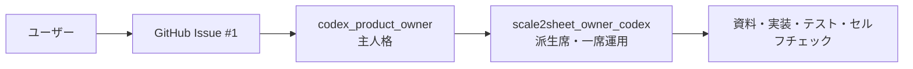

# Issue #1 パイロット運用方針の反映計画

## 目的の妥当性

Issue #1 は、製品機能ではなく開発の運用境界を一つに固定する課題である。
scale2sheet4go は Go ポートを受け入れテスト全件成功まで進めるパイロットであり、通常は一つのエージェントが自律的に進める。
この前提を資料とエージェント定義へ固定することは、Issue #2 の実装担当・課題分割・レビュー経路を決める前提になるため、プロジェクト全体に対して妥当である。

一方、Go への製品移植そのものは別目的である。
そのため、製品コード・受け入れハーネス・Go 仕様は Issue #2 とその PR に分離し、この Issue #1 へ混ぜない。

## 外部解決手段の調査

同等の仕組みを本リポジトリへ新設せず、次の既存機能を利用する。

| 目的 | 利用する外部機能 | 適用理由 |
| --- | --- | --- |
| エージェントの参加・役割宣言 | `~/.agents/skills/agmsg/scripts/join.sh` / `actas-claim.sh` | チーム登録とセッション排他を既に提供している |
| 受信・連絡 | agmsg の `inbox.sh` / `send.sh` | チーム内の配送経路を再実装しない |
| 課題と変更の追跡 | GitHub Issue / PR | Issue と PR の一対一をリポジトリ側で確認できる |
| 作業と検査 | 派生席のローカル検査（`python3 scripts/check-doc-refs.py`、`git diff --check`、対象言語のテスト） | 対向 LLM エージェントを配置せず、実測可能な検査を同じ席で完結する |

調査結果として、追加の daemon・DB・リポジトリ内エージェント管理コードは不要と判断した。

## 採用する構成

- 主人格は `codex_product_owner` とし、モデル `gpt-5.5-terra`、effort `max` を設定する。
- 主人格はチームへ直接登録しない。
- 現プロジェクトではユーザー指定の派生席名 `scale2sheet_owner_codex` を登録する。
- 通常はこの一席で作業し、別席の増員は必要性と担当範囲が明確になった場合だけ別 Issue にする。
- 対向 LLM エージェントは配置しない。派生席が実装・テスト・静的検査・Issue/PR の目的確認を行う。
- 仕様上の決定が必要な場合はユーザーへ確認し、派生席が独断で採否を決めない。

## 実施手順

1. Issue #1 の目的を運用方針とエージェントメタデータに限定し、Go ポートを Issue #2 へ分離する。
2. `docs/NOTES.md` に受付・判断境界・派生席・Issue 分離を記録する。
3. `docs/PLAN.md` の現行担当席と開発順を、パイロットの一席運用に合わせて更新する。
4. 主人格 AGENT.md、主人格 config、派生席 AGENT.md、プロジェクト差分を作成・確認する。
5. `scale2sheet` へ派生席を `join.sh` で登録し、現在のセッションを `actas-claim.sh` で claim する。
6. team roster、identity、受信箱、ファイル実在を確認し、Issue #1 専用 PR の自己検査結果を記録する。

## 完了条件

- Issue #1 の資料が運用方針だけを扱い、Issue #2 の製品移植を含まない。
- `codex_product_owner` の model / effort と派生席の責務がファイルから確認できる。
- `scale2sheet_owner_codex` が `scale2sheet` の一席として登録・claim されている。
- 対向 LLM エージェントが `scale2sheet` に登録されていない。
- 開発資料に、全課題の Issue 化、1 Issue = 1 課題 = 1 PR、ユーザー確認境界が残る。
- Issue #1 の変更だけを一つの PR にまとめ、派生席の自己検査結果を記録する。

## 非目標

- Go 製品コードの実装・TypeScript/Bun の削除・受け入れハーネスの移行（Issue #2）。
- agmsg、herdr、scale_exporter の外部リポジトリ変更。
- 複数エージェントチームの増員や別の運用方式の導入。
