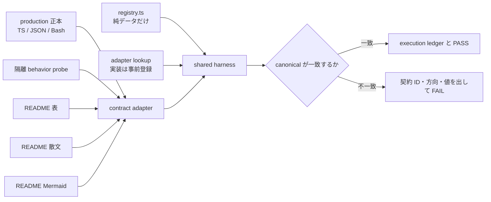
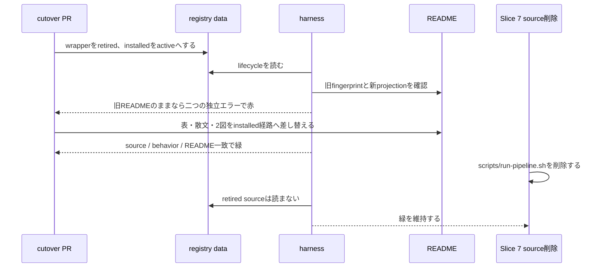

# README 契約 gate harness 実装設計

起草: `scale2sheet_architect_codex`

検証: exact head で `scale2sheet_reviewer_claude` へ依頼する。

| 項目 | 値 |
| --- | --- |
| 起点 | Issue #162 |
| 基準 HEAD | `0671e13d9d48054d771e5e149910095d83a8c559` |
| 採用済み方針 | 既知の四契約を source、隔離 behavior、README で三者照合する |
| 対象 family | `CONFIG_KEYS`、`RUN_EXIT_CODES`、`BUN_REQUIRED`、`RUN_PIPELINE_BOUNDARY` |
| 本書の責務 | 採用済み方針を実装者が一意に着手できる path、形式、probe、退役手順へ具体化する |
| README への影響 | 実装 PR では四契約の機械可読表と図を production の正本へ合わせる |

## 1. 前提と対象外

採否は、[README 追随漏れを検出する契約 gate の検討書](../../decisions/2026-08-09T203209_README追随漏れを検出する契約gateの検討書.md)を受けてユーザーが決定済みである。

本書は案を選び直さず、実装に足りない決定だけを補う。

次は対象外である。

- 任意の実装変更から README 更新要否を推定すること。
- 変更ファイルから実行する adapter を選ぶこと。
- PR テンプレートまたは reviewer の注意力を blocking gate の代わりにすること。
- 設定 schema、終了コード、Bun acceptance、pipeline のユーザー向け意味を変更すること。
- 本番の `run`、`pipeline`、`serve`、`auth`、`install` を probe から実行すること。
- `npm run build:bun` または production の `dist/scale2sheet` を probe から更新すること。

実装が cutover の前に着地するか後に着地するかは確定していない。

この不確定性はコード分岐にせず、registry の lifecycle data で吸収する。

## 2. 方式比較

| 案 | 方式 | 評価 |
| --- | --- | --- |
| A | 純データ lifecycle registry、typed adapter protocol、subsystem 別 production 正本 | 採用 |
| B | 四契約を一つの中央 JSON へ集約し、TS、Bash、package が消費する | 不採用 |
| C | 契約ごとに独立した Vitest を置き、共通 harness を持たない | 不採用 |

案 B は、TS、Bash、`package.json` に現在ある異なる実行正本を中央 JSON へ従属させる。

この変換層自体が追随漏れの対象になり、drift を検出する仕組みが新しい drift を生む。

案 C は導入量が少ないが、全 adapter の常時実行、lifecycle、README parser、診断形式を各 test へ複製する。

したがって、案 A を採る。

## 3. 全体構造



配置は次のとおりとする。

| path | 責務 |
| --- | --- |
| `test/readme-contracts/registry.ts` | lifecycle と selector の純データ |
| `test/readme-contracts/types.ts` | registry、adapter、canonical、ledger の型 |
| `test/readme-contracts/harness.ts` | lifecycle 判定、全 adapter 実行、比較、診断 |
| `test/readme-contracts/adapter-lookup.ts` | adapter key と実装の静的対応 |
| `test/readme-contracts/readme/markdown.ts` | 見出しと直下の表を限定して読む parser |
| `test/readme-contracts/readme/mermaid.ts` | marker 付き Mermaid を読む parser |
| `test/readme-contracts/adapters/*.ts` | 契約別の source、behavior、README projection |
| `test/readme-contracts/fixtures/*` | behavior へ与える入力値と偽物 |
| `test/readme-contracts/readme-contracts.test.ts` | registry 全行の gate と execution ledger の assert |

`runAllContracts` は fail fast にしない。

一つの adapter が失敗しても残りの registry 行を順番に実行し、全 error と ledger を出してから aggregate failure にする。

順番に実行する理由は、`process.exitCode`、環境変数、temp PATH を使う probe 同士を並列にして相互汚染させないためである。

`registry.ts` には関数を置かない。

理由は、cutover の lifecycle data と extractor または helper の変更を同じ diff へ混在させると、gate が変更を検出したのか、変更に合わせて検査ロジックも直したのか区別できなくなるためである。

小さな helper であっても `registry.ts` へ追加しない。

## 4. Registry と lifecycle

### 4.1 データ形式

registry は TypeScript の `as const` data とし、生きている production 正本の値の一覧または extractor 関数を複製しない。

active contract は canonical value を持たない。

retired contract の `retiredCanonicalFingerprint` は、production から意図的に失われた旧 canonical field の唯一の所在である。

これは生きている正本の複製ではなく、退役後も README から除去済みか判定するための履歴データである。

この適用範囲を active contract の値を registry へ置く根拠にしてはならない。

JSON ではなく TypeScript にする理由は、`active` と `retired` の必須項目を discriminated union で検査し、path と adapter key の typo を型検査でも止めるためである。

概念形は次のとおりである。

```ts
type ActiveRegistration = {
  readonly contract: string;
  readonly family: ContractFamily;
  readonly status: "active";
  readonly adapter: AdapterKey;
  readonly sourcePaths: readonly string[];
  readonly readmeSelectors: readonly ReadmeSelectorData[];
};

type RetiredRegistration = {
  readonly contract: string;
  readonly family: ContractFamily;
  readonly status: "retired";
  readonly adapter: AdapterKey;
  readonly sourcePaths: readonly string[];
  readonly readmeSelectors: readonly ReadmeSelectorData[];
  readonly retiredAt: string;
  readonly supersededBy: string;
  readonly retiredCanonicalFingerprint: readonly {
    readonly projection: string;
    readonly field: string;
    readonly value: JsonValue;
  }[];
};

export const README_CONTRACT_REGISTRY = {
  schemaVersion: 1,
  expectedEntries: 4,
  requiredActiveFamilies: [
    "CONFIG_KEYS",
    "RUN_EXIT_CODES",
    "BUN_REQUIRED",
    "RUN_PIPELINE_BOUNDARY",
  ],
  contracts: [/* data only */],
} as const satisfies RegistryData;
```

`expectedEntries` と `requiredActiveFamilies` は canonical value の複製ではない。

両者は、registry 行が消えて adapter 自体が実行されなくなる型を検出するための分母である。

cutover では `expectedEntries`、旧行、新行を同じ registry data 内で更新するため、harness code は変えない。

`retiredCanonicalFingerprint` は空配列を許さない。

値は、退役直前の緑だった source canonical から、旧経路を一意に識別できる field だけを退役作業者が転記する。

adapter、README、記憶から手入力した値を正本とは呼ばない。

型の discriminated union により active 行への fingerprint と、retired 行での fingerprint 欠落を禁止する。

harness は JSON-safe、projection 名の実在、field の一意性、非空を `REGISTRY_INVALID` として検査する。

### 4.2 active と retired

active 行は、harness が全 `sourcePaths` の存在を先に確認する。

欠落は raw `ENOENT` ではなく、`CONTRACT_SOURCE_MISSING` という契約違反に正規化する。

その後に source extractor、behavior probe、全 README projection を実行する。

retired 行は、historical `sourcePaths` を保持するが、存在確認、読取り、behavior probe を一切行わない。

retired 行は、`retiredCanonicalFingerprint` の field が一つでも旧 README projection に一致すれば失敗し、全 field が残っていないことと、`supersededBy` が active であることだけを確認する。

比較値は registry の fingerprint から取り、retired adapter に旧値を手書きしない。

retired 行でも全 `readmeSelectors` の section が解決できることを先に要求する。

section が見つからない 0 件を「旧 field が無い」と解釈せず、`README_SECTION_NOT_FOUND` で失敗する。

section が存在し旧 field が無い場合だけ、正しい退役として成功する。

これにより、同じ「ファイルが無い」を次の二つへ分ける。

| 状態 | 判定 |
| --- | --- |
| source が無く、契約が active | `CONTRACT_SOURCE_MISSING` で失敗 |
| source が無く、契約が retired | source を読まず成功 |

### 4.3 実行 ledger

adapter の非警報対照が緑でも、adapter 自体が登録漏れで実行されていなければ証拠にならない。

そこで harness は各行について execution ledger を返す。

```ts
type AdapterExecution = {
  readonly contract: string;
  readonly family: ContractFamily;
  readonly status: "active" | "retired";
  readonly phases: readonly (
    | "registry-validated"
    | "source-read"
    | "behavior-probed"
    | "readme-read"
    | "canonical-compared"
    | "retirement-checked"
  )[];
};
```

active 行は `source-read`、`behavior-probed`、`readme-read`、`canonical-compared` の完了を要求する。

retired 行は `readme-read` と `retirement-checked` を要求し、`source-read` と `behavior-probed` が無いことを要求する。

top-level test は次を assert する。

1. registry 行数が `expectedEntries` と一致する。
2. contract ID が一意である。
3. `requiredActiveFamilies` の各 family に active 行がちょうど一つある。
4. ledger の contract ID と件数が registry と一致する。
5. status ごとの必須 phase が全件で完了している。

診断出力は、実行した contract の一覧、件数、status、完了 phase を一つの構造化行へ出す。

これにより、非警報対照は「警報が出なかった」だけでなく、「対象 adapter が所定の phase を実行した」ことまで証明する。

### 4.4 canonical 比較と診断

adapter は source、behavior、README の値を、順序を正規化した JSON-safe data へ変換する。

README に表、散文、図がある場合は、表現ごとに独立した named projection を返す。

projection は `kind: "readme" | "repo-file"` を持つ discriminated union にする。

README の表、散文、図は `readme`、`.env.example` のような repository 内の補助資料は `repo-file` とし、利用者向け README の欠落と sample file の欠落を同じ診断にしない。

README parser は selector ごとに section 解決結果と projection を別々に返し、section 欠落を空配列へ畳み込まない。

harness は source と behavior、behavior と各 README projection、README projection 同士を比較する。

失敗は少なくとも次の code を持つ。

| code | 意味 |
| --- | --- |
| `REGISTRY_INVALID` | lifecycle data の形、件数、active family が不正 |
| `ADAPTER_EXECUTION_MISSING` | registry 行に対応する ledger または必須 phase が無い |
| `CONTRACT_SOURCE_MISSING` | active の source path が無い |
| `SOURCE_BEHAVIOR_MISMATCH` | 正本と観測挙動が違う |
| `README_SECTION_NOT_FOUND` | active または retired の selector が指す README section が無い |
| `README_PROJECTION_INVALID` | 見出し重複、表、図、sentinel の分母が不正 |
| `README_PROJECTION_MISSING` | section は在るが active contract が要求する README 表現が無い |
| `README_BEHAVIOR_MISMATCH` | README と観測挙動が違う |
| `README_PROJECTIONS_DISAGREE` | 表、散文、図の内部で説明が違う |
| `REPO_FILE_PROJECTION_INVALID` | sample file など README 外の projection の分母が不正 |
| `REPO_FILE_BEHAVIOR_MISMATCH` | README 外の projection と観測挙動が違う |
| `RETIRED_README_PROJECTION_PRESENT` | 退役した canonical field が README に残る |
| `SUPERSEDED_CONTRACT_NOT_ACTIVE` | 後継 contract が active ではない |

差分には contract ID、projection 名、source、behavior、README の canonical value、差分方向を含める。

## 5. `CONFIG_KEYS` adapter

### 5.1 production 正本

新規 `src/config/contract.ts` を TypeScript の production 正本にする。

同ファイルは次の三つを export する。

| export | 形式 | production consumer |
| --- | --- | --- |
| `settingsFileShape` | Zod raw shape | `src/config/settings.ts` の `z.object` |
| `envShape` | Zod raw shape | `src/config/env.ts` の `envSchema` |
| `SETTINGS_TO_ENV` | `as const` の key mapping | `settingsAsEnvOverlay` |

`defaultSources` も schema の循環 import を避けるため同ファイルへ移し、`settings.ts` から re-export する。

`settings.ts` と `env.ts` が同じ export を実際に消費するため、test 専用の key list は正本にならない。

### 5.2 behavior

`test/readme-contracts/fixtures/config.ts` は、各 settings key へ与える有効な刺激値、必要な組合せ、`AppConfig` の観測点を持つ。

fixture の値は入力であり、期待する契約値の正本ではない。

adapter は一度に一つの設定要因だけを変え、temp の `settings.json` を使って `loadConfig` を実行する。

各 mapping について settings の値が観測点へ届くことと、対応する env value が settings value を上書きすることを確認する。

`source` は env mapping を持たないため、`defaultSource` の観測で確認する。

Google Sheets と Google Fit のように複数値が必要な case は、他の値を固定したうえで対象の一変数だけを動かす。

実在の認証、Spreadsheet、外部 API は使わない。

source の settings key 集合、mapping 集合、実行した behavior case 集合を照合し、新しい key だけを足して probe が無い状態を失敗させる。

### 5.3 README projection

設定表を次の機械可読な一表へ揃える。

selector は `## セットアップ` 配下の新規 `### 設定キー` 見出しと、その直下の一表に固定する。

| 列 | canonical の用途 |
| --- | --- |
| settings key | `settingsFileShape` の key |
| env key | `SETTINGS_TO_ENV` の対応、または対応なし |
| 用途 | 利用者向け説明 |
| 必須条件 | 利用者向け条件 |

一つの settings key を一行にし、現行の `sheet-id / sheet-name` のような複数 key の同居をやめる。

parser は設定見出しとその直下の一表だけを読む。

別表に同じ key があっても設定表の欠落を補わない。

`.env.example` は `kind: "repo-file"` の env key projection として双方向に照合する。

この不一致は README 系ではなく `REPO_FILE_*` の code で報告する。

現行 `scripts/verify-readme-config-keys.mjs` と `test/config/verify-readme-config-keys.test.ts` は新 adapter と parser を重複させるため退役させる。

## 6. `RUN_EXIT_CODES` adapter

### 6.1 production 正本

新規 `src/cli/run-exit-contract.ts` に `RUN_EXIT_CASES` と適用 helper を置く。

```ts
export const RUN_EXIT_CASES = {
  "argument-error": 2,
  "configuration-error": 1,
  "runtime-error": 1,
  "help-version": 0,
  success: 0,
  "no-data": 0,
} as const;
```

`runCli` の Commander error、ConfigError、runtime error、成功、no-data の各経路が helper を使う。

runtime error は exit `1` を設定してから error を再 throw し、既存の失敗伝播を保ったまま Node.js の暗黙値だけへの依存をなくす。

### 6.2 test seam と behavior

`runCli` は、`run` action だけに必要な `loadConfig`、`requireGoogleSheetsConfig`、`requireSourceConfig`、`syncMeasurements` を optional dependency として受け取る。

production default は現在の import である。

`pipeline`、`serve`、`auth`、install 系まで CLI 全体を DI container にしない。

adapter は temp HOME と dependency double を使い、次を実行する。

| case | 刺激 | 観測 |
| --- | --- | --- |
| `argument-error` | `--period` 欠落または不正 | exit `2` |
| `configuration-error` | `ConfigError` | exit `1` |
| `runtime-error` | `syncMeasurements` が throw | exit `1` と error 伝播 |
| `help-version` | help と version | exit `0` |
| `success` | row を返す | exit `0` |
| `no-data` | `undefined` を返す | exit `0` |

実在する設定、認証、入力 file、Spreadsheet、外部 API は使わない。

### 6.3 README projection

README の終了コード表は case ID と code を列挙する。

selector は現行の `### 終了コード` 見出しと、その直下の一表に固定する。

一つの case ID を一行にする。

同じ code の意味を一つの散文 cell へ畳み込まず、`runtime-error` が欠落した #152 型を集合差で検出できる形にする。

## 7. `BUN_REQUIRED` adapter

### 7.1 production 正本

最低版の正本は `package.json` の `engines.bun` とする。

acceptance 集合の正本は新規 `scripts/acceptance/manifest.json` とする。

manifest は次の五行を持つ。

| id | npm script | shell script |
| --- | --- | --- |
| `pipeline-shadow` | `acceptance:pipeline-shadow` | `scripts/run-pipeline-shadow-acceptance.sh` |
| `binary-drift` | `acceptance:binary-drift` | `scripts/run-binary-source-drift-acceptance.sh` |
| `runtime-safety` | `acceptance:runtime-safety` | `scripts/run-runtime-safety-acceptance.sh` |
| `installer` | `acceptance:installer` | `scripts/run-installer-acceptance.sh` |
| `bun-binary-smoke` | `acceptance:bun-binary-smoke` | `scripts/run-bun-binary-smoke.sh` |

新規 `scripts/acceptance/require-bun.mjs` は package と manifest を読み、acceptance ID、Bun の存在、最低版、導入案内を共通処理する。

各 shell script は build より前に ID を渡して同 helper を呼ぶ。

現行五つの薄い Vitest wrapper は、新規 `test/acceptance/manifest.test.ts` の `it.each` 登録へ一本化する。

adapter は manifest と `package.json` の npm scripts を双方向に照合する。

manifest が不採用案 B の中央 JSON と異なるのは、対象集合が npm script と shell script の二者だけで閉じており、その全写像を双方向照合できるためである。

四 subsystem の canonical value を横断して集約せず、第三の consumer または変換層も作らない。

最低版 range は現行の `>=MAJOR.MINOR.PATCH` だけを受理する。

helper はこの形式を三つの整数へ分解して比較し、未対応の range へ変わった場合は fail closed とする。

一般 semver range の実装または新依存は追加しない。

### 7.2 behavior

Bun 欠落の probe は、temp の allowlist `PATH` へ実行に必要な command だけを置き、`bun` を置かない。

system の `/usr/bin` または `/bin` を PATH へそのまま追加せず、system 側に Bun があっても欠落条件を固定する。

五つの shell script を実行し、Bun build へ到達する前に非 0、対象 acceptance ID、導入案内を返すことを観測する。

最低版境界は共通 helper 単体へ fake Bun `0.9.9` と `1.0.0` を与え、前者を拒否し後者を受理する。

最低版以上の fake Bun で whole acceptance を走らせない。

したがって、この追加 probe は Bun build を行わない。

### 7.3 README projection

Bun の事実は一つの表へ集約する。

selector は `## 開発コマンド` 配下の新規 `### Bun と acceptance の要件` 見出しと、その直下の一表に固定する。

表は最低版、`npm test` で必須であること、欠落時に skip せず失敗すること、五つの acceptance ID を持つ。

最低版、必須、欠落時効果を各一行とし、acceptance は一 ID を一行にする。

README 冒頭とテスト節は同じ表を参照し、最低版と五本という値を重複して書かない。

## 8. `RUN_PIPELINE_BOUNDARY` family

### 8.1 cutover 前の wrapper contract

contract ID は `RUN_PIPELINE_WRAPPER_BOUNDARY` とする。

production 正本は `scripts/run-pipeline.sh` 自体である。

同 script を `source` しても main が実行されない guard を置き、実行時に使う readonly command、effect、named stage を main が直接消費する形へ整える。

source adapter は子 Bash で guarded script を source し、実行に使われる readonly value を読む。

別の JSON mirror または表示専用 `--contract-probe` は作らない。

`invokesExporter=false` は、main が消費する stage 集合に exporter stage が無いことから導く。

wrapper の canonical value は次のとおりとする。

| field | value |
| --- | --- |
| `entrypoint` | `run-pipeline.sh` |
| `invokesExporter` | `false` |
| `checksPublishedFile` | `true` |
| `missingPublicationEffect` | `notify-only` |
| `transferCommand` | `run --period` |
| `runFailureWrapperExit` | `1` |
| `notWrittenEffect` | `exit-0-no-notify` |

behavior probe 用に、temp directory、fake `scale2sheet`、temp settings、notification recorder を注入できる private seam を置く。

production default path と command は変えない。

behavior は次を観測する。

| case | 観測 |
| --- | --- |
| poison exporter | 呼ばれない |
| 当日公開 file あり | `run --period` を一回呼ぶ |
| 当日公開 file なし | 通知するが transfer を止めず wrapper exit を変えない |
| fake `scale2sheet` exit `2` | 通知して wrapper exit `1` |
| fake `scale2sheet` が not-written を出して exit `0` | 通知せず exit `0` |

README projection は責任境界表、launchd 節の散文、`composition` 図、`run-path` 図を別々に返す。

責任境界表の selector は `## launchd による日次自動実行` 配下の新規 `### 実行責任` 見出しに固定する。

### 8.2 cutover 後の installed pipeline contract

contract ID は `RUN_PIPELINE_INSTALLED_BOUNDARY` とする。

adapter implementation と lookup は cutover 前に用意する。

cutover 前の registry へ active 行は置かない。

production 正本は次の二つに分ける。

| path | TypeScript const | consumer |
| --- | --- | --- |
| `src/installation/launchd-contract.ts` | period、label、固定時刻、`pipeline --period`、環境変数 | planner と plist builder |
| `src/pipeline/contract.ts` | terminal outcome と exit code | `runPipeline` |

installed contract の canonical value は次のとおりとする。

| field | value |
| --- | --- |
| `entrypoint` | `installed-binary` |
| `command` | `pipeline --period` |
| `periods` | `morning`、`evening` |
| `morningSchedule` | `07:00`、`11:30` |
| `eveningSchedule` | `21:00`、`23:30` |
| `invokesExporter` | `false` |
| `readsPublishedJsonl` | `true` |
| `writesPipelineStatus` | `true` |
| `inputFailureOutcomes` | `failed:input-missing`、`failed:input-unstable`、`failed:input-invalid-or-partial`、いずれも exit `1` |
| `completed:no-data` | exit `0` |
| `completed:transferred` | exit `0` |
| `failed:transfer` | exit `1` |

behavior は `planInstall` と `buildPipelinePlist` を temp path で実行し、二 period が installed binary の `pipeline --period` を直接起動することを観測する。

`runPipeline` は input、transfer、status、notifier の double で実行し、入力失敗、no-data、転記成功、転記失敗の outcome、exit、status を観測する。

`launchctl`、本番 filesystem、実在 binary、外部 API は使わない。

README projection は cutover 後の責任境界表、launchd 節の散文、同じ ID の `composition` 図と `run-path` 図を読む。

責任境界表は wrapper と同じ `### 実行責任` 見出しで内容だけを置き換える。

図 ID は前後で同じため、退役判定は図 ID の消滅ではなく、`run-pipeline.sh`、`run --period`、wrapper exit の旧 canonical field が残るかを見る。

wrapper を retired にする registry 行は、退役直前の wrapper source canonical から少なくとも次を `retiredCanonicalFingerprint` へ転記する。

| projection | field | value |
| --- | --- | --- |
| `launchd-prose` | `entrypoint` | `run-pipeline.sh` |
| `responsibility-table` | `transferCommand` | `run --period` |
| `responsibility-table` | `runFailureWrapperExit` | `1` |
| `responsibility-table` | `notWrittenEffect` | `exit-0-no-notify` |

この表は退役後の production 正本ではなく、設計基準 HEAD で転記対象になる履歴 fingerprint を示す。

実装時には表を鵜呑みにせず、退役直前の source canonical と一致することを probe の緑で確認してから registry へ転記する。

退役時に旧 canonical field が増減していれば、最後に緑だった source canonical を根拠に同じ registry data change で更新する。

## 9. `diagrams.test.ts` との統合

`test/docs/diagrams.test.ts` は Mermaid の構造検査だけを残す。

残す検査は、全 Mermaid fence に一意な diagram marker があることと、対応する `%% verify: <id>` があることである。

source と図の意味 claim、orphan claim、wrapper exit の検査は boundary adapter へ移す。

`parseReadmeDiagrams` は `test/readme-contracts/readme/mermaid.ts` へ抽出し、構造 test と adapter が共有する。

既存十試験が守っていた変異は移植するが、同じ claim を二つの test へ残さない。

## 10. Cutover と retirement



cutover 時の順序は次のとおりである。

1. wrapper と installed の両 adapter implementation と lookup が同じ exact head にあることを確認する。
2. 最後に緑だった wrapper source canonical から `retiredCanonicalFingerprint` を registry へ転記する。
3. registry だけを cutover 後へ変え、README を旧稿のままにした変異を先に実行する。
4. `RETIRED_README_PROJECTION_PRESENT` と `README_PROJECTION_MISSING` または `README_BEHAVIOR_MISMATCH` の二つが出ることを、error code と contract ID の完全一致で記録する。
5. registry data で wrapper を retired にし、`retiredAt` を RFC3339 の `+09:00` で記録し、`supersededBy` を installed contract へ向ける。
6. installed contract の active 行を追加し、`expectedEntries` を増やす。
7. README の表、散文、二図を installed projection へ差し替える。
8. harness code と adapter code を変更せず、全 projection が緑へ戻ることを確認する。
9. Slice 7 で `scripts/run-pipeline.sh` を削除し、retired 行が source を読まず緑を維持することを確認する。

手順 3 と 4 は、README 修正後の緑だけを見て gate が効いたと誤認しないための必須条件である。

retired error が出なければ fingerprint の欠落、空、誤記を疑い、後継側の一エラーだけで通さない。

## 11. 負のコントロールと非警報対照

本節は実装前の期待値であり、KILLED の実測結果ではない。

失敗を起こす変異の実装完了報告は、`KILLED`、`KILLED-BY-TSC`、`SURVIVED` の三値で記録する。

警報を起こさない対照は別の二値 `NO-ALARM`、`FALSE-ALARM` で記録し、`SURVIVED` を成功の意味に使わない。

### 11.1 共通と lifecycle

| ID | 変異 | 期待 |
| --- | --- | --- |
| L-1 | active の source path を削除 | `CONTRACT_SOURCE_MISSING`、KILLED |
| L-2 | retired の source path を削除 | source phase を呼ばず緑、NO-ALARM |
| L-3 | retired 行から `retiredAt` または `supersededBy` を削除 | `REGISTRY_INVALID`、KILLED または KILLED-BY-TSC |
| L-4 | `supersededBy` を未登録または retired contract へ向ける | `SUPERSEDED_CONTRACT_NOT_ACTIVE`、KILLED |
| L-5 | active 行の `readmeSelector` が指す section を削除 | `README_SECTION_NOT_FOUND`、KILLED |
| L-6 | README 以外の unit test または内部 refactor だけを変更 | 全 adapter が ledger に残ったまま緑、NO-ALARM |
| L-7 | registry の adapter 行を一つだけ除外し、`expectedEntries` と active family を据え置く | `REGISTRY_INVALID` または `ADAPTER_EXECUTION_MISSING`、KILLED |
| L-8 | retired 行の fingerprint を削除、空にする、または P-11 の旧値と一致しない値へ変える | 型または `REGISTRY_INVALID`、誤記時は P-11 の必須 retired error 欠落、KILLED または KILLED-BY-TSC |
| L-9 | retired 行の `readmeSelector` が指す section を README から丸ごと削除 | `README_SECTION_NOT_FOUND`、KILLED |
| L-10 | 対象見出しを重複、空表、sentinel 欠落のいずれかにする | `README_PROJECTION_INVALID`、KILLED |

L-2 と L-6 は、ledger に対象 contract と所定 phase が記録されたことを同時に assert する。

### 11.2 `CONFIG_KEYS`

| ID | 変異 | 期待 |
| --- | --- | --- |
| C-1 | README の `sheet-id` を削除 | README 欠落、KILLED |
| C-2 | README へ `obsolete-setting` を追加 | README 余剰、KILLED |
| C-3 | 設定表から `sheet-id` を消し、別表へ同じ key を追加 | 限定 parser が欠落を検出、KILLED |
| C-4 | `SETTINGS_TO_ENV` だけを変更 | source と behavior の不一致、KILLED |
| C-5 | schema へ key を足し、behavior case と README を据え置く | behavior 分母と README 欠落、KILLED |
| C-6 | env と settings の優先順位を逆転 | behavior 不一致、KILLED |
| C-7 | `.env.example` だけへ key を追加または削除 | `REPO_FILE_BEHAVIOR_MISMATCH`、KILLED |

### 11.3 `RUN_EXIT_CODES`

| ID | 変異 | 期待 |
| --- | --- | --- |
| E-1 | README の `argument-error` を削除 | README 欠落、KILLED |
| E-2 | README の `runtime-error` だけを削除 | #152 型の狭い説明を検出、KILLED |
| E-3 | source contract の runtime code を `2` にし、README を据え置く | source と behavior は共に変わるが README と不一致、KILLED |
| E-4 | runtime helper を外し、暗黙 exit へ戻す | behavior が明示 code を観測できず、KILLED |
| E-5 | config、runtime、success、no-data、help-version の一つを別 code にする | 対応 case の不一致、KILLED |

### 11.4 `BUN_REQUIRED`

| ID | 変異 | 期待 |
| --- | --- | --- |
| B-1 | README から最低版、必須、fail、acceptance 一件のいずれかを削除 | README 欠落、KILLED |
| B-2 | `engines.bun` だけを変更 | version behavior または README と不一致、KILLED |
| B-3 | manifest から一件消して package script を残す、または逆 | 双方向 mapping 不一致、KILLED |
| B-4 | shell から共通 preflight を外す | Bun 欠落時に所定案内を返さず、KILLED |
| B-5 | fake Bun `0.9.9` を受理する | 最低版境界 behavior、KILLED |
| B-6 | acceptance と無関係な unit test を追加 | adapter が ledger に残ったまま緑、NO-ALARM |

### 11.5 `RUN_PIPELINE_BOUNDARY`

| ID | 変異 | 期待 |
| --- | --- | --- |
| P-1 | poison exporter を呼ぶ | behavior、KILLED |
| P-2 | wrapper の transfer command を `pipeline` へ変える | source、behavior、README のいずれかで KILLED |
| P-3 | 公開 file 欠落時に transfer を止める | behavior、KILLED |
| P-4 | fake transfer exit `2` を wrapper が `2` のまま返す | behavior、KILLED |
| P-5 | not-written exit `0` で通知する | behavior、KILLED |
| P-6 | 散文だけを旧 exporter 起動へ戻し、図を現行のままにする | `README_PROJECTIONS_DISAGREE`、KILLED |
| P-7 | 図から公開入力、command、status、terminal outcome の一つを消す | 対応 projection、KILLED |
| P-8 | installed plist contract を `run` へ戻し、README を据え置く | source と behavior は共に変わるが README と不一致、KILLED または KILLED-BY-TSC |
| P-9 | pipeline terminal contract の outcome または exit を変え、README を据え置く | source と behavior は共に変わるが README と不一致、KILLED または KILLED-BY-TSC |
| P-10 | active のまま implementation と README だけを installed 経路へ移す | wrapper contract の source または README 不一致、KILLED |
| P-11 | registry だけを cutover 後へ移し、README を cutover 前のままにする | 次の二検査で独立に KILLED |

P-11 では、retired wrapper adapter が source と behavior を呼ばず、registry の `retiredCanonicalFingerprint` と README だけを読む。

旧 `run-pipeline.sh`、`run --period`、wrapper exit `1` の canonical field が残るため、`RETIRED_README_PROJECTION_PRESENT` が発生する。

同時に、active installed adapter は production source と behavior を取得するが、README に `pipeline` 直起動と status terminal projection が無いため、`README_PROJECTION_MISSING` または `README_BEHAVIOR_MISMATCH` が発生する。

片方の検査が壊れても、もう片方が cutover の片側変更を止める。

## 12. 実行時間と安全性

新しい behavior probe は production 設定、本番 HOME、本番 binary、network、launchctl を使わない。

temp path は test ごとに作り、cleanup を必須にする。

`process.exitCode` と変更した環境変数は `finally` で元へ戻す。

Bun adapter の追加 probe は build を実行しない。

既存五 acceptance 自体は manifest から従来どおり登録し、既存の隔離 build を維持する。

実装前後で BUN preflight と shared harness をそれぞれ十回以上実行し、median、最大、failure 件数を記録する。

full `npm test` は一回の緑を根拠にせず複数回実行する。

timeout、Bun 欠落、runner 起動失敗は contract adapter が変異を捕らえた `KILLED` と数えない。

非警報対照で adapter、ledger、assert 自体が実行されなかった場合は `NO-ALARM` とせず、検証不成立として扱う。

## 13. 実装の依存順

本書は programmer の実装計画を代行しないが、依存方向は固定する。

1. registry 型、純データ、harness、ledger、限定 README parser を先に置く。
2. production 正本を subsystem ごとに作り、production consumer を先に接続する。
3. behavior probe を接続し、source と behavior を一致させる。
4. README の一表、散文、図を projection へ接続する。
5. 既存の重複 test と verifier を退役させる。
6. 変異表を実行し、三値と execution ledger を記録する。
7. exact head を reviewer へ渡す。

production 正本、behavior、README を同じ変更単位で扱い、一層だけ先に完成扱いしない。

## 14. 完了条件

- 四つの required family に active contract が一つずつある。
- active adapter は source、behavior、全 README projection を実行 ledger に記録する。
- retired adapter は registry の履歴 fingerprint と README retirement だけを記録し、source と behavior を呼ばない。
- active と retired の selector section 欠落は `README_SECTION_NOT_FOUND` で失敗し、0 件を除去済みと解釈しない。
- registry から一行を外す L-7 が KILLED になる。
- retired selector section を削除する L-9 が KILLED になる。
- P-11 が二つの独立した error code で KILLED になる。
- 現行の基準変異四件が新 gate で KILLED になる。
- 非警報対照は adapter 実行証跡を残したまま緑になる。
- `test/docs/diagrams.test.ts` と boundary adapter に semantic claim の重複がない。
- 新規 probe は本番設定、network、launchctl、production dist、`npm run build:bun` を使わない。
- full `npm test` の複数回実行と各変異の三値が記録される。
- README だけで設定、終了コード、Bun 要件、現行 pipeline 境界を理解できる。
