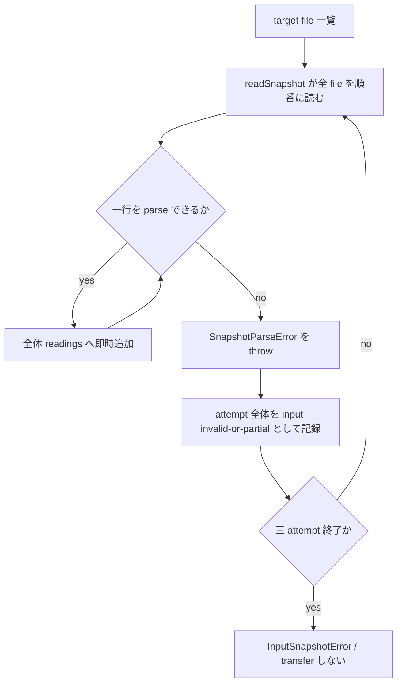
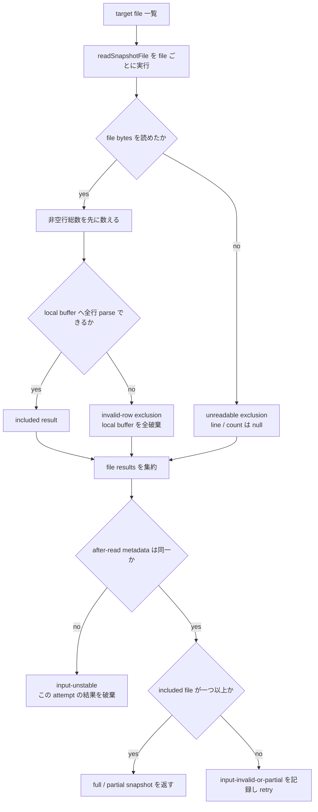

# AC-39〜42 ファイル単位入力除外の検討・実装設計

起草: `scale2sheet_architect_codex`

対象: Issue #246、Issue #182

基準: `main` commit `c692ae863c1f0edec3deb3eb937af40d42cffeb8`

## 1. 目的と未決定事項

2026-08-04 の Issue #56 では、入力ファイルの一部が読めない場合に、読めたファイルだけで処理を続ける A-1 が採用された。

現在の production は、一行の parse error を入力全体の失敗へ変換する A-0 のままである。

さらに、現在の試験は A-0 を正しい挙動として固定している。

本書は、A-1 を今から実装する案と、2026-08-04 の決定を撤回して A-0 を正式契約に戻す案を比較する。

採否と導入時期はユーザー判断であり、本書では決めない。

| 選択肢 | runtime の入力契約 | 観測可能性 | definition 履歴 | cutover への影響 |
| --- | --- | --- | --- | --- |
| **I-before** | A-1 を cutover gate 判定前に有効化する | 除外 file を log、status、doctor で確認できる | 最初の新 definition write で両 period の旧履歴を再基準化する | G-2 に使う観測履歴と outcome の意味が判定前に変わる |
| **I-after** | A-1 を cutover gate 判定後に有効化する | I-before と同じ | gate 判定に使った後で cutover 前の履歴を再基準化する | G-2 は A-0 の一貫した意味で判定できるが、A-1 は別途観測が要る |
| **R** | 2026-08-04 の A-1 決定を撤回し、A-0 全損を正式契約にする | 読取失敗は既存 diagnostic で分かる。部分入力は存在しない | definition version を変えない | G-2 の意味を変えない |

I-before と I-after の「前後」は merge 日ではなく、A-1 を含む binary を対象経路で有効化する時点を指す。

現在の launchd 手順は `run` を呼び、A-1 の対象である `pipeline` の snapshot reader を通らない。

したがって、main へ code を置くだけでは production の入力意味は変わらず、配備と経路切替が境界になる。

そのため、#246 の production 優先度は cutover の activation schedule に従属し、cutover しない間は単独の runtime blocker ではない。

## 2. 現行実装と決定の食い違い

### 2.1 実測

| 場所 | 現在の事実 | 帰結 |
| --- | --- | --- |
| `src/sources/scale-exporter/reader.ts:161-184` | 一行の JSON / schema error を file 名と行番号付きで throw する | 行不正の検出点であり、全体 reject の決定点ではない |
| `src/pipeline/input-snapshot.ts:219-241` | `readSnapshot` が全 file を一つの loop で読み、最初の parse error を `SnapshotParseError` として throw する | 一 file の error が全 input を中断する |
| `src/pipeline/input-snapshot.ts:107-154` | 最大三回の attempt を行い、最強の失敗観測を `InputSnapshotError` にする | A-0 の全損を bounded retry 後に返す |
| `src/pipeline/pipeline.ts:120-193` | snapshot success の readings だけを window、deduplicate、transfer へ渡す | 部分成功を受け取る signal が無い |
| `src/pipeline/status.ts:29-46` | `partialInput?: boolean` は宣言済み | producer は存在しない |
| `src/pipeline/status.ts:327-387` | truthy な `partialInput` だけを terminal へ保存する | `false` と field 欠落を区別できない |
| `src/installation/doctor.ts:417-471` | status に `partialInput: true` が在れば表示する | producer が無いため production では表示されない |
| `test/pipeline/input-snapshot.test.ts:155-171` | 一つの target file の一行不正で全 input が reject されることを検査する | 決定と逆の A-0 が試験で守られている |

基準 commit で次を実行し、4 files / 112 tests が PASS した。

```sh
npx vitest run test/pipeline/input-snapshot.test.ts test/pipeline/pipeline.test.ts test/pipeline/status.test.ts test/installation/doctor.test.ts
```

この baseline は現行 A-0 が一貫して動く証拠であり、AC-39〜42 が満たされている証拠ではない。

### 2.2 決定後の変更履歴

| commit | 日時 | 同じ経路への変更 |
| --- | --- | --- |
| `6683ee1` | 2026-08-04T15:52:12+09:00 | A-1 決定を文書へ反映 |
| `cbd110c` | 2026-08-04T17:52:13+09:00 | `input-snapshot.ts` と test を変更 |
| `2652542` | 2026-08-04T19:40:03+09:00 | `input-snapshot.ts`、`reader.ts`、test を変更 |
| `959b14c` | 2026-08-04T20:06:42+09:00 | `input-snapshot.ts` と test を変更 |

決定当日のうちに同じ経路を三回変更し、いずれも A-1 は実装されなかった。

履歴から、変更者が決定を知っていたかどうかは判断できない。

判断できるのは、決定と実装を自動で突き合わせる gate が無く、AC が PENDING のまま一週間残った事実である。

## 3. 現在と案 I の処理フロー

### 3.1 現在の A-0



一 file の local result が存在しないため、正常 file と異常 file を分けて集約できない。

### 3.2 案 I の A-1



file result を値として集約し、例外は file 境界より外へ直ちに流さない。

## 4. 案 I の file 境界

### 4.1 `readSnapshotFile` の結果型

`src/pipeline/input-diagnostics.ts` に、実装層と永続層が共有する純データ型を置く。

```ts
export type InputFileExclusion =
  | {
      readonly fileName: string;
      readonly reason: "invalid-row";
      readonly firstFailureLine: number;
      readonly excludedLineCount: number;
      readonly diagnostic: string;
    }
  | {
      readonly fileName: string;
      readonly reason: "read-error";
      readonly firstFailureLine: null;
      readonly excludedLineCount: null;
      readonly diagnostic: string;
    };

type SnapshotFileResult =
  | {
      readonly state: "included";
      readonly readings: readonly MeasurementReading[];
      readonly readLineCount: number;
    }
  | {
      readonly state: "excluded";
      readonly readLineCount: number;
      readonly exclusion: InputFileExclusion;
    };
```

`InputFileExclusion` は file 除外の唯一の正本である。

log 用文字列と status 用 object を別々に生成しない。

`fileName` には snapshot が保持する basename を使い、利用者環境の絶対 path を保存しない。

### 4.2 file 内の一行が不正な場合

file 内容を改行で分け、空白行を除いた総数を parse 前に数える。

readings は file ごとの local buffer へ入れる。

最初の parse error を見つけたら local buffer 全体を破棄し、次を返す。

| field | 値 |
| --- | --- |
| `fileName` | 対象 file の basename |
| `reason` | `invalid-row` |
| `firstFailureLine` | file 内の実行行番号。空白行も行番号へ含める |
| `excludedLineCount` | file 内の非空行総数。失敗行より後ろと、失敗前に parse できた行も含める |
| `diagnostic` | 既存 parser が返す file 名と行番号付き message |
| result の `readLineCount` | file 内の非空行総数 |

失敗行までの件数を `excludedLineCount` にしない。

A-1 は一行だけでなく、その file の全行を除外する契約だからである。

### 4.3 `readFile` 自体が失敗した場合

安定して存在する file に対して `readFile` が失敗した場合は、file 単位の unreadable exclusion とする。

| field | 値 |
| --- | --- |
| `fileName` | 対象 file の basename |
| `reason` | `read-error` |
| `firstFailureLine` | `null` |
| `excludedLineCount` | `null` |
| `diagnostic` | file 名と OS error code / message を含む message |
| result の `readLineCount` | `0` |

`null` は未観測を表す。

行番号または行数を取得できていないのに `0` と書かない。

`0` は「0 行だと観測した」という別の事実だからである。

test は chmod の挙動へ依存せず、`ReadStableInputSnapshotOptions` へ注入可能な `readTextFile` seam を追加して read failure を決定的に作る。

production の既定値だけが `node:fs/promises.readFile` を呼ぶ。

### 4.4 file 消失と unreadable を分ける

directory listing と `stat` の間で file が消えた場合は、file 内容の異常ではなく snapshot 集合の変化である。

read と after-read snapshot の間で file が消えた場合も、metadata 不一致である。

これらは従来どおり `input-unstable` とし、unreadable exclusion にしない。

一つの attempt で作った exclusion は、after-read metadata が一致した場合にだけ確定する。

## 5. `readSnapshot` の集約規則

`readSnapshot` は file を現在と同じ file 名順で読み、各 `SnapshotFileResult` を集約する。

対象 file 名は `classifyScaleExporterFileNames` が sort するため、exclusion 配列の順序も決定的になる。

戻り値は次の形とする。

```ts
interface SnapshotReadResult {
  readonly readings: readonly MeasurementReading[];
  readonly readLineCount: number;
  readonly includedFileCount: number;
  readonly inputFileExclusions: readonly InputFileExclusion[];
}
```

| field | 集約規則 |
| --- | --- |
| `readings` | `included` file の local readings だけを file 名順に連結する |
| `readLineCount` | bytes を読めた file の非空行総数。invalid file の行も含む。unreadable file の未知行数は含めない |
| `includedFileCount` | `state: included` の file 数。空 file も readable な included file と数える |
| `inputFileExclusions` | `state: excluded` の structured fact を file 名順に並べる |

`matchedFileCount` は従来どおり安定 snapshot に含まれた全 target file 数である。

`readLineCount` は読み取れた bytes 内の非空行数であり、転記対象行数ではない。

転記対象は既存の `windowedReadingCount` と `uniqueMeasurementCount` で表す。

同じ一行を一つの意味へ潰さない。

## 6. `readStableInputSnapshot` の完了規則

`readSnapshot` の result を得た後も、必ず after-read snapshot を取得する。

### 6.1 metadata が変わった attempt

before / after metadata が一致しなければ `input-unstable` を記録する。

その attempt の readings と exclusions は確定事実ではないため破棄する。

### 6.2 一つ以上の file を含められた attempt

metadata が一致し、`includedFileCount > 0` なら `StableInputSnapshot` を返す。

`inputFileExclusions.length > 0` なら partial、0 なら complete である。

一つ以上除外しても、included file に window 内の体重が無ければ `completed:no-data` になり得る。

一つ以上除外し、transfer が失敗した場合は `failed:transfer` になり得る。

いずれも入力が partial だった事実は失わない。

### 6.3 全 file を除外した attempt（AC-42）

metadata が一致し、`includedFileCount === 0` なら `input-invalid-or-partial` を記録する。

この attempt は success を返さず、従来の最大三回 retry を続ける。

最終的な `InputSnapshotError` は、選ばれた最強観測の outcome、diagnostic、counts、`inputFileExclusions` を一組で持つ。

同じ強さの後続観測が前の観測を置き換える場合も、四つを別々に更新しない。

top-level diagnostic は、file 名順で最初の exclusion の diagnostic を使い、既存 AC-42a の file 名と行番号を維持する。

全 file unreadable で行番号が無い場合は、最初の OS read diagnostic を使う。

## 7. pipeline、status、log への配線

### 7.1 in-memory の必須 fact

`StableInputSnapshot` と `InputSnapshotError` は `inputFileExclusions` を必須の readonly array として持つ。

production で snapshot を解決したのに除外情報を落とす構築点は、TypeScript compile error にする。

この compile error は配線の網羅を守るが、正しい値を証明しない。

変異結果では `KILLED-BY-TSC` とし、behavior probe の `KILLED` に数えない。

### 7.2 `partialInput` の三値（Issue #182）

Issue #182 は #246 の一部として扱う。

これは manager 判断（2026-08-11）である。

| status の値 | 意味 |
| --- | --- |
| `partialInput: true` | input は ready で、一つ以上の target file を除外した |
| `partialInput: false` | input は ready で、target file を除外していない |
| field 欠落 | input が unavailable、または producer 導入前の旧 status |

`false` を field 欠落へ正規化しない。

`recordTerminal` の truthy 判定は `status.partialInput !== undefined` の presence 判定へ変える。

`runPipeline` は input ready の全 terminal へ true / false を明示して渡す。

input missing、unstable、all-excluded では `partialInput` を書かない。

### 7.3 persisted status

`TerminalObservationV1` に次を追加する。

```ts
readonly inputFileExclusions?: readonly InputFileExclusion[];
```

field は旧 status を読むため optional にする。

欠落を空 array へ補完しない。

new writer は次を保存する。

| input state | `partialInput` | `inputFileExclusions` |
| --- | --- | --- |
| ready / complete | `false` | `[]` |
| ready / partial | `true` | 非空 array |
| unavailable / all-excluded | 欠落 | 非空 array |
| unavailable / missing・unstable | 欠落 | 欠落 |
| 旧 status | 欠落し得る | 欠落し得る |

parser は field が在る場合、file 名と diagnostic が非空文字列、reason が既知の値、数値が reason に対応した正整数または `null` であることを検証する。

producer は file 名順で保存し、test が順序を固定する。

malformed な structured diagnostic を unknown field として通さない。

### 7.4 log と status の同一性

`runPipeline.writeStatus` へ `inputFileExclusions` を一度だけ渡す。

status writer へ同じ array を渡し、非空の場合は logger へ次の JSON event を出す。

```json
{
  "event": "input-file-exclusions",
  "targetDate": "2026-08-03",
  "inputFileExclusions": [
    {
      "fileName": "scale_exporter_2026-08-03_apple-health_001.jsonl",
      "reason": "invalid-row",
      "firstFailureLine": 2,
      "excludedLineCount": 3,
      "diagnostic": "invalid JSON in scale_exporter_2026-08-03_apple-health_001.jsonl:2"
    }
  ]
}
```

実際の非空 array は status の `lastTerminal.inputFileExclusions` と deep-equal でなければならない。

logger 用の file 名、行番号、件数を再計算しない。

status write が失敗した場合に「status と log の両方へ出た」と誤報しないため、現在と同じく status write 成功後に log を出す。

二つの sink は transaction を共有しないため、process crash や logger failure をまたいだ atomic durability までは保証できない。

AC-40 が保証するのは、一 run で両方の emission が完了した場合に同じ structured fact が存在することと、片方の projection を削る変異を gate が検出することである。

### 7.5 doctor

doctor は `partialInput: true` の有無だけでなく、除外 file ごとの三要素を表示する。

数値が `null` の項目は `0` ではなく `unobserved` と表示する。

旧 status で field が無い場合は `no exclusions` と表示せず、除外情報自体を表示しない。

## 8. definition version と再基準化

### 8.1 schema version と definition version を分ける

optional な `inputFileExclusions` の追加は、旧 document を読み続けられるため `schemaVersion: 1` のままとする。

一方、A-1 は一部 file が読めない日を `failed:input-invalid-or-partial` から `completed:no-data` または `completed:transferred` へ変える。

これは outcome の意味の変更である。

`definitionsVersion` は次の未使用値へ上げる。

現在の main は version 3 なので、他の意味変更が先に入らなければ version 4 になる。

設計書では番号を固定せず、実装時点の次の未使用値を使う。

`definitionsLabel` は A-1 file-level skip を含むことが分かる名前にする。

### 8.2 履歴への影響

現在の `rebaselineForDefinitions` は version 変更時に両 period を `initialPeriod()` へ置き換える。

最初の新 definition write で次が消える。

- `lastTerminal`
- `lastDoneAt`
- `lastTransferredAt`
- `consecutiveFailureCount`
- `consecutiveNoDataCount`
- `health`
- notification 関連 field

実行中の period だけが新 definition で再観測され、反対 period は次回実行まで unobserved になる。

### 8.3 Issue #243 と version を競合させない

Issue #243 の案 B も outcome の意味を変え、次の definition version を必要とする。

| #243 | #246 | version の扱い |
| --- | --- | --- |
| 案 A（観測のみ） | 案 I | #246 が次の一版を使う |
| 案 B | 案 R | #243 が次の一版を使う |
| 案 B | 案 I を別 release で順次導入 | 先の変更が次版、後の変更がその次版。二回 rebaseline する |
| 案 B | 案 I を同じ release で導入 | 一つの次版 label に両方の意味変更を列挙し、一回だけ rebaseline する |

両方を採る場合に同じ version 番号を別々の意味で使わない。

同時 release は可能である。

ただし、次の条件をすべて満たす場合に限る。

1. #243 B と #246 I の両方について、ユーザー決定が実装開始前に確定している
2. #243 の完全一致 predicate と #246 の file-result aggregation を同じ aggregate head に含める
3. `CURRENT_DEFINITIONS_VERSION` と `definitionsLabel` を一度だけ更新し、label に二つの意味変更を列挙する
4. #243 と #246 の behavior probe、負のコントロール、変異 ledger が同じ aggregate head で緑である
5. README と definition 対応表を同じ release train で二つの新契約へ更新する
6. 片方だけを持つ中間 binary を production または shadow の status writer として一度も有効化しない
7. 新旧 binary を並行実行せず、active route を joint binary へ一回で切り替える

この条件では、旧 version から joint version へ一回だけ遷移するため、履歴消去も一回になる。

片方を先に有効化して status を新 definition で一度でも書いた後は、後続変更を同じ version へ追加できない。

同じ番号の意味を後から広げると、既に保存された document と後発 documentを区別できなくなるためである。

その場合、後続変更は必ず次の version を使い、二回目の rebaseline を受け入れる。

同時 release は履歴消去を一回にできるが、二つの behavior change を一つの判定単位にする。

順次 release は原因を分けて観測できるが、履歴を二回再基準化する。

この選択も実装順が決まった時点の判断であり、本書では決めない。

## 9. outcome の完全表（案 I）

| target file の状態 | included file | exclusions | pipeline outcome | exit | transfer |
| --- | ---: | ---: | --- | ---: | --- |
| file が無い | 0 | 0 | `failed:input-missing` | 1 | 呼ばない |
| metadata が安定しない | 未確定 | 未確定 | `failed:input-unstable` | 1 | 呼ばない |
| 全 file invalid / unreadable | 0 | 1 以上 | `failed:input-invalid-or-partial` | 1 | 呼ばない |
| 一部 file を除外、included readings に window 内体重なし | 1 以上 | 1 以上 | `completed:no-data` | 0 | 呼ばない |
| 一部 file を除外、transfer success | 1 以上 | 1 以上 | `completed:transferred` | 0 | 呼ぶ |
| 一部 file を除外、transfer failure | 1 以上 | 1 以上 | `failed:transfer` | 1 | 呼ぶ |
| 全 file readable、window 内体重なし | 1 以上 | 0 | `completed:no-data` | 0 | 呼ばない |
| 全 file readable、transfer success | 1 以上 | 0 | `completed:transferred` | 0 | 呼ぶ |

`inputAnomalyCandidates` は file-name pattern mismatch の観測であり、content exclusion ではない。

near-miss file を `inputFileExclusions` へ混ぜない。

## 10. 案 R: A-0 を正式契約へ戻す場合

案 R は runtime code を現在のままにするだけでは完了しない。

既に複数の正本が A-1 を accepted な条件として持つため、撤回を明示する必要がある。

| 対象 | 必要な変更 |
| --- | --- |
| 2026-08-04 の決定文書 | 過去の本文を消さず、後続の superseding decision から案 R を参照する |
| `docs/PLAN.md` | AT-10a の A-1 要求を superseded とし、A-0 の fail-closed を現在契約にする |
| `docs/EXTERNAL_TEST_DESIGN.md` | 部分成功の期待を削除し、複数 file の一部不正でも全体失敗することを明記する |
| `docs/ACCEPTANCE_TEST_REPORT.md` | AC-39、AC-40、AC-41 と AC-47 の partialInput 要求を withdrawn / superseded として理由を残す |
| AC-42 | A-0 用に「target file が一つでも読めなければ transfer せず `failed:input-invalid-or-partial` / exit 1」と書き換える。全 file 読取不能 probe は残すが、部分成功と全体失敗を分ける境界条件ではなくなる |
| Issue #182 | producer を作らない決定として close する |
| status / doctor | `partialInput` を新規 production 契約から退役させる。旧 status の unknown / optional field は読めるままにする |
| AC-42a | file 名と行番号付き diagnostic は A-0 でも必要なので維持する |

案 R でも、複数 target file の一つだけが不正な fixture を追加し、全体失敗と transfer 未呼出しを直接固定する。

現在の一 file fixture だけでは、file-level policy を検査していないためである。

## 11. cutover 前後の帰結

### 11.1 I-before

A-1 binary を gate 判定前の pipeline 観測へ配備すると、一部 file 不正時の outcome と exit が変わる。

最初の新 definition write は両 period の従来履歴を消す。

したがって、G-2 の判定に使う status history と、観測期間内の outcome definition が途中で変わる。

2026-08-04 の調査では、現行 schema の 36 日 / 56,848 行に parse 不能行は 0 件だった。

発火 0 は「A-1 が不要」も「判定期間に絶対発火しない」も証明しない。

### 11.2 I-after

gate 判定まで A-0 を維持すれば、G-2 は一つの outcome definition と既存履歴で評価できる。

判定後に A-1 を有効化すると、cutover 前の履歴はその時点で再基準化される。

A-1 は cutover gate では観測されていないため、file exclusion を注入する別 pilot と live diagnostic 確認が要る。

### 11.3 R

A-0 の outcome meaning と status history は変わらない。

一 file の異常が同日の正常 file へ波及する性質を正式に受け入れる。

その代わり、部分入力から Spreadsheet を更新しないという無欠性を維持する。

## 12. 受け入れ probe

### 12.1 baseline と正方向

| ID | probe | 期待 |
| --- | --- | --- |
| P-1 | target file 15 本を valid、1 本を valid prefix + invalid row にする | valid 15 本だけが downstream へ渡り、invalid file の prefix は渡らない |
| P-2 | invalid file に空白行を混ぜ、後半に parse error を置く | `firstFailureLine` は実行行番号、`excludedLineCount` は非空行総数 |
| P-3 | injected `readTextFile` が一 file だけ error を返す | 他 file は included、失敗 file の二数値は `null` |
| P-4 | exclusions を持つ transfer success | status は `partialInput: true`、log と status の array は deep-equal、doctor が三要素を表示 |
| P-5 | exclusions を持つ no-data / transfer failure | outcome にかかわらず partial input fact を保持する |
| P-6 | 全 target file が invalid | `failed:input-invalid-or-partial` / exit 1 / transfer 0 回 |
| P-7 | 全 target file が injected read error | P-6 と同じ。各二数値は `null` |
| P-8 | full input | `partialInput: false` を保存し、exclusions は空。除外 log は出さない |
| P-9 | producer 導入前の旧 status | field 欠落のまま読み、false / 空 array を補わない |
| P-10 | file が after-read 前に変化する | exclusion success にせず `input-unstable` とする |

### 12.2 変異表

| ID | 変異 | 落とす probe | 期待判定 |
| --- | --- | --- | --- |
| M-1 | 一 file error を再び `readSnapshot` から throw する | P-1 | `KILLED` |
| M-2 | invalid file の valid prefix を global readings に残す | P-1 | `KILLED` |
| M-3 | `excludedLineCount` を失敗行までの件数にする | P-2 | `KILLED` |
| M-4 | unreadable の未知数を `0` にする | P-3、P-7 | `KILLED` |
| M-5 | log または status の片方だけ file 名 / 行 / 件数を変える | P-4 | `KILLED` |
| M-6 | `includedFileCount === 0` guard を外す | P-6、P-7 | `KILLED` |
| M-7 | truthy serialize に戻して `false` を落とす | P-8 | `KILLED` |
| M-8 | field 欠落を false / empty array へ補完する | P-9 | `KILLED` |
| M-9 | after-read metadata check より前に partial success を返す | P-10 | `KILLED` |
| M-10 | required in-memory exclusions を構築点から外す | TypeScript | `KILLED-BY-TSC`。behavior の KILLED に数えない |

baseline を取らずに変異結果を判定しない。

順序は baseline 緑、変異、対象 probe の赤、復元、baseline 緑とする。

timeout、runner 起動失敗、Bun 欠落、元から赤い test は `KILLED` に数えない。

### 12.3 非警報対照

| ID | 変更しない条件 | 期待 |
| --- | --- | --- |
| N-1 | 全 file が valid | exclusion log 無し、partialInput false |
| N-2 | near-miss file-name candidate だけが在る | `inputAnomalyCandidates` にだけ現れ、exclusions は空 |
| N-3 | target file が空 | readable な included file として no-data。excluded 扱いにしない |
| N-4 | first attempt が unstable、後続が stable complete | 破棄した attempt の exclusion を terminal へ持ち込まない |
| N-5 | A-1 と無関係な `run` source | 現行挙動を変えない |

これらは `NO-ALARM` と記録し、失敗変異の `SURVIVED` と呼ばない。

## 13. 実装単位と landing gate

AC-39 と AC-40 を別々に main へ入れない。

AC-39 だけを入れると、除外 file が見えない静かな欠測になる。

AC-40 だけを入れても、A-0 では部分除外が発生しない。

実装 commit や feeder review は分けてよいが、main へ入る aggregate head は次を同時に満たす。

1. file-result aggregation
2. structured exclusions
3. log / status identity
4. `partialInput` producer と false preservation（Issue #182）
5. doctor 表示
6. AC-42 all-excluded fail-closed
7. definition version / label 更新
8. README の利用者向け挙動説明
9. baseline と全変異 ledger

README には、A-1 を採る場合だけ、invalid file を丸ごと除外して残りを処理すること、除外内容を log、status、doctor で確認できること、全 file を除外した場合は失敗することを書く。

開発経緯、Issue 番号、却下案、変異 ledger は README へ持ち込まない。

cutover 用 launchd 手順自体は、確定済みの cutover README 差し替えと同じ release train で扱い、本件だけで先行して書き換えない。

## 14. self-review checklist

- [ ] 案 I と案 R のどちらも、現在の runtime からの差を説明している
- [ ] merge 日と runtime activation を混同していない
- [ ] invalid row、stable unreadable、snapshot instability を別の状態にしている
- [ ] `null` と `0` を混同していない
- [ ] invalid file の valid prefix が残らない
- [ ] `excludedLineCount` が file 全体の非空行数である
- [ ] log と status が一つの structured fact を投影する
- [ ] `partialInput` の true / false / 欠落を区別している
- [ ] AC-39 と AC-42 を別条件として検査している
- [ ] A-1 の outcome 意味変更で definition version を上げる
- [ ] Issue #243 と version 番号を競合させない
- [ ] cutover 前後の履歴消去を判断表から読める
- [ ] 決定後に同じ経路を三回触った事実だけを書き、理由を推測していない
- [ ] 案 R でも AC-42a を残している
- [ ] README の変更を activation と同じ release train に含めている
