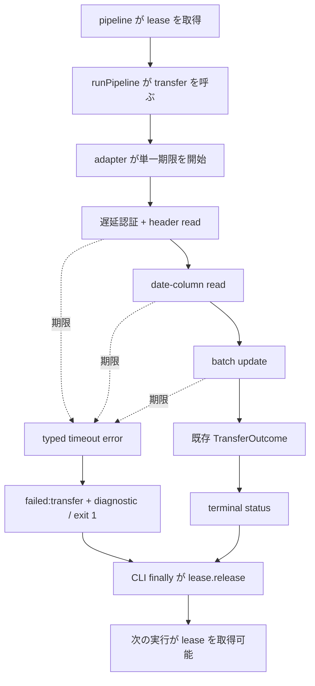

# Google Sheets 操作の単一期限と pipeline lease 解放の実装設計

対象: Issue #280

基準: `main` commit `f52a8eb11707b9bde4de45cf58070e45b689e993`

## 1. 目的

Google Sheets が応答しないときも、一回の adapter 操作を有限時間で終える。

timeout 後は既存の `failed:transfer` として terminal status を書き、pipeline が保持する run lease を解放する。

本書は、2026-08-11T17:20:00+09:00 より前に pipeline shadow acceptance が40分以上終了しなかった事象を入口とする。

同事象では `src/sheets/adapter.ts` の外部呼び出しに timeout が無く、process は Sheets の応答を待ち続けた。

cutover 後は launchd が `pipeline --period` を直接起動するため、一つの hang が次の period の lease 取得も止める。

ただし欠陥は cutover で新設されたものではない。

cutover 前の `run` と `serve` も同じ adapter を使っていた。

変わったのは被害範囲である。

cutover 前の `run` は run lease を取らないため、一つの process が hang しても次回 `run` の lease 取得を塞がなかった。

cutover 後の `pipeline` は process が生きている間、排他 lock を保持する。

## 2. 決定

| 項目 | 決定 |
| --- | --- |
| 期限 | adapter 一回全体で `30_000` ms |
| 境界 | 遅延認証、header read、date-column read、batch update を一つの `AbortSignal` で覆う |
| persisted outcome | 既存の `failed:transfer` |
| stage の識別 | terminal の `diagnostic` に `auth-or-header-read` / `date-column-read` / `batch-update` を保存 |
| batch update timeout | 転記無しとは断定せず、応答未確認として扱う |
| retry | application retry を追加しない |
| lease | adapter では解放せず、pipeline CLI の既存 `finally` で解放 |
| 定義版 | `schemaVersion` / `definitionsVersion` を上げない |
| 利用者設定 | timeout を `settings.json` や環境変数へ追加しない |

`30_000` ms は「30秒以内に応答する」という latency SLO ではない。

30秒を超えた操作を中断し、lease を有限時間で手放すための安全上限である。

## 3. 現行実装の実測

### 3.1 timeout の無い外部呼び出し

`updateSpreadsheetMeasurements` は次の順に外部処理へ進む。

| 順序 | 現行の呼び出し | timeout | 書込みの可能性 |
| ---: | --- | --- | --- |
| 1 | `createGoogleSheetsAuth` と最初の `values.get` | 無し | 無し |
| 2 | date column の `values.get` | 無し | 無し |
| 3 | `values.batchUpdate` | 無し | 有り |

`createGoogleSheetsAuth` の関数本体は `GoogleAuth` object を構築するだけである。

service-account credential の読取と認証用通信は、最初の API request 側で起き得る。

したがって最初の `values.get` で待っている処理を、adapter の外側から「認証」と「header read」へ正確に分離できない。

最初の stage 名は、測っていない区別を作らず `auth-or-header-read` とする。

### 3.2 auth transport の中断可能性

production credential を使わず、memory 上で作った偽 service-account key と local blackhole proxy で実験した。

proxy は TCP connection を受理して109 bytes を受け取った後、response を返さなかった。

同じ1,000 ms signal を `GoogleAuth.clientOptions.transporterOptions` と最初の `values.get` へ渡すと、signal は aborted になり、呼出しは `TimeoutError` で1,614 ms後に reject した。

この結果は token 取得側の transport が signal で中断できることを示す。

同時に、abort 要求時刻と method の reject 時刻が同一ではないことも示す。

### 3.3 error と lease の既存経路

`runPipeline` は `options.transfer` の reject を既に捕捉する。

捕捉後は `failed:transfer`、exit `1`、V-3 transfer state `failed`、error message の diagnostic を同じ terminal write に渡す。

pipeline CLI は `runPipeline` を `try` で呼び、`finally` で `lease.release()` を呼ぶ。

したがって adapter が期限時に reject すれば、outcome の追加や lease 解放処理の複製は要らない。

`acquireRunLease` の lock は `O_EXLOCK` であり、TTL や max age を持たない。

`recoverDeadOwner` が整理するのは dead owner の receipt と socket であり、生きたまま Sheets を待つ process の lock は回収できない。

この process を手で終了しない限り、後続の morning / evening pipeline は `RunLeaseConflictError` になる。



### 3.4 non-acceptance baseline

基準 commit で次を実行し、4 files / 35 tests が PASS した。

```sh
npx vitest run test/sheets/adapter.test.ts test/pipeline/pipeline.test.ts test/cli/run-exit-code.test.ts test/cli/serve-lease.test.ts
```

これは timeout が在る証拠ではない。

既存の adapter、pipeline、run、serve の挙動が設計前に緑だった baseline である。

## 4. 正常時所要の測定

### 4.1 安全な測定条件

本番設定が指す Spreadsheet 以外に sandbox は無い。

本番 Spreadsheet への試験書込みは禁止した。

測定用 `LatestMeasurementSet` は測定値を全て欠落させた。

日付行が偶然一致しても `buildMeasurementUpdateData` は空配列を返すため、`batchUpdate` は構造上呼ばれない。

各試行は production credential による遅延認証、header read、date-column read を行い、`not-written` を確認した。

proxy 環境変数は外して通常の network 経路を測った。

timer は `updateSpreadsheetMeasurements` の直前から resolve までであり、Bun process の起動時間と入力読取は含まない。

### 4.2 結果

| 条件 | n | median | p90 | p95 | max |
| --- | ---: | ---: | ---: | ---: | ---: |
| 同一 process 内で adapter を反復 | 30 | 813 ms | 1,024 ms | 1,371 ms | 1,466 ms |
| 毎回 fresh process | 10 | 1,023 ms | 1,184 ms | — | 1,491 ms |
| 事前の単発 cold | 1 | — | — | — | 2,612 ms |

全41試行は `not-written` で終了した。

単発 cold の一件を含む観測上の worst は2,612 ms である。

warm 反復だけを根拠にすると、launchd が新しい process を起こしたときの初回費用を落とすため、fresh process と単発 cold を分けて残す。

### 4.3 30秒の導出

30秒は、観測 worst 2.612秒を約11.5倍した安全上限である。

倍率は次の未測定分と変動分をまとめて覆う。

| 補正 | 根拠 |
| --- | --- |
| `3 / 2` | 測定した API request は2 read、production は2 read + 1 write |
| `3` | 現行 client は retryable な無応答 request を初回と再試行へ進め得る。正しさは retry 回数へ依存させないが、余裕へ含める |
| `2` | 未測定の write、process 間の負荷差、network の揺らぎ |

`1.5 × 3 × 2 = 9` を、測定外の auth retry と端数のため10倍へ切り上げる。

`2.612秒 × 10 = 26.12秒` を、運用と diagnostic で扱いやすい30秒へ切り上げる。

これは厳密な最大所要の証明ではない。

batch update の正常所要を測っていないため、入力が在る実運用日の full transfer 所要を後から観測し、30秒との差を再評価する。

## 5. 採らない案

| 案 | 内容 | 採らない理由 |
| --- | --- | --- |
| A | adapter 全体へ30秒の単一期限 | 採用。lease 解放の上限を一つにできる |
| B | auth と3 API call の各々へ30秒 | 上限が積み上がり、lease をいつまでに解放するか一意に言えない |
| C | read と write へ別の期限 | batch update の正常所要が無く、write の値を正当化できない |
| D | 外側の `Promise.race` だけで30秒 | 呼出元は戻っても HTTP request を中断せず、socket と process が残り得る |

案 C は廃棄しない。

実運用で batch update を含む分布が取れ、read と write に別の安全上限が必要だと分かった時点で再検討する。

## 6. 単一期限の実装境界

### 6.1 timeout の正本

`src/sheets/adapter.ts` に次の production 定数を一つだけ置く。

```ts
export const GOOGLE_SHEETS_OPERATION_DEADLINE_MS = 30_000;
```

test、diagnostic、acceptance はこの正本を参照または production の出力から読取り、別の30秒を複製しない。

利用者設定にはしない。

安全上限を無制限または過大な値へ変えられると、lease の有限性が設定次第になるためである。

値を変えるときは、本書と同じ測定を取り直し、README の既知の制約と acceptance の上限を同じ PR で追随させる。

### 6.2 `SheetsValuesPort` の再利用

#248 が定義した `SheetsValuesPort` を、timeout の unit seam としても使う。

別の fake Google client を新設しない。

port の各 method は同じ signal を受け取る。

```ts
interface SheetsRequestControl {
  readonly signal: AbortSignal;
}

interface SheetsValuesPort {
  get(
    request: SheetsGetRequest,
    control: SheetsRequestControl,
  ): Promise<SheetsGetResponse>;

  batchUpdate(
    request: SheetsBatchUpdateRequest,
    control: SheetsRequestControl,
  ): Promise<SheetsBatchUpdateResponse>;
}
```

fake port は、header、date column、batch update が同じ `AbortSignal` object を受けたことを検査する。

production port は Google API method の request option に同じ signal を渡す。

### 6.3 遅延認証にも同じ signal を渡す

Google API method だけへ signal を渡しても、最初の request より前の token 取得を覆った証拠にならない。

`createGoogleSheetsAuth` は signal を受け取り、`GoogleAuth` の `clientOptions.transporterOptions.signal` へ渡す。

同じ signal を production port の `values.get` / `values.batchUpdate` にも明示的に渡す。

これにより、一つの controller が auth transport と Sheets transport の両方を中断する。

### 6.4 controller の寿命

`updateSpreadsheetMeasurements` の入口で `AbortController` と30秒 timer を一つ作る。

stage 変数を各 await の直前に更新する。

resolve、通常 error、timeout の全経路で `finally` が timer を解除する。

三呼び出しごとに timer を作り直さない。

先行 read に時間を使えば、後続 write に残る時間も減る。

この性質が、adapter 一回全体を30秒以内に中断する境界である。

30秒ちょうどに method が return することまでは主張しない。

timer の dispatch、HTTP abort の伝播、status write、lease cleanup の実時間が後に続く。

30,000 ms は外部通信へ abort を要求する時点であり、process の bounded exit は acceptance の別の wall-clock 上限で確認する。

## 7. timeout error と persisted status

### 7.1 typed error

adapter は timeout を他の transfer error と区別できる型で reject する。

error は少なくとも次を持つ。

```ts
type GoogleSheetsOperationStage =
  | "auth-or-header-read"
  | "date-column-read"
  | "batch-update";

class GoogleSheetsOperationTimeoutError extends Error {
  readonly code = "google-sheets-operation-timeout";
  readonly stage: GoogleSheetsOperationStage;
  readonly deadlineMilliseconds: number;
  readonly writeState: "not-attempted" | "unknown";
}
```

`auth-or-header-read` と `date-column-read` の `writeState` は `not-attempted` である。

`batch-update` の `writeState` は `unknown` である。

error message は code、stage、deadline、write state だけを含める。

credential path、Spreadsheet ID、request URL、token、raw response は含めない。

controller 自身の signal が aborted のときだけ、元の error を timeout error へ変換する。

期限前の connection refused、HTTP error、credential parse error は既存の transfer error のまま通す。

### 7.2 outcome を増やさない

`runPipeline` は typed timeout も既存の transfer reject として捕捉する。

persisted outcome は `failed:transfer`、exit は `1`、health は既存規則どおり alert である。

stage は diagnostic から人が読める。

現時点で stage を機械的な分岐へ使う consumer は無い。

そのため新しい `failed:transfer-timeout` や persisted field を足さない。

timeout は transfer が完了しなかった一原因であり、count、outcome、window、identity、no-data threshold の意味を変えない。

`schemaVersion` と `definitionsVersion` は上げず、#243 + #246 + #182 の版上げ release train に意味変更として同梱しない。

### 7.3 #276 の period 別 no-data との関係

timeout は weight が在り、transfer へ到達した経路だけで起きる。

morning input-missing の `completed:no-data` / `v3.input=unavailable` と、present-zero の `completed:no-data` / `v3.input=ready` は transfer を呼ばない。

evening input-missing も transfer より前に失敗する。

したがって #276 が定めた period 別の no-data 分類を変えない。

## 8. batch update timeout の不確定性

client が response を受け取る前に期限へ達しても、server が request を適用していないとは限らない。

`batch-update` timeout は「未転記」ではなく「転記結果の応答未確認」である。

この経路で `TransferOutcome { state: "not-written" }` を返さない。

application retry も追加しない。

同じ request の自動再送は、最初の request が適用済みだった場合に同じセルへ二度書くためである。

次回の定期実行または利用者の明示的な再実行は既存運用として残るが、本件で即時 retry loop は作らない。

将来自動 retry を採る場合は、request の適用確認、冪等性、status の attempt identity を先に設計する。

## 9. command ごとの帰結

共有 adapter の期限は `run`、`serve`、`pipeline` の全経路へ効く。

| command | timeout 後 |
| --- | --- |
| `pipeline` | `failed:transfer` を保存し exit `1`。CLI `finally` が lease を解放 |
| `run` | transfer error として nonzero で終了。pipeline status は書かない既存境界を維持 |
| `serve` | scheduler の既存 `.catch` が error を記録し、次の cron 発火を待つ。serve 自身の長命 lease は維持 |

adapter は command ごとの lease を知らない。

adapter 内から `lease.release()` を呼ばない。

## 10. lease 解放の受け入れ条件

pipeline timeout の受け入れ条件は「error が返った」だけではない。

同じ隔離 `HOME` と config namespace で次の順を確認する。

1. weight を含む安定入力を置き、応答しない local proxy を通して compiled `pipeline` を起動する。
2. production deadline 後、test runner 自身ではなく child watchdog が process を回収し、bounded failure を報告する。
3. child が watchdog より先に exit `1` したことを確認する。
4. `pipeline-status.json` が `failed:transfer` と timeout diagnostic を持つことを確認する。
5. `active-run.json` と lock owner が残っていないことを確認する。
6. 同じ隔離 namespace で二回目の pipeline を起動し、`RunLeaseConflictError` ではなく lease を取得できることを確認する。

二回目の実行は network 成功を証明する必要がない。

入力不在など transfer 前に終わる fixture でよく、同じ lease を再取得できたことを証明する。

## 11. 検査設計

### 11.1 unit と integration probe

| ID | 層 | 条件 | 期待 |
| --- | --- | --- | --- |
| P-1 | adapter | fake header が signal の abort まで待つ | typed timeout、stage `auth-or-header-read`、write `not-attempted` |
| P-2 | adapter | header 成功、fake date read が待つ | stage `date-column-read`、write `not-attempted` |
| P-3 | adapter | 二 read 成功、fake batch update が待つ | stage `batch-update`、write `unknown` |
| P-4 | adapter | 三呼び出しが期限内に成功 | 既存の requested / transferred outcome を変更しない |
| P-5 | adapter | fake port が受けた control を記録 | 三呼び出しが同一 signal object を受ける |
| P-6 | auth | 応答しない proxy で token または最初の read が止まる | production auth transport が同一期限で中断 |
| P-7 | pipeline | typed timeout を transfer が投げる | `failed:transfer`、exit `1`、safe diagnostic |
| P-8 | CLI acceptance | P-7 の直後に同じ namespace で再実行 | lease conflict 無し |
| P-9 | run | typed timeout | nonzero。pipeline status は新設しない |
| P-10 | serve | typed timeout | error を記録し、scheduler process は終了しない |

unit probe は fake timer を使い、実時間30秒を待たない。

auth transport と compiled binary の probe は実時間で production default を通す。

### 11.2 network negative control

unused port の connection refused だけでは、永続的な無応答を再現した証拠にならない。

focused acceptance は local proxy が TCP connection を受け付けた後、HTTP response を返さない blackhole を使う。

これにより connection refused、DNS failure、timeout を混同しない。

fixture は構文上有効な一時 service-account credential を使い、production credential をコピーしない。

blackhole proxy が一件以上の connection を受理したことを正の control とする。

connection が0件なら、「timeout が効いた」のではなく対象 network 経路へ到達していないため、probe 自体を失敗させる。

proxy と child process は隔離 `HOME` 内の fixture だけを使い、本番の settings、status、lease、Spreadsheet を触らない。

### 11.3 acceptance の二つの上限

製品の30秒期限と、acceptance runner の安全上限は別の値である。

runner の安全上限は production deadline より長くし、binary startup と fixture 処理の実測余裕を足す。

実装時に focused acceptance の baseline を単独で複数回測り、その分布から runner 上限を決める。

runner の timeout、Bun 欠落、build failure、proxy 起動 failure を mutation の `KILLED` に数えない。

child watchdog が対象 child を回収し、「production deadline を超えても終了しなかった」という assertion failure を返した場合だけ、bounded-exit probe の赤とする。

既存 `pipeline-shadow` acceptance は本件の focused probe に置き換えない。

既存 acceptance が transfer へ到達しても永久に待たないことは確認するが、lease recovery、status shape、producer 非起動という本来の claim は維持する。

## 12. 負のコントロール

変異前 green、対象変異で red、復元後 green の三点を同じ head で取る。

| ID | 変異 | 落ちるべき probe | 期待判定 |
| --- | --- | --- | --- |
| M-1 | deadline timer を開始しない | P-1〜P-3 | KILLED |
| M-2 | header get へ signal を渡さない | P-1、P-5 | KILLED |
| M-3 | date-column get へ signal を渡さない | P-2、P-5 | KILLED |
| M-4 | batch update へ signal を渡さない | P-3、P-5 | KILLED |
| M-5 | GoogleAuth transporter へ signal を渡さない | P-6 | KILLED |
| M-6 | timeout を `completed:transferred` または `not-written` にする | P-7 | KILLED |
| M-7 | batch stage を `writeState=not-attempted` とする | P-3、P-7 | KILLED |
| M-8 | pipeline CLI の `finally` から `lease.release()` を外す | P-8 | KILLED |
| M-9 | normal response でも timeout error を投げる | P-4 | KILLED |

型エラーで止まった変異は `KILLED-BY-TSC` とし、behavior probe が捕捉した `KILLED` に数えない。

### 12.1 非警報対照

| ID | 条件 | 期待 |
| --- | --- | --- |
| L-1 | fake port の三呼び出しが期限内に完了 | timeout diagnostic 無し。既存 outcome |
| L-2 | normal read-only production 経路 | `not-written`。本番 Spreadsheet への write 0件 |
| L-3 | transfer 前の morning / evening no-data | #276 の outcome と counter を維持 |

L-1〜L-3 は `NO-ALARM` と記録し、SURVIVED と呼ばない。

L-2 は本書の値を決めるために承認された一回の測定証拠であり、CI や反復 gate へ接続しない。

継続 gate は production credential と production Spreadsheet を使わず、fake port と隔離 fixture で行う。

## 13. 実装対象

| path | 変更 |
| --- | --- |
| `src/sheets/adapter.ts` | deadline 正本、controller、stage、typed error、同一 signal、#248 port の拡張 |
| `src/auth/google-sheets-auth.ts` | production auth transporter へ同じ signal を渡す |
| `test/sheets/adapter.test.ts` | P-1〜P-5、M-1〜M-4 / M-7 / M-9、normal control |
| `test/pipeline/pipeline.test.ts` | timeout を既存 `failed:transfer` へ写す P-7 |
| `test/cli/run-exit-code.test.ts` | `run` の既存 nonzero 境界 P-9 |
| `test/cli/serve-lease.test.ts` | serve が一回の timeout 後も process を維持する P-10 |
| focused acceptance の shell + Vitest wrapper | P-6、P-8、blackhole proxy、child watchdog |
| `scripts/run-pipeline-shadow-acceptance.sh` | transfer 到達時も無期限に待たないことを追随確認。既存 claim は変えない |
| `README.md` | 外部 Sheets 操作には30秒の安全上限があり、batch timeout は結果未確認である制約 |
| `docs/ACCEPTANCE_TEST_REPORT.md` | baseline、probe、変異三値、lease 再取得証拠 |

#248 の `SheetsValuesPort` が先に landing した状態を基準に実装する。

#280 のためだけに競合する第二の port を作らない。

timeout は定義版の意味変更ではないため、#243 + #246 + #182 と同じ definitionsVersion へ載せる条件は無い。

ただし `src/sheets/adapter.ts` と `test/sheets/adapter.test.ts` は同じ変更点なので、release train を先に landing させ、その head を base に #280 を実装する。

## 14. 実装順序

1. #248 の production port seam と response mapping が landing していることを確認する。
2. P-1〜P-5 の unit baseline を作り、normal control が green であることを確認する。
3. deadline controller と typed error を adapter へ入れる。
4. production GoogleAuth と三 API call へ同じ signal を配線する。
5. pipeline / run / serve の既存 error 境界を probe する。
6. blackhole proxy を使う focused compiled acceptance で bounded exit と lease 再取得を確認する。
7. M-1〜M-9 を一つずつ当て、三値 ledger を残す。
8. README と acceptance report を同じ PR で追随させる。
9. 入力が在る実運用日の full transfer 所要を後日観測し、30秒の余裕を再評価する。

## 15. 完了条件

次を全て満たしたときに完了とする。

1. 遅延認証と三 API call が一つの30秒 signal を共有する。
2. どの stage が無応答でも、adapter は有限時間で typed timeout を投げる。
3. pipeline は `failed:transfer` / exit `1` / stage diagnostic を一つの terminal write に保存する。
4. batch update timeout を未転記と断定せず、application retry を追加しない。
5. timeout 後に同じ隔離 namespace で lease を再取得できる。
6. normal transfer の requested / transferred outcome と #276 の no-data 分類を変えない。
7. M-1〜M-9 の三値と L-1〜L-3 の非警報対照が記録される。
8. README だけで timeout の上限と batch update の不確定性を理解できる。
