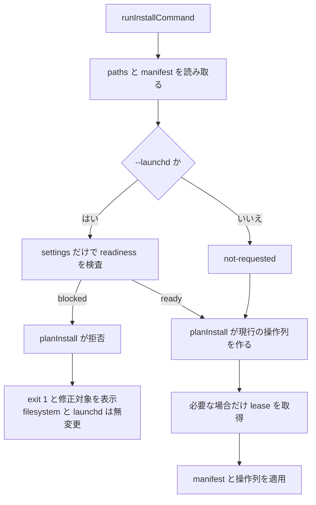

# install --launchd 設定 readiness 実装設計

起草: `scale2sheet_architect_codex`

検証: exact head で `scale2sheet_reviewer_claude` へ依頼する。

| 項目 | 値 |
| --- | --- |
| 起点 | Issue #184 |
| 基準 HEAD | `ccfa29dc5826cf6fea6d495b16fcaa225597925a` |
| 先行 integration | `feature/issue-162-integration` の `6f1372b`。設定 schema の正本を `src/config/contract.ts` へ移す途中 |
| ユーザー決定 | README の注意だけにせず、cutover 前にコマンド側で登録を止める |
| 暫定決定 | 既存登録が在っても readiness 不充足なら bootout せず、全状態を無変更で維持する |
| README への影響 | cutover 前は README を差し替えず、cutover 用の導入手順案を実装後の出力へ追随させる |

## 1. 目的と対象外

`install --launchd` が、設定未完了と認識しながら同じ計画へ launchd 登録を含める経路を閉じる。

登録前の判定対象は、launchd が初回起動時にも同じ値を解決できる**静的設定 readiness**である。

静的設定 readiness は「初回 pipeline が必ず成功する」という保証ではない。

入力公開、認証先の応答、Spreadsheet の状態は登録後にも変わるため、次は対象外とする。

- 入力 directory または Apple Health XML が検査時点で存在すること。
- 認証ファイルの内容で Google へ接続できること。
- Spreadsheet が存在し、対象 sheet と当日行を読めること。
- scale_exporter が当日の入力を公開済みであること。
- `doctor` の外部接続検査を install から実行すること。
- `--force` で readiness を迂回すること。

install は network deny の環境でも完了できる既存契約を維持する。

## 2. 現行実装で起きること

`runInstallCommand` は `settings.json` の存在を読み、存在する場合だけ認証ファイルの path を検査する。

`settings.json` が無い場合は `missingAuthFiles` を空配列にし、`planInstall` は `ensure-settings` と二つの `bootstrap` を同じ操作列へ入れる。

| HOME の状態 | 現行の結果 | 問題 |
| --- | --- | --- |
| `settings.json` が無い | exit `0`。`ensure-settings` と朝夕の `bootstrap` を計画 | 生成直後の未完成 template で自動実行を開始できる |
| settings と参照先認証ファイルが在る | exit `0`。朝夕を登録 | 期待する経路 |
| settings は在るが参照先認証ファイルが無い | exit `1`。`failed:missing-auth-files` | 既に fail fast している |
| `sheet-id` が無いが参照先認証ファイルが在る | exit `0`。朝夕を登録 | schema では optional だが pipeline 起動時には必須 |

`buildPipelinePlist` が渡す環境変数は `HOME`、`PATH`、`SCALE2SHEET_LAUNCHD_LABEL` の三つである。

したがって、install を実行した shell の `GOOGLE_*`、`SCALE_EXPORTER_OUTPUT_DIR`、`APPLE_HEALTH_EXPORT_XML` を readiness 判定へ混ぜると、install だけが成功し launchd 起動時に失敗する。

## 3. 方式比較

| 案 | 不足時の処理 | 利用者に起きること | 判定 |
| --- | --- | --- | --- |
| A | operation を一件も作る前に拒否する | まず `install` で template と binary を配置し、設定後に `install --launchd` を再実行する | 採用 |
| B | plist を配置するが bootstrap せず disabled または pending として残す | enable 用の追加 command と状態管理が必要になり、配置済み plist と manifest に中間状態が増える | 不採用 |
| C | 同じ run で template を作り、その直後に readiness を検査する | template は `sheet-id` と source 固有設定を持たないため必ず停止し、部分的な install だけが残る | 不採用 |

案 A は、既存の二段階導入をコマンドの不変条件へ変える。

案 B は登録していない plist の寿命、enable 手順、manifest の pending 状態を新設するが、Issue #184 はそこまで要求していない。

案 C は実質的に `install` と `install --launchd` を一回の失敗 command へ詰めるだけであり、利用者が修正後に再実行する回数を減らさない。

## 4. 静的設定 readiness

### 4.1 検査条件

`--launchd` を指定した場合、次の条件をすべて満たした状態を `ready` とする。

| ID | 条件 | 判定方法 | 不充足の例 |
| --- | --- | --- | --- |
| R-1 | `settings.json` が既に存在する | `readSettings(settingsPath)` が `undefined` でない | 初回の空 HOME |
| R-2 | JSON と settings schema が正しい | 既存の `readSettings` と `parseSettingsFile` を通す | 空文字、列挙外 source、型違反 |
| R-3 | Google Sheets 設定を構築できる | shell の `process.env` を渡さず設定を解決し、`requireGoogleSheetsConfig` を通す | `sheet-id` または `sheets-credentials` 欠落 |
| R-4 | 選択 source の設定を構築できる | 解決済み `defaultSource` に `requireSourceConfig` を適用する | source 固有 path または Google Fit client credentials 欠落 |
| R-5 | 必須の認証ファイル path が存在する | 既存の `resolveMissingAuthFiles` と同じ stat 検査を行う | Sheets credential file、Google Fit 選択時の token file 欠落 |

R-3 と R-4 の設定解決では、概念上 `loadConfig({}, { settingsPath })` と同じ環境を使う。

空 object は、launchd plist が引き継がない shell 環境変数を遮断する。

Google Fit の `google-fit-credentials.json` または settings 内の client credentials は永続設定なので利用できる。

source 別の必須条件は次のとおりである。

| source | 必須の論理設定 | 存在を検査する認証ファイル | 存在を検査しない runtime 入力 |
| --- | --- | --- | --- |
| `scale-exporter` | `scale-exporter-output-dir` | Sheets credential file | output directory と当日 JSONL |
| `apple-health` | `apple-health-export-xml` | Sheets credential file | export XML |
| `google-fit` | client ID、client secret、token path | Sheets credential file、Google Fit token file | Google API の応答 |

`source` が無ければ既存契約どおり `scale-exporter` として判定する。

`sheet-name`、time zone、schedule 関連値は既存の既定値を持つため、キーの明示を readiness 条件にしない。

### 4.2 結果型

readiness は boolean にせず、利用者が直す対象を失わない結果型にする。

概念形は次のとおりである。

```ts
type LaunchdReadiness =
  | { readonly status: "not-requested" }
  | { readonly status: "ready" }
  | {
      readonly status: "blocked";
      readonly issues: readonly LaunchdReadinessIssue[];
    };

type LaunchdReadinessIssue =
  | { readonly code: "settings-missing"; readonly path: string }
  | { readonly code: "settings-invalid"; readonly detail: string }
  | { readonly code: "sheets-config-missing"; readonly detail: string }
  | { readonly code: "source-config-missing"; readonly source: string; readonly detail: string }
  | { readonly code: "auth-file-missing"; readonly path: string };
```

`issues` は、settings を読めない場合を除き、Sheets と source と auth の不足をまとめて返す。

利用者が一項目ずつ直して再実行する往復を避けるためである。

## 5. 責務と処理順

readiness の検査機構は `src/installation/launchd-readiness.ts` へ置く。

設定 schema を直接複製せず、#162 integration 後の production 正本を消費する `loadConfig` と既存の `require*Config` を再利用する。



`runInstallCommand` は readiness を計算して `planInstall` へ渡すが、blocked を見て独自に早期 return しない。

`planInstall` を「launchd operation を生成できる唯一の関門」とし、`options.launchd` かつ readiness が `ready` でない場合に新設する `LaunchdNotReadyError` を投げる。

`not-requested` は launchd 固有の論理設定だけを検査対象外にする。

settings が既に在る通常の `install` で認証ファイルが欠けていれば拒否する既存の AC-04 は維持する。

ただし AC-04 が別途要求する認証ファイルの入手方法は本設計の対象外であり、#184 の実装だけを根拠に AC-04 を PASS へ変更しない。

CLI と planner の両方へ同じ拒否条件を複製すると、一方を壊した変異がもう一方に遮られ、どの検査が安全性を保証したか分からなくなるためである。

`planInstall` の拒否は、operation 配列の作成、maintenance lease 取得、manifest の `installing` 遷移、binary 置換、plist 書込み、`bootout`、`bootstrap` より前でなければならない。

binary source の解決、path 解決、manifest 読取り、settings 読取り、認証ファイルの stat は read-only なので拒否前に実行できる。

## 6. 不足時の外部契約

readiness が blocked の場合は dry-run と実行の双方を exit `1` にする。

`[planned]` 行は一行も表示しない。

少なくとも次を stderr へ出す。

1. 安定した prefix `failed:launchd-not-ready`。
2. issue code と不足した設定または絶対 path。
3. 読み取った `settings.json` の絶対 path。
4. `install` を `--launchd` なしで実行し、設定後に元の command を再実行する手順。

認証ファイル欠落の `failed:missing-auth-files <paths>` は既存の利用者向け契約なので維持する。

`--launchd` で認証ファイルが欠けた場合は、`failed:launchd-not-ready` の後に既存の `failed:missing-auth-files` 行を詳細として出す。

`--launchd` の無い既存経路は、従来どおり `failed:missing-auth-files` だけを出す。

複数 issue がある場合は全件を表示するが、exit code は一回だけ `1` とする。

`--force` は active run の扱いに関する option であり、readiness の bypass には使わない。

## 7. 既存登録と再実行

readiness の結果は新規 install と再 install で変えない。

| 登録状態 | readiness | 結果 |
| --- | --- | --- |
| 未登録 | blocked | exit `1`。settings、binary、manifest、plist、label を変更しない |
| 未登録 | ready | 現行どおり binary を配置し、朝夕を登録する |
| 登録済み | blocked | exit `1`。既存 label を bootout せず、manifest と plist も変更しない |
| 登録済み | ready | 現行どおり period ごとに `bootout`、`write-plist`、`bootstrap` の順で置き換える |

blocked の再 install が既存 label を停止しない理由は、失敗 command が別の欠測を発生させないためである。

既存登録の停止が目的なら、利用者は readiness の失敗に便乗せず `uninstall` を明示的に使う。

この扱いは、既に登録された不完全な job を自動修復または自動停止するものではない。

設定を直して再 install するか、明示的に uninstall するまで既存状態は残る。

## 8. 試験設計

### 8.1 baseline probes

| ID | 層 | 条件 | 必須 assert |
| --- | --- | --- | --- |
| P-1 | planner unit | launchd、`settings-missing` | `LaunchdNotReadyError`。operation を取得できない |
| P-2 | CLI unit | 空の隔離 HOME、launchd | exit `1`。lease、executor、manifest、binary、plist、launchctl の call が `0` |
| P-3 | CLI unit | settings は在るが `sheet-id` と source 固有設定が無い | exit `1`。両不足 code を表示し、全 mutation が `0` |
| P-4 | CLI unit | shell env だけに Sheets と source の値が在る | exit `1`。shell env を readiness に流用しない |
| P-5 | CLI unit | 登録済み manifest、readiness blocked | exit `1`。manifest bytes 不変、`bootout` と `bootstrap` が `0` |
| P-6 | planner unit | launchd、readiness ready | 朝夕それぞれ `bootout`、`write-plist`、`bootstrap` の順 |
| P-7 | acceptance | 隔離 HOME と fake launchctl で blocked 条件を実行 | nonzero、tree hash 不変、fake launchctl log が空 |

P-7 は production の HOME、plist、label、`dist/scale2sheet` を使わない。

`scripts/run-installer-acceptance.sh` が既に使う一時 binary、隔離 HOME、fake launchctl、network deny を再利用する。

### 8.2 非警報対照

| ID | 条件 | 期待 |
| --- | --- | --- |
| L-1 | settings が無く、`--launchd` も無い初回 `install` | NO-ALARM。template と binary を配置できる |
| L-2 | settings と必要な auth が揃った `install --launchd` | NO-ALARM。朝夕の登録計画を生成できる |
| L-3 | source path は設定済みだが runtime 入力はまだ存在しない | NO-ALARM。外部状態を readiness と誤認しない |
| L-4 | 登録済みで readiness ready の再 install | NO-ALARM。既存の冪等な置換順を維持する |

非警報対照に `SURVIVED` を使わない。

`SURVIVED` は壊した変異を検査が捕捉できなかった判定に限定する。

### 8.3 変異

変異前の対象 probe が緑であることを確認し、変異、対象 probe、復元後の三段階を記録する。

| ID | 変異 | 落ちるべき probe | 意味 |
| --- | --- | --- | --- |
| M-1 | planner の blocked 拒否条件を常に false にする | P-1、P-2、P-7 | 設定欠落で launchd operation を作れる回帰を捕捉する |
| M-2 | settings 不在を `ready` と返す | P-2、P-7 | 検出器が空 HOME を見落とす回帰を捕捉する |
| M-3 | readiness の config 解決へ `process.env` を渡す | P-4 | shell だけで通り、launchd で再現しない回帰を捕捉する |
| M-4 | auth file 欠落 issue を除外する | 既存 AC-04 probe、P-7 の auth 条件 | 現行の認証 fail fast を失う回帰を捕捉する |
| M-5 | readiness 検査を既存登録の `bootout` 後へ移す | P-5 | failed reinstall が稼働中 label を止める回帰を捕捉する |

各変異は `KILLED`、`KILLED-BY-TSC`、`SURVIVED` の三値で報告する。

型検査で対象 probe の起動前に落ちた場合は `KILLED-BY-TSC` であり、readiness behavior を検出した証拠へ数えない。

timeout、Bun 欠落、test runner 起動失敗、変異前から赤い baseline も `KILLED` へ数えない。

## 9. 変更面

| path | 変更 |
| --- | --- |
| `src/installation/launchd-readiness.ts` | readiness 結果型、settings-only 解決、source と Sheets の要求、auth stat を実装する |
| `src/installation/planner.ts` | readiness を入力に加え、launchd operation を作る前の単一 guard を置く |
| `src/cli/installation.ts` | readiness の計算、error formatting、exit `1` を配線する |
| `test/installation/launchd-readiness.test.ts` | R-1 から R-5、shell env 遮断、runtime 外部状態の対象外を検査する |
| `test/installation/planner.test.ts` | blocked と ready の operation 不変条件を検査する |
| `test/cli/installation.test.ts` | 無変更、既存登録保持、診断を検査する |
| `scripts/run-installer-acceptance.sh` | 空 HOME の launchd dry-run を成功扱いする旧 Check 4 を blocked 契約へ更新し、ready 対照を別 HOME で置く |
| `docs/INSTALLATION_DESIGN.md` | 登録前 readiness、拒否順、既存登録保持を反映する |
| `docs/superpowers/plans/2026-08-09-cutover-readme-installation.md` | `ensure-settings` を目視する旧分岐を新しい失敗 prefix と二段階 command へ更新する |
| `docs/ACCEPTANCE_TEST_REPORT.md` | AC-04 に blocked と ready の証跡、変異判定を追記する。ただし認証ファイルの入手方法が未実装なら PASS へ変更しない |

#162 integration が先に main へ入った場合も、#184 は `settingsFileShape` を再定義しない。

readiness は `src/config/contract.ts` を間接的に消費する production loader を使う。

## 10. README 反映と cutover 順序

現行 README は手動 plist 手順を正規経路としているため、#184 の設計 PR では README を差し替えない。

実装 PR は cutover 用 README 案を同時に更新し、次の説明を固定する。

1. 初回は `install` を `--launchd` なしで実行する。
2. 表示された path の `settings.json` と認証ファイルを整える。
3. `install --dry-run --launchd` が blocked でないことを確認する。
4. `install --launchd` で登録する。

cutover 時は README 本文、Mermaid 図、`test/docs/diagrams.test.ts`、README contract gate を同じ release train で更新する。

#184 の実装と負のコントロールが通る前に、installer plist を正規の launchd 経路へ切り替えない。

## 11. 完了条件

- R-1 から R-5 が production の設定正本を再利用して実装されている。
- install 時の shell 環境だけで readiness が緑にならない。
- blocked では新規と既存登録の双方が全状態無変更で exit `1` になる。
- ready では既存の朝夕再登録順が変わらない。
- `--force` が readiness を迂回しない。
- P-1 から P-7 と L-1 から L-4 が通る。
- M-1 から M-5 を三値で記録し、少なくとも設定欠落を通す実行可能な変異が `KILLED` になる。
- cutover 用 README 案、installation 設計、AC report が実装と一致する。
- production の HOME、plist、label、`dist/scale2sheet` を検査で変更していない。
