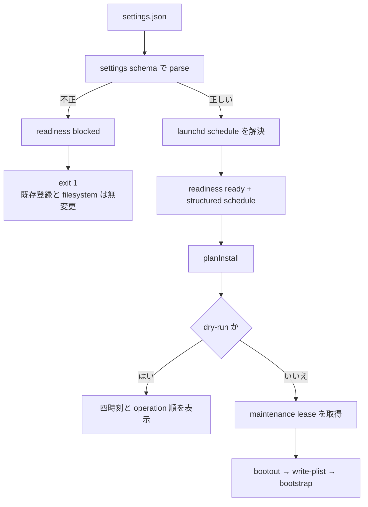
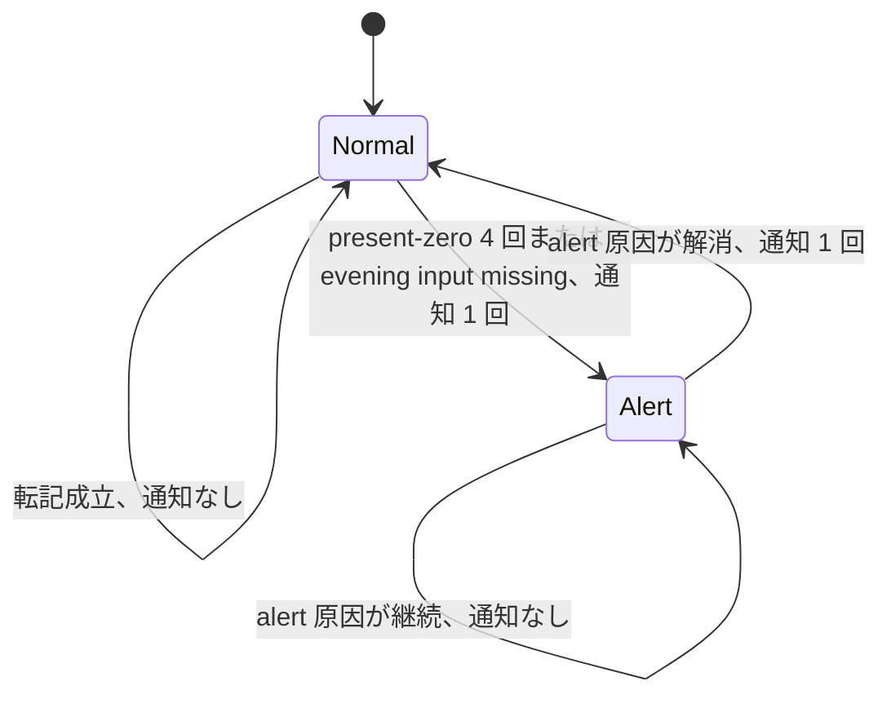

# launchd 実行時刻の設定可能化と既定値変更の設計

起草: `scale2sheet_architect_codex`

検証: exact head で `scale2sheet_reviewer_claude` へ依頼する。

| 項目 | 値 |
| --- | --- |
| 起点 | Issue #179、Issue #259 |
| 初版の基準 HEAD | `ad971e918a6ba7b983b6d427fdd8865f15fa5bf9` |
| 本追記の基準 HEAD | `47f5cb127943c2dfe952436837e568e6e4975d8d` |
| ユーザー決定 | morning の時刻をずらして launchd の時刻を設定可能にする。morning の対象日入力ファイル不在は no-data として扱う |
| 決定の記録 | Issue #259 の 2026-08-11T08:17:27+09:00、2026-08-11T14:50:35+09:00 の manager コメント |
| 決定の検証範囲 | manager の証言であり、reviewer の検証範囲外 |
| 本書の設計 | `settings.json` に launchd 専用 schedule を置き、既定値を `07:30 / 11:30` と `21:10 / 23:40` にする。morning の input-missing は `completed:no-data` と `v3.input=unavailable` の組で表す |
| 未決事項 | なし。cutover の実行可否は本書と別の gate で判定する |
| README への影響 | 設定表、JSON 例、launchd 導入手順、構成図、時刻表、period 別の input-missing 契約を該当 release train で更新する |

## 1. 対象と結論

launchd の四つの実行時刻を `settings.json` から変更できるようにする。

新しい設定は `morning-cron` と `evening-cron` を再利用せず、launchd 専用の `launchd-schedule` とする。

環境変数による上書きは追加しない。

既定値は次の四つとする。

| period | 本実行 | 拾い直し |
| --- | --- | --- |
| `morning` | `07:30` | `11:30` |
| `evening` | `21:10` | `23:40` |

設定変更だけでは登録済み plist を変更しない。

利用者は `install --dry-run --launchd` で四時刻を確認し、`install --launchd` を明示的に再実行して反映する。

設定が不正な場合は Issue #184 の readiness gate で拒否し、既存 plist、label、binary、manifest を変更しない。

Issue #179 の変更手段と Issue #259 の既定値変更は、同じ settings schema、planner、plist、README を変更するため、一つの実装 PR で扱う。

ただし、時刻変更だけでは morning の入力不在を解消しない。

43 日中 28 日は `11:30` までに独立した morning 公開を確認できず、schedule をずらしても入力不在の分類は残る。

このため、morning の対象日入力ファイル不在は `completed:no-data`、exit `0` とする。

status では `v3.input=unavailable` を残し、ファイルが存在して window 適用後に零件だった `v3.input=ready` と区別する。

evening の入力不在は、43 日の観測でほぼ毎日公開されている実態から異常の可能性が高いため、`failed:input-missing`、exit `1`、health alert を維持する。

この outcome と counter の意味変更は schedule/settings の実装 head へ単独で入れない。

Issue #243、Issue #246、Issue #182 の意味変更と同じ definitions release train へ載せ、`definitionsVersion` の版上げと履歴の再基準化を一回にまとめる。

## 2. 現行実装

基準 HEAD の実装は、launchd と `serve` の時刻を別の正本から得る。

| 対象 | 現在の正本 | 現在の使われ方 |
| --- | --- | --- |
| launchd | `src/installation/planner.ts:38-41` の `LAUNCHD_SCHEDULE` | morning と evening の plist へ各二時刻を渡す |
| `serve` | `settings.json` の `morning-cron` と `evening-cron` | `src/config/env.ts:120-146` で runtime config へ写す |
| plist | `src/installation/plist.ts:47-79` の `buildPipelinePlist` | `StartCalendarInterval` の配列を生成する |
| install | `src/cli/installation.ts:290-428` の `runInstallCommand` | readiness、計画、dry-run、適用の順で処理する |

`planInstall` は period ごとに `bootout`、`write-plist`、`bootstrap` を並べる。

`write-plist` の operation description は label だけを表示し、登録予定の時刻を表示しない。

したがって、現行の dry-run では操作順を確認できても四つの時刻を確認できない。

Issue #184 の実装により、launchd readiness が `blocked` なら operation を作る前に `LaunchdNotReadyError` で停止する。

この順序を維持すれば、新しい schedule の型違反や値域違反も既存登録へ触れる前に拒否できる。

## 3. 公開時刻の実測

### 3.1 測定方法

測定期間は 2026-06-29 から 2026-08-10 までの 43 暦日である。

環境変数、`settings.json`、既定値の順で実効 output directory を解決し、その directory の google-fit JSONL を読み取りだけで集計した。

入力可用性の集計では、各日について対象日を filename に持つファイルの最初の mtime を公開時刻の proxy とした。

`07:10` と `11:40` の集計は、予定時刻から 10 分以内に対象日ファイルが現れたかを数える。

mtime は nominal schedule から最初の target-date file が現れるまでの proxy である。

exporter process の start と end を保存した log ではないため、「exporter の実行時間を実測した」とは扱わない。

### 3.2 元の集計と legacy の混入

元の 43 日集計は次のとおり再現した。

| 締切 | 公開あり | 公開なし |
| --- | ---: | ---: |
| `07:10` | 13 | 30 |
| `11:40` | 22 | 21 |

しかし、`07:10` から `11:40` の間に増えた九日のうち七日は、`11:30:31` から `11:39:43` に初回公開されていた。

この七日は PR #160 より前の legacy `scripts/run-pipeline.sh` が `11:30` に exporter を起動した期間に属する。

PR #160 は 2026-08-09T13:45:06+09:00 に merge され、consumer から exporter を起動する処理を削除した。

したがって、この七日を cutover 後の `11:30` 回収実績へ含めない。

cutover 後へ使える観測は次のように狭まる。

| 条件 | 日数 |
| --- | ---: |
| `07:10` までに公開 | 13 / 43 |
| `07:15:04` までに公開 | 14 / 43 |
| `08:27:26` までに公開 | 15 / 43 |
| `11:30` までに独立した公開を確認できない | 28 / 43 |

`08:27:26` の一件は、予定された `07:00` run の遅い完了か、別の再実行かを現存データから帰属できない。

この一件を捕まえるために本実行を `08:30` へ置くと、帰属できない一件のために毎日一時間遅らせる。

既定値の根拠には含めない。

### 3.3 分布

morning cluster は、各日の target-date file の最初の mtime が `07:00:00` から `07:20:00` に入る十四日を対象とする。

evening cluster は、各日の target-date file から `21:00:00` から `21:10:00`、または `23:30:00` から `23:40:00` に入る最初の mtime を slot ごとに一件選ぶ。

percentile は nearest-rank で求めた。

| cluster | n | median | p90 または p95 | max |
| --- | ---: | ---: | ---: | ---: |
| morning `07:00` | 14 | 00:38 | p90 09:48 | 15:04 |
| evening `21:00` | 23 | 00:35 | p95 04:05 | 04:10 |
| evening `23:30` | 23 | 00:36 | p95 04:19 | 08:24 |

2026-08-10 の `21:00:35` には二十ファイルが同じ秒に公開されていた。

この観測は、少なくともその実行では publication がファイルごとに長時間ばらつかず、batch に近いことを示す。

### 3.4 数値の限界

元の `30 / 43` と補正後の `28 / 43` は、予定時刻から十分に遅い締切を置いた入力可用性の proxy である。

実際の通知回数ではない。

観測された `07:00` cluster の最初の mtime はすべて `07:00` より後である。

したがって、consumer が予定時刻直後に入力を列挙すれば、`07:10` までに公開される十三日でも race し得る。

本書は `70%` から `65%` への差を、alert 頻度そのものではなく morning 終了時点の入力不在 proxy の差として扱う。

### 3.5 no-data 判断に使った別の母集団

ユーザー決定時に manager が示した `29 / 43`、約 `67%` は、07 時台に対象日ファイルが公開されなかった日の割合である。

これは §3.2 の「`11:30` までに独立した公開を確認できない `28 / 43`」とは締切と判定条件が異なる。

`67%` を schedule 変更後の alert 頻度や、`07:30` 時点の入力不在率へ読み替えない。

本書で no-data とする条件は割合ではなく、実行時に morning の対象日入力ファイルが存在しないことである。

## 4. 方式比較

| 案 | 方法 | 利点 | 問題 | 判定 |
| --- | --- | --- | --- | --- |
| A | `LAUNCHD_SCHEDULE` の固定値だけを変える | 変更量が小さい | Issue #179 を残し、upgrade で手編集を再び上書きする | 不採用 |
| B | `morning-cron`、`evening-cron` または環境変数を再利用する | 新しい top-level key を増やさない | `serve` は一 period 一 cron、launchd は一 period 二 slot であり、意味と個数が違う | 不採用 |
| C | `settings.json` に launchd 専用 schedule を置く | 設定の正本と install の再現性を両立する | settings schema と README の追加が要る | 採用 |

案 B の環境変数は install process の一時状態である。

同じ `settings.json` を使った次回 install で環境変数が無ければ既定値へ戻り、登録済み plist の再現元にならない。

案 C は永続する利用者設定だけを入力にし、再 install が同じ plist を再生成できる。

## 5. settings 契約

### 5.1 外部形式

設定は次の形とする。

```json
{
  "launchd-schedule": {
    "morning": ["07:30", "11:30"],
    "evening": ["21:10", "23:40"]
  }
}
```

`launchd-schedule` を省略した既存 settings は、新しい既定値へ解決する。

`launchd-schedule` を書く場合は `morning` と `evening` の両方を必須とし、片方だけを既定値で補完しない。

部分補完を許すと、利用者が片方の key を書き忘れても install が成功し、意図しない時刻を登録するためである。

### 5.2 値の規則

| 規則 | 判定 |
| --- | --- |
| period | `morning` と `evening` の二つだけ |
| 要素数 | 各 period ちょうど二つ |
| 形式 | zero padding された 24 時間表記 `HH:mm` |
| 値域 | `00:00` から `23:59` |
| 重複 | 同じ period 内では禁止 |
| 順序 | 同じ暦日内で昇順 |
| 未知 field | `launchd-schedule` object 内では拒否 |

実行時刻は macOS の local wall clock である。

`time-zone` は入力の対象日と測定時刻の解釈に使う設定であり、launchd の system clock を変更しない。

schedule を変えても morning と evening の測定 window は変わらない。

top-level settings の未知 key を許す既存の `.passthrough()` 契約は、本件だけでは変更しない。

このため、利用者は dry-run に表示された四時刻を確認条件とし、settings file を編集したことだけを適用済みの証拠にしない。

### 5.3 production 正本

`src/config/launchd-schedule.ts` を新設し、次の production 型、既定値、nested schema、解決関数を置く。

```ts
type LaunchdPeriodSchedule = readonly [LaunchdTime, LaunchdTime];

interface LaunchdSchedule {
  readonly morning: LaunchdPeriodSchedule;
  readonly evening: LaunchdPeriodSchedule;
}

interface LaunchdTime {
  readonly hour: number;
  readonly minute: number;
}
```

`DEFAULT_LAUNCHD_SCHEDULE` は四つの既定値を持つ唯一の production 正本とする。

`defaultSettingsContent` はこの定数から `HH:mm` を生成し、値を手書きで複製しない。

基準 HEAD では `src/config/settings.ts` の `settingsFileSchema` と `SettingsFile` が settings の active 正本である。

ここへ `launchd-schedule` の nested schema を追加する。

`src/config/env.ts` の mapping と環境変数 schemaには追加しない。

## 6. readiness から plist までの流れ

### 6.1 validated data を一度だけ渡す

`evaluateLaunchdReadiness` は settings の構文と値域を検査した後、`ready` に解決済み schedule を含める。

概念形は次のとおりである。

```ts
type LaunchdReadiness =
  | { readonly status: "not-requested" }
  | { readonly status: "ready"; readonly schedule: LaunchdSchedule }
  | { readonly status: "blocked"; readonly issues: readonly LaunchdReadinessIssue[] };
```

planner は settings file を読み直さず、`ready.schedule` だけを plist 生成へ渡す。

readiness と planner が別々に settings を解釈すると、検査した値と登録した値が異なる経路ができるためである。

`runInstallCommand` が readiness より前に行う現在の `readSettings` は、launchd 経路では schedule 不正を未処理例外にしない形へまとめる。

schedule の parse error は `evaluateLaunchdReadiness` の `settings-invalid` へ一意に分類する。



### 6.2 readiness の拒否

次の条件は `settings-invalid` として `failed:launchd-not-ready` で拒否する。

- `launchd-schedule` の型違反。
- period の欠落。
- 時刻の形式または値域違反。
- 要素数の違反。
- 重複または逆順。
- nested object の未知 field。

拒否は operation 作成、maintenance lease、manifest 遷移、binary 置換、plist 書込み、`bootout`、`bootstrap` より前に行う。

`--force` は readiness を迂回しない。

### 6.3 operation と表示

`write-plist` operation は XML だけでなく、XML と同じ入力から得た structured schedule を持つ。

`describeOperation` は次のように period の二時刻を表示する。

```text
[planned] write-plist jp.seijin.kappa.scale-pipeline.morning schedule=07:30,11:30
[planned] write-plist jp.seijin.kappa.scale-pipeline.evening schedule=21:10,23:40
```

dry-run は副作用を持たず、利用者が settings file を編集した事実ではなく、登録される四時刻を確認できる出力にする。

成功した非 dry-run install も、朝夕の適用時刻を完了表示へ含める。

## 7. 既存登録と再実行

settings file の編集だけでは、launchd に登録済みの `StartCalendarInterval` は変わらない。

適用規則は次のとおりである。

| 既存登録 | schedule | command | 結果 |
| --- | --- | --- | --- |
| 無し | 不正 | `install --launchd` | exit `1`。登録しない |
| 在り | 不正 | `install --launchd` | exit `1`。既存 plist と label を変更しない |
| 無し | 正しい | `install --launchd` | 新しい schedule で登録する |
| 在り | 正しい | `install --launchd` | period ごとに `bootout`、`write-plist`、`bootstrap` で置き換える |
| 在り | 正しいが settings だけ変更 | command 未実行 | 旧 schedule のまま |

手編集した plist も、valid な再 install では settings から生成した値で上書きする。

正本を settings へ戻し、手編集と次回 install の drift を残さないためである。

active pipeline または active `serve` がある場合の maintenance lease と `--force` の契約は変更しない。

schedule の自動 watch と、自動再登録は行わない。

### 7.1 doctor の表示

既存の `docs/INSTALLATION_DESIGN.md` は install 完了表示と doctor が四つの実時刻を列挙する契約を持つ。

実装時はこの未配線契約も schedule の同じ structured data から満たす。

doctor は settings から得た期待時刻と、登録済み plist の `StartCalendarInterval` を period ごとに比較する。

一致すれば `PASS` と実時刻を表示し、不一致なら `FAIL` と期待値、観測値、`install --launchd` の再実行手順を表示する。

settings または plist を読めず比較不能なら、正常と推測せず `WARN` とする。

doctor は read-only を維持し、schedule を修復しない。

## 8. 既定値の根拠

### 8.1 morning

`07:30` は、`07:00` cluster の観測 max `07:15:04` から十四分五十六秒の余裕を持つ。

`07:15` では観測 max と同じ分に consumer と producer が競合するため、既定値にしない。

`08:30` は帰属不能な `08:27:26` の一件を捕まえるが、毎日一時間遅らせるため採らない。

`11:30` は対応する upstream schedule を持たない。

この slot は `07:00` run の遅い公開または手動公開を拾い直すために維持する。

### 8.2 evening

`21:10` は `21:00` cluster の観測 max 四分十秒から五分五十秒の余裕を持つ。

`23:40` は `23:30` cluster の観測 max 八分二十四秒から一分三十六秒の余裕を持ち、日付境界まで二十分を残す。

後者の余裕は morning と `21:00` slot より小さい。

実装後の observation では、`23:40` 時点の target-date file 不在を slot 別に記録し、観測 max を超えた場合に既定値を再評価する。

## 9. morning の入力不在

### 9.1 採用する分類

schedule 変更後も 28 / 43 日では `11:30` までの独立した morning 公開を確認できない。

ユーザー決定により、morning の対象日入力ファイル不在は no-data として扱う。

period と入力状態ごとの契約は次のとおりである。

| period と入力状態 | outcome | `terminal.v3.input` | exit | `consecutiveNoDataCount` | health |
| --- | --- | --- | ---: | --- | --- |
| morning、対象日ファイル不在 | `completed:no-data` | `unavailable` | `0` | 前回値を維持し、増やさない | この事実だけでは alert にしない |
| いずれかの period、ファイルは在るが window 適用後に零件 | `completed:no-data` | `ready` | `0` | 一つ増やす | 四回連続で `consecutive-no-data` alert |
| evening、対象日ファイル不在 | `failed:input-missing` | `unavailable` | `1` | 前回値を維持する | `terminal-failure` alert |
| いずれかの period、転記成立 | `completed:transferred` | `ready` | `0` | 零へ戻す | 他の異常が無ければ normal |

morning の input-missing で counter を零へ戻さない。

零へ戻すと、実際に四回続いた present-zero の途中へ expected input-missing が一度入るだけで、AC-44 の連続 no-data 検知を解除するためである。

前回から `consecutive-no-data` alert が継続している場合は、morning の input-missing だけで回復させない。

「この事実だけでは alert にしない」は、既存の別原因まで normal へ上書きする意味ではない。

### 9.2 AC-45 の判定を維持する

AC-45 の要求は、対象日ファイル不在と、ファイルはあるが window 適用後に零件である状態が、status 上の別の値として区別できることである。

変更後は両方の outcome が `completed:no-data` になるが、status の terminal は次の異なる値を持つ。

| 観測 | status 上の値 |
| --- | --- |
| 対象日ファイル不在 | `(outcome=completed:no-data, v3.input=unavailable)` |
| ファイル在り、window 適用後に零件 | `(outcome=completed:no-data, v3.input=ready)` |

したがって、outcome 単独ではなく status の組で二状態を区別でき、AC-45 の acceptance の本質と PASS 判定を維持する。

ただし、2026-08-04 の詳細定義は file 不在の具体値を `failed:input-missing` と明記している。

この具体値は、2026-08-11 のユーザー決定により morning について supersede される。

過去の決定本文は当時の記録として消さず、本書を後続決定の記録とする。

区別の手段は次のように変わる。

| period | 旧契約 | 新契約 |
| --- | --- | --- |
| morning | outcome の `failed:input-missing / completed:no-data` | `(completed:no-data, v3.input=unavailable / ready)` の組 |
| evening | outcome の `failed:input-missing / completed:no-data` | 変更なし |

morning の二状態は新契約でも status 上の別の値であり、evening の区別も失われない。

このため AC-45 の acceptance 判定は PASS を維持できる。

新しい `noDataReason` field は追加しない。

同じ観測を `v3.input` と二重に保持すると、片方だけが更新される drift を作るためである。

代わりに、現行 definitions の terminal では `v3` と `v3.input` を必須として検証する。

旧 binary または不完全な writer が `v3` を落とした status を、reader が正常な no-data と推測して受理してはならない。

### 9.3 不採用案

| 案 | 不採用理由 |
| --- | --- |
| outcome を `failed:input-missing` のまま health だけ normal にする | ユーザー決定の `completed:no-data`、exit `0` と一致せず、failed が alert である既存の一貫性も崩す |
| morning と evening の両方を no-data にする | evening は 43 日の観測でほぼ毎日公開され、入力不在が異常である可能性を隠す |
| 新しい reason field を追加する | `v3.input` と同じ事実を重複して正本が二つになる |
| first slot だけ pending にする | runtime は二つの launchd slot を識別せず、時刻からの推定は遅延起動を誤分類する |

period によって input-missing の意味は異なる。

この差を health の暗黙条件へ埋めず、pipeline の分類表と README の period 別契約へ明記する。

### 9.4 AC-43、AC-44、AC-46

AC-43 と AC-44 の no-data counter は、`completed:no-data` という outcome だけでなく `v3.input=ready` との組を対象にする。

`v3.input=unavailable` は counter を増やさず、前回値を維持する。

これは、2026-08-04 の AC-43、AC-44 にある outcome 単独の表現を、2026-08-11 のユーザー決定と矛盾しない対象集合へ supersede する。

AC の識別子と N=4 の閾値は変えない。

AC-46 の連続観測 gate では、転記が成立した period-day だけを成功として数える。

判定には `uniqueMeasurementCount > 0` を使う。

morning input-missing と present-zero は、どちらも `completed:no-data` であり成功日へ数えない。

したがって、期待された morning input-missing を no-data に変えても、no-op のまま七日 gate を通る Issue #38 の経路は再導入しない。

### 9.5 definitionsVersion と一回の再基準化

本変更は outcome、no-data counter、health の意味を変えるため、`schemaVersion` ではなく `definitionsVersion` を上げる。

次の番号を本書で固定しない。

実装時点の次の未使用値を使い、その label に Issue #243、Issue #246、Issue #182、Issue #259 の morning input-missing 変更を列挙する。

一回の版上げへまとめる条件は次のすべてである。

- 同じ aggregate head、binary、definitions label、README、mutation gate に四つの意味変更を含める。
- 四つのうち一部だけを含む中間 binary を active status writer に一度も使わない。
- aggregate head の baseline が緑であることを確認してから、一回だけ active binary を置き換える。
- 版上げによる period history の再基準化が一回であることを配備後に確認する。

schedule/settings の設定可能化は definitions の意味を変えないため、この aggregate head とは分けてよい。

morning no-data の semantic slice だけを schedule PR へ遅らせると、definitions の版上げと履歴消去が二回になるため禁止する。

## 10. 通知契約との関係

通知判定は period ごとの health state transition に対して行われる。

morning の alert は evening の成功では回復しない。

変更後の morning input-missing は、それ自体では `normal -> alert` を作らない。

既存の alert 原因が無くなり `alert -> normal` になったときだけ、同じ morning の後続実行で回復通知が生じる。



| 公開条件 | schedule 変更だけ | morning no-data 変更後 |
| --- | --- | --- |
| `07:15:04` までに公開 | `07:30` の初回から ready | 同じ |
| `08:27:26` に公開 | `07:30` は alert、`11:30` で回復し得る | `07:30` は no-data、`11:30` の転記成立まで通知なし |
| `11:30` まで公開なし | morning は alert のまま | morning は no-data。入力不在だけでは通知なし |

`07:30` は `07:00` cluster の十四日すべてで、初回の input-missing 自体を避ける。

morning no-data 変更後は、schedule が捕捉できない input-missing も alert transition を作らない。

ただし、present-zero 四回、別の terminal failure、stale、anomaly による alert は維持する。

過去 43 日の input availability から変更後の exact 通知回数は算出しない。

初期 health、日ごとの並び、別原因の health、legacy `11:30` producer、通知実装の有無が過去期間で一定ではないためである。

Issue #242 は各 notification attempt の終了結果を記録するが、再送を追加しない。

schedule 変更と morning no-data 変更は notification delivery 契約を変えず、state transition が生じる条件だけを変える。

## 11. README と設計正本の更新

README はユーザーが目にする唯一の資料なので、実装だけを先に main へ入れない。

main へ入る各 release train で、その head が変える契約を README へ同時に反映する。

| 文書 | 更新 |
| --- | --- |
| `README.md` の設定表 | `launchd-schedule` の用途、既定値、環境変数が無いことを追加する |
| `README.md` の JSON 例 | morning と evening の二時刻を追加する |
| `README.md` の launchd 節 | dry-run、再 install、local wall clock、`serve` cron との違いを書く |
| `README.md` の図と時刻表 | `07:30 / 11:30`、`21:10 / 23:40` へ更新する |
| `README.md` の outcome と exit 表 | morning input-missing は no-data / exit `0`、evening input-missing は failed / exit `1` と明記する |
| `README.md` の status 説明 | `v3.input=unavailable / ready` が二つの no-data を区別し、input-missing は連続 no-data counter を増やさないことを書く |
| cutover 導入手順案 | 「時刻は固定で変更手段が無い」という旧説明を削除し、settings 編集と再 install を書く |
| `docs/INSTALLATION_DESIGN.md` | launchd schedule の正本、readiness、表示、再登録を反映する |
| accepted な acceptance 記録 | 過去の決定本文を消さず、AC-43、AC-44 の counter 対象、AC-45 の supersede と判定根拠、AC-46 の成功条件を新 definitions の追記として残す |

cutover 前に実装を branch へ用意しても、現行の手動 plist 手順と installer 手順を README へ併記しない。

二つの正規手順が同時に読める状態は、どちらの plist が settings を消費するかを利用者が判定できないためである。

既存の `verify-readme-config-keys.mjs` は top-level key の存在だけを検査する。

`launchd-schedule` の nested field、四つの既定値、`serve` との責務分離は専用の README projection test で照合する。

## 12. 試験設計

### 12.1 baseline probes

| ID | 層 | 条件 | 必須 assert |
| --- | --- | --- | --- |
| P-1 | settings unit | `launchd-schedule` 無し | 新しい四既定値へ解決する |
| P-2 | settings unit | custom の二時刻ずつ | structured schedule へ lossless に変換する |
| P-3 | settings unit | period 欠落、要素数違反、形式違反、値域違反、重複、逆順、未知 field | 全件を拒否する |
| P-4 | readiness unit | 登録済み相当で P-3 の各不正値 | `blocked`。operation と mutation が零件 |
| P-5 | planner unit | custom schedule | plist の `StartCalendarInterval` が custom 四時刻と一致する |
| P-6 | CLI unit | custom schedule の dry-run | 四時刻、朝夕 label、`bootout -> write-plist -> bootstrap` を表示し、副作用が零件 |
| P-7 | CLI unit | valid な登録済み環境で再 install | period ごとに既存順序で置き換え、新 schedule を登録する |
| P-8 | doctor unit | settings と plist の schedule が一致または不一致 | 一致で `PASS`、不一致で `FAIL` と再 install 手順 |
| P-9 | config unit | `morning-cron` と `evening-cron` を変更 | launchd schedule が変わらない |
| P-10 | docs | README の key、nested field、四既定値、図、時刻表 | production 正本と一致する |
| P-11 | pipeline unit | morning の対象日ファイル不在 | `completed:no-data`、exit `0`、`v3.input=unavailable`、transfer not-attempted |
| P-12 | pipeline / status unit | evening の対象日ファイル不在 | `failed:input-missing`、exit `1`、`v3.input=unavailable`、`terminal-failure` alert |
| P-13 | status unit | present-zero 三回、morning input-missing、present-zero の順に記録 | input-missing 後も counter は三のまま、最後の present-zero で四になり alert |
| P-14 | status unit | present-zero を四回記録 | 四回目に `consecutive-no-data` alert |
| P-15 | status parser | 現 definitions の terminal から `v3` または `v3.input` を欠落させる | status を正常として受理しない |
| P-16 | observation gate | morning input-missing と present-zero だけの七日 | どちらも成功日へ数えず、`uniqueMeasurementCount > 0` の日だけを数える |

P-4、P-6、P-7 は production の HOME、plist、label、`dist/scale2sheet` を使わない。

隔離 HOME、一時 prefix、fake launchctl を使う。

### 12.2 非警報対照

| ID | 条件 | 期待 |
| --- | --- | --- |
| L-1 | 既存 settings に `launchd-schedule` が無い | NO-ALARM。新既定値で install を計画できる |
| L-2 | `serve` cron が custom で launchd key が無い | NO-ALARM。launchd は新既定値を使う |
| L-3 | shell に schedule らしい環境変数が在る | NO-ALARM。settings または既定値だけを使う |
| L-4 | settings と plist が同じ custom schedule | NO-ALARM。doctor は `PASS` |
| L-5 | dry-run を二回実行 | NO-ALARM。filesystem と fake launchctl log が二回とも不変 |
| L-6 | health normal で morning input-missing を四回記録 | NO-ALARM。counter は増えず、この入力不在だけでは alert にならない |

非警報対照に `SURVIVED` を使わない。

`SURVIVED` は壊した変異を検査が捕捉できなかった判定に限定する。

### 12.3 変異

変異前の対象 probe が緑であることを確認し、変異、対象 probe、復元後の三段階を記録する。

| ID | 変異 | 落ちるべき probe | 意味 |
| --- | --- | --- | --- |
| M-1 | planner が resolved schedule を無視し、固定時刻を使う | P-2、P-5、P-6 | 設定可能に見えて登録へ届かない回帰を捕捉する |
| M-2 | `launchd-schedule` 無しで旧 `07:00 / 21:00` を使う | P-1、P-5、P-10 | 既定値の追随漏れを捕捉する |
| M-3 | 重複または逆順を受理する | P-3、P-4 | 誤設定を既存登録へ適用できる回帰を捕捉する |
| M-4 | schedule 不正の拒否を `bootout` 後へ移す | P-4 | failed install が既存 label を止める回帰を捕捉する |
| M-5 | dry-run の operation description から時刻を除く | P-6 | 実行した事実だけが残り、登録値を確認できない回帰を捕捉する |
| M-6 | `morning-cron` を launchd morning へ流用する | P-9、L-2 | `serve` と launchd の責務混同を捕捉する |
| M-7 | doctor が plist の時刻を比較せず常に `PASS` にする | P-8 | settings を変えたが再 install していない状態を捕捉する |
| M-8 | README の一時刻だけを旧値へ戻す | P-10 | source とユーザー向け記述の drift を捕捉する |
| M-9 | morning input-missing を `failed:input-missing` のまま残す | P-11 | ユーザー決定が pipeline behavior へ届かない回帰を捕捉する |
| M-10 | evening input-missing も `completed:no-data` にする | P-12 | morning 専用の意味変更を evening へ広げる回帰を捕捉する |
| M-11 | morning input-missing の `v3.input` を `ready` にする | P-11、P-13 | AC-45 の二状態を潰す回帰を捕捉する |
| M-12 | `v3.input=unavailable` で no-data counter を増やす、または零へ戻す | P-13、L-6 | expected input-missing が alert を作る回帰と、実際の present-zero streak を隠す回帰を捕捉する |
| M-13 | 現 definitions の terminal で `v3` 欠落を受理する | P-15 | AC-45 の識別子が無い状態を正常とみなす回帰を捕捉する |
| M-14 | `completed:no-data` を observation 成功日へ数える | P-16 | no-op で七日 gate が成立する Issue #38 の再発を捕捉する |

各変異は `KILLED`、`KILLED-BY-TSC`、`SURVIVED` の三値で報告する。

型検査で対象 probe の起動前に落ちた場合は `KILLED-BY-TSC` であり、behavior を検出した証拠へ数えない。

timeout、Bun 欠落、runner 起動失敗、変異前から赤い baseline も `KILLED` へ数えない。

## 13. 変更面と実装順

| path | 変更 |
| --- | --- |
| `src/config/settings.ts` | nested settings schema と `SettingsFile` を追加する |
| `src/config/launchd-schedule.ts` | 型、唯一の既定値、nested schema、format、解決を実装する |
| `src/installation/launchd-readiness.ts` | `ready` に validated schedule を含める |
| `src/cli/installation.ts` | unguarded な重複 parse を除き、readiness の schedule と完了表示を配線する |
| `src/installation/planner.ts` | 固定 `LAUNCHD_SCHEDULE` を削除し、readiness の schedule を使う |
| `src/installation/model.ts` | `write-plist` に structured schedule を保持する |
| `src/installation/executor.ts` | dry-run と実行結果へ四時刻を表示する |
| `src/installation/doctor.ts` | settings と plist の schedule を比較し、四時刻を表示する |
| `src/pipeline/pipeline.ts` | morning input-missing だけを no-data / exit `0` へ写し、evening の failure を維持する |
| `src/pipeline/status.ts` | `v3.input=ready` の no-data だけを counter へ加算し、現 definitions の `v3` を必須検証する |
| `test/config/` | nested schema、既定値、`serve` との分離を検査する |
| `test/installation/`、`test/cli/` | readiness、plist、dry-run、再登録、doctor を検査する |
| `test/pipeline/`、observation gate test | period 別の input-missing、AC-43 から AC-46、definitions 再基準化を検査する |
| `README.md` と関連 docs | 同じ release train でユーザー向け契約を追随させる |

実装は二つの release train に分ける。

### 13.1 definitions release train

Issue #243、Issue #246、Issue #182 と本書 §9 の semantic slice を同じ aggregate head に載せる。

順序は次のとおりとする。

1. morning input-missing、present-zero、evening input-missing の baseline を固定する。
2. pipeline の period 別 outcome と exit を変更する。
3. status の counter と現 definitions の `v3` 検証を変更する。
4. AC-43 から AC-46、README、definitions label を同じ head で更新する。
5. §12 の P-11 から P-16、L-6、M-9 から M-14 を実行する。
6. 一部だけを含む binary を active writer にせず、aggregate head を一回だけ配備する。

### 13.2 schedule/settings release train

Issue #179 と Issue #259 の schedule/settings slice は次の順序で実装する。

1. settings schema と唯一の既定値を追加する。
2. readiness が structured schedule を返すようにする。
3. planner と plist へ配線し、隔離 test で custom 値を確認する。
4. dry-run、install 完了表示、doctor へ観測値を出す。
5. README と設計正本を同じ head で更新する。
6. §12 の P-1 から P-10、L-1 から L-5、M-1 から M-8 を実行する。

Issue #179 と Issue #259 の schedule/settings slice を別 PR に分けると、一つ目の PR が固定値だけを変えるか、設定可能だが旧既定値の中間状態を main へ作る。

ユーザー決定は設定可能化と時刻変更の組なので、schedule/settings slice は一つの実装 head で成立させる。

二つの release train を分けることは、morning no-data の semantic slice を分けることを意味しない。

semantic slice は definitions release train から外さない。

## 14. 完了条件と残る判断

本設計の実装完了条件は次のとおりである。

- 既存 settings が新既定値へ移行できる。
- custom の四時刻が plist、dry-run、install 完了表示、doctor、README で一致する。
- 不正 settings が既存登録と filesystem を変更しない。
- `serve` cron と launchd schedule が互いに影響しない。
- settings 変更後の明示的な再 install で既存登録を置き換えられる。
- baseline と非警報対照が緑で、M-1 から M-8 の三値が記録される。
- morning input-missing と present-zero が status の組で区別でき、AC-45 が PASS のままである。
- morning input-missing が no-data counter と observation 成功日を増やさない。
- evening input-missing が failure と alert を維持する。
- definitions release train の再基準化が一回だけである。
- P-11 から P-16、L-6 が期待どおりで、M-9 から M-14 の三値が記録される。

次は本書の契約変更ではなく、運用時の観測で決める。

- observation で既定値の余裕を再評価する期間と閾値。

schedule の設定可能化と morning input-missing の no-data 化は採用済みである。

cutover は本変更を待たず、cutover 直後から本変更が配備されるまでは現行実装の morning alert が出る。

この暫定 alert は想定済みの観測として扱い、本書の semantic slice を cutover の前提条件へ追加しない。

実際の cutover は runbook の既存 gate が緑になった後に行う。
