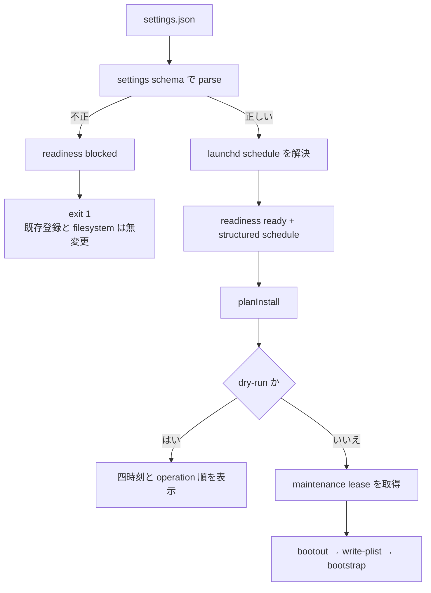
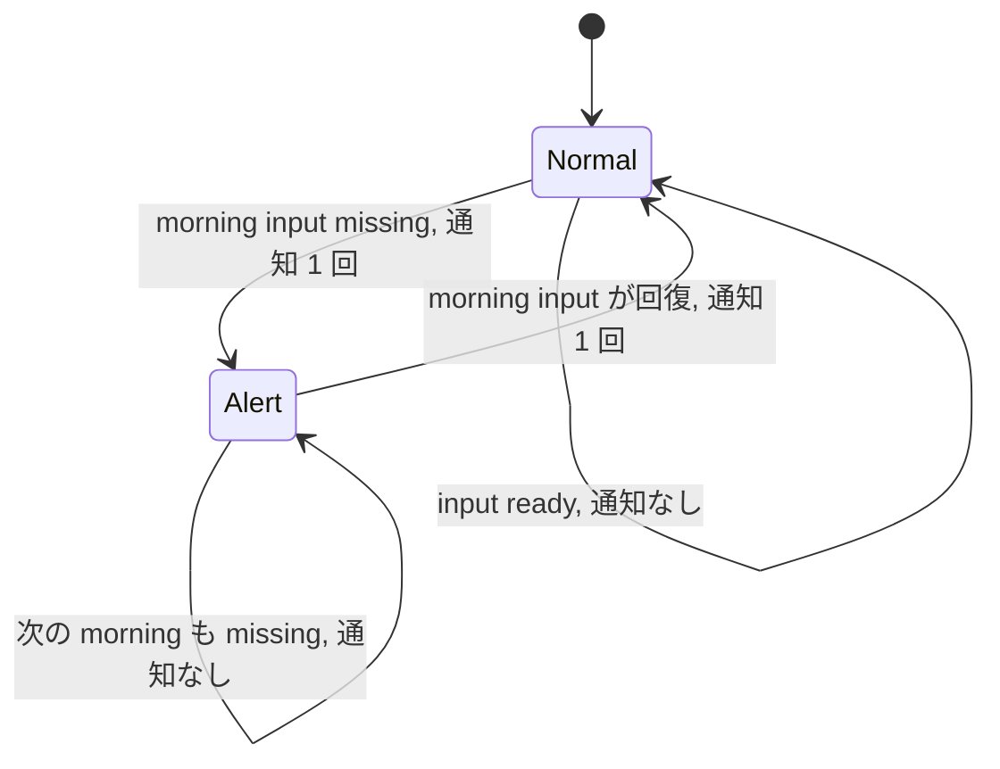

# launchd 実行時刻の設定可能化と既定値変更の設計

起草: `scale2sheet_architect_codex`

検証: exact head で `scale2sheet_reviewer_claude` へ依頼する。

| 項目 | 値 |
| --- | --- |
| 起点 | Issue #179、Issue #259 |
| 基準 HEAD | `ad971e918a6ba7b983b6d427fdd8865f15fa5bf9` |
| ユーザー決定 | morning の時刻をずらし、launchd の時刻を設定可能にする |
| 決定の記録 | Issue #259 の 2026-08-11T08:17:27+09:00 の manager コメント |
| 決定の検証範囲 | manager の証言であり、reviewer の検証範囲外 |
| 本書の推奨 | `settings.json` に launchd 専用 schedule を置き、既定値を `07:30 / 11:30` と `21:10 / 23:40` にする |
| 未決事項 | 対象日の入力ファイルが無い morning を失敗のまま扱うか |
| README への影響 | 設定表、JSON 例、launchd 導入手順、構成図、時刻表を同じ release train で更新する |

## 1. 対象と結論

launchd の四つの実行時刻を `settings.json` から変更できるようにする。

新しい設定は `morning-cron` と `evening-cron` を再利用せず、launchd 専用の `launchd-schedule` とする。

環境変数による上書きは追加しない。

既定値は次の四つとする。

| period | 本実行 | 拾い直し |
| --- | --- | --- |
| `morning` | `07:30` | `11:30` |
| `evening` | `21:10` | `23:40` |

設定変更だけでは登録済み plist を変更しない。

利用者は `install --dry-run --launchd` で四時刻を確認し、`install --launchd` を明示的に再実行して反映する。

設定が不正な場合は Issue #184 の readiness gate で拒否し、既存 plist、label、binary、manifest を変更しない。

Issue #179 の変更手段と Issue #259 の既定値変更は、同じ settings schema、planner、plist、README を変更するため、一つの実装 PR で扱う。

ただし、時刻変更だけでは morning の入力不在を解消しない。

43 日中 28 日は `11:30` までに独立した morning 公開を確認できず、schedule をずらしても入力不在の分類は残る。

## 2. 現行実装

基準 HEAD の実装は、launchd と `serve` の時刻を別の正本から得る。

| 対象 | 現在の正本 | 現在の使われ方 |
| --- | --- | --- |
| launchd | `src/installation/planner.ts:38-41` の `LAUNCHD_SCHEDULE` | morning と evening の plist へ各二時刻を渡す |
| `serve` | `settings.json` の `morning-cron` と `evening-cron` | `src/config/env.ts:120-146` で runtime config へ写す |
| plist | `src/installation/plist.ts:47-79` の `buildPipelinePlist` | `StartCalendarInterval` の配列を生成する |
| install | `src/cli/installation.ts:290-428` の `runInstallCommand` | readiness、計画、dry-run、適用の順で処理する |

`planInstall` は period ごとに `bootout`、`write-plist`、`bootstrap` を並べる。

`write-plist` の operation description は label だけを表示し、登録予定の時刻を表示しない。

したがって、現行の dry-run では操作順を確認できても四つの時刻を確認できない。

Issue #184 の実装により、launchd readiness が `blocked` なら operation を作る前に `LaunchdNotReadyError` で停止する。

この順序を維持すれば、新しい schedule の型違反や値域違反も既存登録へ触れる前に拒否できる。

## 3. 公開時刻の実測

### 3.1 測定方法

測定期間は 2026-06-29 から 2026-08-10 までの 43 暦日である。

環境変数、`settings.json`、既定値の順で実効 output directory を解決し、その directory の google-fit JSONL を読み取りだけで集計した。

入力可用性の集計では、各日について対象日を filename に持つファイルの最初の mtime を公開時刻の proxy とした。

`07:10` と `11:40` の集計は、予定時刻から 10 分以内に対象日ファイルが現れたかを数える。

mtime は nominal schedule から最初の target-date file が現れるまでの proxy である。

exporter process の start と end を保存した log ではないため、「exporter の実行時間を実測した」とは扱わない。

### 3.2 元の集計と legacy の混入

元の 43 日集計は次のとおり再現した。

| 締切 | 公開あり | 公開なし |
| --- | ---: | ---: |
| `07:10` | 13 | 30 |
| `11:40` | 22 | 21 |

しかし、`07:10` から `11:40` の間に増えた九日のうち七日は、`11:30:31` から `11:39:43` に初回公開されていた。

この七日は PR #160 より前の legacy `scripts/run-pipeline.sh` が `11:30` に exporter を起動した期間に属する。

PR #160 は 2026-08-09T13:45:06+09:00 に merge され、consumer から exporter を起動する処理を削除した。

したがって、この七日を cutover 後の `11:30` 回収実績へ含めない。

cutover 後へ使える観測は次のように狭まる。

| 条件 | 日数 |
| --- | ---: |
| `07:10` までに公開 | 13 / 43 |
| `07:15:04` までに公開 | 14 / 43 |
| `08:27:26` までに公開 | 15 / 43 |
| `11:30` までに独立した公開を確認できない | 28 / 43 |

`08:27:26` の一件は、予定された `07:00` run の遅い完了か、別の再実行かを現存データから帰属できない。

この一件を捕まえるために本実行を `08:30` へ置くと、帰属できない一件のために毎日一時間遅らせる。

既定値の根拠には含めない。

### 3.3 分布

morning cluster は、各日の target-date file の最初の mtime が `07:00:00` から `07:20:00` に入る十四日を対象とする。

evening cluster は、各日の target-date file から `21:00:00` から `21:10:00`、または `23:30:00` から `23:40:00` に入る最初の mtime を slot ごとに一件選ぶ。

percentile は nearest-rank で求めた。

| cluster | n | median | p90 または p95 | max |
| --- | ---: | ---: | ---: | ---: |
| morning `07:00` | 14 | 00:38 | p90 09:48 | 15:04 |
| evening `21:00` | 23 | 00:35 | p95 04:05 | 04:10 |
| evening `23:30` | 23 | 00:36 | p95 04:19 | 08:24 |

2026-08-10 の `21:00:35` には二十ファイルが同じ秒に公開されていた。

この観測は、少なくともその実行では publication がファイルごとに長時間ばらつかず、batch に近いことを示す。

### 3.4 数値の限界

元の `30 / 43` と補正後の `28 / 43` は、予定時刻から十分に遅い締切を置いた入力可用性の proxy である。

実際の通知回数ではない。

観測された `07:00` cluster の最初の mtime はすべて `07:00` より後である。

したがって、consumer が予定時刻直後に入力を列挙すれば、`07:10` までに公開される十三日でも race し得る。

本書は `70%` から `65%` への差を、alert 頻度そのものではなく morning 終了時点の入力不在 proxy の差として扱う。

## 4. 方式比較

| 案 | 方法 | 利点 | 問題 | 判定 |
| --- | --- | --- | --- | --- |
| A | `LAUNCHD_SCHEDULE` の固定値だけを変える | 変更量が小さい | Issue #179 を残し、upgrade で手編集を再び上書きする | 不採用 |
| B | `morning-cron`、`evening-cron` または環境変数を再利用する | 新しい top-level key を増やさない | `serve` は一 period 一 cron、launchd は一 period 二 slot であり、意味と個数が違う | 不採用 |
| C | `settings.json` に launchd 専用 schedule を置く | 設定の正本と install の再現性を両立する | settings schema と README の追加が要る | 採用 |

案 B の環境変数は install process の一時状態である。

同じ `settings.json` を使った次回 install で環境変数が無ければ既定値へ戻り、登録済み plist の再現元にならない。

案 C は永続する利用者設定だけを入力にし、再 install が同じ plist を再生成できる。

## 5. settings 契約

### 5.1 外部形式

設定は次の形とする。

```json
{
  "launchd-schedule": {
    "morning": ["07:30", "11:30"],
    "evening": ["21:10", "23:40"]
  }
}
```

`launchd-schedule` を省略した既存 settings は、新しい既定値へ解決する。

`launchd-schedule` を書く場合は `morning` と `evening` の両方を必須とし、片方だけを既定値で補完しない。

部分補完を許すと、利用者が片方の key を書き忘れても install が成功し、意図しない時刻を登録するためである。

### 5.2 値の規則

| 規則 | 判定 |
| --- | --- |
| period | `morning` と `evening` の二つだけ |
| 要素数 | 各 period ちょうど二つ |
| 形式 | zero padding された 24 時間表記 `HH:mm` |
| 値域 | `00:00` から `23:59` |
| 重複 | 同じ period 内では禁止 |
| 順序 | 同じ暦日内で昇順 |
| 未知 field | `launchd-schedule` object 内では拒否 |

実行時刻は macOS の local wall clock である。

`time-zone` は入力の対象日と測定時刻の解釈に使う設定であり、launchd の system clock を変更しない。

schedule を変えても morning と evening の測定 window は変わらない。

top-level settings の未知 key を許す既存の `.passthrough()` 契約は、本件だけでは変更しない。

このため、利用者は dry-run に表示された四時刻を確認条件とし、settings file を編集したことだけを適用済みの証拠にしない。

### 5.3 production 正本

`src/config/launchd-schedule.ts` を新設し、次の production 型、既定値、nested schema、解決関数を置く。

```ts
type LaunchdPeriodSchedule = readonly [LaunchdTime, LaunchdTime];

interface LaunchdSchedule {
  readonly morning: LaunchdPeriodSchedule;
  readonly evening: LaunchdPeriodSchedule;
}

interface LaunchdTime {
  readonly hour: number;
  readonly minute: number;
}
```

`DEFAULT_LAUNCHD_SCHEDULE` は四つの既定値を持つ唯一の production 正本とする。

`defaultSettingsContent` はこの定数から `HH:mm` を生成し、値を手書きで複製しない。

基準 HEAD では `src/config/settings.ts` の `settingsFileSchema` と `SettingsFile` が settings の active 正本である。

ここへ `launchd-schedule` の nested schema を追加する。

`src/config/env.ts` の mapping と環境変数 schemaには追加しない。

## 6. readiness から plist までの流れ

### 6.1 validated data を一度だけ渡す

`evaluateLaunchdReadiness` は settings の構文と値域を検査した後、`ready` に解決済み schedule を含める。

概念形は次のとおりである。

```ts
type LaunchdReadiness =
  | { readonly status: "not-requested" }
  | { readonly status: "ready"; readonly schedule: LaunchdSchedule }
  | { readonly status: "blocked"; readonly issues: readonly LaunchdReadinessIssue[] };
```

planner は settings file を読み直さず、`ready.schedule` だけを plist 生成へ渡す。

readiness と planner が別々に settings を解釈すると、検査した値と登録した値が異なる経路ができるためである。

`runInstallCommand` が readiness より前に行う現在の `readSettings` は、launchd 経路では schedule 不正を未処理例外にしない形へまとめる。

schedule の parse error は `evaluateLaunchdReadiness` の `settings-invalid` へ一意に分類する。



### 6.2 readiness の拒否

次の条件は `settings-invalid` として `failed:launchd-not-ready` で拒否する。

- `launchd-schedule` の型違反。
- period の欠落。
- 時刻の形式または値域違反。
- 要素数の違反。
- 重複または逆順。
- nested object の未知 field。

拒否は operation 作成、maintenance lease、manifest 遷移、binary 置換、plist 書込み、`bootout`、`bootstrap` より前に行う。

`--force` は readiness を迂回しない。

### 6.3 operation と表示

`write-plist` operation は XML だけでなく、XML と同じ入力から得た structured schedule を持つ。

`describeOperation` は次のように period の二時刻を表示する。

```text
[planned] write-plist jp.seijin.kappa.scale-pipeline.morning schedule=07:30,11:30
[planned] write-plist jp.seijin.kappa.scale-pipeline.evening schedule=21:10,23:40
```

dry-run は副作用を持たず、利用者が settings file を編集した事実ではなく、登録される四時刻を確認できる出力にする。

成功した非 dry-run install も、朝夕の適用時刻を完了表示へ含める。

## 7. 既存登録と再実行

settings file の編集だけでは、launchd に登録済みの `StartCalendarInterval` は変わらない。

適用規則は次のとおりである。

| 既存登録 | schedule | command | 結果 |
| --- | --- | --- | --- |
| 無し | 不正 | `install --launchd` | exit `1`。登録しない |
| 在り | 不正 | `install --launchd` | exit `1`。既存 plist と label を変更しない |
| 無し | 正しい | `install --launchd` | 新しい schedule で登録する |
| 在り | 正しい | `install --launchd` | period ごとに `bootout`、`write-plist`、`bootstrap` で置き換える |
| 在り | 正しいが settings だけ変更 | command 未実行 | 旧 schedule のまま |

手編集した plist も、valid な再 install では settings から生成した値で上書きする。

正本を settings へ戻し、手編集と次回 install の drift を残さないためである。

active pipeline または active `serve` がある場合の maintenance lease と `--force` の契約は変更しない。

schedule の自動 watch と、自動再登録は行わない。

### 7.1 doctor の表示

既存の `docs/INSTALLATION_DESIGN.md` は install 完了表示と doctor が四つの実時刻を列挙する契約を持つ。

実装時はこの未配線契約も schedule の同じ structured data から満たす。

doctor は settings から得た期待時刻と、登録済み plist の `StartCalendarInterval` を period ごとに比較する。

一致すれば `PASS` と実時刻を表示し、不一致なら `FAIL` と期待値、観測値、`install --launchd` の再実行手順を表示する。

settings または plist を読めず比較不能なら、正常と推測せず `WARN` とする。

doctor は read-only を維持し、schedule を修復しない。

## 8. 既定値の根拠

### 8.1 morning

`07:30` は、`07:00` cluster の観測 max `07:15:04` から十四分五十六秒の余裕を持つ。

`07:15` では観測 max と同じ分に consumer と producer が競合するため、既定値にしない。

`08:30` は帰属不能な `08:27:26` の一件を捕まえるが、毎日一時間遅らせるため採らない。

`11:30` は対応する upstream schedule を持たない。

この slot は `07:00` run の遅い公開または手動公開を拾い直すために維持する。

### 8.2 evening

`21:10` は `21:00` cluster の観測 max 四分十秒から五分五十秒の余裕を持つ。

`23:40` は `23:30` cluster の観測 max 八分二十四秒から一分三十六秒の余裕を持ち、日付境界まで二十分を残す。

後者の余裕は morning と `21:00` slot より小さい。

実装後の observation では、`23:40` 時点の target-date file 不在を slot 別に記録し、観測 max を超えた場合に既定値を再評価する。

## 9. morning の入力不在

schedule 変更後も 28 / 43 日では `11:30` までの独立した morning 公開を確認できない。

したがって、入力不在の outcome は別のユーザー判断として残す。

| 案 | first slot | retry slot | AC-45 | 通知への影響 | 実装範囲 |
| --- | --- | --- | --- | --- | --- |
| N-1 現行維持 | `failed:input-missing` | `failed:input-missing` | 維持 | 初回の `normal -> alert` と後日の回復を通知 | schedule PR は outcome を変更しない |
| N-2 retry まで pending | transient として永続失敗にしない | 無ければ `failed:input-missing` | 維持 | 同日回復の alert と recovery を抑える | slot identity、新状態、status、doctor、definitionsVersion が要る |
| N-3 no-data | `completed:no-data` | `completed:no-data` | file 不在と present-zero を潰す | 三回連続までは normal、四回目で `consecutive-no-data` alert | AC と schema の変更が要る |

本書は N-1 を推奨する。

N-1 は、対象日 file 不在と、file はあるが window 適用後に零件である状態を区別する AC-45 を維持する。

N-2 は transient race だけを抑えられるが、現在の plist は二つの slot を同じ `pipeline --period morning` として起動するため、どちらの slot かを runtime が知らない。

時刻から slot を推定すると launchd の遅延起動で誤分類するため、明示的な slot identity が必要になる。

N-3 はユーザーが決めた AC-46 の「転記した日だけを成功日とする」条件を満たさない。

したがって、N-3 を採っても input-missing の日が連続観測 gate を通ることはない。

ただし、status 上では producer の file 不在と正当な未測定を区別できなくなり、AC-45 と `failed:input-missing` の既存定義を改定する必要がある。

N-2 または N-3 を採る場合は、schedule 実装とは別の設計と PR で扱う。

## 10. 通知契約との関係

通知判定は period ごとの health state transition に対して行われる。

morning の alert は evening の成功では回復しない。

同じ morning の後続実行で `alert -> normal` になったときに回復通知が生じる。



| 公開条件 | 現行 `07:00 / 11:30` | 新既定 `07:30 / 11:30` |
| --- | --- | --- |
| `07:15:04` までに公開 | `07:00` で race し、`11:30` で回復し得る | `07:30` の初回から ready |
| `08:27:26` に公開 | 初回 alert、`11:30` で回復し得る | 同じ |
| `11:30` まで公開なし | morning は alert のまま | morning は alert のまま |

`07:30` は `07:00` cluster の十四日すべてで、初回 alert と同日 recovery の組を避ける。

一日につき最大二つの state transition notification が減るため、43 日の観測集合に対する上限は二十八通知である。

これは上限であり、過去の exact 通知回数ではない。

初期 health、日ごとの並び、legacy `11:30` producer、通知実装の有無が過去期間で一定ではないためである。

公開が無い 28 日も、`alert -> alert` では再通知しない。

したがって、入力不在日数をそのまま通知回数として数えない。

Issue #242 は各 notification attempt の終了結果を記録するが、再送を追加しない。

schedule 変更は notification delivery 契約を変えず、state transition が生じる回数だけを減らす。

## 11. README と設計正本の更新

README はユーザーが目にする唯一の資料なので、実装だけを先に main へ入れない。

manager が cutover 前後のどちらで有効化するかを決め、main へ入る release train で次を同時に更新する。

| 文書 | 更新 |
| --- | --- |
| `README.md` の設定表 | `launchd-schedule` の用途、既定値、環境変数が無いことを追加する |
| `README.md` の JSON 例 | morning と evening の二時刻を追加する |
| `README.md` の launchd 節 | dry-run、再 install、local wall clock、`serve` cron との違いを書く |
| `README.md` の図と時刻表 | `07:30 / 11:30`、`21:10 / 23:40` へ更新する |
| cutover 導入手順案 | 「時刻は固定で変更手段が無い」という旧説明を削除し、settings 編集と再 install を書く |
| `docs/INSTALLATION_DESIGN.md` | launchd schedule の正本、readiness、表示、再登録を反映する |

cutover 前に実装を branch へ用意しても、現行の手動 plist 手順と installer 手順を README へ併記しない。

二つの正規手順が同時に読める状態は、どちらの plist が settings を消費するかを利用者が判定できないためである。

既存の `verify-readme-config-keys.mjs` は top-level key の存在だけを検査する。

`launchd-schedule` の nested field、四つの既定値、`serve` との責務分離は専用の README projection test で照合する。

## 12. 試験設計

### 12.1 baseline probes

| ID | 層 | 条件 | 必須 assert |
| --- | --- | --- | --- |
| P-1 | settings unit | `launchd-schedule` 無し | 新しい四既定値へ解決する |
| P-2 | settings unit | custom の二時刻ずつ | structured schedule へ lossless に変換する |
| P-3 | settings unit | period 欠落、要素数違反、形式違反、値域違反、重複、逆順、未知 field | 全件を拒否する |
| P-4 | readiness unit | 登録済み相当で P-3 の各不正値 | `blocked`。operation と mutation が零件 |
| P-5 | planner unit | custom schedule | plist の `StartCalendarInterval` が custom 四時刻と一致する |
| P-6 | CLI unit | custom schedule の dry-run | 四時刻、朝夕 label、`bootout -> write-plist -> bootstrap` を表示し、副作用が零件 |
| P-7 | CLI unit | valid な登録済み環境で再 install | period ごとに既存順序で置き換え、新 schedule を登録する |
| P-8 | doctor unit | settings と plist の schedule が一致または不一致 | 一致で `PASS`、不一致で `FAIL` と再 install 手順 |
| P-9 | config unit | `morning-cron` と `evening-cron` を変更 | launchd schedule が変わらない |
| P-10 | docs | README の key、nested field、四既定値、図、時刻表 | production 正本と一致する |

P-4、P-6、P-7 は production の HOME、plist、label、`dist/scale2sheet` を使わない。

隔離 HOME、一時 prefix、fake launchctl を使う。

### 12.2 非警報対照

| ID | 条件 | 期待 |
| --- | --- | --- |
| L-1 | 既存 settings に `launchd-schedule` が無い | NO-ALARM。新既定値で install を計画できる |
| L-2 | `serve` cron が custom で launchd key が無い | NO-ALARM。launchd は新既定値を使う |
| L-3 | shell に schedule らしい環境変数が在る | NO-ALARM。settings または既定値だけを使う |
| L-4 | settings と plist が同じ custom schedule | NO-ALARM。doctor は `PASS` |
| L-5 | dry-run を二回実行 | NO-ALARM。filesystem と fake launchctl log が二回とも不変 |

非警報対照に `SURVIVED` を使わない。

`SURVIVED` は壊した変異を検査が捕捉できなかった判定に限定する。

### 12.3 変異

変異前の対象 probe が緑であることを確認し、変異、対象 probe、復元後の三段階を記録する。

| ID | 変異 | 落ちるべき probe | 意味 |
| --- | --- | --- | --- |
| M-1 | planner が resolved schedule を無視し、固定時刻を使う | P-2、P-5、P-6 | 設定可能に見えて登録へ届かない回帰を捕捉する |
| M-2 | `launchd-schedule` 無しで旧 `07:00 / 21:00` を使う | P-1、P-5、P-10 | 既定値の追随漏れを捕捉する |
| M-3 | 重複または逆順を受理する | P-3、P-4 | 誤設定を既存登録へ適用できる回帰を捕捉する |
| M-4 | schedule 不正の拒否を `bootout` 後へ移す | P-4 | failed install が既存 label を止める回帰を捕捉する |
| M-5 | dry-run の operation description から時刻を除く | P-6 | 実行した事実だけが残り、登録値を確認できない回帰を捕捉する |
| M-6 | `morning-cron` を launchd morning へ流用する | P-9、L-2 | `serve` と launchd の責務混同を捕捉する |
| M-7 | doctor が plist の時刻を比較せず常に `PASS` にする | P-8 | settings を変えたが再 install していない状態を捕捉する |
| M-8 | README の一時刻だけを旧値へ戻す | P-10 | source とユーザー向け記述の drift を捕捉する |

各変異は `KILLED`、`KILLED-BY-TSC`、`SURVIVED` の三値で報告する。

型検査で対象 probe の起動前に落ちた場合は `KILLED-BY-TSC` であり、behavior を検出した証拠へ数えない。

timeout、Bun 欠落、runner 起動失敗、変異前から赤い baseline も `KILLED` へ数えない。

## 13. 変更面と実装順

| path | 変更 |
| --- | --- |
| `src/config/settings.ts` | nested settings schema と `SettingsFile` を追加する |
| `src/config/launchd-schedule.ts` | 型、唯一の既定値、nested schema、format、解決を実装する |
| `src/installation/launchd-readiness.ts` | `ready` に validated schedule を含める |
| `src/cli/installation.ts` | unguarded な重複 parse を除き、readiness の schedule と完了表示を配線する |
| `src/installation/planner.ts` | 固定 `LAUNCHD_SCHEDULE` を削除し、readiness の schedule を使う |
| `src/installation/model.ts` | `write-plist` に structured schedule を保持する |
| `src/installation/executor.ts` | dry-run と実行結果へ四時刻を表示する |
| `src/installation/doctor.ts` | settings と plist の schedule を比較し、四時刻を表示する |
| `test/config/` | nested schema、既定値、`serve` との分離を検査する |
| `test/installation/`、`test/cli/` | readiness、plist、dry-run、再登録、doctor を検査する |
| `README.md` と関連 docs | 同じ release train でユーザー向け契約を追随させる |

実装順は次のとおりとする。

1. settings schema と唯一の既定値を追加する。
2. readiness が structured schedule を返すようにする。
3. planner と plist へ配線し、隔離 test で custom 値を確認する。
4. dry-run、install 完了表示、doctor へ観測値を出す。
5. README と設計正本を同じ head で更新する。
6. baseline、非警報対照、変異を実行する。

Issue #179 と Issue #259 を別 PR に分けると、一つ目の PR が固定値だけを変えるか、設定可能だが旧既定値の中間状態を main へ作る。

ユーザー決定は設定可能化と時刻変更の組なので、一つの実装 head で成立させる。

## 14. 完了条件と残る判断

schedule 実装の完了条件は次のとおりである。

- 既存 settings が新既定値へ移行できる。
- custom の四時刻が plist、dry-run、install 完了表示、doctor、README で一致する。
- 不正 settings が既存登録と filesystem を変更しない。
- `serve` cron と launchd schedule が互いに影響しない。
- settings 変更後の明示的な再 install で既存登録を置き換えられる。
- baseline と非警報対照が緑で、M-1 から M-8 の三値が記録される。

次は本書で決めない。

- N-1、N-2、N-3 のどれを採るか。
- 実装を cutover 前に用意するか、cutover と同じ release train で main へ入れるか。
- observation で既定値の余裕を再評価する期間と閾値。

schedule の設定可能化は採用済みである。

入力不在の outcome と適用時期は、manager がユーザーへ別に提示する。
