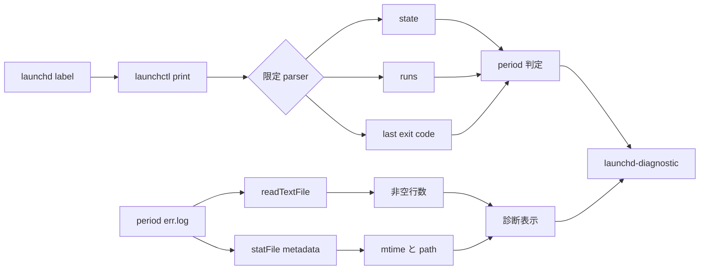
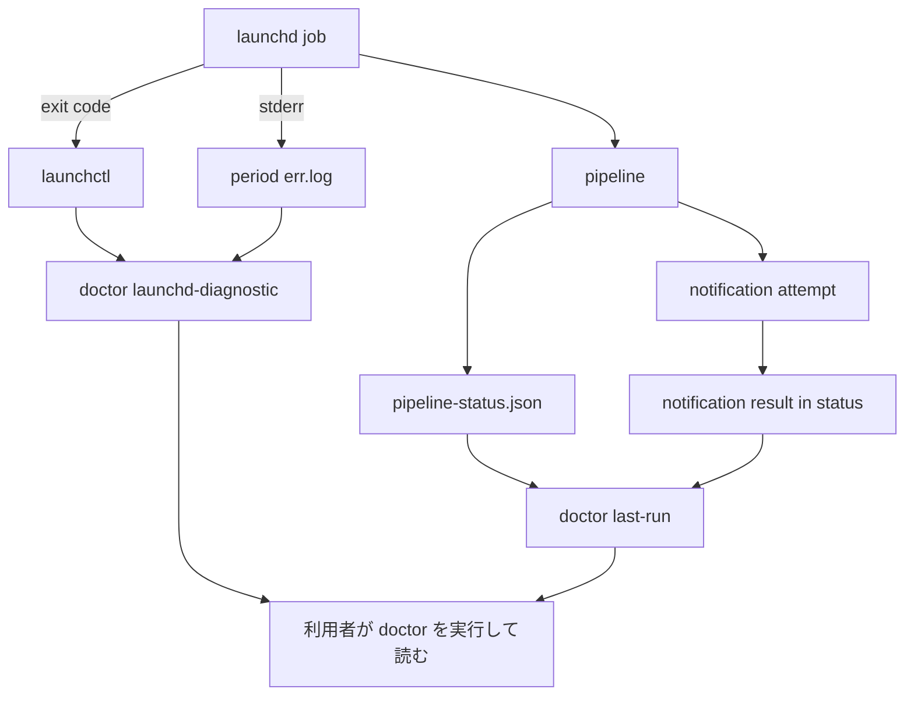

# launchd の最新終了結果と stderr 証跡を doctor で判定する設計

## 1. 対象と結論

Issue #251 は、launchd が書いた `morning.err.log` と `evening.err.log` の本文を production code が読まず、失敗が人へ届かなかった問題を扱う。

現行 `checkLaunchdDiagnostic` は、どちらか一方の err.log が存在すれば `PASS` を返す。

しかし、ファイルの存在は launchd が一度はファイルを開いたことしか示さない。

失敗行があることも、正常に終了したことも示さない。

本書は、既存の `checkLaunchdDiagnostic` を次の契約へ変更する。

1. 同じ launchd label の `launchctl print` から、root job の `state`、`runs`、`last exit code` を限定的に読む。
2. 完了済みの最新 job が nonzero なら `FAIL`、zero なら `PASS` とする。
3. 実行中、未実行、取得不能、解析不能は `WARN` とする。
4. err.log は非空行数、更新時刻、path だけを診断証跡として表示する。
5. err.log の本文は、全文も末尾一行も表示しない。

err.log の語句を正常性の正本にはしない。

終了結果の正本は、同じ launchd job が保持する `last exit code` である。

## 2. 確認した現状

### 2.1 production 実装

基準 commit は `f200efd362c2295825d152cbb4ad257a73965454` である。

| 対象 | 現在の動作 | 問題 |
| --- | --- | --- |
| `checkLaunchdDiagnostic` | `statFile` で err.log の存在を確認する | 内容と終了結果を判定しない |
| 同 | 両方の err.log が無い場合だけ `WARN` | 一方でも存在すれば `PASS` |
| 同 | `printRaw(...).stdout` をそのまま message に入れる | `last exit code` を読んでいるが使わない |
| `DoctorDeps.readTextFile` | plist 本文を読むために存在する | err.log には使っていない |
| `checkPlistSyntax` | `readTextFile` を使う既存の先例 | 新しい filesystem 読取機構は不要 |
| `runDoctorCommand` | `FAIL` のときだけ exit 1 | `WARN` は表示するが exit 0 |

`DoctorDeps` は manifest、settings、status、launchd を書く依存を持たない。

本件でも read-only 境界を維持する。

### 2.2 baseline

基準 commit で次を実行し、49 tests が PASS した。

```sh
npx vitest run test/installation/doctor.test.ts
```

この baseline は、現在の「err.log が存在すれば `launchd-diagnostic` は `PASS`」という挙動を含む。

### 2.3 production err.log の全量集計

2026-08-11T05:44:00+09:00 ごろに、production の二つの err.log を読み取りだけで集計した。

値の本文は出力せず、行数と分類数だけを得た。

| log | bytes | 全行 | 非空行 | 主な内訳 |
| --- | ---: | ---: | ---: | --- |
| morning | 11,378 | 184 | 184 | token refresh error 84、attempt failed 90、binary 不在、kill、shell error 10 |
| evening | 15,373 | 289 | 285 | token refresh error 87、attempt failed 94、invalid reading の stack と code frame、request error |

正常な stderr 行は見つからなかった。

非空469行は、failure 本文またはその stack trace、code frame、shell diagnostic だった。

ただし、この実測は「将来も正常時の stderr が必ず空である」ことを保証しない。

### 2.4 秘密情報候補の集計

現在の二つの err.log について、次の形を件数だけ検査した。

| 候補 | 検出数 |
| --- | ---: |
| secret を示す key 名 | 0 |
| JWT | 0 |
| Google access token | 0 |
| Google refresh token | 0 |
| private key | 0 |
| Authorization header | 0 |
| email address | 0 |

現在の log に秘密情報候補が無いことは、将来の例外本文に秘密情報が入らない根拠にはならない。

このため、本文を安全に redact しようとせず、最初から doctor の出力対象外にする。

### 2.5 production launchd の現況

production label は変更せず、`launchctl print` の限定 field だけを読んだ。

| period | state | runs | last exit code |
| --- | --- | ---: | ---: |
| morning | `not running` | 22 | 0 |
| evening | `not running` | 24 | 0 |

err.log は過去の failure を469行保持する一方、最新 job は両 period とも exit 0 である。

したがって「err.log が非空なら常に `WARN`」は、復旧後も緑へ戻らない。

### 2.6 bootout と bootstrap による消失

production label に触れず、固有 label の一時 LaunchAgent で次を実測した。

```text
nonzero 実行後
  state = not running
  runs = 1
  last exit code = 1

同じ label を bootout して再 bootstrap、実行前
  state = not running
  runs = 0
  last exit code = (never exited)
```

bootout と bootstrap は、`runs` と `last exit code` をリセットする。

probe label は bootout し、一時 plist、stdout、stderr、directory は測定後に削除した。

## 3. 採らない案

### 3.1 err.log が非空なら常に WARN

この案は実装量が少ない。

しかし、現在の469行は最新 job の exit 0 後も残っている。

利用者が log を手で消すまで警告が消えず、read-only な doctor に外部の消去手順を要求する。

復旧しても緑に戻らない check は、現在の失敗と過去の失敗を区別できない。

### 3.2 特定の語句で異常を判定する

`error`、`failed`、`exception` などの語句を列挙すると、未知の例外を見逃す。

vendor の文言変更でも検査が外れる。

stack trace の継続行は、単独では失敗語を持たない。

現在の実データに合わせた keyword list を production contract にしない。

### 3.3 一定日数以内の mtime を異常とする

この案は、時間が過ぎるだけで未観測の失敗を緑へ戻す。

Issue #46 は10日間気付かれなかったため、古さを正常性へ変換すると同じ型を再導入する。

### 3.4 pipeline-status.json の時刻で無効化する

`lastTerminal` は、手動、shadow、launchd の出所を持たない。

別経路の実行で更新した status を使うと、launchd の失敗を復旧済みと誤判定する。

出所を持たない時刻で、出所の異なる err.log を無効化しない。

### 3.5 stdout log を追加で解析する

現行 legacy route の stdout は、`Updated`、`No spreadsheet row updated`、`pipeline done` を持つ。

cutover 後の installed route は、`pipeline` の outcome を直接出す。

stdout を判定に使うと、cutover を境に二種類の parser が必要になる。

Issue #38 で結果行が無かった34件は、すべて `pipeline done` も無く、shell が完了していない側だった。

本件は同じ job の exit code で捕まえ、転記結果は #114 の status と doctor に任せる。

stdout reader は本書の対象外とする。

## 4. 判定の構造

### 4.1 既存 check を変更する

新しい check を隣に足さず、`checkLaunchdDiagnostic` の判定を直す。

同じ launchd 事実について、既存 check が `PASS`、新 check が `FAIL` と並ぶと、利用者はどちらを信じるか判断できない。

check ID は `launchd-diagnostic` のまま維持する。

内部では parser、log summary、period classification を pure function に分ける。

### 4.2 情報の流れ



### 4.3 launchctl の限定 parser

`launchctl print` の全文を message へ写さない。

parser は root job の次の field だけを返す。

```ts
interface LaunchdJobObservation {
  readonly queryExitCode: number;
  readonly state?: string;
  readonly runs?: number;
  readonly lastExit:
    | { readonly kind: "code"; readonly code: number }
    | { readonly kind: "never-exited" }
    | { readonly kind: "unobserved" };
}
```

root の `state` は最初の `state = ...` を使う。

同じ raw output 内の nested service state を上書きに使わない。

`runs` は0以上の整数だけを受ける。

`last exit code = (never exited)` は数値0へ変換しない。

field 欠落、重複矛盾、不正な数値は `unobserved` とする。

`printRaw` 自体の exit code が nonzero なら、stdout の内容にかかわらず query failure とする。

### 4.4 既存 raw-display-only 契約の変更

現行 `LaunchctlAdapter.printRaw` の comment は、raw output を pass/fail に使わないとしている。

本書は、その制約を `launchd-diagnostic` に限って変更する。

判定へ昇格するのは、root job の `state`、`runs`、`last exit code` だけである。

registration の判定は、引き続き `isRegistered` の boolean を正本にする。

`checkLaunchdRegistration` が `printRaw` の文言を読む変更は行わない。

既存の N-4 を維持する。

## 5. period ごとの分類

### 5.1 job result

| launchctl の観測 | status | 理由 |
| --- | --- | --- |
| query nonzero | `WARN` | label の診断を取得できない |
| root state が running | `WARN` | 現在の job が未完了で、last exit は前回を指す |
| `runs = 0` または `never-exited` | `WARN` | bootstrap 後に完了 job が無い |
| not running、last exit 0 | `PASS` | 最新 job は command contract 上で exit 0 になった |
| not running、last exit nonzero | `FAIL` | 最新 job が失敗した |
| field 欠落または矛盾 | `WARN` | 成否を確定できない |

root state の未知値は、last exit が数値でも `WARN` にする。

未知 state を正常終了へ推測しない。

### 5.2 err.log の観測

各 period の err.log を独立に読む。

| err.log | log state |
| --- | --- |
| file 不在 | missing |
| stat は成功したが read 不能 | unreadable |
| 空または空白行だけ | empty |
| 非空行が1行以上 | retained |

`retained` は failure 件数ではない。

stack trace や code frame も一行ずつ数えるため、message は必ず `non-empty lines` と書く。

### 5.3 job result と log state の合成

job result を主判定にする。

| job result | log state | period status |
| --- | --- | --- |
| nonzero | 任意 | `FAIL` |
| zero | retained | `PASS`。retained stderr があることと latest exit 0 を別々に表示 |
| zero | empty | `PASS` |
| zero | missing または unreadable | `WARN`。終了結果は0だが診断先を確認できない |
| running | 任意 | `WARN` |
| never-exited | 任意 | `WARN` |
| unobserved | 任意 | `WARN` |

morning と evening の強い status を check 全体へ採用する。

強さは `FAIL > WARN > PASS` とする。

片方が `FAIL` なら、反対 period が `PASS` でも全体は `FAIL` である。

### 5.4 exit 0 の限定

現行 `run-pipeline.sh` では、binary 不在と `scale2sheet run` の nonzero は wrapper の exit 1 へ伝播する。

binary 成功後だけ wrapper は exit 0 になる。

ただし、次は exit 0 でも成立しうる。

- `scale-exporter-output-dir` を解決できず、通知だけ出した
- 当日ぶんの公開ファイルが無く、通知だけ出した
- 入力が0件だった
- 転記対象が無かった
- 通知の表示または到達を確認できなかった

したがって `last exit code = 0` は、上流公開、cell 転記、人への通知成功を意味しない。

exit 0 は「この command contract が失敗しなかった」であって、end-to-end の「成功した」ではない。

「最新 launchd command が nonzero で終わらなかった」という範囲だけを示す。

cutover 後は installed `pipeline` command の exit contract に従うが、転記や通知の詳細は status 側で表示する。

## 6. severity と副作用

最新 job の nonzero は `FAIL` とする。

`runDoctorCommand` は overall `FAIL` を exit 1 にする。

これは pipeline の outcome を変更する処理ではない。

新しい `DoctorFailureStage` は追加しない。

既存の `LAST_RUN_FAILED` は pipeline status の `lastTerminal` を根拠にする stage であり、binary 起動前の shell failure には再利用できない。

本件は既存 check ID `launchd-diagnostic` と、その `FAIL` status で区別する。

doctor は次を行わない。

- pipeline を実行しない
- status を書かない
- err.log を消去、truncate、rotate しない
- launchd を bootout、bootstrap、kickstart しない
- 通知を送らない
- retry しない

実行中、未実行、観測不能は `WARN` とし、失敗を推測して exit 1 にしない。

## 7. 利用者へ出す情報

### 7.1 出す field

period ごとに次だけを出す。

- period
- parsed root state
- runs
- last exit code、never exited、unobserved のいずれか
- err.log の non-empty line count
- err.log の mtime
- err.log の path

例を示す。

```text
[PASS] launchd-diagnostic: morning: state not running, runs 22, last exit 0, retained stderr 184 non-empty lines, modified 2026-07-28T11:32:14+09:00, path /Users/.../morning.err.log; evening: ...
```

nonzero の例を示す。

```text
[FAIL] launchd-diagnostic: morning: state not running, runs 23, last exit 1, stderr 12 non-empty lines, modified 2026-08-11T07:01:03+09:00, path /Users/.../morning.err.log
```

### 7.2 出さない情報

次は message へ出さない。

- err.log の全文
- 最終行
- error message の抜粋
- stack trace
- JSON の値
- raw `launchctl print` 全文
- stdout log の内容

現在の実ログに秘密情報候補が無いことを、将来の出力許可には使わない。

## 8. 再配備で失われる情報

bootout と bootstrap は、job の `runs` と `last exit code` を消す。

再 bootstrap 後、最初の実行前は `never-exited` として `WARN` になる。

`never-exited` は完了結果が「無い」状態であり、正常ではない。

したがって、再配備の直後に過去 err.log が残っていても `PASS` にはしない。

しかし、再配備後の最初の job が exit 0 になると、再配備前の nonzero は launchctl から復元できない。

doctor がその間に実行されなければ、失敗が利用者に観測されたとは言えない。

err.log の行数を表示しても、どの run に属するかを復元できない。

本書はこの限界を解消しない。

解消するには、job generation と終了結果を別の永続 state へ保存する仕組みが必要であり、本件の「既存値を使う」範囲を超える。

## 9. Issue #46 への断定限界

Issue #46 の期間には、err.log に token refresh failure があり、stdout に `pipeline done` と結果行が無い。

当時の wrapper は exporter の三回失敗後に exit 1 を返す経路を持っていた。

これらの事実は、shell nonzero と整合する。

しかし、当時の `launchctl print` にあった last exit code は保存されていない。

本書の check が Issue #46 を検出できたはずだとは断定しない。

受け入れ試験では、同じ exit 1 と err.log を fixture で再現し、将来の同型を `FAIL` にすることだけを証明する。

## 10. #114 と #242 との関係



| Issue | 塞ぐ範囲 | #251 後も残ること |
| --- | --- | --- |
| #251 | shell と launchd job の最新終了結果、err.log の存在と量を doctor へ出す | 自発通知は増えず、doctor を実行しなければ人へ届かない |
| #114 | production route が pipeline status を書く | shell が binary 前に失敗した事実は status だけでは残らない |
| #242 | notification attempt の process result を保存し、doctor へ出す | launchd wrapper と err.log の失敗は notifier status に入らない |

三つは代替関係ではない。

#251 だけを直しても「人へ届く」全体は保証されない。

## 11. 実装境界

### 11.1 production code

| path | 変更 |
| --- | --- |
| `src/installation/doctor.ts` | launchctl parser、period classification、二 period の集約、本文非表示を実装する |
| `src/cli/installation.ts` | `statReadableFile` の戻り値へ mtime を加える |
| `src/installation/process.ts` | `printRaw` の comment を、限定 field を diagnostic に使う新契約へ更新する |

`DoctorDeps.statFile` は、既存の `executable` と `readable` に次を加える。

```ts
interface DoctorFileObservation {
  readonly executable: boolean;
  readonly readable: boolean;
  readonly modifiedAt?: string;
}
```

production adapter は `modifiedAt` を RFC3339 で返す。

既存 test fake が field を省略した場合は、message に mtime unobserved と出す。

分類では時刻の新旧を使わず、表示だけに使う。

### 11.2 README

実装と同じ release train で README の「実行状態と検知の限界」を更新する。

次を利用者向けに書く。

- `scale2sheet doctor` は latest launchd job の nonzero を `FAIL` とする
- err.log の path、非空行数、mtime は出すが本文は出さない
- exit 0 は公開、転記、通知既読を保証しない
- bootout と bootstrap で last exit は消える
- doctor は能動照会であり、自発通知ではない

開発経緯、Issue 番号、変異 ledger、却下案は README へ持ち込まない。

## 12. 受け入れ試験

### 12.1 正の probe

| ID | 入力 | 期待 |
| --- | --- | --- |
| P-1 | root state `not running`、runs 22、last exit 0 | parser が三 field を返す |
| P-2 | nested `state = active` を含む raw | root state を nested state で上書きしない |
| P-3 | `last exit code = (never exited)` | 0 にせず `never-exited` |
| P-4 | printRaw command exit nonzero | `WARN` |
| P-5 | state `running`、過去 last exit 0 | `WARN`。現在 run を成功扱いしない |
| P-6 | not running、last exit 0、空 log | `PASS` |
| P-7 | not running、last exit 0、retained log | `PASS`。retained stderr と latest exit 0 を別々に表示 |
| P-8 | not running、last exit 1、非空 log | `FAIL`、doctor exit 1 |
| P-9 | not running、last exit 1、空または missing log | `FAIL`。log 欠落で exit result を弱めない |
| P-10 | runs 0、never exited、非空 log | `WARN`。再配備前の result を推測しない |
| P-11 | err.log が空白行だけ | non-empty line count 0 |
| P-12 | morning FAIL、evening PASS | check 全体と doctor 全体が `FAIL` |
| P-13 | one period の log が missing、last exit 0 | `WARN` |
| P-14 | secret-shaped text を含む err.log fixture | message に本文と secret-shaped text が出ない |
| P-15 | status document と err.log fixture を deep freeze | doctor 後も byte-equivalent、write call 0 |
| P-16 | notifier を持たない既存 N-11 | 維持 |
| P-17 | contradictory printRaw text と `isRegistered: true` | registration check は既存どおり `PASS` |
| P-18 | stdout path を読むと throw する fake | #251 check は stdout を読まず完了 |
| P-19 | launchd last exit 1、別 route が更新した status lastTerminal | `FAIL`。status の更新で launchd failure を無効化しない |

P-6 と P-7 が非警報対照である。

「空なら緑」と「retained stderr があっても latest job が exit 0 なら緑」の両方を固定する。

### 12.2 mutation

| ID | 変異 | 落ちるべき probe | 期待判定 |
| --- | --- | --- | --- |
| M-1 | last exit を判定に使わず、file 存在だけで PASS | P-8 | KILLED |
| M-2 | nonzero を PASS または WARN にする | P-8、P-12 | KILLED |
| M-3 | running 中に過去 exit 0 を PASS にする | P-5 | KILLED |
| M-4 | never exited を0として PASS にする | P-3、P-10 | KILLED |
| M-5 | nested state で root state を上書きする | P-2 | KILLED |
| M-6 | retained log を常に WARN にする | P-7 | KILLED |
| M-7 | raw err line または raw launchctl 全文を message に入れる | P-14 | KILLED |
| M-8 | status の lastTerminal で launchd failure を無効化する | P-19 | KILLED |
| M-9 | registration を `printRaw` text で判定する | P-17 | KILLED |
| M-10 | stdout log を判定に加える | P-18 | KILLED |
| M-11 | doctor から status、log、launchd の write を呼ぶ | P-15、既存 N-3 | KILLED |

変異を当てる前に baseline green を取る。

変異後に試験が落ち、復元後に同じ試験が通るまでを一組として記録する。

TypeScript compile だけが先に落ちた場合は `KILLED-BY-TSC` とし、試験の検出へ数えない。

runner timeout、Bun 不在、fixture 作成失敗は mutation result に数えない。

### 12.3 非警報対照

| ID | 条件 | 期待 |
| --- | --- | --- |
| L-1 | latest exit 0、err.log empty | NO-ALARM |
| L-2 | latest exit 0、err.log に過去 failure 行 | NO-ALARM。retained line count は表示 |
| L-3 | latest exit 0、err.log は空白行だけ | NO-ALARM |
| L-4 | #242 の notification stderr が status に在り、period err.log は empty | #251 check は NO-ALARM、#242 projection が別に判定 |

`SURVIVED` を良い結果の意味に使わない。

非警報対照は `NO-ALARM` と記録する。

## 13. 実装順序

1. current main で doctor test の baseline を取る。
2. launchctl raw parser と parser probe を追加する。
3. `statFile` の metadata を拡張し、err.log summary を追加する。
4. `checkLaunchdDiagnostic` を period classification へ置き換える。
5. FAIL、WARN、PASS、二 period 集約の probe を通す。
6. raw 本文非表示、read-only、stdout 非依存、N-4 と N-11 を通す。
7. mutation M-1 から M-11 を baseline green、mutation red、restore green の順で実測する。
8. README の利用者向け記述を同じ release train で更新する。
9. full `npm test` を複数回実行し、flaky が無いことを確認する。

## 14. 完了条件

次をすべて満たしたときに #251 の実装を完了とする。

1. 最新 launchd job の nonzero が `launchd-diagnostic` の `FAIL` と doctor exit 1 になる。
2. 最新 job が exit 0 なら、過去の err.log が残っていても `PASS` へ戻る。
3. running、never exited、取得不能、解析不能を `WARN` として区別する。
4. err.log と raw launchctl の本文を doctor output に含めない。
5. morning と evening を混同しない。
6. registration の N-4 と notifier 不在の N-11 を維持する。
7. pipeline outcome、status document、err.log、launchd registration を変更しない。
8. bootout と bootstrap で last exit が消える限界を README に示す。
9. #114、#242、#251 の役割を README と設計書で混同しない。
10. 指定 mutation が KILLED、非警報対照が NO-ALARM になる。

## 15. self-review checklist

- [x] err.log の存在と job の成功を同じにしていない
- [x] retained line count を failure count と呼んでいない
- [x] exit 0 の意味を公開、転記、通知成功へ広げていない
- [x] status の出所不明な時刻で launchd failure を無効化していない
- [x] raw err line と raw launchctl output を利用者へ出していない
- [x] running と never exited を PASS にしていない
- [x] bootout と bootstrap の reset を限界へ含めている
- [x] #46 当時の last exit code を実測済みと書いていない
- [x] stdout parser を暗黙に追加していない
- [x] FAIL が doctor のみに作用し、pipeline outcome を変えない
- [x] #114、#242、#251 を代替関係として書いていない
- [x] 正負両方向の probe と mutation を分けている
