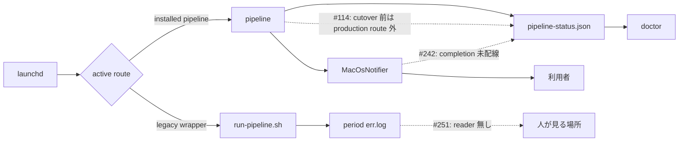
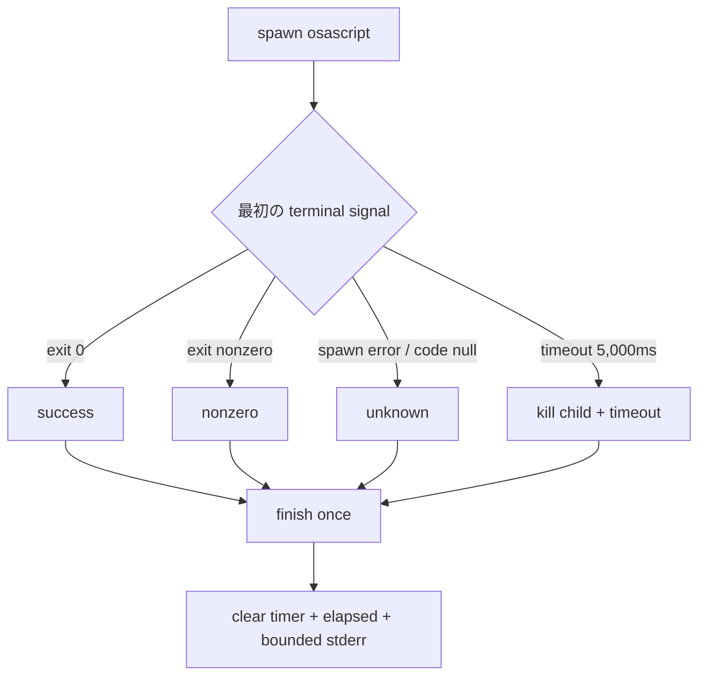
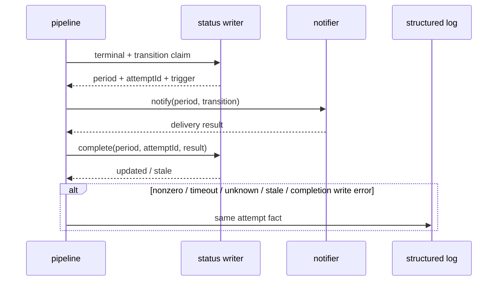

# AC-113・AC-114 通知結果記録の未配線を埋める実装設計

起草: `scale2sheet_architect_codex`

対象: Issue #242

基準: `main` commit `ed312395b0d0b3cd5e93909b26f87cf43104e551`

## 1. 結論

#242 は新しい通知方式を選ぶ Issue ではない。

2026-08-04 の accepted 決定で、既に次が決まっている。

| 正本 | 決定済みの契約 |
| --- | --- |
| `docs/decisions/2026-08-04T194632_デスクトップとメニューバーへの常設状態表示の検討書.md` AC-113 | bounded timeout、exit code、stderr、経過時間を同じ attempt として返し、claim の後に一回だけ通知し、結果を次の atomic replacement で保存する |
| 同 AC-114 | `doctor` が最後の notification attempt の transition、時刻、exit または timeout を報告する |
| 同 §5.3 | crash 後に同じ transition を再送しない at-most-once を採る。pipeline outcome と通知失敗を混ぜない |
| `docs/decisions/2026-08-05T102852_pipeline_statusの永続schemaと更新規則の設計.md` §9.2 | `completedAt`、`exitCode`、`stderr`、`elapsedMilliseconds` を `NotificationAttemptResultV1` に保持する |

したがって、案 1「結果を status へ書く」と案 3「doctor へ出す」は両方とも実装対象である。

案 2「次回 run で再送する」は accepted な at-most-once 契約に反するため実装しない。

再送を採るには、本書を変えるのではなく、2026-08-04 のユーザー決定を明示的に supersede する必要がある。

実装順は次の三段階に固定する。

1. notifier が結果を作る
2. attempt ID を照合して status へ atomic completion を保存する
3. doctor が保存済みの結果を表示する

doctor だけを先に入れると、成功した通知も永続的な `claimed` として警告し続ける。

このため三段階を一つの aggregate head に揃えてから main へ入れる。

## 2. 現在の実装で欠けているもの

### 2.1 実測

| 場所 | 現在の事実 | 欠落 |
| --- | --- | --- |
| `src/pipeline/notifier.ts:11-13` | `Notifier.notify` は `Promise<void>` | 呼出側が保存できる結果が無い |
| `src/pipeline/notifier.ts:18-30` | child の `error` と `exit` の両方で成功扱いの `resolve()` を行う | spawn error、exit 0、nonzero、signal を区別しない |
| 同 | `stdio: "ignore"` | stderr を観測できない |
| 同 | timer と kill が無い | child が終了しなければ pipeline も待ち続ける |
| `src/pipeline/status.ts:131-139` | `result` の五値だけを型に持つ | accepted schema の `completedAt`、`exitCode`、`stderr`、`elapsedMilliseconds` が未実装 |
| `src/pipeline/status.ts:179-210` | `write` は claim を保存して通知対象を返す | attempt result だけを更新する API が無い |
| `src/pipeline/status.ts:327-387`、`:542-578` | state transition と state-loss recovery は `claimed` だけを書く | `success`、`nonzero`、`timeout`、`unknown` を書く producer が無い |
| `src/pipeline/pipeline.ts:47-110` | claim 後に notifier を await する | result completion、failure log、unexpected rejection の隔離が無い |
| `src/installation/doctor.ts:417-471` | status は既に読む | `lastNotificationAttempt` を表示しない |

現在の型に `result` field が在ることは、結果が作られ保存される証拠ではない。

現在は一つの値 `claimed` だけが producer を持つ。

### 2.2 baseline

基準 commit で次を実行し、4 files / 104 tests が PASS した。

```sh
npx vitest run test/pipeline/pipeline.test.ts test/pipeline/status.test.ts test/installation/doctor.test.ts test/cli/serve-lease.test.ts
```

この baseline は claim と state-change-only が動く証拠である。

通知結果が保存される証拠ではない。

既存 test の「`lastNotificationAttempt=claimed` が実 delivery に対応する」というコメントは、attempt を呼んだことまでしか示さない。

## 3. #114・#242・#251 の責務境界



| Issue | 対象の切断 | 本書との関係 |
| --- | --- | --- |
| #114 | production の documented route が `pipeline-status.json` を書かない | #242 の結果保存は、installed `pipeline` route が有効になって初めて production へ効く |
| #242 | `pipeline` が通知を一回試みても、その process 結果を保存しない | 本書の実装対象 |
| #251 | legacy shell / exporter の失敗は err.log にだけ在り、読む側が無い | 本書の notifier と status writer を通らないため対象外 |

#242 を直しても「人へ届く」全体は保証されない。

cutover 前の legacy wrapper failure は #251 の領域であり、#242 の notifier result では観測できない。

cutover 後も、pipeline 自体が起動しなければ claim も結果も作れない。

## 4. 実装するデータ契約

### 4.1 正本

新しい `src/pipeline/notification-contract.ts` を通知結果の production 正本にする。

```ts
export const NOTIFICATION_TIMEOUT_MS = 5_000;
export const MAX_NOTIFICATION_STDERR_BYTES = 4_096;

export type NotificationDeliveryResult =
  | {
      readonly result: "success";
      readonly exitCode: 0;
      readonly stderr?: string;
      readonly elapsedMilliseconds: number;
    }
  | {
      readonly result: "nonzero";
      readonly exitCode: number;
      readonly stderr?: string;
      readonly elapsedMilliseconds: number;
    }
  | {
      readonly result: "timeout";
      readonly stderr?: string;
      readonly elapsedMilliseconds: number;
    }
  | {
      readonly result: "unknown";
      readonly stderr?: string;
      readonly elapsedMilliseconds?: number;
    };
```

`nonzero.exitCode` は runtime validator で 0 を拒否する。

`elapsedMilliseconds` は monotonic clock で測り、0 以上の整数へ丸める。

`stderr` の空文字列は field 欠落へ正規化する。

timeout と signal exit は有効な exit code を観測していないため `exitCode: 0` を補わない。

0 は「観測した成功」であり、欠落は「観測していない」である。

### 4.2 timeout の根拠

2026-08-11 に、通知を出さない `/usr/bin/osascript -e 'return 1'` を30回実行した。

| n | min | median | p95 | max |
| ---: | ---: | ---: | ---: | ---: |
| 30 | 34.8ms | 42.8ms | 63.3ms | 80.0ms |

測定は次の command で行った。

```sh
python3 - <<'PY'
import statistics
import subprocess
import time

samples = []
for _ in range(30):
    started = time.perf_counter()
    subprocess.run(
        ["/usr/bin/osascript", "-e", "return 1"],
        stdout=subprocess.DEVNULL,
        stderr=subprocess.DEVNULL,
        check=True,
    )
    samples.append((time.perf_counter() - started) * 1_000)

ordered = sorted(samples)
print(len(samples), ordered[0], statistics.median(samples), ordered[28], ordered[-1])
PY
```

5,000ms は観測最大の約60倍である。

この測定は local process の起動と正常終了だけを測り、Notification Center への表示、delivery、既読を測らない。

timeout は delivery SLO ではなく、child process が pipeline を無期限に止めないための安全上限である。

値は `NOTIFICATION_TIMEOUT_MS` の一箇所だけに置き、test と production adapter が同じ const を import する。

### 4.3 persisted attempt

`NotificationAttemptV1` は accepted schema §9.2 の field を実装する。

| result | `completedAt` | `exitCode` | `stderr` | `elapsedMilliseconds` |
| --- | --- | --- | --- | --- |
| `claimed` | 無し | 無し | 無し | 無し |
| `success` | 必須 | `0` | 観測時のみ | 必須 |
| `nonzero` | 必須 | 非0 | 観測時のみ | 必須 |
| `timeout` | 必須 | 無し | timeout までに観測した場合のみ | 必須 |
| `unknown` / adapter が応答 | 必須 | 無し | 観測時のみ | 観測できた場合のみ |
| `unknown` / crash 後の再照合 | 無し | 無し | 無し | 無し |

`claimed` は attempt の claim が durable で、completion がまだ durable でない状態を表す。

`unknown` は配送失敗を意味しない。

sender が結果を確定できなかったことだけを表す。

`schemaVersion` は上げない。

これらの optional field は accepted な schema v1 に既に定義されており、旧 v1 document はそのまま読める。

`definitionsVersion` も上げない。

pipeline outcome、counter、health の意味は変えず、既存 attempt の未実装 projection を埋めるためである。

## 5. notifier adapter

`Notifier.notify` の戻り値を `Promise<NotificationDeliveryResult>` へ変える。

`RunPipelineOptions.notifier` は独自の `Promise<void>` 構造型を持たず、同じ `Notifier` contract を参照する。

MacOS adapter は child process を次のように閉じる。



実装は一つの `finish` 関数だけが Promise を resolve できるようにする。

child は `error` の後に `exit` を発火し得るため、二つの handler が別々に結果を作ってはならない。

stdio は stdin と stdout を ignore、stderr だけ pipe にする。

stderr は受信中に byte 数を数え、4,096 byteを越える分を保持しない。

文字列化は最後に UTF-8 decoder で行い、multi-byte 文字の途中を壊さない。

timeout 時は child を kill し、その後の `exit` は既に完了した attempt として無視する。

spawn error と signal-only exit は `unknown` にする。

adapter は既知の child-process result を throw しない。

pipeline は port 実装の unexpected rejection だけを catch し、`unknown` completion に変換する。

## 6. status の atomic completion

### 6.1 API

`PipelineStatusWriter` に次を必須追加する。

```ts
interface NotificationAttemptCompletion {
  readonly period: PipelinePeriod;
  readonly attemptId: string;
  readonly completedAt: string;
  readonly delivery: NotificationDeliveryResult;
}

interface PipelineStatusWriter {
  write(status: PipelineStatus): Promise<PipelineStatusWriteResult>;
  completeNotificationAttempt(
    completion: NotificationAttemptCompletion,
  ): Promise<"updated" | "stale">;
}
```

optional method にはしない。

method が無い fake や production writer は typecheck で露出し、completion の実装忘れを許さない。

### 6.2 compare-and-swap

`completeNotificationAttempt` は document 全体を読み、次をすべて満たすときだけ更新する。

1. 対象 period に `lastNotificationAttempt` が在る
2. persisted `attemptId` が completion の `attemptId` と一致する
3. persisted `result` が `claimed` である

一致しなければ `stale` を返し、file を書かない。

古い child の遅延完了が、新しい transition の attempt を上書きしてはならない。

一致した場合は trigger、from/to state、attemptId、claimedAt を保持し、result field だけを completion へ置き換える。

反対 period、terminal、counter、health、diagnostic、activeRun は一 byte も再計算しない。

既存 writer と同じ mode 0600 の temporary file と rename を使って document 全体を atomic replacement する。

二 period の recovery notification が一 run で返る場合も、二回目の completion は一回目の result を保持する。

### 6.3 crash 後の `claimed`

新しい pipeline write が既存 document を読むとき、前 run から残った `claimed` は `unknown` として保存する。

同じ attempt は再送しない。

一方、`completeNotificationAttempt` の read は `claimed` を保持する mode を使う。

completion のために document を読んだだけで、照合対象を先に `unknown` へ変えてはならない。

status parser が notification-state-loss recovery 用にその read で新しく作った claim も stale claim へ分類しない。

実装は read mode を明示する。

| read mode | 既存 `claimed` | 用途 |
| --- | --- | --- |
| `pipeline-write` | `unknown` へ再照合 | 次の run 開始・terminal write |
| `attempt-completion` | `claimed` のまま | attemptId CAS と completion |
| read-only doctor | 変更しない | `claimed` を「完了未記録」と表示 |

## 7. pipeline の配線

status writer は従来どおり、terminal observation、health transition、notification claim を最初の atomic replacement で保存する。

その後、各 notification entry を period ごとに次の順で処理する。



notifier が option として存在しないのに writer が notification を返した場合は、stderr を捏造せず `unknown` result を作る。

原因 code `notifier-unavailable` は structured log にだけ出す。

claim を無言で残さない。

notifier の unexpected rejection も stderr を捏造しない `unknown` result に変換し、completion は試みる。

例外 message は structured log の diagnostic として別 field に出す。

status completion と failure log は同じ `NotificationAttemptCompletion` object から投影する。

exit code や elapsed time を log 用に再計算しない。

status completion を先に試み、その成否にかかわらず non-success result と persistence failure を structured log へ出す。

status file と log file は同じ transaction を共有しない。

crash をまたいで両方が必ず残ることは保証しない。

通知 result、status completion failure、stale CAS は pipeline の primary outcome、exit code、terminal diagnostic、V-3、件数を変更しない。

通知を知らせる第二の通知は送らない。

## 8. doctor projection

doctor は既存の `DoctorDeps.readPipelineStatus` と `checkLastRun` を使う。

notifier port、spawn、`.notify()` を追加しない。

したがって N-11「doctor は通知を dispatch しない」は変更せず HELD のままにする。

period ごとに最後の attempt を次のように表示する。

| persisted state | doctor の表示 | check severity |
| --- | --- | --- |
| attempt 無し | `notification unobserved` | それ自体では異常にしない |
| `success` | transition、claimed/completed 時刻、exit 0、elapsed | それ自体では異常にしない |
| `nonzero` | transition、時刻、nonzero exit、elapsed、bounded stderr | `WARN` |
| `timeout` | transition、時刻、timeout、elapsed、bounded stderr | `WARN` |
| `unknown` | transition、時刻、delivery unknown | `WARN` |
| `claimed` | transition、claimed 時刻、completion not recorded / delivery unknown | `WARN` |

`success` は `osascript` が exit 0 で終了したことだけを表す。

macOS が表示したこと、利用者へ到達したこと、利用者が読んだことの証拠として表示しない。

last pipeline outcome が失敗なら、既存の `LAST_RUN_FAILED` が全体を `FAIL` にする。

notification failure だけで primary pipeline failure に偽装せず、`WARN` として別の fact を出す。

## 9. README と台帳

実装 PR は README の「実行状態と検知の限界」を同じ release train で更新する。

現在の「macOS通知が表示・到達したことは記録できる」という記述は強すぎる。

次へ修正する。

- 記録できるのは `osascript` の exit、timeout、stderr、経過時間である
- exit 0 は表示、delivery、既読の証拠ではない
- 同じ state の継続中は再送しない
- `doctor` は最後の attempt を表示する
- 現行 launchd の `run` route では pipeline status と notification result を書かない
- legacy err.log は #251 の別経路である

`docs/ACCEPTANCE_TEST_REPORT.md` は AC-113 と AC-114 の実施方式、exact commit、実施日時、証跡を追加する。

reservation が `CONFIRMED` であることを、behavior が `PASS` したことの代用にしない。

## 10. probe と負のコントロール

### 10.1 baseline と正方向

| ID | probe | 期待 |
| --- | --- | --- |
| P-1 | fake child が exit 0 | `success`、exitCode 0、nonnegative elapsed |
| P-2 | fake child が stderr を出して exit 7 | `nonzero`、exitCode 7、同じ stderr |
| P-3 | fake timer の登録数と delay を先に assert し、timeout 境界の1ms前と境界で進める | timer 一件、delay は正本値、1ms前は未確定、境界で kill 一回と `timeout` |
| P-4 | fake child が spawn error | `unknown`。Promise は reject しない |
| P-5 | fake child が signal-only exit | `unknown`。exitCode を0で補わない |
| P-6 | multi-byte stderr が上限を越える | valid UTF-8 の4,096 byte以下で保存 |
| P-7 | terminal write が alert を claim し notifier が成功 | 同じ attemptId が `success` へ atomic completion される |
| P-8 | notifier が nonzero / timeout / unexpected rejection | primary outcome は不変で、同じ result が status と log に在る |
| P-9 | 一 run で二 period の recovery notification | 両 period の attempt が別々に completion され、一方が他方を消さない |
| P-10 | attempt A の後に attempt B を保存し、A の completion を遅延適用 | `stale`、B は不変 |
| P-11 | claim 後に process を止め、次 run を開始 | 旧 claim は `unknown`、通知は再送されない |
| P-12 | status fixture を result 五値と attempt 無しで doctor へ渡す | §8 の表示と severity の全行に一致 |
| P-13 | doctor の dependency keys と source を検査 | notifier port と `.notify()` は0件のまま |
| P-14 | `nonzero` completion に exitCode 0 を与える | schema error、status file 不変 |
| P-15 | completion field の無い旧 v1 status を読む | migration 無しで受理し、次の正当な write が成功 |

P-3 は fake timer と fake child を使い、timer 登録を同期的に先に検査する。

実時間の sleep と OS notification に依存しない。

timer arm を外す変異は test timeout ではなく、登録数の assertion で落とす。

### 10.2 mutation

baseline を同じ head で緑にしてから、各変異を一つずつ当てる。

| ID | 変異 | 落ちるべき probe | 期待判定 |
| --- | --- | --- | --- |
| M-1 | nonzero exit を `success` に変える | P-2 | `KILLED` |
| M-2 | timeout timer の arm を外す | P-3 | `KILLED` |
| M-3 | stderr cap を外す | P-6 | `KILLED` |
| M-4 | pipeline の `completeNotificationAttempt` 呼出しを外す | P-7 / P-8 | `KILLED` |
| M-5 | CAS の attemptId 比較を外す | P-10 | `KILLED` |
| M-6 | 二 period の一方だけ completion する | P-9 | `KILLED` |
| M-7 | notification failure で pipeline exit を1にする | P-8 | `KILLED` |
| M-8 | 次 run で `claimed` を再送する | P-11 | `KILLED` |
| M-9 | doctor の notification summary を削る | P-12 | `KILLED` |
| M-10 | doctor の nonzero / timeout / unknown を正常表示にする | P-12 | `KILLED` |
| M-11 | `nonzero.exitCode !== 0` の runtime validation を外す | P-14 | `KILLED` |

compile error は `KILLED-BY-TSC` であり、probe が変異を捕捉した `KILLED` と数えない。

runner timeout、Bun 欠落、fixture 起動失敗も mutation result に数えない。

### 10.3 非警報対照

| ID | 対照 | 期待 |
| --- | --- | --- |
| L-1 | state transition 無し | notifier 0回、completion 0回 |
| L-2 | notification `success` | doctor は notification failure を出さない |
| L-3 | notification `nonzero` だが pipeline は transferred | pipeline outcome / exit / counts は不変 |
| L-4 | doctor 実行 | notifier construction / dispatch 0回 |
| L-5 | status に attempt 無し | 成功と表示せず `unobserved`。それ自体では warning にしない |

L-1〜L-5 が警報を出さないことを `NO-ALARM` と記録する。

## 11. 実装順序

1. `notification-contract.ts` と notifier adapter の unit test を先に書く
2. fake child / timer / monotonic clock を注入できる seam と result producer を実装する
3. status completion の CAS test を先に書く
4. `completeNotificationAttempt` と stale-claim reconciliation を実装する
5. pipeline の status・log 同一性 test を先に書く
6. notifier result、atomic completion、structured log を配線する
7. doctor の五値 projection test を先に書く
8. existing `readPipelineStatus` だけで doctor projection を実装し、N-11 を再実行する
9. README と acceptance report を更新する
10. targeted test、full `npm test`、baseline、M-1〜M-11、復元後 baseline を同じ aggregate head で記録する

通知 result を返す adapter だけを main へ入れ、completion を後回しにしない。

completion だけを入れ、doctor が永久 `claimed` を表示する期間も作らない。

review を分割する必要があれば integration branch を使い、main へは三段階が揃った aggregate head だけを入れる。

## 12. 完了条件

- AC-113 と AC-114 の未実装部分が正方向 probe で観測できる
- M-1〜M-11 がそれぞれ `KILLED` である
- L-1〜L-5 が `NO-ALARM` である
- notifier failure が pipeline outcome と exit codeを変えない
- old v1 status を schema migration 無しで読める
- N-11 が HELD である
- README が exit 0 と delivery / 既読を混同しない
- #114 と #251 の対象外経路が「#242 で直った」と報告されない

「型を広げた」「method を実装した」「一回緑だった」は完了証拠にしない。

完了報告は、各変異でどの試験が落ちたかと、復元後の baseline が緑へ戻ったことを含める。
