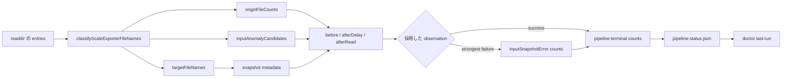

# origin 別入力ファイル件数を status と doctor へ接続する設計

起草: `scale2sheet_architect_codex`

検証: exact head で `scale2sheet_reviewer_claude` へ依頼する。

| 項目 | 値 |
| --- | --- |
| 起点 | Issue #126 |
| 基準 HEAD | `751533300f0476d0f863a886227d6718f4f3fd6d` |
| ユーザー決定 | 片方の origin が零件でも異常として扱わず、origin 別件数を status に保存して doctor で表示する |
| 決定の記録 | Issue #126 の 2026-08-10T16:18:00+09:00、2026-08-10T22:29:00+09:00 の manager コメント |
| 決定の検証範囲 | manager の証言であり、reviewer の検証範囲外 |
| canonical origin | `apple-health`、`google-fit` |
| outcome、health、exit code | 変更しない |
| schema | `schemaVersion: 1` を維持し、新しい definitions の terminal counts で二値を必須にする |
| 未決事項 | なし。definitions release train への同梱可否は実装時点の配備状態で判定する |

## 1. 対象と結論

Issue #126 は、対象日に片方の公開経路しか存在しない場合に、合計ファイル数だけでは欠けた経路を識別できない問題を扱う。

当方は片方の零件を failure、health alert、通知条件へ追加しない。

当方が保存するのは、pipeline が対象日の安定 snapshot で観測した origin 別ファイル件数である。

先方が公開時に行う origin parity 検査は、当方の観測を代替しない。

先方の検査は公開集合を判定し、当方の counts は consumer が実際に読んだ集合と転記結果を同じ terminal observation に残すため、対象と時点が異なる。

新しい definitions の terminal observation は、次の二値を両方持つ。

```json
{
  "counts": {
    "matchedFileCount": 15,
    "originFileCounts": {
      "apple-health": 0,
      "google-fit": 15
    }
  }
}
```

`originFileCounts` が存在する場合、二つの key は必須である。

key の欠落を零件へ読み替えない。

## 2. 実測の母集団

実効出力先 `/Users/kappa/Dropbox/data/private/健康/scale_exporter` を読み取りだけで集計した。

対象日の判定には mtime ではなく canonical filename の日付を使った。

2026-06-29 から 2026-08-10 までの canonical file は `apple-health` 十二件、`google-fit` 六百七十四件で、四十三暦日に分布していた。

canonical な `apple-health` は 2026-07-27 に初めて現れた。

導入後の十五日では、2026-07-30、2026-07-31、2026-08-01 の三日だけが `apple-health: 0` だった。

四十三日全体で零件の日を数えると三十一日になるが、導入前を欠測として含むため運用上の欠測率には使わない。

`apple-health-file` を含む旧命名は canonical origin へ含めない。

本番には Finder が作った `のコピー` 接尾辞の二件が NFD で存在する。

これは canonical file にも anomaly candidate にも含めず、黙って除外する。

Dropbox の conflicted copy は別の分岐であり、canonical file へ含めず、同じ target date の分類時だけ anomaly candidate とする。

## 3. origin の正本

現行の `src/sources/scale-exporter/reader.ts:38-39` は、filename pattern の中に二つの origin を直接書いている。

実装では二つの文字列を tuple へ移し、型、filename pattern、零初期化した counts を同じ tuple から導出する。

```ts
export const scaleExporterOrigins = ["apple-health", "google-fit"] as const;

export type ScaleExporterOrigin = (typeof scaleExporterOrigins)[number];

export type ScaleExporterOriginFileCounts = Readonly<
  Record<ScaleExporterOrigin, number>
>;
```

`apple-health-file` を三つ目の値にしない。

現行 pattern に一致しないためであり、同名の旧試行を canonical input として数えると、導入前の試行と現行契約を混在させる。

`classifyScaleExporterFileNames` は比較前に filename を NFC へ正規化する。

正規化するのは比較値だけであり、`targetFileNames` には filesystem から得た元の name を保持する。

単一の `classifyScaleExporterFileName` helper は、canonical match と Finder の `のコピー` 判定の両方で同じ NFC 正規化を使う。

helper は `target`、`finder-copy`、`near-miss`、`irrelevant` の判定種別を返す。

これにより、最終的な counts と anomaly が同じになる `finder-copy` と `irrelevant` の違いも unit test から直接観測できる。

Finder copy は canonical target として数えず、pattern mismatch anomaly にもしない。

conflicted copy と `apple-health-file` は Finder copy とは異なり、同じ target date なら pattern mismatch anomaly にする。

`classifyScaleExporterFileNames` は canonical match を一度だけ解析し、`targetFileNames` と `originFileCounts` を同時に返す。

`isScaleExporterTargetFile` は同じ match helper を使い、別の正規表現や origin 集合を持たない。

```ts
export interface ScaleExporterFileClassification {
  readonly targetFileNames: readonly string[];
  readonly originFileCounts: ScaleExporterOriginFileCounts;
  readonly inputAnomalyCandidates: readonly InputAnomalyCandidate[];
}
```

`classifyScaleExporterFileNames` は各 name にこの helper を一回だけ適用し、判定種別から aggregate を作る。

NFC 正規化を helper の外へ複製しない。

## 4. observation のデータフロー

件数は pipeline の終端で filename を再解析して作らない。

各 filesystem snapshot を分類した時点で固定し、その snapshot を採用した observation と一緒に運ぶ。



`InputSnapshotFiles`、`StableInputSnapshot`、`InputSnapshotCounts` は `originFileCounts` を必須にする。

`InputSnapshotError` の空の既定 counts は削除し、生成時に observation の counts を必ず渡す。

出力 directory が存在しない場合も、二つの key を持つ零 counts を返す。

origin 別件数は、安定 snapshot に含まれた canonical target file の件数である。

Issue #246 により parse error の file が除外されても、その file は `matchedFileCount` と `originFileCounts` に含める。

利用可能な file の件数は Issue #246 の `inputFileExclusions` と組み合わせて読むため、origin counts から推測しない。

near miss と conflicted copy は canonical counts に含めず、`inputAnomalyCandidates` で別に表す。

`matchedFileCount` と origin 別件数には次の不変条件を置く。

```text
matchedFileCount
  = originFileCounts["apple-health"]
  + originFileCounts["google-fit"]
```

負数、小数、未知 key、片方の key の欠落、合計不一致は有効な current definitions の observation として受け入れない。

## 5. strongest failure と同じ snapshot の件数

`src/pipeline/input-snapshot.ts:77-84` は、三回の attempt から最も強い failure observation を選ぶ。

origin 別件数は、選ばれた outcome と diagnostic と同じ observation に属する。

| 経路 | 保存する origin 別件数 |
| --- | --- |
| `input-missing` | `before`。両方零件 |
| stability window で `input-unstable` | `afterDelay` |
| read 後に `input-unstable` | `afterRead` |
| `input-invalid-or-partial` | parse 対象の `afterDelay` |
| success | 採用した `afterRead` |

強い observation の outcome だけを採り、counts を以前の弱い observation から残す更新を禁止する。

同じ強さの後続 observation が前の observation を置き換える場合も、outcome、diagnostic、counts、anomaly candidates を一組で置き換える。

pipeline は `InputSnapshotError.counts` を input failure terminal へそのまま渡す。

success 後は `matchedFileCount` と `readLineCount` に `originFileCounts` を加え、no-data、transfer failure、transferred の全 terminal へ同じ counts を渡す。

## 6. status schema と definitions lifecycle

`PipelineCounts` には `originFileCounts` を追加する。

`running` は input をまだ観測していないため、この field を持たない。

このため、共通 `PipelineCounts` 上では field を optional に保ち、current definitions の terminal validator と writer boundary で必須にする。

current definitions の terminal は、非負整数の `matchedFileCount`、`originFileCounts`、内部の二つの key を必須にする。

旧 definitions の terminal は field 欠落を許容する。

旧 definitions でも field が存在する場合は、二つの key、非負整数、合計一致を検証する。

この差を parser で判定するため、`parseDocument` は `definitionsVersion` を `parsePeriodState` と terminal validator へ渡す。

| document | `originFileCounts` 欠落時の扱い |
| --- | --- |
| 旧 definitions | 有効。未観測として読む |
| current definitions の `running` | 有効。input 未到達 |
| current definitions の terminal | schema error。零件へ補完しない |

`recordTerminal` も current definitions の required counts を検査し、不完全な production observation を永続化しない。

`schemaVersion` は `1` のまま維持する。

旧 definitions を版付きで読み、current definitions だけを厳格化する既存方式に収まり、旧 field を自動移送しないためである。

本変更は件数の定義を追加するため、`definitionsVersion` を実装時点の次の未使用値へ上げる。

既に計画された Issue #243、Issue #246、Issue #182、Issue #259 の release train が active writer へ未配備なら、次の条件をすべて満たす場合だけ同じ版上げへ含めてよい。

- 同じ aggregate head、binary、definitions label、README、mutation gate に Issue #126 を含める。
- Issue #126 を欠いた中間 binary を active writer にしない。
- label に Issue #126 の origin file counts を列挙する。
- 配備後の再基準化を一回だけ確認する。

先行 train が active writer へ配備済みなら、既存 label を遡って変更せず、Issue #126 は次の definitionsVersion を使う。

## 7. doctor の表示

`src/installation/doctor.ts:441-457` の `last-run` summary に、各 period の最新 terminal が観測した二値を追加する。

```text
morning: completed:transferred, ..., origin files apple-health 1, google-fit 15
evening: completed:no-data, ..., origin files apple-health 0, google-fit 20
```

旧 definitions の terminal に field が無い場合は、次のように表示する。

```text
origin files apple-health unobserved, google-fit unobserved
```

欠落を `0` と表示しない。

片方が零件でも doctor check の severity、terminal outcome、health、exit code を変更しない。

period に terminal 自体が無い場合は、現行どおり period 全体を `unobserved` と表示する。

## 8. README の追随

README の status 説明へ、`lastTerminal.counts.originFileCounts` の二値と、零件が異常を意味しないことを追加する。

doctor の説明には、最新 terminal の origin 別件数を表示することと、旧記録は `unobserved` になることを書く。

開発経緯、四十三日の調査、definitions release train は README へ持ち込まない。

## 9. behavior control

無変異 baseline では次を確認する。

| ID | 層 | fixture | 期待結果 |
| --- | --- | --- | --- |
| P-1 | classifier | canonical 二 origin を一件ずつ | `apple-health=1`、`google-fit=1`、合計二件 |
| P-2 | classifier | google-fit 二件だけ | `apple-health=0`、`google-fit=2`。anomaly なし |
| P-3 | classifier | apple-health 一件だけ | `apple-health=1`、`google-fit=0`。anomaly なし |
| P-4 | single-name helper と classifier | NFD で表した target date の Finder copy | helper は `finder-copy`。aggregate の canonical counts は両方零、anomaly なし |
| P-5 | classifier | NFC の Finder copy と番号付き Finder copy | canonical counts は両方零、anomaly なし |
| P-6 | classifier | target date の `apple-health-file` と conflicted copy | canonical counts は両方零、二件とも pattern mismatch anomaly |
| P-7 | classifier | 2026-08-05 の conflicted copy、target date は 2026-08-11 | counts は両方零、anomaly なし |
| P-8 | snapshot | 安定した二 origin | success が `afterRead` の counts を返す |
| P-9 | snapshot | directory 不在または対象日 file なし | `input-missing` と両方零 |
| P-10 | snapshot | `afterDelay` で file 集合が変化 | `input-unstable` と `afterDelay` の counts |
| P-11 | snapshot | parse error | `input-invalid-or-partial` と parse 対象 snapshot の counts |
| P-12 | strongest failure | 弱い failure の後に別 counts の強い failure | 強い outcome、diagnostic、counts が同じ attempt の組 |
| P-13 | pipeline | input failure、no-data、transfer failure、transferred | 全 terminal に同じ run の origin counts |
| P-14 | status | current definitions の valid、欠落、負数、小数、未知 key、合計不一致 | valid だけ受理。旧 definitions の欠落は受理し、存在する不正値は拒否 |
| P-15 | doctor | 零件、正数、旧 definitions | 実数または `unobserved`。severity は元 outcome のまま |
| P-16 | status health | 同じ terminal で apple-health を一件から零件へ変更 | health、通知 claim、exit code は不変 |

P-4 から P-7 は unit fixture で検査する。

2026-08-05 の conflicted copy は target date が異なるため、2026-08-11 の production status を対照に使わない。

## 10. mutation control

変異は一度に一箇所だけへ当て、無変異 baseline、変異後、復元後 baseline の順で実行する。

| ID | 変異 | 狙う検査 | 期待判定 |
| --- | --- | --- | --- |
| M-1 | comparison name の NFC 正規化を削除 | P-4 | `KILLED` |
| M-2 | helper の Finder copy 判定を削除し、`irrelevant` へ落とす | P-4 | `KILLED` |
| M-3 | helper が Finder copy を canonical `target` として返す | P-4、P-5 | `KILLED` |
| M-4 | classifier の `apple-health` increment を削除 | P-1、P-3 | `KILLED` |
| M-5 | 零 counts から `apple-health` key を省く。ただし cast で tsc を通す | P-2、P-9、P-14 | `KILLED` |
| M-6 | `apple-health-file` を canonical `apple-health` として数える | P-6 | `KILLED` |
| M-7 | failure observation から `originFileCounts` を落とす | P-9、P-10、P-11 | `KILLED` |
| M-8 | strongest outcome 更新時に以前の弱い counts を残す | P-12 | `KILLED` |
| M-9 | success 後の pipeline counts から `originFileCounts` を落とす | P-13 | `KILLED` |
| M-10 | current definitions の terminal 欠落を parser が受理する | P-14 | `KILLED` |
| M-11 | 合計不一致を parser または writer が受理する | P-14 | `KILLED` |
| M-12 | doctor が欠落を零件と表示する | P-15 | `KILLED` |
| M-13 | 片方零件を health cause に加える | P-16 | `KILLED` |
| M-14 | required counts literal から一方の key を削除し、cast は加えない | `npm run typecheck` | `KILLED-BY-TSC` |

M-14 は試験が捕まえたとは報告しない。

M-1 から M-13 でも tsc が先に落ちた場合は `KILLED-BY-TSC` とし、対象試験の `KILLED` に数えない。

対象試験が落ちなければ `SURVIVED` とし、別の試験が偶然落ちた結果で置き換えない。

各結果には変異箇所、実行した test file、落ちた test 名、tsc の exit code を記録する。

## 11. 変更ファイル

| file | 変更責務 |
| --- | --- |
| `src/sources/scale-exporter/reader.ts` | origin tuple/type、単一 match helper、classifier counts |
| `src/sources/scale-exporter/index.ts` | origin type と counts type の export |
| `src/pipeline/input-snapshot.ts` | 各 snapshot と strongest observation に counts を保持 |
| `src/pipeline/pipeline.ts` | success と全 failure terminal へ counts を渡す |
| `src/pipeline/status.ts` | current definitions の必須 validation、不変条件、版上げ、再基準化 |
| `src/installation/doctor.ts` | period ごとの origin counts または `unobserved` の表示 |
| `README.md` | status と doctor のユーザー向け説明 |
| `test/scale-exporter/reader.test.ts` | P-1 から P-7 |
| `test/pipeline/input-snapshot.test.ts` | P-8 から P-12 |
| `test/pipeline/pipeline.test.ts` | P-13 |
| `test/pipeline/status.test.ts` | P-14、P-16、definitions transition |
| `test/installation/doctor.test.ts` | P-15 |

新しい production module、外部依存、設定 key、環境変数は追加しない。

## 12. 受け入れ gate

次をすべて満たした head だけを実装完了とする。

1. canonical origin の正本が二値の tuple 一箇所にあり、reader と status が別の集合を持たない。
2. current definitions の全 terminal が両方の origin count を持ち、零件と欠落を区別する。
3. `matchedFileCount` と二値の合計が一致する。
4. strongest failure の outcome、diagnostic、counts、anomaly candidates が同じ observation に対応する。
5. 片方零件で outcome、health、notification claim、exit code が変わらない。
6. doctor が実数または `unobserved` を period ごとに表示する。
7. P-1 から P-16 が baseline で通る。
8. M-1 から M-13 が `KILLED`、M-14 が `KILLED-BY-TSC` になる。
9. 変異をすべて復元した後に `npm run typecheck` が exit `0` になる。
10. 復元後に対象五 test file が通る。
11. README の status と doctor の説明が実装と同じ二値を使う。

`npm test` は `test/**/*.test.ts` を対象にするため、acceptance も含む repository integration gate である。

これは M-1 から M-14 の mutation 判定には使わず、contract の focused test と分離する。

Issue #177、Issue #274 など既知の timeout や runner failure が出た場合、変異の `SURVIVED` や `KILLED` に読み替えず、integration gate failure として実装 PR を止める。

赤のあとに再実行して緑になった一回を合格根拠にしない。

原因を解消した final head で `npm test` が二回連続して通ることを merge gate とする。

起草時の無変異 baseline は `npm run typecheck` が exit `0`、対象五 test file が `129` 件 PASS だった。

これは実装後の合格証拠ではない。

## 13. 範囲外

- 片方零件を failure、health cause、通知条件へ変えること
- apple-health の未公開原因を consumer が推測すること
- record 内の自由文字列 `source` を集計すること
- `apple-health-file` と conflicted copy を canonical input として回収すること
- 過去四十三日の status を再構成すること
- 2026-08-11 の production status を anomaly fixture として使うこと
- 全 terminal history を保持すること
