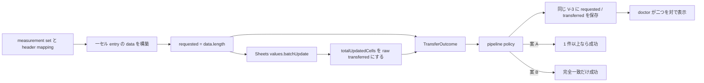
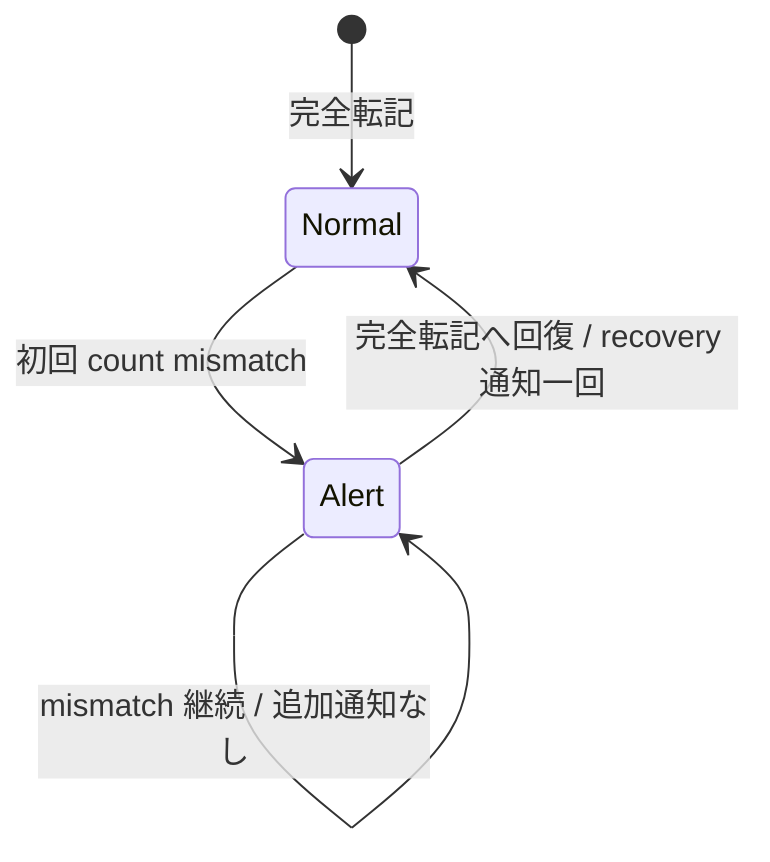

# requestedCellCount と部分転記判定の実装設計

起草: `scale2sheet_architect_codex`

対象: Issue #243

基準: `main` commit `62774353caefbfa497aa4ffe69401b5ca8fbe849`

## 1. 目的と決定状態

本書は、要求したセル数を計算できるのに保存していない欠落を直し、Google Sheets の response から transfer fact を作る adapter 自身を直接検査できるようにする。

部分転記を成功と呼ぶか失敗と呼ぶかは、通知、終了コード、status の定義版を変えるため、固定実装と分離する。

| 区分 | 本書での扱い |
| --- | --- |
| 固定 | `requestedCellCount` の正本、adapter outcome、pipeline status、doctor 表示、adapter の直接 probe |
| ユーザー判断 | 案 A「観測だけ追加」、案 B-before「完全一致を cutover 前に導入」、案 B-after「完全一致を cutover 後に導入」の選択。B は最初の version 4 write で両 period の従来履歴を消す。B-before は G-2 の判定前に観測履歴を失い、B-after は判定に使った後で cutover 前の履歴を失う |
| 対象外 | 実 Spreadsheet への試験書込み、Sheets API の transaction 保証、任意の型 field に writer が存在するかを調べる汎用 AST gate |

汎用 AST gate は #243 の発見方法を一般化する別課題であり、対象 field ごとの正しい生成条件までは判定できない。

#243 では、対象が明確な adapter、pipeline、status、doctor の probe を置く。

## 2. 現行実装の実測

| 場所 | 現在の事実 | 欠落 |
| --- | --- | --- |
| `src/domain/measurement.ts:56-59` | `TransferOutcome` は state と `transferredCellCount` を持つ | `requestedCellCount` が無い |
| `src/sheets/adapter.ts:76-106` | `data` を request body へ渡し、`totalUpdatedCells` を outcome へ写す | `data.length` を log 以外へ渡さない |
| `src/sheets/adapter.ts:163-208` | 各 `data` entry は一つの range と `[[value]]` を持つ | 戻り型が `unknown[][]` なので一セル不変条件を型で表していない |
| `src/pipeline/pipeline.ts:170-193` | `transferredCellCount` を V-3 へ写し、1 件以上なら成功とする | requested を写さない |
| `src/pipeline/status.ts:19-27` | persisted V-3 に optional な `requestedCellCount` が宣言済み | production writer が値を作らない |
| `src/installation/doctor.ts:440-454` | transferred だけを表示する | 要求数との比が分からない |
| `test/sheets/adapter.test.ts:1-127` | mapping、行検索、request data helper を検査する | 実 adapter の response 変換を呼ばない |

基準 commit で次を実行し、4 files / 100 tests が PASS した。

```sh
npx vitest run test/sheets/adapter.test.ts test/service/measurements.test.ts test/pipeline/pipeline.test.ts test/installation/doctor.test.ts
```

この baseline は現行挙動が緑である証拠であり、`requestedCellCount` が機能している証拠ではない。

Google Sheets API は `spreadsheets.values.batchUpdate` の `totalUpdatedCells` を「更新されたセルの総数」と定義している。

一次資料: [Method: spreadsheets.values.batchUpdate](https://developers.google.com/workspace/sheets/api/reference/rest/v4/spreadsheets.values/batchUpdate)

同ページは要求数と実更新数の一致を scale2sheet の成功条件には定めないため、その分類は本プロジェクトの判断である。

## 3. 要求セル数の正本

### 3.1 一 entry 一 cell を型にする

`buildMeasurementUpdateData` の戻り値を次の一セル型へ狭める。

```ts
interface MeasurementCellUpdate {
  readonly range: string;
  readonly values: [[number]];
}
```

`buildMeasurementUpdateData` が返す `MeasurementCellUpdate[]` では、一 entry が一 cell を表す。

したがって `requestedCellCount` の正本は、Sheets へ実際に渡す `data.length` とする。

測定値の種類数、入力 reading 数、header の列数から別に再計算しない。

別の値から再計算すると、request body と count が別々に変わる経路ができるためである。

将来一つの entry が複数 cell を持つ仕様へ変える場合は、`MeasurementCellUpdate` と count の定義を同じ PR で変える。

### 3.2 resolved outcome では requested を必須にする

production の `TransferOutcome` は次の形へ変える。

```ts
export interface TransferOutcome {
  readonly state: "written" | "not-written" | "unknown";
  readonly requestedCellCount: number;
  readonly transferredCellCount?: number;
}
```

`requestedCellCount` を optional にしない。

adapter が resolve したのに要求数を落とす構築点は、production と test fixture の双方で型エラーになる。

この型エラーは構築点の網羅を守るが、response 変換の正しさを証明しないため、変異判定では `KILLED-BY-TSC` として behavior probe の `KILLED` に数えない。

## 4. adapter が返す fact

adapter は request と response の事実だけを返し、部分転記を成功または失敗に分類しない。

| 到達点 | `requestedCellCount` | `transferredCellCount` | state |
| --- | ---: | ---: | --- |
| 当日行が無く batchUpdate を呼ばない | `0` | `0` | `not-written` |
| mapping できる値が無く batchUpdate を呼ばない | `0` | `0` | `not-written` |
| N cell を要求し、`totalUpdatedCells` が欠落 | N | 未観測 | `unknown` |
| N cell を要求し、`totalUpdatedCells = 0` | N | `0` | `not-written` |
| N cell を要求し、`totalUpdatedCells > 0` | N | response の値 | `written` |
| auth、読取、batchUpdate が reject | outcome を返さない | outcome を返さない | pipeline の `failed` 経路 |

正の `totalUpdatedCells` が requested より少ない場合も多い場合も、adapter は値を clamp、補完、分類せず `written` と raw count を返す。

件数の対応を判断するのは pipeline policy の責務である。



## 5. status と doctor の後方互換

### 5.1 persisted field は optional のまま

`TransferOutcome.requestedCellCount` は新しい production result で必須にする一方、`V3Observation.transfer.requestedCellCount?` は optional のまま維持する。

既存の `pipeline-status.json` は requested を持たないため、persisted schema まで required にすると旧 status を読めない。

| persisted value | 読み方 |
| --- | --- |
| field が無い | 未観測 |
| `0` | batchUpdate へ要求した cell が 0 件 |
| 正の整数 N | N cell を要求した |

field 欠落を `0` に正規化しない。

「無い」と「0」を同じにすると、旧 writer の記録が要求 0 件だったという偽の観測になる。

requested field は `definitionsVersion: 3` の設計に既に存在するため、固定部分の追加だけでは `schemaVersion` も `definitionsVersion` も上げない。

### 5.2 pipeline は同じ observation へ写す

transfer が resolve した経路では、pipeline は同じ `v3.transfer` object に state、requested、存在する場合の transferred を置く。

outcome、diagnostic、requested、transferred を別々の status write にしない。

transfer が reject して `TransferOutcome` を返さなかった経路では、現行どおり state を `failed` とし、requested を推測しない。

### 5.3 doctor は二値を独立に表示する

doctor の `last-run` summary は次の二項を並べる。

```text
requested cells 5, transferred cells 3
```

旧 status では次のように表示する。

```text
requested cells unobserved, transferred cells 3
```

`3 / 5 = 60%` のような比率へ丸めない。

件数そのものを出すことで、field 欠落、要求 0、response 欠落を混同しない。

## 6. adapter response を直接検査する seam

`test/sheets/adapter.test.ts` から production の `updateSpreadsheetMeasurements` を呼び、Google API の read と batchUpdate だけを fake にする。

production function が任意の mock object を直接参照しないよう、adapter 内に必要最小限の `SheetsValuesPort` を定義する。

```ts
interface SheetsValuesPort {
  get(request: SheetsGetRequest): Promise<SheetsGetResponse>;
  batchUpdate(request: SheetsBatchUpdateRequest): Promise<{
    readonly data: { readonly totalUpdatedCells?: number };
  }>;
}
```

`updateSpreadsheetMeasurements` は optional に注入された port があればそれを使い、無ければ現行どおり auth と `google.sheets` から production port を作る。

fake port の試験は次の全てを見る。

1. header read と date-column read の後に batchUpdate が一回だけ呼ばれる。
2. request body の `data` が一セル entry を N 件持つ。
3. outcome の `requestedCellCount` が同じ N である。
4. `totalUpdatedCells` の欠落、`0`、N 未満、N と同数、N より大きい値が加工されず outcome へ写る。
5. 欠落は `unknown`、`0` は `not-written`、正数は `written` になる。

pipeline の fake `TransferOutcome` だけを検査しても、Google response を adapter が正しく変換した証拠にならない。

## 7. ユーザー判断 A: 観測だけを追加する

案 A は accepted な 2026-08-05 の定義を変えない。

pipeline の成功条件は、state が `written` で `transferredCellCount >= 1` のままとする。

| response | pipeline outcome | exit | health / 通知 |
| --- | --- | ---: | --- |
| requested `5` / transferred `5` | `completed:transferred` | `0` | 正常 |
| requested `5` / transferred `3` | `completed:transferred` | `0` | 新しい alert なし |
| requested `5` / transferred `0` | `failed:transfer` | `1` | 現行どおり alert |
| requested `5` / transferred 未観測 | `failed:transfer` | `1` | 現行どおり alert |

### 7.1 版と移行

`definitionsVersion` は `3`、label は `2026-08-05/v3-transfer-observation` のままにする。

writer、reader、doctor は既存 document を rebaseline せず、last terminal、last done、last transfer、counter、health、notification attempt を維持する。

新 writer が次に terminal を保存した period から requested が現れ、反対 period の旧 terminal は field 欠落のまま残る。

### 7.2 利用者への帰結

部分転記は status と doctor を見れば分かるが、利用者が見に行かなければ成功のままである。

終了コード、launchd の alert、状態遷移通知は増えない。

案 A は「見えるようにする」であり、「不完全な転記を止める」ではない。

## 8. ユーザー判断 B: 完全一致だけを成功にする

案 B は次の一つの predicate を pipeline outcome と health evaluator の双方で使う。

```ts
state === "written" &&
requestedCellCount >= 1 &&
transferredCellCount === requestedCellCount
```

同じ比較を pipeline と status に別々に手書きしない。

`src/pipeline/transfer-policy.ts` に pure function を置き、`TransferOutcome` と persisted V-3 transfer の双方が渡せる最小 shape を引数にする。

| response | pipeline outcome | exit | health cause |
| --- | --- | ---: | --- |
| requested `5` / transferred `5` | `completed:transferred` | `0` | V-3 cause なし |
| requested `5` / transferred `3` | `failed:transfer` | `1` | `terminal-failure` と `v3-not-transferred` |
| requested `5` / transferred `6` | `failed:transfer` | `1` | `terminal-failure` と `v3-not-transferred` |
| requested `5` / transferred `0` | `failed:transfer` | `1` | `terminal-failure` と `v3-not-transferred` |
| requested `5` / transferred 未観測 | `failed:transfer` | `1` | `terminal-failure` と `v3-not-transferred` |

requested より多い response は、現在の一セル entry では valid な結果ではない。

成功に丸めず contract inconsistency として fail closed にするため、比較は `<` ではなく等値にする。

diagnostic は state だけでなく requested と transferred の双方を含める。

### 8.1 通知と rollback の限界

部分 response を受けた時点で、Sheets 側では transferred 分の cell が既に更新されている。

`failed:transfer` は transaction rollback を意味せず、「要求した全 cell の更新を確認できなかった」を意味する。

再実行は同じ当日行の同じ cell を上書きするため、欠落した cell を含む全 request を再送する。



最初の mismatch が `unobserved` または `normal` から `alert` への遷移なら通知を一回要求する。

後続 mismatch が `alert` のままなら追加通知しない。

完全転記へ戻ったときは `alert` から `normal` への recovery 通知を一回要求する。

### 8.2 definitionsVersion 4

案 B は `completed:transferred` と V-3 health の意味を変えるため、構造が同じでも `definitionsVersion` を `4` へ上げる。

新しい label は `2026-08-11/v4-complete-transfer` とする。

現行 `rebaselineForDefinitions` は旧版 document の両 period を `initialPeriod()` へ置換する。

したがって v3 から v4 への最初の write で次が消える。

- `lastTerminal`
- `lastDoneAt`
- `lastTransferredAt`
- 連続 failure / no-data counter
- health
- notification diagnostic / attempt

実行中の period は同じ write 以降に v4 の observation を持つが、反対 period は次の実行まで `unobserved` になる。

doctor も反対 period を、その period が v4 で実行されるまで `unobserved` と表示する。

古い v3 binary は v4 document を current より新しい版として拒否し、上書きしない。

新 binary と旧 binary を並行実行しないことが移行条件である。

`DefinitionsVersion`、current version、current label、既知版の試験を同じ PR で更新する。

現在「版 4 は未知」とする probe は `5` を未知版に変える。

`docs/decisions/2026-08-05T102852_pipeline_statusの永続schemaと更新規則の設計.md` と `docs/decisions/2026-08-04T170446_数え方の版についての目標定義.md` の版表には、既存 v3 行を変更せず v4 行を追加する。

### 8.3 cutover 前後の導入時期

案 B の version transition は status の履歴を消すため、採用するかだけでなく導入時期も決定対象にする。

| 選択 | G-2 観測への影響 | 導入後の状態 |
| --- | --- | --- |
| B-before: cutover 判定前 | cutover 前に得た両 period の terminal、last done、last transfer、counter、health、notification attempt が消え、G-2 の観測根拠を同じ status から続けて読めない | 実行中 period だけ v4 で再観測し、反対 period は次回まで unobserved |
| B-after: cutover 判定後 | G-2 は v3 の既存履歴で判定できる。判定後にその履歴を閉じる | cutover 後の経路を v4 の新しい基準として観測し直す |

B-before を選ぶ場合、既存の G-2 観測をそのまま継続したとは扱わず、version transition 後に必要な period の観測を取り直す。

B-after を選ぶ場合も履歴消去そのものは起きるが、cutover 判定へ使い終えた v3 の履歴を閉じるため、判定根拠を途中で失わない。

本書は完全一致の意味を採るなら B-after を推奨する。

## 9. A / B の比較

| 観点 | 案 A: 観測だけ | 案 B: 完全一致だけ成功 |
| --- | --- | --- |
| 5 requested / 3 transferred | 成功 | 失敗 |
| 自動検知 | 無し | alert と状態遷移通知 |
| Sheets の部分更新 | 残る | 残る。rollback はしない |
| retry | 自動では増やさない | 運用側の次回実行または手動再実行 |
| definitionsVersion | 3 のまま | 4 へ上げる |
| 既存 status | 維持 | 両 period を rebaseline |
| 反対 period | 既存 terminal を維持 | 次回実行まで unobserved |
| 古い binary | そのまま読める | v4 を拒否する |
| README の成功説明 | 1 cell 以上のまま | 全 requested cell の確認へ変更 |
| #46 の「静かな失敗」型 | 見に行けば分かる | count mismatch を一回で通知する |

利用者が実際に選ぶ単位は、次の三つである。

| 実質的な案 | outcome 意味 | 導入時期 | 帰結 |
| --- | --- | --- | --- |
| A | 1 cell 以上で成功 | 固定部分だけ導入 | 履歴を保つが mismatch は自動検知しない |
| B-before | 完全一致だけ成功 | G-2 cutover 判定前 | mismatch を自動検知するが、判定に使う v3 履歴を途中で消す |
| B-after | 完全一致だけ成功 | G-2 cutover 判定後 | v3 履歴で cutover を判定してから、v4 で新しい運用履歴を開始する |

本書は B-after を推奨する。

要求した全 cell が更新された場合だけ、一回の transfer が完全だったと言えるためである。

ただし、案 B は accepted な v3 の意味と persisted status の履歴を変えるため、採否と導入時期のユーザー決定なしに実装しない。

## 10. 自動試験

### 10.1 固定 probe

| ID | 層 | 入力 | 期待 |
| --- | --- | --- | --- |
| P-1 | data helper | weight、血圧、pulse の3値 | 一セル entry が3件 |
| P-2 | adapter | response `undefined` | requested `3`、state `unknown`、transferred 欠落 |
| P-3 | adapter | response `0` | requested `3`、state `not-written`、transferred `0` |
| P-4 | adapter | response `2` | requested `3`、state `written`、transferred `2` |
| P-5 | adapter | response `3` | requested `3`、state `written`、transferred `3` |
| P-6 | adapter | response `4` | requested `3`、state `written`、transferred `4` |
| P-7 | pipeline | resolved outcome requested `3` / transferred `2` | 同じ terminal V-3 に両 count を保存 |
| P-8 | status reader | requested field が無い v3 fixture | 読取成功、requested は未観測 |
| P-9 | doctor | requested field が無い v3 fixture | `requested cells unobserved`。`0` と表示しない |
| P-10 | doctor | requested `3` / transferred `2` | 二つを同じ period summary に表示 |

### 10.2 案 B の追加 probe

| ID | 入力または列 | 期待 |
| --- | --- | --- |
| B-1 | requested `3` / transferred `3` | `completed:transferred`、exit `0` |
| B-2 | requested `3` / transferred `2` | `failed:transfer`、exit `1`、両 count の diagnostic |
| B-3 | requested `3` / transferred `4` | `failed:transfer`、exit `1` |
| B-4 | normal → mismatch | alert 通知一回 |
| B-5 | mismatch → mismatch | 追加通知なし |
| B-6 | mismatch → full | recovery 通知一回 |
| B-7 | v3 document へ最初の v4 write | version transition、両 period rebaseline、実行 period だけ再観測 |
| B-8 | v3 binary が v4 document を読む | schema error、元 file は不変 |

### 10.3 非警報対照

非警報対照には `SURVIVED` を使わず `NO-ALARM` を使う。

| ID | 対照 | 期待 |
| --- | --- | --- |
| L-1 | 全件一致 | NO-ALARM |
| L-2 | 旧 status の requested 欠落 | NO-ALARM。未観測として読む |

fail-closed control は非警報対照と分ける。

| ID | 条件 | 期待 |
| --- | --- | --- |
| F-1 | batchUpdate response の count 欠落 | 既存の明示的 `failed:transfer`。成功へ補完しない |
| F-2 | adapter が request `0` で `not-written` | count mismatch を追加理由にせず、現行 not-written failure を維持 |

F-1 と F-2 は観測台帳の NO-ALARM の分母へ含めない。

## 11. 負のコントロール

baseline green、変異で対象 probe が red、復元後 green の三点を取る。

| ID | 変異 | 落ちるべき probe |
| --- | --- | --- |
| M-1 | requested を常に `0` にする | P-2〜P-6 |
| M-2 | response count を requested として返す | P-4、P-6 |
| M-3 | `totalUpdatedCells` 欠落を requested で補完する | P-2 |
| M-4 | positive response を常に requested と同数へ clamp する | P-4、P-6 |
| M-5 | pipeline が requested を V-3 へ写さない | P-7 |
| M-6 | doctor が requested 欠落を `0` と表示する | P-9 |
| M-7 | 案 B で旧 comparator の「1件以上」を残す | B-2 |
| M-8 | 案 B で requested 超過を成功にする | B-3 |
| M-9 | 案 B で health evaluator が count mismatch を無視する | B-4 の cause assertion |
| M-10 | 案 B で version を `3` のままにする | B-7 |

判定は `KILLED`、`KILLED-BY-TSC`、`SURVIVED` の三値で記録する。

型 field を必須にしたため compile で止まった変異は `KILLED-BY-TSC` であり、runtime probe が捕捉した `KILLED` と数えない。

timeout、runner 起動失敗、変異前から赤い baseline は変異判定に数えず、台帳全体を失敗にする。

## 12. 変更面

### 12.1 固定部分

| path | 変更 |
| --- | --- |
| `src/domain/measurement.ts` | resolved outcome の requested を必須にする |
| `src/sheets/adapter.ts` | 一セル entry 型、requested の生成、narrow values port seam、raw response mapping |
| `src/pipeline/pipeline.ts` | requested を V-3 へ写す |
| `src/installation/doctor.ts` | requested と transferred を独立表示する |
| `test/sheets/adapter.test.ts` | production adapter の response mapping を fake port で直接検査する |
| `test/service/measurements.test.ts` | outcome fixture と伝播を更新する |
| `test/pipeline/pipeline.test.ts` | requested と transferred の不可分な status 保存を検査する |
| `test/pipeline/status.test.ts` | requested 欠落を未観測のまま読む legacy fixture を置く |
| `test/installation/doctor.test.ts` | 二値表示と legacy 未観測を検査する |
| `docs/ACCEPTANCE_TEST_REPORT.md` | AC-122 の adapter、pipeline、doctor 証跡と変異判定を追記する |
| `docs/superpowers/plans/2026-08-09-cutover-readme-installation.md` | cutover 後 README の status 説明へ二値を追加する |

### 12.2 案 B だけの追加変更

| path | 変更 |
| --- | --- |
| `src/pipeline/transfer-policy.ts` | 完全転記 predicate を一箇所に置く |
| `src/pipeline/pipeline.ts` | mismatch を `failed:transfer` と診断する |
| `src/pipeline/status.ts` | health cause に同じ predicate を使い、definition 4 を登録する |
| `test/pipeline/pipeline.test.ts` | partial、超過、通知、回復を検査する |
| `test/pipeline/status.test.ts` | v3 → v4 rebaseline と future version 拒否を検査する |
| `README.md` | 1 cell 以上を成功とする散文と run-path 図を完全一致条件へ変える |
| `test/docs/diagrams.test.ts` | 図の成功条件を完全一致へ更新する |
| `docs/decisions/2026-08-05T102852_pipeline_statusの永続schemaと更新規則の設計.md` | v4 行を追加する。v3 の歴史は変更しない |
| `docs/decisions/2026-08-04T170446_数え方の版についての目標定義.md` | 定義版正本へ v4 行を追加する |

## 13. 実装順序

1. 固定 probe の baseline を取る。
2. 一セル entry 型と required requested を入れ、全構築点を型で列挙する。
3. adapter の直接 probe を通し、response mapping の変異を当てる。
4. pipeline、status、doctor へ二値を配線し、legacy 未観測の負のコントロールを通す。
5. 案 A が採用された場合は version 3 のまま固定部分で完了する。
6. 案 B が採用された場合だけ、完全転記 predicate、version 4、再基準化、通知、README を同じ release train へ入れる。
7. B-before なら version transition 後の G-2 観測を取り直し、B-after なら G-2 cutover 判定が完了してから同じ release train を配備する。

固定部分は A / B の決定前に実装できる。

案 B の predicate だけを先に入れ、version 4 と README を後続 PR に送らない。

その状態では新しい outcome 意味を旧 definition と旧説明で配備してしまうためである。

## 14. ユーザー決定が必要な問い

requested `5` に対して transferred `3` の success response をどう分類し、完全一致を採るならいつ導入するか。

- 案 A: `completed:transferred` のまま保存し、status と doctor で観測できるようにする。
- 案 B-before: `failed:transfer` とし、G-2 cutover 判定前に definitionsVersion 4 へ移行する。既存の観測履歴は消える。
- 案 B-after: `failed:transfer` とし、G-2 cutover 判定後に definitionsVersion 4 へ移行する。判定済みの v3 履歴を閉じて v4 を開始する。

推奨は案 B-after である。
