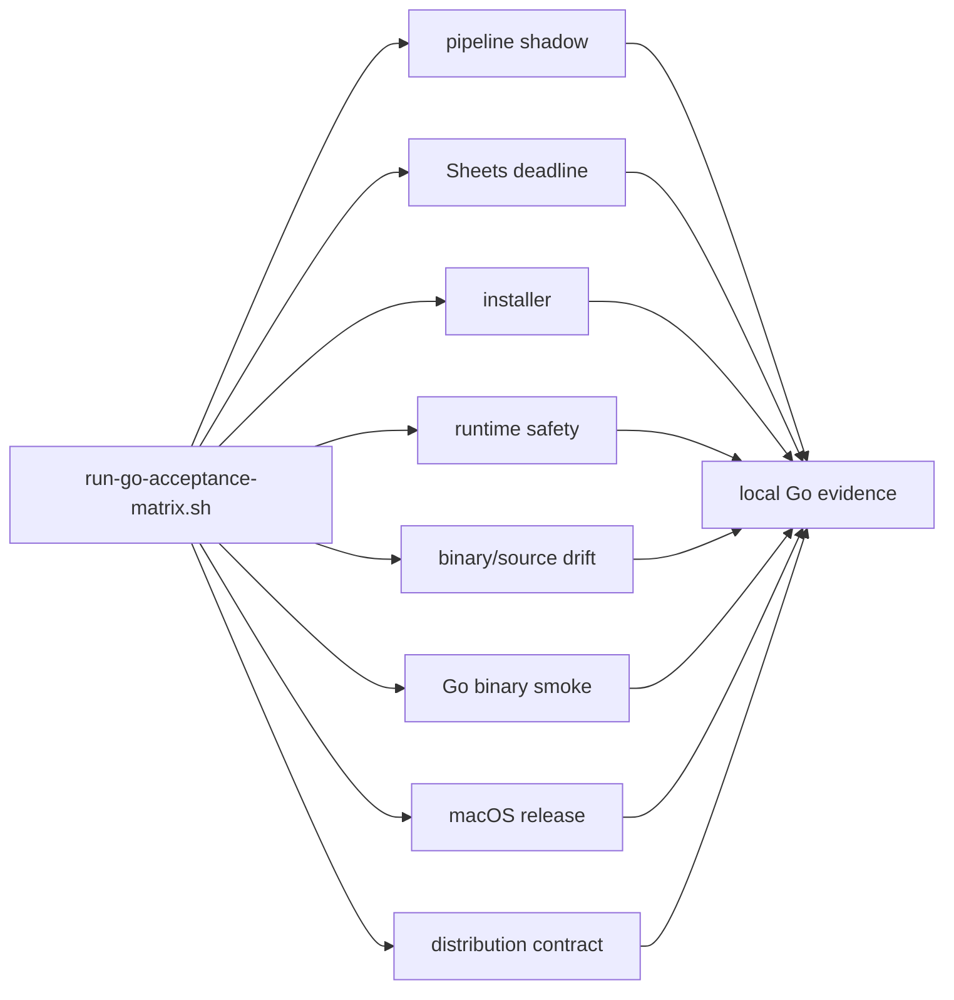

# Go版受入マトリクス現行化設計

## 目的

旧 TypeScript/Bun の AT-01〜AT-18 記録を、現行 Go バイナリ・Go unit test・Go acceptance script のどの証跡で検証するかへ対応付ける。

この資料は、ローカルで再現できる契約、実 Google API が必要な契約、仕様判断が未確定な契約を分離する。ローカル fake、blackhole、偽 credential は実 Google Sheets / Google Fit の成功を意味しない。

## プロジェクト全体に対する妥当性

Issue #2 の Go 移植は、Go の quality gate と acceptance script 一式を受入条件に含めて完了した。一方、受入報告の冒頭には旧 TS/Bun の判定が残り、現行 Go の実行証跡と外部環境の未実施が混在している。

そのままでは、Go ポートがどこまで実証済みか、どこがユーザー環境待ちか、どこが仕様未決定かを監査できない。したがって、受入証跡の現行化は Go ポートの完了判定を壊さないための独立した資料・runner 整備として妥当である。

## 判定分類

| 分類 | 意味 | 完了判定 |
| --- | --- | --- |
| `AUTO_PASS` | 隔離 HOME、fixture、fake、または blackhole で Go バイナリ／Go テストを再実行できる | コマンドと期待結果が成功する |
| `BLOCKED_EXTERNAL` | 実 Google Sheets、Google Fit OAuth、または実時刻 schedule の確認が必要 | 専用検証環境が無い間は PASS にしない |
| `BLOCKED_DECISION` | 現行設計の採否が確定していない | ユーザー決定と別 Issue が必要 |
| `HISTORICAL` | 旧 TS/Bun の実装経路にだけ属する | 現行 Go の合格根拠にしない |

## AT 対応表

| AT | 現行判定 | Go の証跡／前提 | 備考 |
| --- | --- | --- | --- |
| AT-01 | `BLOCKED_EXTERNAL` | 実検証 Spreadsheet への morning 転記 | fake Sheets の unit test は実サービス成功を代替しない |
| AT-02 | `BLOCKED_EXTERNAL` | 実検証 Spreadsheet への evening 転記 | 同上 |
| AT-03 | `BLOCKED_EXTERNAL` | 実検証 Spreadsheet への指定日転記 | 同上 |
| AT-04 | `BLOCKED_EXTERNAL` | Google Fit OAuth 済みの実データ取得と転記 | test-local HTTP client は OAuth 完了を代替しない |
| AT-05 | `BLOCKED_EXTERNAL` | 実時刻または同等の schedule 観測 | runtime-safety は lease を検証するが cron trigger を証明しない |
| AT-06 | `BLOCKED_EXTERNAL` | 実 Google OAuth installed-app callback と token 保存 | 実 client credentials が必要 |
| AT-07 | `AUTO_PASS` | Go service test、pipeline shadow、binary smoke の no-data | Sheets write 無しを確認 |
| AT-08 | `AUTO_PASS` | Go service/domain test の体重アンカー無し | 体重無しで転記対象を作らない |
| AT-09 | `AUTO_PASS` | `run-bun-binary-smoke.sh` の空 input fixture、pipeline shadow | ファイル無しを no-data または pipeline input-missing として検証 |
| AT-10 | `AUTO_PASS` | `run-bun-binary-smoke.sh` の不正 JSON/schema fixture | Go reader の file/line diagnostic を検証 |
| AT-10a | `BLOCKED_DECISION` | Issue [#14](https://github.com/kappaseijin/scale2sheet4go/issues/14) | A-0 fail-closed と A-1 file-level skip の採否が未確定 |
| AT-11 | `AUTO_PASS` | Go scale-exporter reader test の file-boundary dedup | exact duplicate を一件へ縮約 |
| AT-12 | `AUTO_PASS` | Go CLI invocation test、binary source drift の command parser | 不正 period は exit `2` |
| AT-13 | `AUTO_PASS` | Go Sheets adapter test の no-row case | batch update 無し、not-written を検証 |
| AT-14 | `AUTO_PASS` | Go settings test、isolated install/smoke | settings 初回生成は隔離 HOME だけで確認 |
| AT-15 | `AUTO_PASS` | Go config precedence test | settings の source default を確認 |
| AT-16 | `AUTO_PASS` | Go config precedence test | environment > settings を確認 |
| AT-17 | `AUTO_PASS` | Go domain/service test | source が複数の場合 `mixed` |
| AT-18 | `AUTO_PASS` | Go Sheets adapter test | 半角・全角括弧の血圧列を認識 |

AT-10a は、Issue #14 の決定と実装が完了するまで `AUTO_PASS` へ昇格させない。AT-01〜AT-06 も、隔離 fake の成功を理由に `AUTO_PASS` へ変更しない。

## 正本の自動 runner

`scripts/run-go-acceptance-matrix.sh` が、現行 Go acceptance script を同じ順序で起動する。

runner は各 script が自分で build する既存契約を維持し、checkout の `dist/scale2sheet`、ユーザー HOME、実 credential、実 Spreadsheet を共有しない。個別 script の失敗は runner の non-zero として伝播させる。

## 外部調査結果

Google 公式 API は Sheets の `spreadsheets.values` で値の読み書きを提供し、Go の公式生成クライアントを利用する現行実装方針と矛盾しない。Google OAuth は installed application の authorization code と token refresh を前提とし、Fit API は data sources/datasets を OAuth scope 付きで扱う。

- [Sheets: Read & write cell values](https://developers.google.com/workspace/sheets/api/guides/values)
- [Sheets: spreadsheets.values.get](https://developers.google.com/workspace/sheets/api/reference/rest/v4/spreadsheets.values/get)
- [Sheets: spreadsheets.values.batchUpdate](https://developers.google.com/workspace/sheets/api/reference/rest/v4/spreadsheets.values/batchUpdate)
- [Google OAuth 2.0](https://developers.google.com/identity/protocols/oauth2)
- [Google Fit API reference](https://developers.google.com/fit/rest/v1/reference)

実サービス試験は専用 Google Cloud project、専用 Spreadsheet、テスト用 HOME、必要な OAuth consent/client を分けて用意し、認証値を資料へ出力しない。

## 非目標

- 実 Google API の credentials を作成・取得すること。
- 本番 Spreadsheet を変更すること。
- AT-10a の契約を独断で A-0 または A-1 に変更すること。
- Apple Developer ID 署名・公証（Issue #10）。
