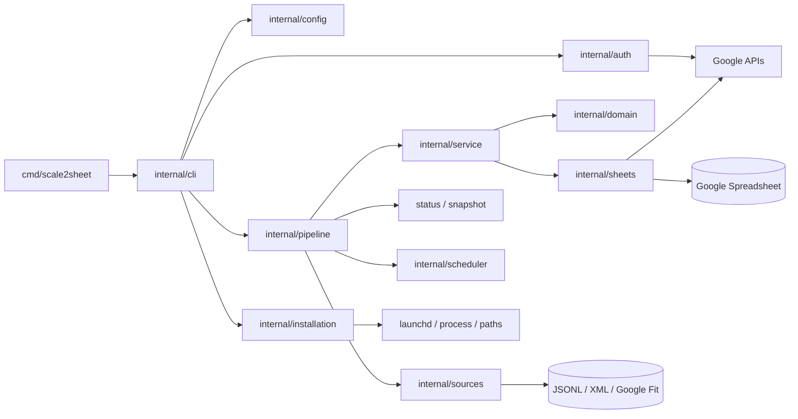
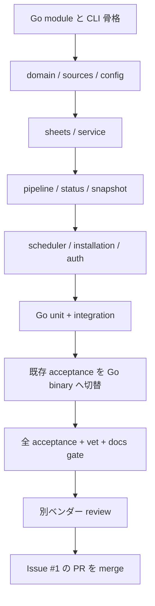

# scale2sheet Go ポート設計

## 目的

既存の `src/` にある scale2sheet の製品実装を Go へ移植する。移植後も、利用者から見える CLI、設定ファイル、終了コード、パイプライン状態、launchd 運用、Google Sheets 転記、入力ソースの契約を維持し、受け入れテストを Go の実行経路で全件成功させる。

対象 Issue は [#1](https://github.com/kappaseijin/scale2sheet4go/issues/1) であり、今回のポート全体を 1 課題・1 PR として扱う。

## 現行コードから引き継ぐ外部契約

| 契約 | Go 実装で維持する内容 |
| --- | --- |
| 製品名 | CLI と配布バイナリの名前は `scale2sheet` |
| コマンド | `run`、`pipeline`、`serve`、`auth`、`install`、`uninstall`、`doctor`、`--help`、`--version` |
| 終了コード | 構文・引数エラーは `2`、設定/実行時エラーは `1`、正常終了は `0` |
| 設定 | `~/.config/scale2sheet/settings.json` と環境変数の優先順位（環境変数 > settings.json） |
| 認証 | Google Sheets service-account JSON と Google Fit OAuth token の既存パス/キー |
| 入力 | scale_exporter 分割 JSONL、Apple Health XML、Google Fit REST API |
| 出力 | Google Spreadsheet の `月日` 行と朝/夜の測定列、既存の status JSON schema |
| 自動実行 | `pipeline --period morning|evening` と launchd plist の既存パス/時刻 |
| 安全性 | 30 秒の Sheets 操作期限、run lease、atomic な status 更新、入力 snapshot の安定性判定 |
| 配布 | `dist/scale2sheet` 相当の単一実行バイナリと install/uninstall/doctor の挙動 |

仕様の根拠は現行 README、`docs/PLAN.md`、`docs/*_DESIGN.md`、TypeScript の実装/テスト、`scripts/run-*-acceptance.sh` とする。Go 化を理由に外部契約を再設計しない。

## 構成

製品コードは Go の標準的な `cmd` / `internal` 構成へ移す。`internal` の各パッケージは現行 TypeScript の責務境界に対応させ、CLI から Google API や filesystem の詳細を直接呼ばない。

### パッケージ責務

- `internal/domain`: 測定値、期間、測定値選択、時間帯、日付の純粋ロジック。
- `internal/config`: settings.json、環境変数、認証ファイル、パス展開と必須設定検証。
- `internal/sources`: scale_exporter JSONL、Apple Health XML、Google Fit の入力 adapter。
- `internal/sheets`: Sheets API client、見出し/日付行の解決、A1 列、batch update、期限。
- `internal/service`: 入力から最新測定値集合を選び Sheets へ転記する application service。
- `internal/pipeline`: input snapshot、terminal outcome、health、status JSON の atomic 更新、通知。
- `internal/scheduler`: run lease と serve の予定実行。
- `internal/installation`: binary copy、settings template、plist、doctor、process cleanup。
- `internal/auth`: Google Fit OAuth と Sheets 認証。
- `internal/cli`: コマンド、引数、依存性の組み立て、終了コード。

外部 API は小さな interface の後ろへ置き、単体テストでは fake port を使う。実際の Google API を必要とする試験は acceptance harness の既存 fixture/blackhole 手順を維持する。

## 移植方針

1. 既存 TypeScript を行単位で翻訳するのではなく、テストが示す observable behavior を Go の table-driven test と contract fixture に移す。
2. 純粋ロジックを先に移植し、filesystem/HTTP/process の adapter を後から接続する。
3. Go バイナリを `go build` で作り、受け入れスクリプトの実行対象をそのバイナリへ変更する。
4. Go の unit/integration/acceptance が同じ契約を検証できることを確認してから、TypeScript の製品コード、Node/Bun 用 test harness、不要な依存を削除する。
5. 移植中は TypeScript を比較用の参照として残すが、完了時の製品ソースと既定テスト経路は Go とする。

## 受け入れ条件

- `go test ./...` が成功する。
- `go vet ./...` が成功する。
- Go バイナリの `--help` / `--version` / 引数エラーの終了コードが既存契約と一致する。
- 既存 acceptance script が Go バイナリをビルドして実行し、全スクリプトが成功する。
- 正常系と負のコントロールの両方で、入力欠落、壊れた status、期限超過、lease 競合、install/uninstall の復旧を検出できる。
- README が Go の install、build、実行、設定、出力、アンインストール手順だけで利用者の操作を完結させる。
- `docs/PLAN.md` と設計書が Go 実装の実態と一致し、TypeScript/Bun を製品の既定経路として説明しない。

## 非目標

- scale_exporter の実装やリポジトリを変更しない。
- Google Sheets/Google Fit の外部契約を変更しない。
- Go 化と無関係な機能追加、UI 変更、agent 自動化機能の製品組込みを行わない。
- 現行テストが隠していない新しい仕様を独断で追加しない。判断が必要な仕様差は Issue #1 の未解決事項として記録し、ユーザーへ確認する。

## 検証の順序

各段階はテスト先行で進め、失敗の出力を保存する。完了判定は狭い focused test ではなく、最終的な `go test ./...`、`go vet ./...`、acceptance 全件、README/ドキュメント検査の実測で行う。
