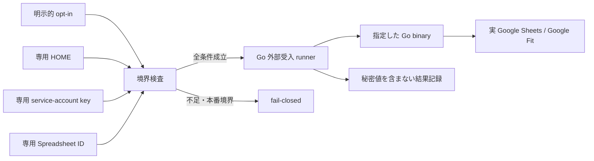

# 専用検証環境向け Google 外部受入 runner 設計

## 目的

専用の Google Cloud／Spreadsheet／OAuth 検証環境が用意された場合に限り、現行 Go バイナリの AT-01〜AT-06 を本番の `HOME`、設定、認証情報から隔離して再実行できる入口を提供する。

## プロジェクト全体に対する妥当性

現行の Go 自動受入は隔離 fixture で通過しているが、実 Google Sheets の読み書き、Google Fit OAuth、実時刻 `serve` は外部環境に依存するため未証明である。受入テストを全成功させるという Go ポートの目標に対し、専用環境を安全に使う再実行境界を作ることは妥当である。

本仕様は外部環境を作成せず、実 API の成功を fake／blackhole で代替しない。資格情報が無い状態は安全に `BLOCKED_EXTERNAL` として残す。

## 調査結果

- `config.Load` は `HOME/.config/scale2sheet/settings.json` と環境変数を読み、`GOOGLE_SHEET_ID`／`GOOGLE_APPLICATION_CREDENTIALS` を Sheets 設定へ解決する。
- `NewGoogleSheetsClient` は service-account JSON ファイルを使って公式 Google Sheets client を作成する。
- `RunGoogleFitAuth` は localhost callback を待ち、`SaveGoogleFitToken` は token を mode `0600` で保存する。
- `serve` は一分ごとの tick で cron を評価するため、外部 runner は観測時間と cron を明示的に受け取る。
- Google 公式資料は、OAuth の installed-app flow、サービスアカウントの最小権限、鍵の保護を前提としている。

## 実行境界

### 必須入力

runner は次の環境変数を使う。値そのものは表示・記録しない。

| 変数 | 用途 | 制約 |
| --- | --- | --- |
| `SCALE2SHEET_EXTERNAL_ACCEPTANCE` | 実外部受入の opt-in | `1` のみ許可 |
| `SCALE2SHEET_EXTERNAL_HOME` | 専用 HOME | 絶対パス、現在のユーザー HOME と異なる、事前作成済み marker が必要 |
| `SCALE2SHEET_EXTERNAL_SHEET_ID` | 専用 Spreadsheet ID | 空・fixture placeholder・不正形式を拒否 |
| `SCALE2SHEET_EXTERNAL_SHEETS_CREDENTIALS` | service-account JSON | 絶対パス、symlink でない、owner-only permissions、現在のユーザー HOME 配下を拒否 |
| `SCALE2SHEET_EXTERNAL_INPUT_DIR` | scale_exporter JSONL の専用入力 | AT-01〜03／AT-05 で必須、専用 HOME 外でも本番入力と混同しない明示パスのみ |
| `SCALE2SHEET_EXTERNAL_BINARY` | 実行する Go binary | 既定は `dist/scale2sheet`、実行可能ファイル |
| `SCALE2SHEET_EXTERNAL_DATE` | AT-01/02/04 の対象日 | 省略時は Asia/Tokyo の当日 |
| `SCALE2SHEET_EXTERNAL_PAST_DATE` | AT-03 の指定日 | AT-03 では必須 |
| `SCALE2SHEET_EXTERNAL_SERVE_CRON` | AT-05 の観測用 cron | 明示時のみ使用 |
| `SCALE2SHEET_EXTERNAL_SERVE_SECONDS` | AT-05 の最大観測時間 | 正の整数、既定なし |

Google Fit の AT-04／AT-06 では既存の `GOOGLE_FIT_CLIENT_ID`、`GOOGLE_FIT_CLIENT_SECRET` をプロセス環境へ渡し、token path は専用 HOME 配下へ固定する。secret と token は runner のログへ渡さない。

## ケース契約

| ケース | 実行 | 自動判定 | 手動確認 |
| --- | --- | --- | --- |
| AT-01 | `run --period morning --date <date>` | exit `0`、結果の秘密値非表示 | 専用 Spreadsheet の対象行・セル |
| AT-02 | `run --period evening --date <date>` | exit `0`、結果の秘密値非表示 | 専用 Spreadsheet の対象行・セル |
| AT-03 | `run --period morning --date <past-date>` | exit `0`、結果の秘密値非表示 | 指定日の対象行・セル |
| AT-04 | `run --period morning --source google-fit --date <date>` | token が専用 HOME 内 mode `0600`、exit `0` | Google Fit 実データと転記値 |
| AT-05 | `serve` を指定秒数起動して SIGTERM | 起動・終了、lease 回収、外部結果を秘密値なしで記録 | cron callback、Spreadsheet 更新 |
| AT-06 | `auth` を対話実行 | exit `0`、token が専用 HOME 内 mode `0600` | OAuth consent と callback 完了 |

runner が自動判定できるのはコマンド境界とローカル状態だけである。Spreadsheet のセル値、Google Fit の実データ、cron callback の外部結果を確認できない場合は `PASS` と記録せず、`OBSERVATION_REQUIRED` とする。

## 安全性と後片付け

- 実ユーザーの `HOME`、production settings、production token、production Spreadsheet を自動選択しない。
- raw stdout/stderr は一時領域へ隔離し、結果記録には exit code、ケース、時刻、状態だけを残す。
- エラー表示にも Spreadsheet ID、credential path、token 内容、実測値を含めない。
- runner は専用 HOME や認証ファイルを削除しない。検証完了後の削除は利用者が専用パスを確認して行う。
- 認証情報、opt-in、境界検査のいずれかが不足した場合、child process を起動せず non-zero で終了する。

## 外部資料

- [Sheets: Read & write cell values](https://developers.google.com/workspace/sheets/api/guides/values)
- [Sheets: spreadsheets.values.get](https://developers.google.com/workspace/sheets/api/reference/rest/v4/spreadsheets.values/get)
- [Sheets: spreadsheets.values.batchUpdate](https://developers.google.com/workspace/sheets/api/reference/rest/v4/spreadsheets.values/batchUpdate)
- [Google OAuth 2.0 for installed apps](https://developers.google.com/identity/protocols/oauth2/native-app)
- [Google service account best practices](https://docs.cloud.google.com/iam/docs/best-practices-service-accounts)
